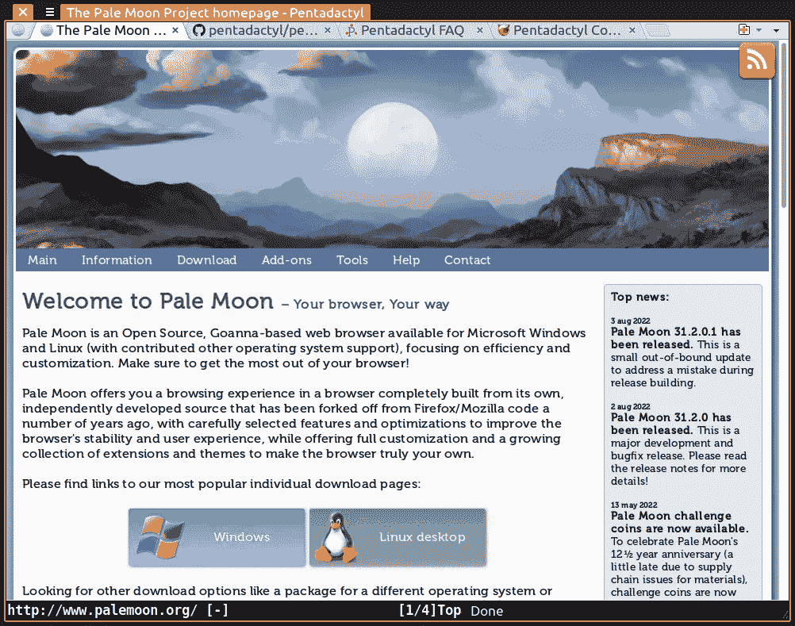
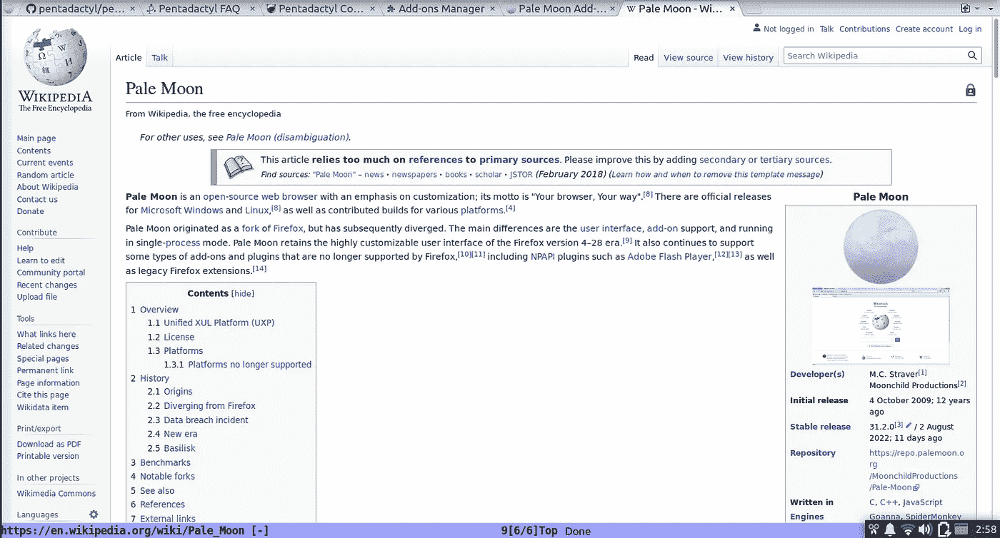

# 苍白的月亮，一个复古风格的网络浏览器

> 原文：<https://medium.com/codex/pale-moon-a-web-browser-with-a-retro-vibe-145fe6e25d99?source=collection_archive---------8----------------------->

苍白的月亮是一个优秀的类似火狐的浏览器，让人想起“老火狐”，一个前澳大利亚 GUI 风格的“层云”。事实上苍月是火狐的一个分支；这两者在十几年前就相互背离了，而苍白的月亮比火狐本身更紧密地保留了火狐从那时起的感觉。

当谈到苍白月亮时，附加的生态系统不是很健康，但它确实提供了扩展，并提供了下载它们的附加数据库。不幸的是，[网站](https://addons.palemoon.org/extensions/)上列出的一些扩展无法工作，但除此之外，还有一些可以从其他来源下载。例如，uBlock Origin 列在 palemoon.org，但必须从 github 安装。Pentadactyl 在试图从 Pale Moon 的网站安装它时注册了一个错误(从 Pale Moon 31.1.1 开始),但如果从源代码编译，可以从文件安装。尽管如此，Pale Moon 提供了相当多的扩展，尤其是与其他替代浏览器相比，Pale Moon 不仅仅是一个克隆，使用与 Firefox 或 Chrome 相同的扩展。

苍白的月亮有一些明确的优势，并有一种感觉，并不一定老化不良。它保留了标签栏中的菜单按钮，这是火狐过去的功能。此外，有一个选项来移动导航栏下面的标签栏；对于一些人来说，这是非常可取的，但是没有一个主流浏览器提供这个功能了。

根据苍白的月亮[网站](http://www.palemoon.org/)的说法，该浏览器专注于“效率和定制”。

palemoon.org 的[上列出的“主要功能”有:](https://palemoon.org)

-针对现代处理器优化
-基于我们自己优化的布局和渲染引擎“Goanna”！
-安全:来源于成熟的 Mozilla 平台代码，并定期更新最新的安全补丁
-安全:额外的安全功能和安全感知开发
-可通过越来越多的维护 XUL 浏览器扩展进行扩展
-由我们的用户社区支持，完全非营利
-隐私感知:零广告；没有遥测、间谍软件或数据收集
-熟悉、高效、完全可定制的界面
-支持完整的主题:任何元素的设计完全自由
-支持轻松创建的轻量级主题(工具栏皮肤)
-平滑且快速的页面绘制和脚本处理
-与其他渲染引擎相比更出色的渐变和字体
-将继续支持 Silverlight、Adobe Flash 和 Java 等 NPAPI 插件
-对现有 web 标准的广泛且不断增长的支持

这些年来，我发现自己使用过这个软件几次，但它从来都不是我唯一的主要浏览器。根据[维基百科](https://wikipedia.org/en/)的说法，苍月在以下几个方面“背离”了火狐:

-使用 Firefox 在版本 4–28
期间提供的澳大利亚之前的用户界面“Strata”–支持使用 Firefox
不再支持的 XUL 和 XPCOM 构建的扩展–支持“完整主题”，即可以自定义浏览器整个 UI 的附加组件。Firefox 不再支持这一点，并保留了有限的 UI 定制选项。
-不加区别地支持 NPAPI 插件，所有这些插件都不再被 Firefox 支持
-用 Goanna fork
取代 Gecko 浏览器引擎-总是以单进程模式运行，而 Firefox 变成了多进程程序
-默认为与 start.me
合作的可定制起始页-默认为 DuckDuckGo 作为搜索引擎，而不是 Google 或 Yahoo！
-使用 IP-API 服务代替谷歌的地理定位服务

[维基](https://en.wikipedia.org/wiki/Pale_Moon)继续说:

> M.C. Straver 是该项目的创始人和主要开发者。Straver 在 2009 年首次正式发布了 Pale Moon，它是 Firefox 3.5.2 的重建版，做了一些小改动。最终项目的范围扩大了，版本 24 成为了 Firefox 24 ESR 的真正分支。从版本 25 开始，苍月开始使用自己的版本控制方案。

[另请注意](https://en.wikipedia.org/wiki/Pale_Moon#cite_note-60):

> 2021 年 4 月，Straver 宣布下一个版本的 Pale Moon，版本 29.2.0，将不再允许安装针对 Firefox 的扩展。这个决定与 Pale Moon 之前对 Firefox 插件长达十年的支持大相径庭。

《苍白的月亮》适用于 Windows 和 Linux。