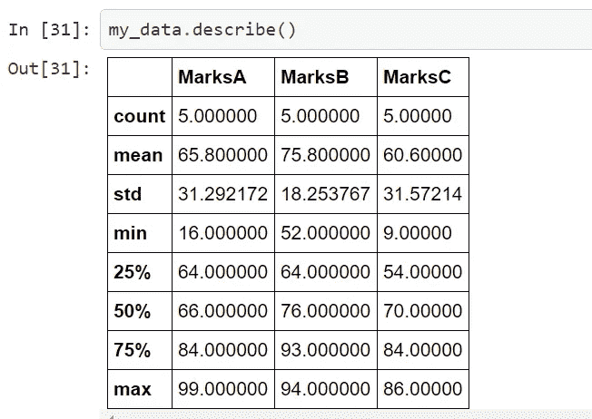
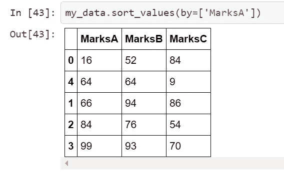
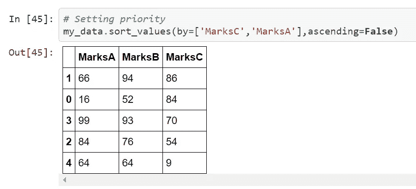

# Python 中的熊猫简单指南

> 原文：<https://medium.com/codex/pandas-ab2f515d7ffd?source=collection_archive---------1----------------------->


锡德·巴拉钱德朗在 [Unsplash](https://unsplash.com?utm_source=medium&utm_medium=referral) 上拍摄的照片

## Pandas 是一个非常著名和有用的 python 库


它代表“Python 数据分析库”。由于其丰富的功能，它在数据科学中非常常用。它提供了非常快速、灵活和富有表现力的数据结构。

Pandas 允许我们从 man 文件格式导入数据，例如 csv *(* 逗号分隔文件)、excel、JSON 文件。

它允许执行许多功能，例如:

*   数据集的重塑和旋转
*   大小可变性:列插入和删除
*   数据集的合并和连接
*   数据过滤
*   大型数据集的切片、索引
*   数据清理和数据争论功能

因为它是用 c 语言编写的，所以性能得到了高度优化。

# 装置

要安装 pandas，只需在命令提示符下运行以下命令。

```
pip install pandas*#for Anaconda* conda install pandas 
```

# 进口熊猫

```
import pandas as pd
```

# **读取数据帧**

在 user_data 中，您可以通过写入路径或您创建的数据框名称，从 PC 中放入数据集。

```
df=pd.DataFrame(user_data)
```

为了打印数据帧，我们使用 head 和 tail，其中 head 代表从开头开始的列，tail 代表从结尾开始的列。同样，通过指定 *n* 的值，我们可以控制行数。

```
df.head()
df.head(n=3)
df.tail()
df.tail(n=5)
```

了解数据框中的列

```
df.columns
```

删除列:

```
my_data=my_data.drop(columns=['*column_name*'])
```

我们还可以将数据帧转换成 csv 格式，并将 csv 文件作为数据帧读取

```
df.to_csv('marks.csv')

my_data = pd.read_csv('marks.csv')
```

通过只执行一个命令，我们可以得到计数，平均，最小标准，最大和许多东西

```
my_data.describe()
```



访问特定行

```
df.iloc[3]Out[34]:
MarksA    99
MarksB    93
MarksC    70
Name: 3, dtype: int32
```

访问特定的行和列

```
df.iloc[3][1]Out[36]:
93
```

如果我们不知道某个列号

```
index=df.columns.get_loc('MarksB')
df.iloc[3,index]Out[37]:
93
```

# 对数据帧进行排序

```
my_data.sort_values(by=['MarksA'])
```



**我们还可以设置优先级，并确定数据应该升序还是降序**。

```
*# Setting priority*
my_data.sort_values(by=['MarksC','MarksA'],ascending=**False**)
```



从 dataframe 获取 numpy 数组

```
data_array = my_data.values
```

感谢阅读:)