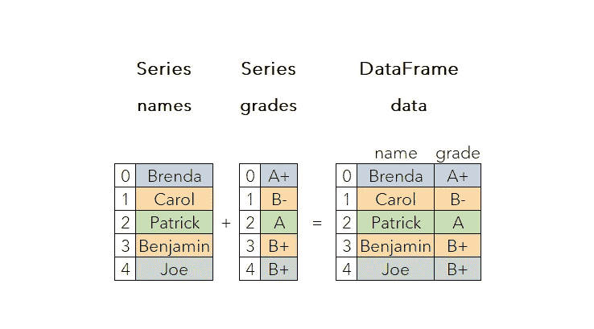

# Python 中的熊猫操作—系列

> 原文：<https://medium.com/codex/pandas-operations-in-python-series-21ca9ef99a29?source=collection_archive---------17----------------------->

Pandas 是建立在 numpy 之上的，用 Python 提供了高效的数据结构和数据处理工具。它通常与软件包 matplotlib、seaborn、statsmodels、scikit-learn 一起用于数据分析和可视化。

作者图片

# 熊猫

与 numpy 相比，pandas 主要处理**表格数据**，这允许**对每一列使用不同的数据类型**，而 numpy 需要一个…