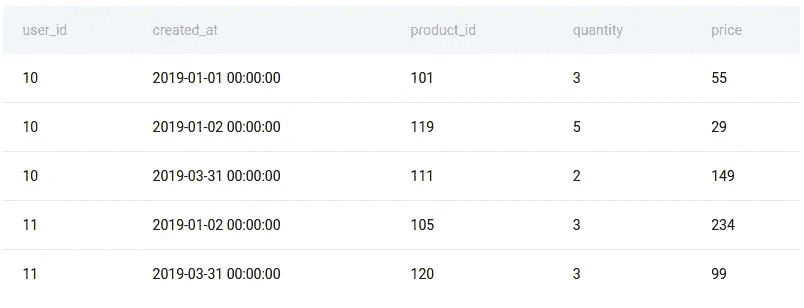
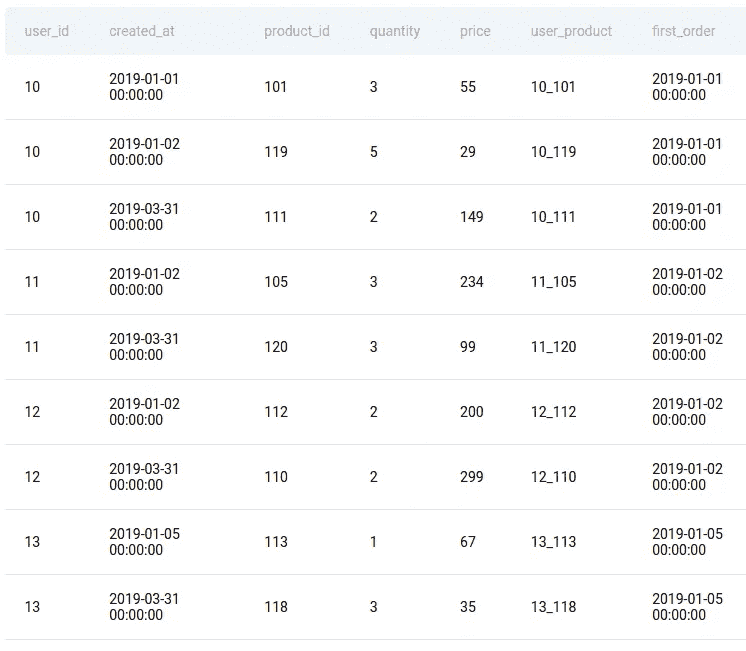

# 熊猫实践系列:营销活动成功

> 原文：<https://medium.com/codex/pandas-practice-series-marketing-campaign-success-c73e0177d1c1?source=collection_archive---------15----------------------->

## 级别:硬|公司:亚马逊


图片来自 Unsplash 的 Lukas Blaze

# 问题描述:

> 你有一个用户应用内购买的表格。首次进行应用内购买的用户被置于营销活动中，他们会看到更多应用内购买的行动号召。找出由于营销活动的成功而进行额外应用内购买的用户数量。
> 
> 营销活动在首次应用内购买后一天才开始，所以第一天只购买一次或多次的用户不算在内，随着时间的推移，只购买第一天购买的产品的用户也不算在内。

这个问题来自 **Stratascratch，**一个网站，该网站收集了基本的面试问题，并根据问题的难度和被问到的公司来组织这些问题。

**数据预览:**

```
marketing_campaign.head()
```

**输出:**



# 类比与第一原理方法:

简单的问题可以用蛮力或类比思维来解决。但是，当一个问题如此复杂时，我们需要一个适当的第一原则方法，将问题分成几个部分，一步一步地解决它。

甚至很难描绘出类比方法可能是什么样子；你不断尝试，直到达到你想要的结果，你所有的行动都是基于直觉和推理，只有当问题很简单时，直觉才是有意义的，随着问题难度的增加，直觉开始瓦解。执行的步骤似乎不可追踪，留给你的解决方案(如果你找到了解决方案)更像是一个黑箱。

另一方面，当你用基本原则思维处理问题时，你会把问题分解成基本的部分。逐个解决这些问题，然后把它们放在一起。它让你有一个高度可解释且易于理解的解决方案。

# 解决办法

让我们逐步解决这个问题:

这个想法是首先过滤符合活动标准的用户，然后检查他们购买的所有产品是否都符合标准。

*   活动的标准取决于唯一日期的数量以及每个用户的产品 id。因此，我们根据用户 id 进行分组，并获得日期和产品 id 的唯一值的数量，如下所示:

*   问题声明活动将在第二天开始，相同产品的购买将不被计算在内。因此，我们必须只考虑那些日期和产品 id 都大于 1 的用户。

*   现在我们已经在一个单独的数据框中获得了符合标准的用户，为了方便起见，让我们在原始数据框中创建几列。

“user_product”列连接两列的值，即“user_id”和“product_id”，这样我们就不必在每次需要特定用户的产品 id 时都编写新的条件(因为相同的 product_id 可能属于不同的用户)。

修改“created_at”列，将日期转换为下一行中的 transform 函数可以轻松处理的格式。

[转换函数](https://pbpython.com/pandas_transform.html)是一个与 groupby 函数结合使用的聚合函数，但它不同于其他聚合函数，如 apply、count、..等等。区别在于它返回的输出大小。大多数聚合函数返回小于输入大小的输出，但在这种情况下，它返回与输入大小相同的输出。

该问题指定不应该考虑在不包括在活动中的日期购买的产品 id，即用户购买产品的初始/最小日期。“first_order”列包含每个用户的最小日期。

```
marketing_campaign.head(9)
```



*   现在我们已经准备好了所有的列，我们只需要编写一个简单的条件来过滤出符合条件的用户，同时，删除每个用户在活动开始前购买的产品 id。

# 结论

正如你自己所看到的，当问题被分解成基本部分，然后用自下而上的方法解决时，它会更有意义，也更容易解决。尽管我们必须将问题分解成小部分的部分并不容易，但要掌握基本原则思维的艺术，我们必须大量练习。所以敬请关注更多此类解决问题的帖子！！！

如果你有兴趣以一口大小的块的形式获取每天的 ML、DL 和 python 内容，以便即使在空闲时间也可以更新知识，请查看我的 Twitter 帐户👇