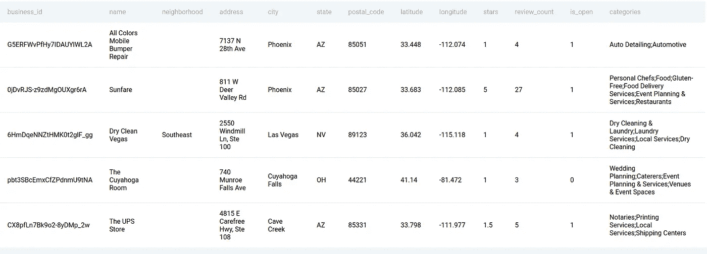
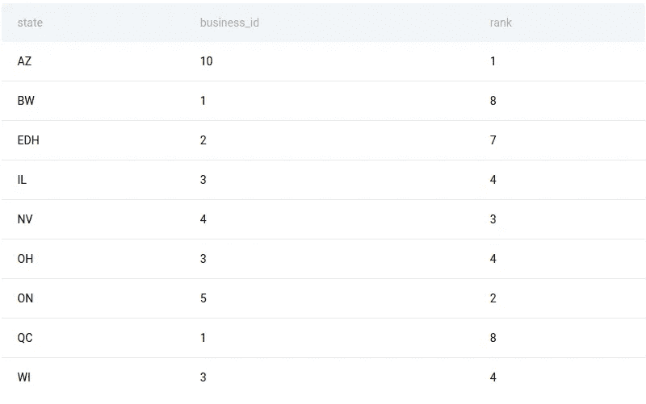

# 熊猫实践系列:五星级企业排名前五的州

> 原文：<https://medium.com/codex/pandas-practice-series-top-5-states-with-5-star-businesses-e30b33f691b6?source=collection_archive---------5----------------------->

级别:中等|公司:Yelp


图片来自 Unsplash 的 [@mailchimp](https://unsplash.com/@mailchimp)

# 问题描述:

> 找出拥有最多五星级企业的前 5 个州。输出州名和五星级商家数量，并按五星级商家数量降序排列订单记录。如果企业数量相同，则返回所有唯一的状态。如果两个州的结果相同，按字母顺序排序。

问题和数据来自 **Stratascratch，**一个网站，该网站收集基本的面试问题，并根据问题的难度和被问到的公司来组织这些问题。

**数据预览:**

```
yelp_business.head()
```

**输出:**



**列定义:**

```
business_id:object
name:object
neighborhood:object
address:object
city:object
state:object
postal_code:object
latitude:float64
longitude:float64
stars:float64
review_count:int64
is_open:int64
categories:object
```

# 解决方案:

让我们逐步解决这个问题。

考虑到这一点，我们需要返回拥有 5 星评论的企业数量最多的前 5 个州。这个问题可以分成几个部分:

首先，过滤掉五星级企业

其次，统计每个州的企业数量。

我们需要确定`business_id`是否是表的主键，这可以通过比较数据集的大小和`business_id`中唯一数量的值的大小来完成，如果大小相同，就可以认为是主键。

现在我们知道`business_id`是一个主键，我们可以计算每个州的企业数量，并相应地对结果数据进行排序。现在问题说你要按降序对各州进行排序，即五星商家数量最多的州应该是第一，五星商家数量最少的州应该是最后。如果出现平局，那么应该按照字母顺序或者简单地按照升序对州进行排序。

所以我们得到了正确的答案，但最后一点可以这样做，让我们有机会了解一个名为 [*Rank*](https://www.geeksforgeeks.org/python-pandas-dataframe-rank/) 的熊猫函数。Pandas `**Dataframe.rank()**`方法返回一系列被传递的每个索引的等级。排序后根据位置返回排名。所以我们会这样做:

**输出:**



上面的代码片段根据每个州的企业数量对每一行进行排名，现在我们可以只保留排名小于 5 的行，并进行相应的排序。

# 我们学习了一些重要的概念:

我们可以通过在`sort_values`函数的`by`参数中提到一个列名数组来基于多个列对数据帧进行排序。我们也可以通过设置`ascending`参数为`True`或`False`来决定其顺序。

我们还学习了如何使用`rank`函数根据列值对行进行排序。

这篇文章到此为止，但不要忘记实践是掌握解决问题艺术的关键，所以请继续关注更多此类内容！

如果你有兴趣以一口大小的块的形式获取每天的 ML、DL 和 python 内容，以便即使在空闲时间也可以更新知识，请查看我的 Twitter 帐户👇