# 论文解释— SeMask:用于语义分割的语义屏蔽转换器

> 原文：<https://medium.com/codex/paper-explained-semask-semantically-masked-transformers-for-semantic-segmentation-966c19a1512?source=collection_archive---------6----------------------->

## 一种新的语义分割 SOTA

语义分割

# “语义是你所需要的一切”(semicit。:D)

每次我们处理图像转换器网络时，我们最终做的是完全相同的事情:微调编码器部分的预训练主干。这是传统的方法，而不仅仅是用于语义分割任务。

然而，不考虑**图像的语义信息来解决这个任务可能不是最佳方法**，尤其是如果我们正在讨论语义分割的话。

本文的作者通过提出一种新的简单有效的框架来解决上述问题，该框架可以在**语义注意力操作**的帮助下，将图像的语义信息合并到预先训练的基于层次变换器的主干中。

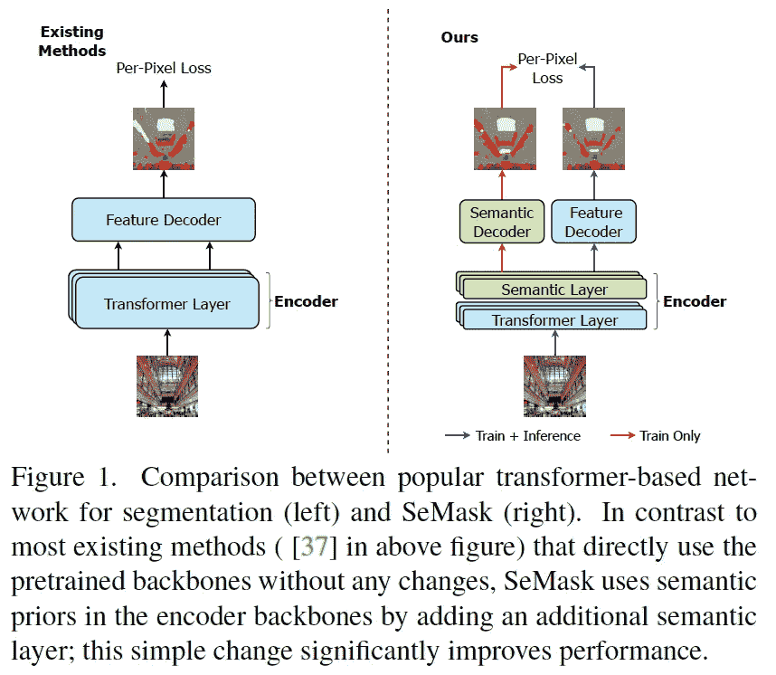

总之，本文的贡献有三个方面:

*   引入 **SeMask 模块**，研究了将语义上下文添加到预训练的变压器主干中以用于语义分割任务的效果；
*   他们引入了一个**语义解码器**，用于聚合来自编码器不同阶段的语义先验；
*   提供了对 SeMask 块对 ADE20K 和 Cityscapes 数据集的影响的深入分析。特别是，作者在 ADE20K 上实现了**新的最先进性能，并在 Cityscapes 上的 *mIoU* 指标上提高了 3%以上。**

# 架构概述

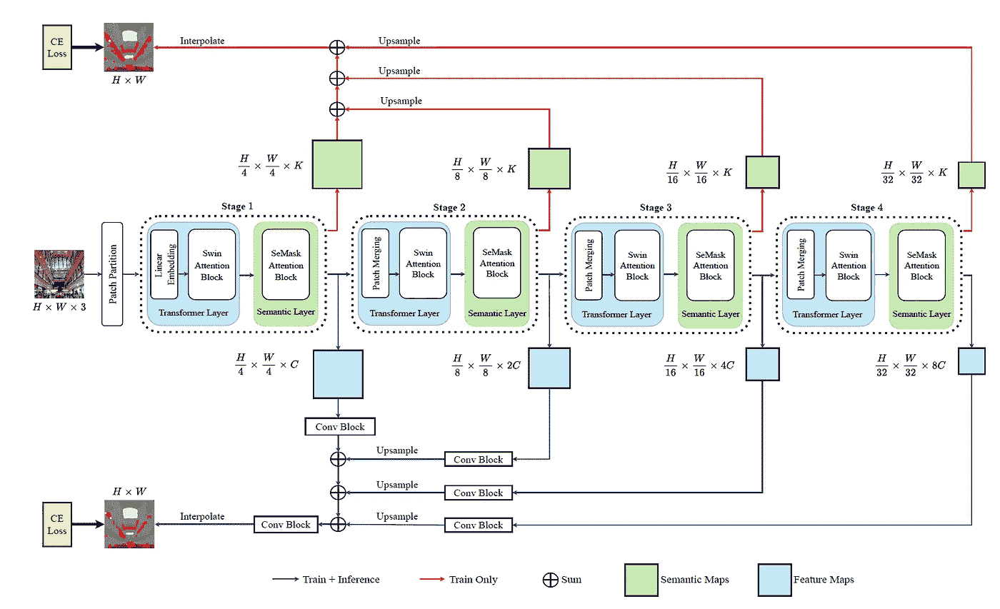

上图显示了 SeMask Swin 语义 FPN 框架。

作者通过将 SeMask 集成到 Swin-Transformer 中提供了经验证据。

> 我们在 Swin 变换器层之后添加了具有 Ns 个 SeMask 块的语义层，以捕获编码器网络中的语义上下文。使用简单的上采样+求和操作聚集来自每个阶段的语义层的语义图，并通过加权 CE 损失来监控语义上下文。

上图显示了整体架构，即 **SeMask Swin 语义 FPN 框架**。

编码阶段包括层次特征建模的四个不同阶段。对于等级表示，他们通过为下一个阶段合并图层将每个阶段的要素地图缩小 2 倍，其中 *i* 是阶段编号(见下图)

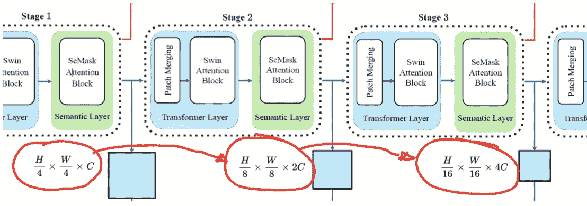

# SeMask 编码器

编码器中的每个阶段都由两层组成:转换器层和语义层。

在将尺寸为 H x W x 3 的 RGB 输入图像输入到转换器之前，它首先被分裂成尺寸为 4x4x3 的不重叠的小块，这给出了 48 的特征维数。

**编码阶段的第一阶段**是线性嵌入层，其将补丁令牌的维度从 48 改变为 *C* (对于 Swin-T 变体，在第一阶段， *C* =96)

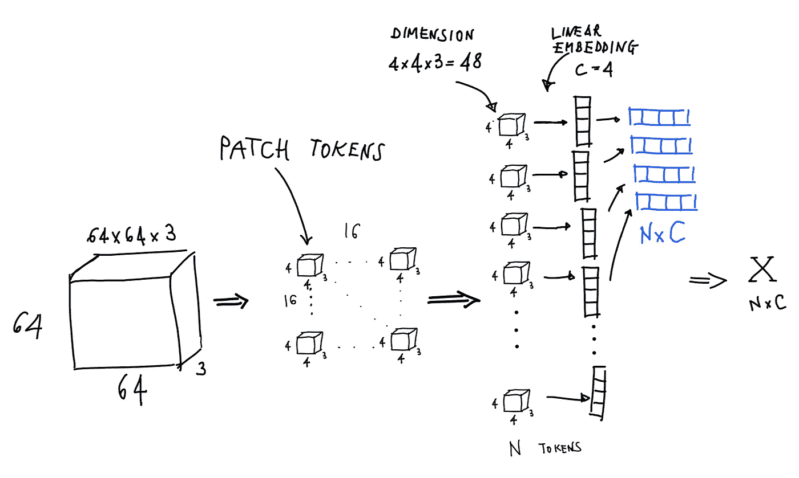

一个 H=W=64，C=4 的例子

*X* 转化为 *Q，K* 和 *V* 分别是维度为 *N x C* 的查询、键和值矩阵*。*相对位置嵌入(RPE)包括在尺寸*N×N*中，其中*N = M×M，*其中 *N* 是小块的数量， *M* 是窗口大小*。*

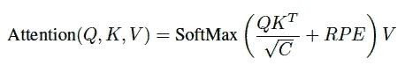

变形层内部的注意力等式

## 变压器层

Transformer 层由*Na*Swin 关注块堆叠在一起组成，从图像中提取图像级上下文信息。

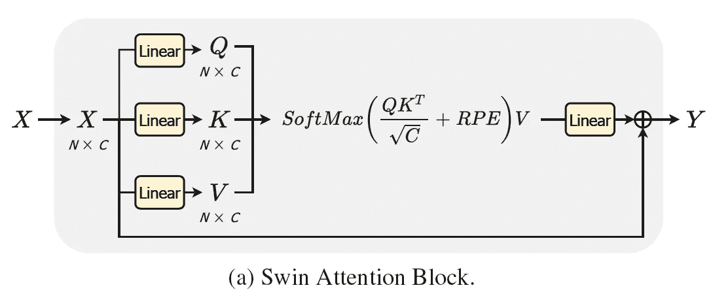

## 语义层

语义层在编码步骤的每个阶段都跟在变换器层之后。

> 语义层负责**对语义上下文**建模，该语义上下文用作计算分割分数的先验，以基于图像中存在的语义本质的指导来更新特征图。
> 
> **SeMask 注意模块**负责捕获编码器中的语义上下文。它根据分割分数更新来自变换器层的特征，提供指导并给出语义优先图，以便在训练期间有效监督语义建模。

来自先前变换器层的特征 Y 被分成三个矩阵:语义查询(Sq)、语义关键字(Sk)和特征值(Yv)。Sq 和 Sk 的维数是 N×K，其中 K 是类的个数，Yv 的维数仍然是 N×C，其中 C 是嵌入维数。从 Sq 返回语义图 S，并且使用 Sk 和 Sq 为 SeMask 注意力等式计算分割分数:

语义层内部的注意力等式

在分割分数和特征值之间的矩阵乘法之后，矩阵通过线性层并与**可学习常数λ** 相乘，该常数用作处理来自权重初始化的噪声的特征的调谐因子。经过残差连接后，得到富含语义信息*Y’*的修改特征，统称为**Se**T42ed 特征。

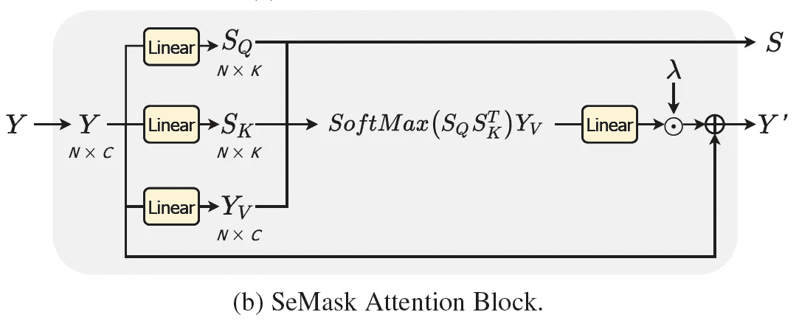

# 解码器

作者使用两个解码器分别从编码器的不同阶段聚集特征图和语义先验图:

*   **语义 FPN 解码器**，其通过一系列卷积、上采样和求和操作融合来自不同阶段的特征图；
*   一个**轻量级语义解码器**，仅用于训练，用于语义优先图的地面真实监督

作为最后一步，两个解码器的输出被放大 x4，以匹配最终预测的原始图像的分辨率。

# 损失函数

为了训练该模型，总损失已经被计算为下图所示的两个每像素交叉熵损失的**加权和:第一个是基于语义 FPN 解码器的主预测计算的，第二个是基于来自所提出的轻量级解码器的语义先验预测计算的。**

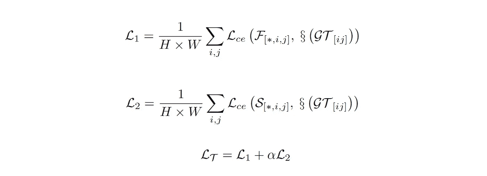

# 浅析 SeMask

> 为了证实我们的假设，即在语义关注操作的帮助下在编码器中添加语义上下文有助于提高特征的语义质量，我们在 Cityscapes val 数据集上分析了 SeMask-T FPN 模型的中间特征的像素级关注质量，如下图所示

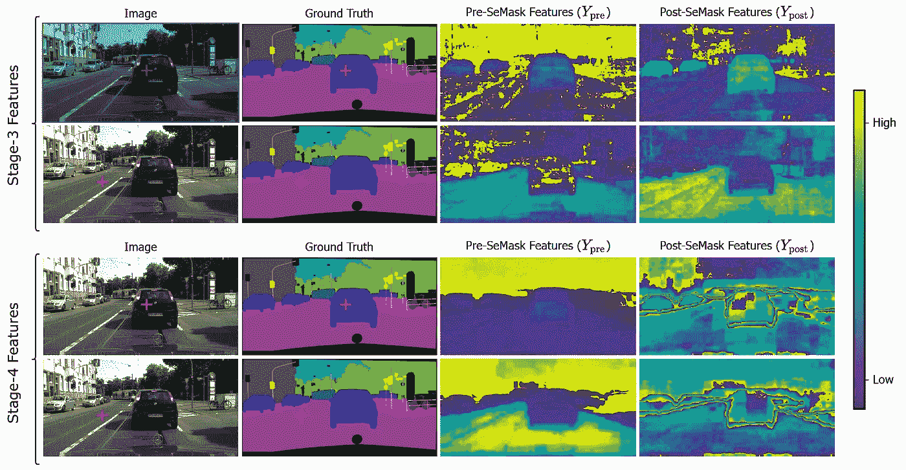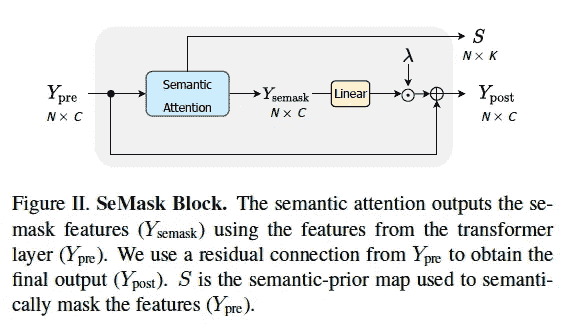

> 我们计算对应于目标像素(红色十字符号)的逐像素注意图，并且我们观察到，与前 SeMask 特征相比，后 SeMask 特征对于具有更好边界的相同语义类别区域具有更多相似特征。这反映了语义先验图有助于增加属于相同语义类别的像素之间的相似性，并改善语义分割性能。

# 结果

## ADE20K 数据集

下面是作者取得的结果，他们在 **ADE20K 数据集**上获得了**新的最先进的性能**。

> 使用 SeMask Swin-L 作为主要预测的编码器，Mask2Former-FaPN 作为我们的解码器，我们在单尺度和多尺度 mIoU 度量上分别获得了 56.97%和 58.22%的分数。

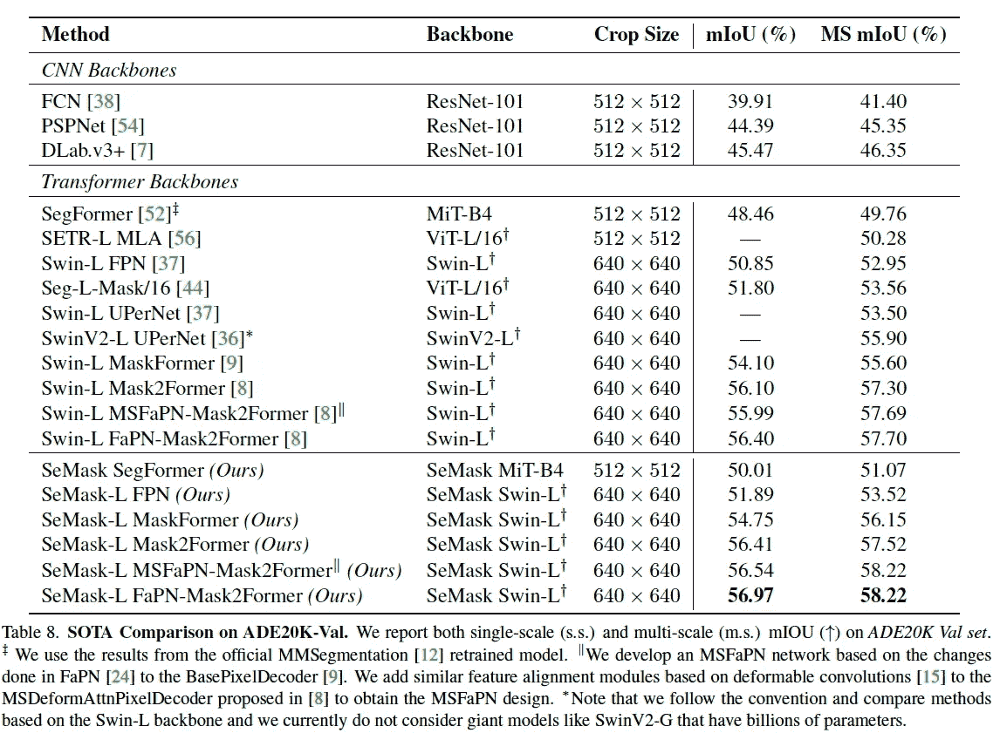

## 城市景观数据集

在语义分割的另一个参考数据集 Cityscapes 上，Semask Swin-L 与其他最先进的方法相比具有竞争力，SeMask Swin-L Mask2Former 达到 84.98% mIoU。

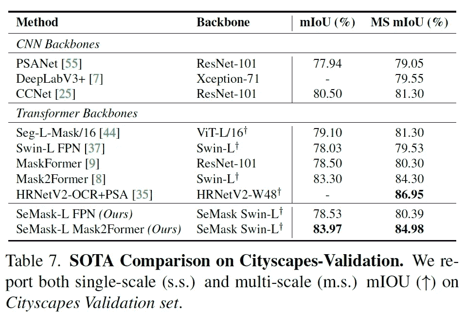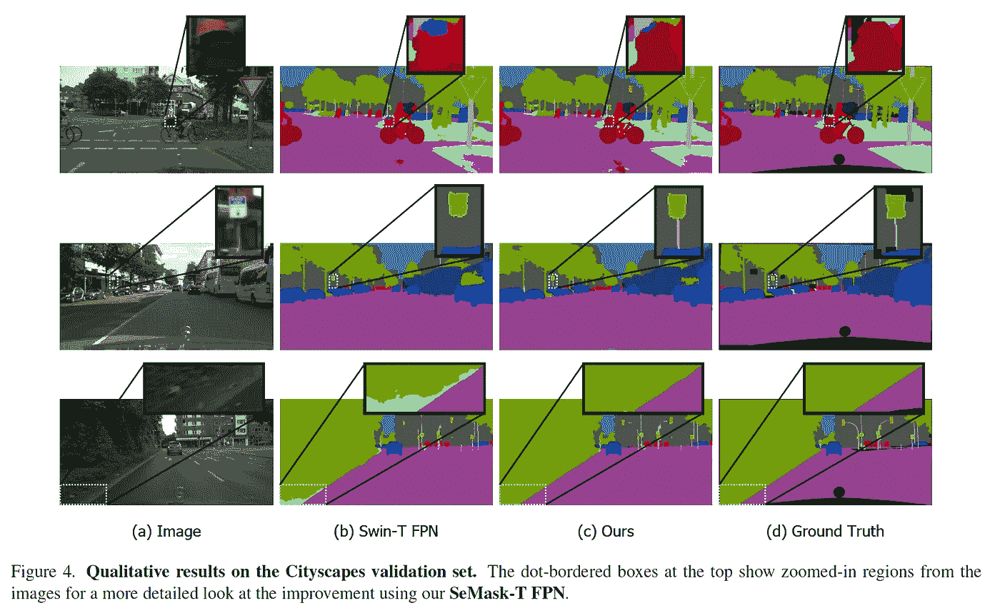

# 结论

本文提出了加入语义先验来指导编码器的特征建模，对语义分割有很好的影响，提高了分割精度和整体性能。

作者提出了 SeMask 块，它使用语义注意操作来捕获语义上下文，从而增强特征图的语义表示。

真正有趣的特性是**这个模块可以插入任何现有的层次视觉转换器**！

如果你想了解更多关于这部作品的信息，我把所有的参考资料都留在了下面。

[论文链接](https://arxiv.org/abs/2112.12782)

[GitHub 页面链接](https://github.com/Picsart-AI-Research/SeMask-Segmentation)

> 我希望你喜欢这篇文章！

如果你能开始在 Medium 或 [LinkedIn](https://www.linkedin.com/in/lorenzo-baiocco-lb/) 上关注我，在社交媒体上分享这篇文章，并使用下面的鼓掌按钮来支持我，我将不胜感激，当然，如果你喜欢的话！:D

最后，如果您还不是中等会员，您可以使用我的推荐链接成为中等会员:

[https://medium.com/subscribe/@lorebaiocco](/subscribe/@lorebaiocco)