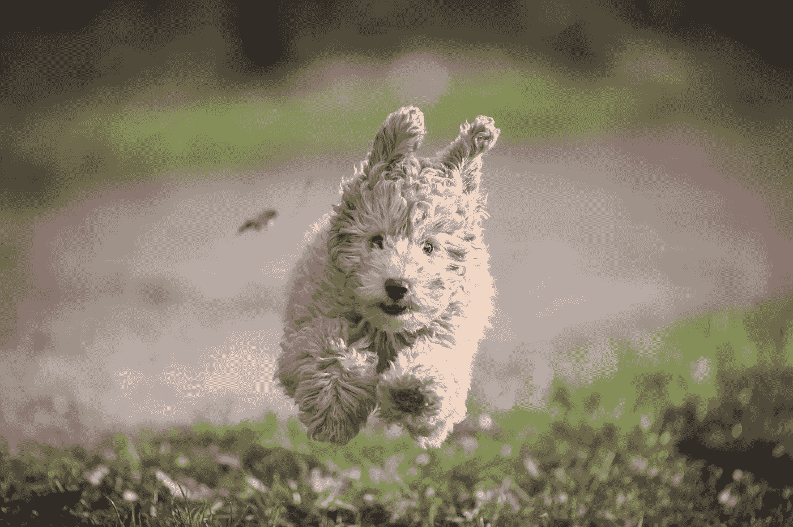
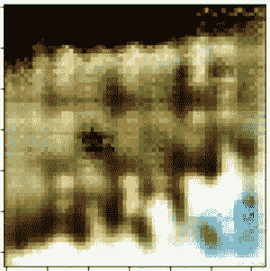
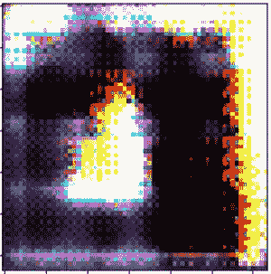
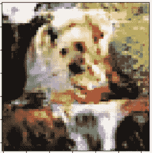
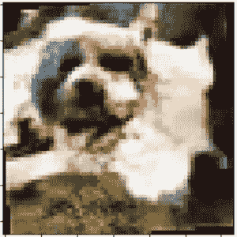
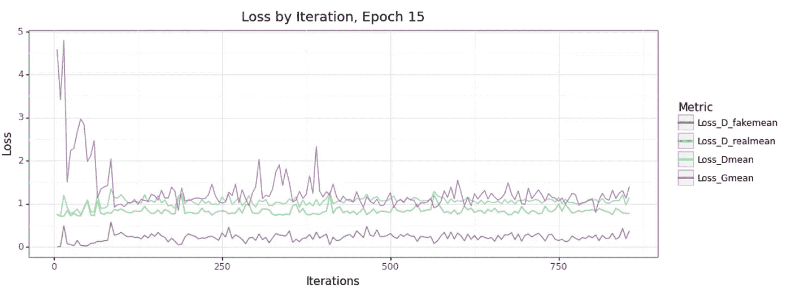
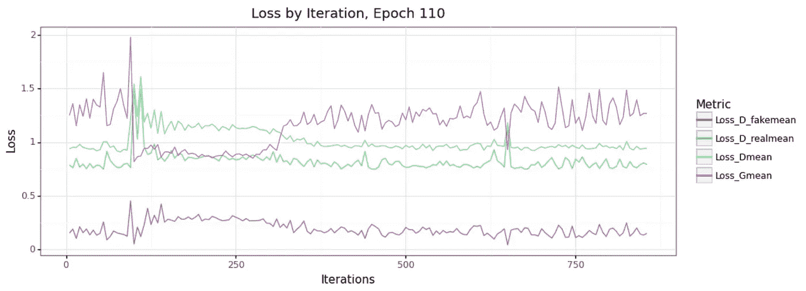
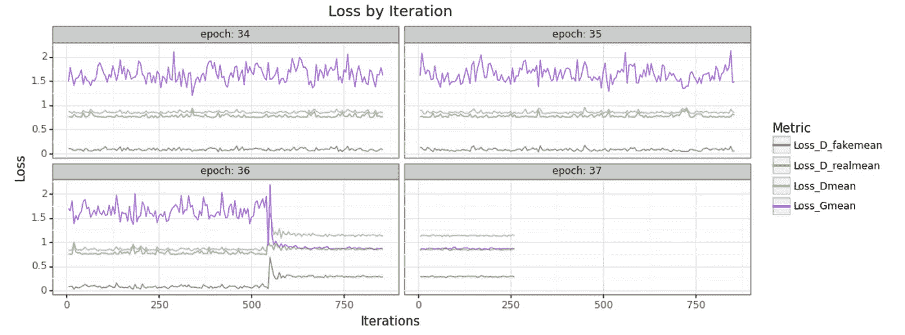
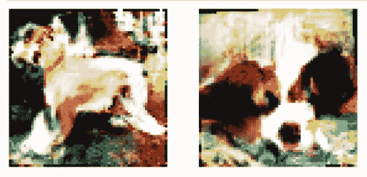
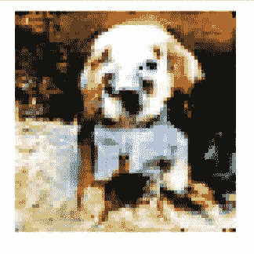

# GPU 上的并行 GAN 训练:生成自己的图像！

> 原文：<https://medium.com/codex/parallel-gan-training-on-gpu-generate-your-own-images-9aa807042ef1?source=collection_archive---------0----------------------->

## [法典](http://medium.com/codex)



由 [Unsplash](/s/photos/dog?utm_source=unsplash&utm_medium=referral&utm_content=creditCopyText) 上的[Arjan stalbers](https://unsplash.com/@arjan_stalpers?utm_source=unsplash&utm_medium=referral&utm_content=creditCopyText)拍摄的照片

生成对手网络(GANs)是一种越来越受欢迎且非常强大的计算机视觉深度学习形式，它们需要大量的计算来有效快速地完成。这只是 Dask 集群的并行化可以改变您的工作流的一种用例，所以让我们来学习如何构建一个 GAN 并在集群上训练它！

我们将使用 PyTorch 来训练它，我将使用土星云来管理集群。

> *免责声明:我是 Saturn Cloud 的高级数据科学家，Saturn Cloud 是一个使用 Dask 为 Python 提供易于使用的并行化和扩展的平台。如果你想了解更多关于土星云的信息，请访问我们的网站*[*www . Saturn Cloud . io*](https://www.saturncloud.io/)*。*

这篇文章引用了我之前讨论过的一些概念，以及一些外部内容:

*   [dask-pytorch-ddp 库，包括 ddp 概述](https://www.saturncloud.io/s/combining-dask-and-pytorch-for-better-faster-transfer-learning/)
*   [PyTorch DCGAN 教程](https://pytorch.org/tutorials/beginner/dcgan_faces_tutorial.html)
*   [卡格尔甘斯简介](https://www.kaggle.com/jesucristo/gan-introduction)

# 目标

GAN 的目标是共同训练两个模型:一个基于训练样本生成图像(生成器)，另一个评估生成的图像与真实训练图像的比较，试图区分它们(鉴别器)。我们不会深究所有这些是如何工作的，但是上面链接的 PyTorch 文档中的教程给出了一些很好的讨论！

在单个 GPU 上训练这样的模型是很常见的，但它仍然可能是一个缓慢的过程，特别是如果您的图像数据集很大，而您的 GPU 不是那么大。相反，我们可以通过使用一组 GPU 机器来增加大量计算能力。

# 设置

## 数据

我们使用斯坦福狗数据集作为我们的训练数据，这个数据集只有 20，000 多张图片。(如果你看过我其他关于 PyTorch 的教程，这个应该听起来很耳熟吧！)我将这些数据保存在一个公开的 S3 回购中，这样我们就可以从那里加载数据了。

## 串

我将创建一个具有 GPU 能力的工人集群来启动我们。下面的代码展示了如何在 Saturn Cloud 上完成这项工作——对于这个项目，我实际上使用了 10 个工人。

如果你喜欢，你可以使用更大或更小的集群，你也可以选择不同大小的 GPU 机器——这是一个你可以根据工作需要定制的领域。

# 班级

为了开发这个模型网络，我们需要定义两个类:一个鉴别器和一个生成器。正如您在这里看到的，这些类看起来与您在本地环境或单个节点上进行培训时完全一样。该类定义了它们将包含的层。

我们将遇到的与单节点训练工作流的唯一区别是，我们将在 DDP(分布式数据并行)函数中包装每一个，以便 PyTorch 可以理解如何以分布式方式训练它们。DDP 为我们提供了一个框架，让每个工人训练自己版本的模型，在每个时期结束时进行交流，分享他们取得的进展。要了解关于 DDP 的更多信息，请查看我们关于 PyTorch 计算机视觉的[分布式培训的其他博客帖子。](https://www.saturncloud.io/s/combining-dask-and-pytorch-for-better-faster-transfer-learning/)

# 因素

在开始工作之前，我们需要对培训职能部门进行一些指导。需要注意的是两个模型将使用的学习率(`LR_G`和`LR_D`)——这些将决定我们的模型在训练过程中接收新信息时的移动速度。我们希望这个过程非常缓慢，以便模型能够逐渐适应新的输入，而不会反应过度。如果您的模型版本没有按照您想要的方式学习，请尝试更改这些值！

此外，`real_label`和`fake_label`允许我们的训练过程具有鉴别器可以针对其进行训练的基本事实。生成器生成的假图像将全部被标记为 0，训练集图像将全部被标记为 0.5。您在此设置的值也会对培训进度产生影响。例如，如果将训练标签设置为 1.0，有些人会发现模型卡住了，也无法适应。

`nz`代表我们将用于生成器的随机噪声，以继续生成用于训练的新样本。

# 培训流程

这个训练函数是用训练所需的参数设置的，但是设置了默认值，所以我们不需要担心它们——如果您愿意，您可以设置这些参数的字典来传递给作业！

请注意，在函数的第一部分，我们将设备指定为 CUDA，因此我们的所有培训都将利用每个工作人员的 GPU。我们还获得了每个工人的人数，以便培训能够保持有组织——如果你读过我们关于 PyTorch 培训工作的其他博客帖子，这可能很熟悉。然后，我们初始化我们将使用的两类模型(生成器和鉴别器),并将它们包装在`DDP()`中以支持分布式并行训练。

这里的其他东西，比如优化器和标准，是在单个节点上训练 GAN 的标准实践，不需要任何改变。(上面链接的外部资料可以给你更多关于这些作品的信息。)

像任何其他监督学习工作一样，我们需要一个训练数据集。这里我使用的是来自`dask-pytorch-ddp`的`S3ImageFolder`类，它允许我们直接从 S3 加载图像。我使用的转换是将尺寸缩小到 64 x 64，并添加一些随机噪声以及标准化的颜色。自己尝试这些转换，看看它们是如何影响训练进度的！我发现添加这些有助于模型学习。

我还启用了来自 S3 的多线程图像加载，这样图像摄取就不会成为阻碍我们提高工作速度的障碍。在数据加载器中包含`shuffle`参数是很重要的，这样不同的工作人员就可以以不同的顺序获得图像。随着训练迭代的进行，这允许他们从数据中学习不同的东西。

此时，我们开始实际训练我们的模型。我建议分别训练鉴别器和生成器，如下所示。首先运行鉴别器步骤，一直到反向传递，包括模型在检测真实和伪造图像时的误差。

在鉴别器步骤完成之后，我们通过告诉生成器鉴别器是否能够检测到它的假货来让生成器学习。这让它决定为下一轮的努力调整什么。

您还可以在这里包含一个元素来跟踪您的模型的性能统计数据。我在我的训练流程中使用了`dask-pytorch-ddp` ResultsHandler，但是你可以选择你自己喜欢的方法来写那些结果。(我也用 Tensorboard 试过，结果真的很好！)我建议保存发生器和鉴别器的计数和时期以及所有损耗值。鉴别器的整体损失是其在真实(假阴性)和假(假阳性)图像上的误差的组合，但跟踪这些单独的误差值对于查看它的表现真的很有价值，所以我会每五次迭代左右保存它们。

# 将作业分发到集群

我们上面定义的函数为我们提供了模型完全训练所需的所有步骤——我们需要运行尽可能多的时期来获得我们想要的结果，但是我们不能总是提前知道这个值。我从 300 开始，100 之后我密切监视模型的行为，看看我们做得怎么样。

```
futures = dispatch.run(client, train_GAN)
```

# 结果

你的模型需要一些时间来真正掌握生成新图像的技巧，但是这种等待是值得的。

在我训练的很长一段时间里，我得到的图像是这样的:



68 世纪



81 世纪

那里没什么狗。但是我们很快就转了弯！



公元 107 年



第 109 纪元

除了图像，我们还可以绘制不同模型元素的误差率。随着训练的进行，我们希望看到发电机的损耗下降，但我们也希望看到鉴别器的行为发生变化。鉴别器发现生成的(伪造的)图像会变得更加困难，因此鉴别器在伪造图像上的损失会增加。

我们还将看到模型在整个纪元中学习，然后在继续学习之前，新纪元的开始显示出一些混乱/重置。

纪元 15 告诉我们，发电机的误差很高，大多在 1 以上。鉴别假货的误差保持在较低水平。这意味着发生器没有产生欺骗鉴别器的图像。



第 15 纪元

另一方面，纪元 110 给出了明显不同的行为。请注意，生成器的每次迭代平均误差在迭代 100 次左右显著下降，并在接近 300 次时保持较低水平。它确实恢复了，但这不是一个值得警惕的原因——这意味着发生器在它的假货中发现了善于欺骗鉴别器的东西！鉴别器正在继续尝试并捕捉这些假货，所以它恢复了，但随着训练的进行，这种生成器“获胜”的部分可能会变得更加常见。



第 110 纪元

像这样训练一个模型网络可能不会像你在一些机器学习设置中看到的那样线性一致——随着神经网络对任务以及如何实现任务的理解的发展，这些改进可能是不完整的。耐心点，记住他们是在互相竞争以求成功！

在第 136 纪元，我开始看到一些非常有趣的事情:



时期 134–137(我在前 100 个时期之后拆分统计数据集)

我的发电机开始不断地欺骗我的鉴别器！这些图像仍然骗不了人眼，但我们正在快速接近代表性的图片。



公元 136 年



公元 137 年

现在，来自我的生成器的更多图像返回了一张图片，其中类似狗的特征是可区分的。这些颜色可能会让你觉得异常明亮，但请记住，我们在输入的转换中使用了归一化步骤，这将创建一个更高对比度的配色方案(我没有对这些进行反归一化)。

# 什么时候完成？

这是一个棘手的问题，当训练一个甘。这两个模型将继续相互斗争，希望随着你的发展变得更加复杂。他们可能会在上面的图表中多次交易头寸！你可以让它们持续相当长的时间，抽查生成的图像，当结果满足你的需要时，就可以结束了。

祝你在训练 GAN 的过程中好运，如果你想使用土星云轻松快速地访问多个 GPU，请访问我们的网站！