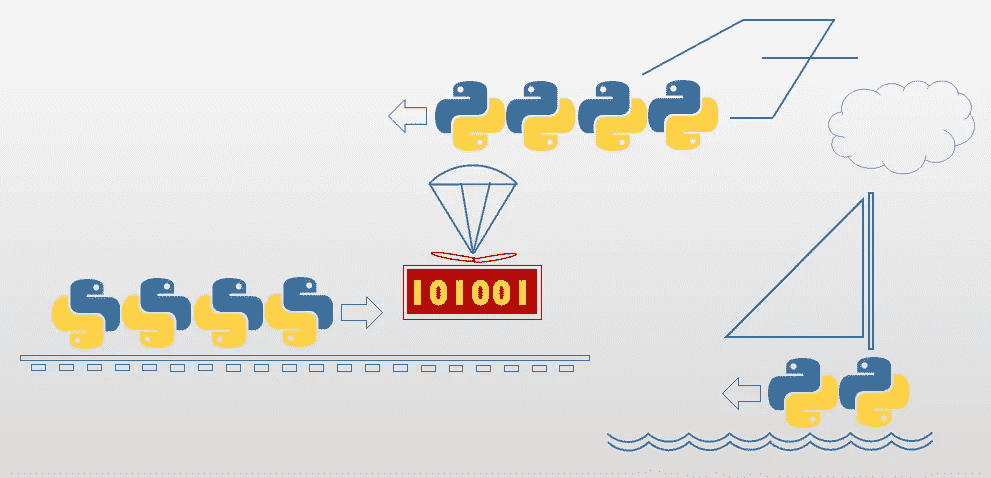

# Python 中的并行编程—第 1 课。介绍

> 原文：<https://medium.com/codex/parallel-programming-in-python-lesson-1-introduction-210e33d02ea6?source=collection_archive---------11----------------------->



这是系列课程的第一部分，涵盖了 Python 编程语言为并行编程提供的一些工具以及使用它们的动机。本系列专注于将并行性用作软件设计习语，(如在*实时*和*系统*应用中)，有意避免使用*技术*并行性，例如性能优化(这在其他地方广泛涉及)。

*本课章节:*

1.  事件驱动、并行和并发设计的动机
2.  一个例子:“终端用户界面”
3.  一个例子:“定时器”线程

## 1.事件驱动、并行和并发设计的动机

软件花费大部分时间消耗输入以产生输出。算法生活在中间的某个地方(并提供对转换的洞察力。我们很少使用什么都不做的算法，让一切都保持原样)。

毫不奇怪，流行的编程模型是处理器消耗一系列离散输入，一次一个，留下一串输出。每当处理器消耗输入时，它就咨询它的当前状态如何处理它，可能导致输出，并且可能切换到不同的内部状态(包含下一步该做什么的智慧，使用这个和其他输入)。这种编程模型严谨、简单、易于实现并且可靠:它将总是完全按照预期工作。但是它有一个问题:它是基于输入被*阻塞的假设。*(准确地说:处理它会阻塞其他任何东西)。是*同步。*挂起输入被挂起，直到处理器处理完当前输入。处理器不会同时处理两个输入(因为它由一个内部状态控制)。

不幸的是，这个模型并不总是与我们碰巧生活的*真实的、*混乱的世界相一致，在这个世界中，许多输入共存并且不一定阻塞！因此，为现实世界的问题设计程序性解决方案的工作通常涉及到一个额外的挑战:找到聪明的方法来适应我们遗留的同步基础设施。精确地说:*给定一个同步处理基础设施，如何实现对非阻塞输入的处理。*

一个明显的解决方案是*中断的流程:*以某种方式将处理划分给这么多同步的部分流程，这个解决方案由许多程序员以不同的形式独立达成。(而如何控制其中的每一个，反过来，是我们已经知道的事情)。识别同步流程部分的设计挑战通常出奇的简单。真正的问题是如何协调它们。或者准确地说，如何让*与*同步，因为这完全是时间问题。值得注意的是，同步很少是关于部分流程同时展开*，*，而是关于控制每个部分流程在正确的时间进行(和暂停)，有助于展开我们所想的确切用例场景。

一旦分析了输入和输出(以及涉及它们的转换)之间的关系，我们就面临着编排如此多的部分同步过程(通常是编程的*函数*)的设计挑战，每个过程负责产生一些输出和/或消耗一些输入——其中*并行是例外，*不是规则！(因为它引入了复杂性，除非绝对必要，否则应该避免！)在琐碎的情况下，设计包含如此多的挑战形式:*如何将函数 B 的输入与函数 A 的输出耦合起来？*幸运的话，这个挑战通过引入调用 A 和 B(或者在 A 的末尾调用 B，或者在 B 的开头调用 A)的函数 C 得到了解决，I/O 以某种方式在它们之间进行了引导。只要这种简单的同步解决方案可行，就一定要采用它，不需要并行！由于各种原因，当并行编程设备不能实现时，就需要并行编程设备。为了找到答案，我们必须分析*生产者*(产出)和*消费者*(投入)之间关系的复杂性。但是没必要急。通常，肉眼看来可能引起并行的事情，可能在同步过程中被轻易解决。以“游戏循环”挑战为例。

一款“第一人称射击游戏”视频游戏呈现了一个三维迷宫，其中有如此多的怪物在前进，每个怪物都以自己的速度前进，它们被用户(我们可以看到用户的背部)射击，也以自己的速度前进，射弹到处都是(也以自己的速度)。此外，这些运动的物体可能会碰撞，而且很有仪式感。人们期望设计由几十个线程组成(一个线程对应一个怪物，一个投射物和一个用户)，但是这很少是必要的。如果主要的设计挑战是如何协调这么多移动物体的运动，那将是一个挑战。但是*这个*是一个相对技术性的问题，涉及到常规的几何和物理，我们知道如何在程序上解决。如果问题域是*线性的，*，情况仍然是这样，但它不是！利用当前的计算机视频技术，这个问题域被数字化成帧量(比如说，每秒 20 帧或更多)。在这个问题域中，不要求运动元素输出运动，而是相反的情况:静止帧(准确地说，是它们在总帧中的部分，并且以正确的覆盖顺序)。因此，问题简化为计算每个移动元素在下一帧(“游戏滴答”)时的位置，检测碰撞，解决它们并以正确的覆盖顺序(和准时)累积下一帧。(在更复杂的解决方案中，移动对象将其数据累积到三维数据库中，例如“opengl”库，并且从那里呈现帧)。因此，设计挑战被简化为**如此多的*生产者*(发出部分帧)被单个*消费者*(累积下一帧)阻止。**这种瓶颈拓扑决定了设计。幸运的是，在这个问题域中，输入是灵活的(它们的准备完全由游戏节拍决定),因此——在没有好的理由的情况下——不需要并行。当然，考虑到冲突及其后果所增加的复杂性，所有构成帧的函数都可以从游戏循环函数中顺序调用。

事实上，许多中断的流程确实需要*事件驱动的设计*，但不需要并行性。典型的例子是 GUI(图形用户界面——即窗口)系统，其中用户被允许以任何顺序操作屏幕，但是响应这些*事件*(显然，由如此多的独立*事件处理程序*函数组成)的软件存在于单个线程中。在这个问题域中，软件不需要同时响应任何两个事件*！*(虽然这种替代架构可以——可以说——改善用户体验，但它不值得花费这么多！窗口系统用户习惯于忽略他们的一些输出。他们会再试一次…)

事件驱动设计是并行设计的先决条件，至少有以下原因:

*   它与并行共享一个设计模式:回调。它涉及到将“功能”(要完成的功能序列)视为对象的范式转换，该对象可能被变量、参数(即发送到另一个函数进行*延迟*调用)或函数返回(另一个函数调用的结果)引用。一个*在中央*调度器*处注册*事件处理函数，中央*调度器*运行*事件循环*，其中，在每个循环中，下一个事件被发现(如果有的话——例如，GUI 循环中的鼠标按下、游戏循环中的游戏滴答)，并且事件的适当处理函数(如果确实被注册的话)被调用，通常被阻塞。
*   通常，仔细分析一个看似并行的问题，会发现它与事件驱动设计有关(在单线程中)。明显的例子是上面讨论的 GUI *消息泵*和“游戏循环”。(在后者中，游戏循环可以通过注册*帧贡献者*功能来实现。这种“开放式”设计允许在每个版本中添加和删除移动的*对象类型*，以及在运行时添加和删除移动的*对象实例*，而不必重写 switch/case 结构或在错误的地方维护复杂的逻辑负担！
*   此外，调度机制可以用来实现“软”版本的(好像)并行性，其中后者不是真正需要的，但它的*接口*是需要的！参见 Python *异步*工具，将在另一课中讨论。

让我们确保我们知道我们在谈论什么，简单提醒一下*事件驱动*设计，使用*回调的*注册*。*

*下面是一个简单的“滚动菜单”例子(用 Python 3.9 编写，评论如下):*

*注释(对应上述代码中编号注释):*

1.  *doMenu* 函数接受一个函数列表(“可调用”对象)，每个函数不接受任何参数(由空方括号表示)并且不返回任何内容。
2.  一个*事件循环*几乎永远重复(除非通过适当的关闭事件或异常从内部停止)。
3.  菜单从所提供的函数中提取选项标题——它们的文档字符串。像任何对象一样，函数具有成员函数和属性。*文档字符串*(函数体顶部的三引号字符串)保存在函数对象的“成员数据”中。
4.  *退出*选项得到程序处理。它不是通过回调实现的(尽管这种替代设计是可能的和合法的)，因为它的编号(99)是有意超出界限的。(因此，无论如何都需要额外的逻辑)。
5.  调度程序试图检测(在这种情况下，主动获取)下一个事件:准确地说，是在键盘上键入的一个数字。
6.  识别并安全处理无效输入(非数字)。
7.  *退出事件* (99)得到程序处理。循环终止。
8.  更多的无效输入(数值，但超出范围)被识别并安全处理。
9.  由数字选择索引的回调被检索到变量“回调”中。
10.  回调是*叫*。我们不必知道“被调用”的对象实际上是一个函数。任何响应函数调用(圆括号)操作符的对象都可以！
11.  显式变量只是为了方便。同样的代码可以简单明了地表达出来(让外行有些头疼): *options[selection - 1]()*
12.  菜单功能。这是一个普通的 Python 函数。没有任何迹象表明它将被用作某人的回调。
13.  作为参数(收集在列表中)传递给菜单函数的函数。在 Python 中，不需要获取函数的地址或以任何方式“包装”它。在模块作用域中声明的函数在模块的字典(由内置的“全局变量”获得)中注册为该名称的对象。(只有名称，没有参数类型或不变性。Python 不支持函数重载)。

*输出:*

```
1\. Print 
2\. Edit 
3\. Erase 
99\. exit 
select: 
1 
Print logic to come here...
99
```

## 2.“终结器用户界面”示例

现在，解决一个真正需要并行设计的问题:简单的*停止编译 UI* 。在这种情况下，*中断另一个进程*(该进程可能正在同时*做某事*)就是游戏的名称！

*问题:* **用户应该能够通过 UI** 在可接受的延迟内停止编译过程。编译器显示 UI(用于人机界面),允许用户中止编译。注意，编译器的逻辑是给定的。虽然我们可能要对编译器代码做一些调整，但我们不打算重写编译器来适应用户界面！因此，我们有两个功能需求(编译和导致中止的按键),这两个需求看起来几乎是同时发生的。真的吗？

*建议的解决方案:*按照提示，用户可以选择“按任意键停止…”。另一方面，编译器提供了一个“中止”标志。按下任意键*向*发送信号(打开)中止标志。(虽然正确的方法是通过 GUI，显示一个按钮供用户按下，但为了简化代码示例，本解决方案被故意降级)。

显然,“停止编译 UI”问题需要一个真正的并行解决方案，因为它涉及到一个**生产者(终止者)和消费者(编译器)在不同的解决方案中进展！**终结器立即响应其输入(按键)。但是编译器在自己的时间内响应相关的输入(中止信号),这完全不受终结器的控制。显然，过程化的解决方案是不行的:终结器不能控制编译器，编译器不能控制终结器，而且两者都不能从上面控制！换句话说，这个问题涉及到绝对不能阻塞的**输入。**是*异步*。

*下面的用例场景必须展开:*

所需的用例场景

*备注:*

1.  具体如何做到这一点(监听)有待*确定*。(还有什么问题？)
2.  非阻塞输出。终结符写停止标志，并确实停止等待任何人来读取它。
3.  非阻塞输入。如果停止标志在那里，编译器就查询它，而不是停下来等待任何人来写它。

当然，我们不能使用过程代码来实现这种设计！第一步(编译器初始化)总是发生在用例的开始。第四步(编译器终结)总是在最后，第三步(编译器函数执行循环)在中间。第二步(终止符初始化)可能在编译器初始化之前或之后(但在编译器函数循环之前)。但是我们对第二部分的主要功能的定位有问题:信令中止可能在第三步中的任何时候发生。(实际上，它也可能发生在编译器初始化结束之前和终结期间。这样做对用户没有任何好处，但是程序必须准备好应对它)。该分析没有留下其他选择，只能部署两个功能来分离控制的*线程！*

因此，这里有一个并行设计:它具有相同的所需功能，但是注入了*同步。*注意，在主线程中调用终止符，在副线程中启动编译器，这有点违背直觉。这一设计决策承认了 Python 的标准 I/O 实现对主线程有利的限制。

平行设计

*备注:*

1.  *编译器*在控制的并行线程中启动。
2.  对*轮询*停止标志的要求是隐含的。
3.  编译器实际上向终结器发出信号，停止监听键盘。(编译器已经停止。)
4.  终止符*阻塞*主程序。
5.  要求迭代能够使终止符本身提前终止(例如，由编译器正常终止)。另一种选择(坐下来等待按键被按下，发出中止信号并回家)将在正常终止的情况下冻结程序。

*   *下面是一个 Python 实现(讨论如下):*

1.  IDE(如 IDLE、pyCharm、Wing 等。)将标准输入和输出替换为它们自己的控制台，这不太可能像这里预期的那样运行。即使你使用 IDE 来保存这段代码，你也必须从操作系统控制台*运行*(或者在文件浏览器中双击它的条目)！
2.  程序导入*线程库*
3.  Python 不支持非阻塞键盘输入，所以我们求助于第三方库 *msvcrt* (微软 C 运行时)，可在 python MS-Windows 实现中获得。(UNIX 实现稍微复杂一些，涉及到 *select* ，所以为了方便起见我们跳过它)。
4.  在这个简单的例子中，编译器中止标志被实现为一个*全局*变量。(在更健壮的设计中，人们会希望它被封装在编译器对象中，并通过 getter 来访问)。
5.  终止符存在于*终止*功能中。它以 1 秒的分辨率迭代轮询键盘输入，查询 *kbhit* (键盘被点击了吗？).
6.  终结器为编译器不再活动的可能性做准备(在离开之前，已经自己发出中止标志)。
7.  它的工作完成后，终止信号中止并返回，释放主程序结束。
8.  但是在出发之前，终结符会“吃掉”用户按下的字符(防止它在用户最终按下 enter 键时被意外回显)。
9.  为了这个简单的例子，*什么都不做*代表各种编译器函数。它每秒输出一次进度指示，连续五次，除非它发现已经发出中止信号，这使它停止并过早返回。
10.  点输出被*刷新*到屏幕上。(默认情况下，标准输出等待 enter 或某个输入，以便一次发出整个点序列)。这就是为什么直接使用标准输出，而不是通过内置打印。
11.  我们的伪编译器经历了一系列的六个活动，由什么都不做的函数来完成。
12.  编译器遍历由中止标志保护的活动序列。
13.  编译器功能完成后，在没有用户干预的情况下，编译器本身会发出中止标志信号，以解除终止符对程序的阻塞。
14.  上下文感知提示从主程序发出。编译器知道中止标志，这就足够了。是什么让它滴答作响(在本例中是按键)超出了编译器的范围(并且容易改变！).它在主程序的范围内，主程序将所有的目的联系在一起。
15.  Python 线程接受一个函数，并且可选地接受传递给它的参数。该线程尚未激活(该函数尚未被调用)。当线程对象被明确请求*开始*时，线程函数被调用。
16.  一旦编译器被允许独立运行，终止符就会被调用，阻塞主线程。当编译器完成时，它将正常返回，或者由用户中止返回(这与主程序无关)。注意*启动*编译器线程并不保证当终止程序启动时线程函数已经被调用。但这无关紧要(在这种情况下)。甚至在编译器存在之前，用户就可以按下键盘。尽管如此，终结器将完成它的工作(当它最终启动时，给编译器一个短暂的生命)。
17.  最后，请求正确的键盘输入(回车终止),这有几个原因:(1)防止终端窗口在一些运行时和调试配置中过早关闭，以及(2)让编译器线程有时间正常退出。

*输出:*

```
Press any key to abort compilation! 
Dummy Compiler v1.0 
initializing..... 
parsing..... 
building memory database..... 
checking dependencies..... 
generating code..... 
finalizing..... 
Compilation successful! 
Press [enter] to closePress any key to abort compilation! 
Dummy Compiler v1.0 
Initializing..... 
Parsing.... 
Aborted by user! 
Press [enter] to close
```

## 3.计时器线程

将编译器部署到次线程，将终结器部署到主线程，这具有功能上的合理性(终结器通过阻塞应用程序直到编译器以某种方式终止，来缓冲编译器对应用程序的影响)。尽管如此，这是相当反直觉的！人们会认为扮演主要角色的编译器会占据主线程，而扮演次要和可任意使用的角色的终结器会被放逐到一个次要线程。唉，实现平台挡住了我们的路！但是简单的*定时器*并不会妨碍我们，我们将用它作为一个更直观的小线程例子。

*   **问题:**“定时器”实现了在给定的时间间隔后(或在给定的绝对时间)做某事的要求，而不管请求者在此期间正在做什么。
*   **建议的解决方案:**明显的编程实现是一个*线程*接受“回调”和间隔。线程的工作相当简单:它*在给定的时间间隔内休眠*，调用回调并终止。

*下面是一个 Python 实现(讨论如下):*

*输出:*

```
Snoring... 
Snoring... 
Snoring... 
Snoring... 
Snoring... 
Snoring... 
Snoring... 
Snoring... 
Snoring... 
Snoring... 
Oops, woke up!
```

1.  在这个简单的例子中，要发送信号的标志也是全局的。
2.  计时器线程等待指定的时间并调用回调。(注意，这种乐观设计不允许过早取消定时器。一个更现实的实现将重复休眠一段时间，轮询退出条件)。
3.  回调所做的只是发出退出条件的信号。
4.  睡眠者在入睡前(自然地)打开闹钟*。*
5.  睡眠者反复打鼾，直到被示意醒来。

诚然，从编程的角度来看，这个算法也可以不用计时器来编写，只需简单地迭代打鼾并计算还剩多长时间。然而，这在问题域中不太有意义。你不能要求睡觉的人看他/她的手表，在睡觉的时候每秒钟都进行计算*。醒来的冲动一定是来自外部的！(但是期望睡觉的人*睡觉时打鼾*是正确的……)。当前的设计更加现实，因此具有可扩展性、可伸缩性等。*

*在下一课中，我们将详细研究 Python 线程。接下来，我们将遇到经典的*生产者/消费者*示例，并使用各种 Python 工具迭代实现它，从“原始”到高级。*

**本课程的课时:**

1.  *简介*(你来了！)**
2.  *线*
3.  *同步原语(多线程)*
4.  *同步原语(多处理)*
5.  *协作处理—同步*
6.  *协作处理—异步*