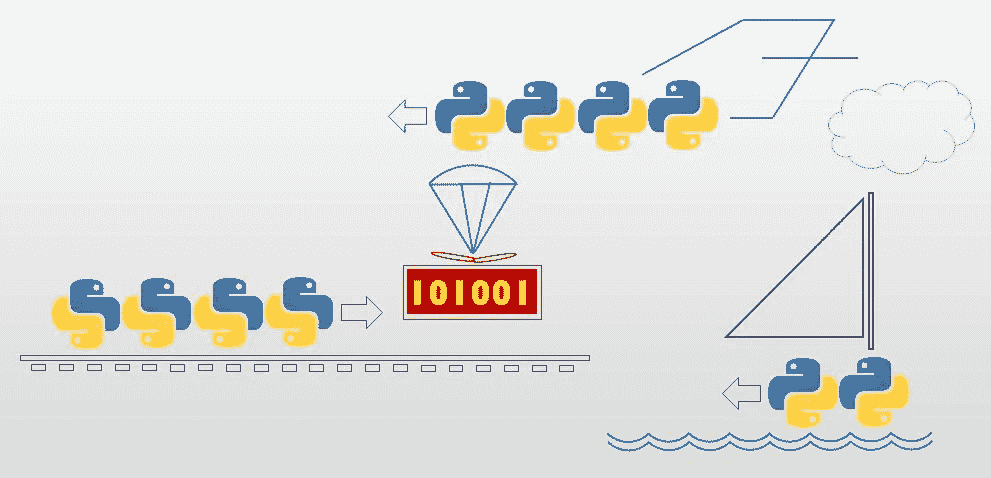

# Python 中的并行编程第 5 课。合作编程—同步

> 原文：<https://medium.com/codex/parallel-programming-in-python-lesson-5-cooperative-programming-synchronous-774aa4dac237?source=collection_archive---------21----------------------->



本课的章节:

1.  介绍
2.  拉迭代器
3.  迭代器要素
4.  单个消费者适合从多个生产商那里拉货
5.  推送迭代器
6.  协程要素
7.  自动启动
8.  单个生产者，适于推送给多个消费者(多播)
9.  传播数据接收器
10.  基于状态机和协程的解决方案的比较
11.  练习:合作尾服务器

## 1.介绍

在前两节课(第三和第四节)中，我们学习了一个简单的*【生产者/消费者】*(一对一)用例:

*   生产者发送列举的文本消息，消费者以两秒钟的间隔接收并立即显示这些消息。生产者和消费者都由主程序创建(并配对)，主程序在 20 秒后关闭生产者，导致消费者也关闭，结果正好显示 10 条消息”。

我们已经试验了生产者/消费者用例的各种“常规”实现:首先是多线程，然后是 Python 自己的*多处理*扭曲。所有这些“经典”解决方案都有两个共同的原则:

1.  生产者和消费者是松散耦合的——他们从不亲自见面，通过第三方交流。我们考虑了以下通信方式:全局变量、共享变量、点对点消息队列、管道、发布/订阅和套接字。
2.  协议是由生产者(生产商品的)规定的。消费者顺从了。

现在，我们来看一个替代的解决方案，其中生产者和消费者(1)在*控制的同一个线程*中*循环*，而(2)在*时间上耦合*(或者消费者*直接从*生产循环*中拉出*，或者生产者直接推入*消费循环*)。当然，这些解决方案仅限于生产者和消费者从不需要同时执行*(在完全相同的时间——不可否认这是*线程*的领域)的用例子集。然后，考虑到我们宇宙中几乎所有的生产者/消费者用例并不真正需要同时性，这并不是一个过分的要求！(根据定义，发送消息必须在接收消息之前*发生。只有在非常奇怪的情况下才允许同时发送和接收，例如，消息是分组发送的，或者在接收之前必须发出多条消息，因此两边的外围活动*可能*碰巧同时发生)。在质疑这种魔力是否能够实现以及如何实现之前，有很好的理由去尝试:(1)多线程/处理是资源昂贵的，(2)它给设计带来了复杂性，使得程序(不必要的)难以管理和扩展。**

*该解决方案涉及两种编程范例:*

1.  **协同处理*(使用*协程*)。我们将考虑两种设计模式:(1) **拉迭代器**。在每次迭代中，消费循环*从生产循环(暂停)中提取*下一条消息，使用它并暂停，等等。(2) **推送迭代器**。在每次迭代中，生产循环*将下一条消息推送给消费循环*(并暂停)。消费循环从那里接管(并暂停)等等。虽然这种解决方案可以用简单的过程化编程来构建，但结果很可能太复杂而不值得付出努力(这解释了为什么这种设计在实践中并不常见)。这里，*协程*的编程特性(相互传递控制、保留执行状态的函数)就派上了用场！Python 对协程的支持使得这些解决方案非常简单和易读(当然，对于熟悉这种范式的人来说)。*
2.  **可替代性*(或*多态性*)。这些解决方案似乎妥协了基本的*松散耦合*(生产者和消费者之间)——不可否认，这个生产者明确地*调用消费者的方法*(反之亦然)。但是，问题来了:这个生产者并不清楚(甚至模糊地)它在和谁说话。可以给生产者(反之亦然)任何对象，只要该对象实现了消费者接口(生产者感兴趣的部分，也是生产者期望找到的部分)。正如我们将看到的，迭代参数的可替代性打开了一些有趣的扩展。例如，为什么要用 1:1 呢？接口背后的对象可能是一个适配器，它允许轻松地实现单个生产者/多个消费者、多个生产者/单个消费者等用例。例如，接口另一端的对象可能是位于另一个线程中的真实对象的代理(如果真的需要并发的话！)*

## *2.拉迭代器*

*下面的例子使用 Python 对*结构化迭代的支持，显式地将消费者和生产者耦合在一起，但有所改变。*如果我们将我们的生产者/消费者用例约束到*恰好一个消费者，*(这是相当现实的)，那么我们可以用这种简单的形式重新表述它:*

*   *“消费者迭代来自生产者的消息”。( *"Iterates"* 与从文件中提取记录、从字符串中提取字符或从列表中提取对象的方式相同)。*

*下面是一个例子(注释如下)*

**备注:**

1.  *在这个设计中，生产者不是一个线程。*
2.  *实现*结构化迭代*的生产者方法。这个*魔法函数*被 Python 默默调用，以实现生产者对象上循环的*。(稍后将详细介绍)。**
3.  **yield* 语句挂起循环，向调用 for-loop 提供当前元素。*
4.  *消费者(一个线程)用一个符合 *Iterable* 接口的对象初始化，(比如我们的生产者)。*
5.  *消费者迭代“存储”在生产者中的消息(据其所知)。*
6.  *主程序创建生产者，并用它初始化消费者。*

**输出:**

```
*Round 1 
Round 2 
Round 3 
Round 4 
Round 5 
Round 6 
Round 7 
Round 8 
Round 9 
Round 10 
[End of input]*
```

## *3.迭代器/生成器基础*

*该序列图展示了通过*数据耦合*实现的同步。在消费循环的每次迭代中，“从生产者拉下一条消息”(隐含在 *for 循环*头中)在设计上通过*“消息”*(虚线弧)与生产方的“生成下一条消息”相耦合*，从而在*并行*中循环。**

**

*不同于在某些严格用例下支持结构化迭代的其他语言(比如从文件中提取记录或者从标准容器中提取对象)，Python 的迭代模型是——在 Python 精神中——尽可能通用的。任何对象都可以被迭代，只要它的类符合*“iterable”*协议，该协议由一个功能组成:魔术方法 **__ *iter__*** 。object 上的内置函数 *iter* 调用对象的魔方法 **__ *iter__*** (如果有)，返回一个*迭代器*。然后循环继续调用迭代器的 __ *next__* 。当迭代器抛出一个特殊异常时，循环终止。*

*神奇的方法 **__ *iter__*** 可能是生成下一个条目的生成器*或者是返回迭代器的普通函数。准确地说，内置的 *iter* 总是返回一个迭代器。当出现一个生成器(函数*产生*)时，它会悄悄地创建一个默认的迭代器。**

**备注:**

1.  *首先从迭代的对象中获取一个迭代器(使用内置的 *iter* ，其中使用了制作人的魔 **__ *iter__*** 方法)。这给出了一个(默认的)迭代器，它“指向”第一个消息之前的*。(即尚未产生任何消息)。**
2.  *在每次迭代中，内置的 *next* 试图从生产者那里获得下一条消息(使用迭代器的神奇方法 **__ *next__*** ，这释放了生产者的神奇方法 **__ *iter__*** ，直到下一条 *yield* 语句，在那里它暂停，返回下一条消息。*
3.  *当生产者决定停止生产消息时(即其神奇方法**_ _*ITER _ _****返回*“正常”——不同于 *yield* )，迭代器抛出*停止迭代*，从而终止消费循环。*

*虽然 Python 迭代器的典型用法隐含在循环的*中(如上所示)，但有些情况下，我们宁愿亲自动手，显式地推进迭代器。以下面的函数为例，它从任意的 iterable 中获取第一个条目(或者没有条目)。**

**备注:**

1.  *函数*从它的参数中获得一个迭代器*，不管它是什么，并返回其中的下一个项(实际上是第一个*项和第一个*项，因为 Python 迭代器天生是未初始化的)*
2.  *如果迭代器为空(next 在第一次迭代中失败)，则返回 None 对象。*

**输出:**

```
*'a' 
None*
```

## *4.单个消费者适合从多个生产商那里拉货*

*通过接口将消费者耦合到生产者*的设计决策打开了设计，提供了一些有趣的扩展(和有用的)用例。但首先，要证明消费者确实不知道生产商的真实身份:**

**备注:*
1。这个消费者用一个字符串初始化(迭代字符)。*

**输出:**

```
*a 
b 
c 
d 
e 
f 
g 
[End of input]*
```

*一个更有用的扩展是实现单个消费者/多个生产者的情况。并且这是在不对当前实现进行任何重大改变的情况下完成的。由于消费者不知道它真正迭代的是什么，我们将为它提供一个*适配器*，在每次来自消费者的迭代请求中，迭代来自生产者数组的下一条消息，它隐藏在里面！*

*顺便提一下，这个*多生产者适配器*提供了展示迭代的“低级”用法的机会，如上所述。*

**备注:**

1.  *为生产者提供了唯一的前缀，以区分其输出。否则，生产者逻辑没有变化。*
2.  *生产者输出是前缀。*
3.  *多生产者适配器接收生产者列表，并准备对每个生产者进行迭代。*
4.  *多生成器适配器遍历每个生成器，一次遍历一个(下一个)元素。*
5.  *延迟现在由多生产者适配器负责。(我们不希望它依赖于任意数量的生产者)。*
6.  *这里，第一个结束的生产者终止了整个迭代。(另一种解决方案是从列表中删除过期的生产者，并将生产循环的终止推迟到列表变空时)。*
7.  *延迟不再是消费者的责任。否则，没有改变消费者的逻辑。*
8.  *主程序创建三个生产者，前缀为“a”到“c”。*
9.  *这一次，消费者得到了一个超过三个前缀生产者的适配器。*
10.  *现在有多个生产者停止。*

**输出:**

```
*Round a1 
Round b1 
Round c1 
Round a2 
Round b2 
Round c2 
Round a3 
Round b3 
Round c3 
Round a4 
Round b4 
Round c4 
Round a5 
Round b5 
Round c5 
[End of input]*
```

## *5.推送迭代器*

*现在来看相反的用例，生产者向消费者的协程提供消息，一次一条。和前面的解决方案一样(消费者迭代生产者)，控制权以明显的(程序化的)方式在他们之间传递，不需要*同步*设施。有趣的是，Python 也允许我们在这里使用迭代器(通过生成器函数)，但是这个特殊的迭代器*使用专用语法将*推送到数据目标(而不是*从数据源拉*)。*

**备注:**

1.  *生产者*启动*迭代器(即调用下一个的*)。因为 Python 迭代器是未初始化的，所以需要第一个*get-next*("*priming "*)将它定位到开始。*否则下面的*发送*会导致错误！*
2.  *生产者*向消费循环*发送消息，*阻塞*。*
3.  *由于*发送*，不同于*产出*不被另一端的(结束)循环终止，输出流必须被*明确关闭*。*
4.  *消费循环阻塞，等待某人(在我们的例子中是生产者)向*发送*下一条消息(通过 yield *给出*消息来实现)。当消息最终被接收时，生产者(发送它的)保持阻塞，直到下一个产出或消耗*退出*。将 yield 括在括号中并不重要，但这是 Python 的常见做法。*
5.  *这种延迟由消费者来管理。*
6.  *生产者决定*停止发送*(此处不隐含)会引发*发生器退出*异常。消费者将这个“异常”解释为循环的合法结束。*
7.  *主程序调用*消费*，给*消费*一个 Python *协程*包装器，并把它交给生产者。主程序的其余部分不受协议变化的影响。*

## *6.协程要素*

*序列图展示了通过*数据耦合*的同步。在消费循环的每次迭代中，“在消费者中接收下一条消息” *(yield)* 在设计上通过“消息”(虚线弧)与“将消息推送给消费者” *(send)* (通过编程阻止)耦合，这是一个并行循环。*

**

**注意区别！**

*   **拉*-迭代器的产量*产生*自变量，*阻塞生产*循环，*释放消费*循环。*
*   **推*-迭代器的产量*阻塞生产*循环，*释放消耗*循环，*消耗*自变量，*

*“调用”一个依赖的协程(比如我们的消费者)还没有执行这个函数。相反，它返回一个迭代器，准备运行，有点像线程“构造函数”(例如在需要的地方使用初始化参数的*)。当第一次进入协程时(当被请求推动下一个*的*—即第一个*的*—输出)，它执行到第一个*产出*并暂停，该过程被称为*启动*。然后，从另一侧发送的每个项目*释放协程以“推送”未决的*产出值*。***

当然，只要推送迭代器协程在一个*产出*点被阻塞，这种机制就能工作，这在输出循环期间是有保证的，但在第一次时就不行了，那时协程还没有被定位在任何有用的地方。这就是为什么需要*灌注*的原因。诚然，发电机启动的功能和动机是有点模糊的。为了充分理解它，人们必须深入研究语言的历史。推送迭代器(生成器协同例程)是 Python 的新增功能，是在现有的(拉取)迭代器上实现的。为了证明这一点，可以编写如下代码:

```
inp = yield outp
```

虽然这种代码的效用是可疑的，并且被所有教科书强烈反对，但它将会工作。(*产出*将首先发生，而由*驱动的分配将最后发送*。这一切都始于 Python 迭代范式，它不区分*指向*当前元素和*返回*(产生)它，例如，C++ STL 就是这样。(Python 在这方面并不独特。C#和其他语言也是如此，从设计的角度来看，它更有意义)。Python 迭代器天生是“未初始化”的，当需要*获取下一个*时，它只会*指向第一个元素(并返回它)。第一个*下一个*请求将获取第一个元素(如果有)。顺便说一句，如果存在迭代初始化过程，它也将贯穿整个过程。这对于最初的 *pull* 迭代器很有效，因为 *it* 控制迭代(另一端被阻塞，直到它让步)。但是*推*迭代器不能天生“未初始化”，因为它是从外部控制的！它被封锁，直到有人帮它一个忙，然后*派*进去。当这种情况发生时，它必须定位在某个*产量*点，等待*发送*的到来。为了第一次实现这一点，我们必须使用它(不需要的)能力作为拉迭代器，并指示它检索下一个元素*，即到达第一个屈服点(在这里它什么也没有检索到，因为它什么也没有得到)，并准备好接收。这是一个公认的蹩脚借口，但这就是它的工作方式…**

*在协程生命周期的另一端，当它被*返回*“正常”终止时(与*产生*不同)，它自己主动这么做并不是一个好主意。通常，应由推动侧决定何时*停止推动*并终止循环。(与*拉式迭代器*相反，拉式迭代器通过提升*停止迭代*来保持*发回*货物，其自然职责是停止循环)。当生产者发送完信息时，它通过升高*发生器出口*向消费者发出停止接收的信号。这给了消费者在退出之前进行清理的机会。*

## *7.自动启动*

*启动生成器的任务可以被一般化并委托给一个*装饰器*，如下例所示。(奇怪的是，这不是内置 Python 库的一部分)。*

**备注:**

1.  **协程*函数接受一个函数。*
2.  *在协程装饰器内部隐藏了另一个名为 *start* 的函数，该函数用于包装接收到的函数。因为我们事先不知道包装的函数将接受什么参数，所以 start 解决了最大可能的情况:如此多的未命名参数和如此多的命名参数。*
3.  *Start 创建一个*协程*(通过调用包装的函数)。它不需要包装的函数作为形式参数，因为它已经在它的*闭包*中了。*
4.  *消费者被*装饰*为*协程*。函数名*消耗*现在指向*协程*的函数*开始*。(消费不亏。它处于*开始*的关闭状态。)对 *consume* 的调用将调用 *start* (属于*协程*函数)来代替(作为上面*装饰器*的结果)，这将调用 consume， *prime* 它并返回(primed)结果协程对象。*
5.  *主程序调用它持有的 *consume* (实际上是*协程*的 *start* )，后者调用真正的 *consume* ，给 *consume* 一个 Python *协程*包装器，对其进行预处理并将其返回给主程序，主程序将它交给生产者。主程序的其余部分不受协议变化的影响。*

## *8.单个生产者，适于推送给多个消费者(多点传送)*

*这个版本*将生产者的信息“多播”给多个消费者。多播协程被插入到生产者和消费者之间。延迟被移动到多播**

***备注:***

1.  **不同的消费者通过前缀来识别。**
2.  **消费者的消息会相应地加上前缀。**
3.  **多播适配器接受一个生成器列表。**
4.  **消息依次发送给每个消费者。**
5.  **延迟被委托给多播者。(我们不希望它依赖于任意的消费者数量)。**
6.  **最后，多播适配器依次关闭每个使用者。**
7.  **主程序加载带有消费者生成器的多播适配器，前缀为“a”到“c”。**

***输出:***

```
**a: Round 1 
b: Round 1 
c: Round 1 
a: Round 2 
b: Round 2 
c: Round 2 
a: Round 3 
b: Round 3 
c: Round 3 
a: Round 4 
b: Round 4 
c: Round 4 
a: Round 5 
b: Round 5 
c: Round 5 
a: [End of input] 
b: [End of input] 
c: [End of input]**
```

## **9.传播数据接收器-协程管道**

**这个版本通过引入一个可替换的接收器媒介——链中的另一个协程——来一般化消息的显示，它沿着层次结构向下传播，形成一个*管道*。**

***备注:***

1.  **生产者有两个生产者:消费者和输出媒介。**
2.  **使用输出媒介将输出提供给消费者。**
3.  **消费者受到两个因素的影响:信息和目标媒体。(注意，在这个设计中，目标媒体在每个消息中被再次发送，强调消费者与输出媒体的独立性。另一种设计是使用输出介质初始化消费者，假设它不改变并且不依赖于消息)。**
4.  **消费者将显示转发到给定的输出媒体。**
5.  **输出介质被实现为协程以符合设计。(它也可以是一个函数或一个可替换的对象)**
6.  **主程序用输出介质初始化生产者。**

## **10.事件驱动与基于协程的解决方案的比较**

**在接下来的讨论中，我们将切换到构建一个课程结构的用例，该结构由 dictionary-of-list 实现，并从 XML 加载。我们将使用从 XML 加载数据的过程，以便比较“传统的”状态机解决方案和另一种基于协程的解决方案，这种解决方案初看起来可能不寻常，但有其魅力，并且肯定展示了范例。**

***这是我们例子的数据结构实例:***

****

***XML 输入:***

****一个“常规”**版本:根据标签填充航向，观察加载状态**

***备注:***

1.  **“Course”标签重置解析。**
2.  **“Paradigm”标签在课程中打开了一个新的范例，带有(目前)空的课程列表，并将两者都设置为当前。**
3.  **“language”标签为当前范例添加了一种语言。**
4.  **结束元素已注册但未实现。(保留供将来使用)。**

***输出:***

```
**Procedural 
  C 
  COBOL 
OO 
  Python 
  C++ 
  C# 
  Java 
Functional 
  Clojure**
```

****基于协程的解决方案:**填充课程，在数据层次中迭代**

**这是一个基于协程的 XML 构建器，使用相同的解析器。构建器在解析器中注册开始标记和结束标记处理程序，这些处理程序提供给协程。协程被构建为*循环中的循环，*符合*一对多对多*过程数据结构**

***备注:***

1.  **课程循环(通常执行一次)。**
2.  **begin-course 标签清除课程并重置当前范例。**
3.  **范式循环。**
4.  **begin-paradigm 标签打开一个新的范例作为当前范例，并清除它的语言列表。**
5.  **语言循环**
6.  **语言标签将一种语言添加到当前范例中。**
7.  **结束语言标签(由解析器引入)被忽略。**
8.  **下一种语言。**
9.  **下一个范例**
10.  **下一道菜(预期结束标签)。**

**这块小宝石非常有条理(尽管它的实际用途值得怀疑)。我们在这里看到的是传统的*程序性*代码，但是被*功能性*编程所模拟！它是事件驱动的，但在表面之下。协程的使用有效地对程序员隐藏了状态机。如同在通用程序中一样，*控制结构*遵循*数据结构*。当然，对数据结构的忠实性是这种设计模式的优点，也是它的缺点。一方面，代码非常清楚。任何初学 Python 的程序员都可以理解这段代码的作用，即使不熟悉*产出*的确切作用。(相比之下，事件驱动的解决方案尽可能地脱离数据结构，几乎不可读)。另一方面，它不是开放-封闭/可扩展的。对数据结构的任何改变都需要物理地改变代码(而事件驱动的解决方案只需要注册额外的处理程序)。尽管如此，我还是建议考虑这种设计模式，因为它的可读性很好，数据结构是可靠的，或者当代码发生变化时扩展代码不成问题。**

## **11.练习:合作尾服务器**

**重构第三课中介绍的多线程尾部服务器练习的解决方案，以使用协程。**

***这里是官方的“教科书解决方案”:***

***输出:***

```
**File 1 to watch: file1.txt 
File 2 to watch: file2.txt 
File 3 to watch: file3.txt 
File 4 to watch: 
[Tailing "file1.txt"] 
[Tailing "file2.txt"] 
[Tailing "file3.txt"] 
file3.txt: 1\. Mon Aug 23 23:02:22 2021 
file1.txt: 1\. Mon Aug 23 23:02:22 2021 
file2.txt: 1\. Mon Aug 23 23:02:22 2021 
file3.txt: 2\. Mon Aug 23 23:02:27 2021 
file1.txt: 2\. Mon Aug 23 23:02:27 2021 
file2.txt: 2\. Mon Aug 23 23:02:27 2021 
file3.txt: 3\. Mon Aug 23 23:02:32 2021 
file1.txt: 3\. Mon Aug 23 23:02:32 2021 
file2.txt: 3\. Mon Aug 23 23:02:32 2021 
file3.txt: 4\. Mon Aug 23 23:02:37 2021 
file1.txt: 4\. Mon Aug 23 23:02:37 2021 
file2.txt: 4\. Mon Aug 23 23:02:37 2021 
file1.txt: 5\. Mon Aug 23 23:02:42 2021 
file3.txt: 5\. Mon Aug 23 23:02:42 2021 
file2.txt: 5\. Mon Aug 23 23:02:42 2021 
[stopped tailing "file1.txt"] 
[stopped tailing "file2.txt"] 
[stopped tailing "file3.txt"]**
```

**在这个解决方案中，每个尾部观察器以及尾部服务器都有自己的线程。将解决方案重构为一个尾部服务器，它运行在自己的线程上，但是使用 *pull 迭代器*模式同步迭代它的尾部观察器。总而言之，解决方案中有两个线程:线程服务器和文件接触功能。**

## **参考**

1.  **“一个关于协同程序和并发性的奇怪课程”，David Beazley，2009 年([讲座衬托](http://www.dabeaz.com/coroutines/Coroutines.pdf))**

## **接下来呢？**

**还有一课要上！在下一课，也是最后一课，我们将考虑基于分派的协作处理替代方案，称为*异步*执行。**

***内容:***

1.  **[简介](/codex/parallel-programming-in-python-lesson-1-introduction-210e33d02ea6?source=friends_link&sk=5273e19224913fbd6a3b74f41871a754)**
2.  **[螺纹](/codex/parallel-programming-in-python-lesson-2-the-thread-b3986e215d4f?source=friends_link&sk=5ad6a9c99ce8947be53af4949ce6f086)**
3.  **[同步原语(多线程)](/@Avner_17989/parallel-programming-in-python-lesson-3-synchronization-primitives-78ac09befc43)**
4.  **[同步原语(多处理)](/codex/parallel-programming-in-python-lesson-4-multi-processing-90f597da89ba)**
5.  **协同处理—同步— *(你来了！)***
6.  **协作处理—异步**