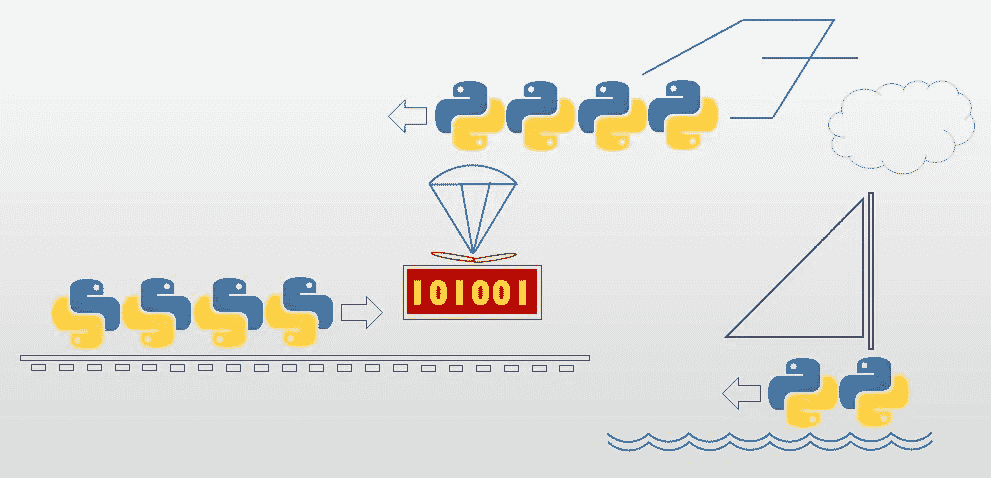
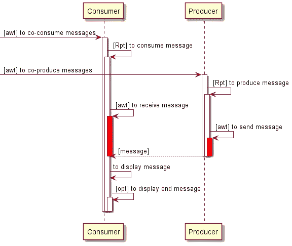

# Python 中的并行编程第 6 课。合作编程—异步

> 原文：<https://medium.com/codex/parallel-programming-in-python-lesson-6-cooperative-programming-asynchronous-1953ddf97498?source=collection_archive---------5----------------------->



这是系列课程中的第六课，也是最后一课，涵盖了 Python 编程语言为并行编程提供的各种工具，以及使用每种工具的动机。在之前的课程中，我们已经探索了*事件驱动*设计的应用需求，并学会了区分那些确实需要并行代码的需求。我们研究了常见的*生产者/消费者*用例，并探索了它的各种实现:*多线程*、*多处理*和*协作编程*。后者用*协程*的合作取代了传统的并行逻辑到线程/进程的分离，在单个控制线程内交错同步要求的活动。在最后一课中，我们将考虑 Python 对将这些协程(或任何函数)的执行开放给*调度*的特殊(且重要)情况的支持。

*本课章节*

1.  调度协程的动机
2.  通过异步队列的生产者/消费者
3.  消费者决定速度
4.  异步迭代
5.  附加功能

## 1.调度协程的动机

在本系列的前面，我们讨论了两个(或更多)编程任务的用例——指定为“消费者”和“生产者”——它们并行存在，并且需要*同步*才能正常运行。一项任务消耗的输入——并非偶然——恰好是另一项任务产生的输出，反之亦然。在“经典的”*多线程/多处理*解决方案(分别在第 3 课和第 4 课中讨论)中，每个任务以其独立的方式启动，加上同步机制(锁、事件、队列)的开销，在访问两端的公共资源之前必须参考这些开销。例如，确保*消耗*输入不会干扰*产生*输出(在我们的例子中，它们是同一个对象)，确保输入*确实存在*用于消耗，确保输出*确实在生产后*交付，等等。然后，*协程*解决方案(在第 5 课中讨论)设法将两个任务保持在同一个控制线程中，交错输入和输出步骤，使用协程协议，不需要*显式*同步。一个单独的控制线程在这里就可以了，因为消费者和生产者任务(以及我们宇宙中邀请并行的任务的大多数其他情况)不涉及真正同步的步骤。他们从来不需要同时执行任何两个原子步骤！

但是协程解决方案的简单性是有代价的。协程解决方案在*函数调用*的量子中工作(或者隐式协程重入，实际上是通过函数调用实现的——神奇的方法 __next__，等等。).函数调用会阻塞通向它的控制路径中的所有东西(不像一个单独的线程，它可能阻塞自己，也可能不阻塞自己，让其他线程照常运行)。但是函数会阻塞它们的调用者，直到它们返回，即使它们在此期间做得很少或者根本不做任何事情(就 CPU 而言)。两个明显的例子是执行 I/O 的函数(包括空闲等待硬件)和休眠的函数。在多线程解决方案中，这种缓慢的函数不会阻止它们的对等体(在其他线程中)运行。但是现在我们已经将整个并行功能压缩到了一个线程中，这似乎是我们搬起石头砸了自己的脚！总结一下多线程模拟，如果我们能够以某种方式说服那些不必要地阻止我们的函数让出位置，让我们使用这个时间窗口，而同时仍然保持在同一个控制线程中，那就太好了！

> *调度协同程序机制的秘密在于，在任何时刻，*许多*函数调用可能被逻辑阻塞，但这仍然发生在一个控制线程内(尽管后者只能*物理地*阻塞其中一个！)*

实现这一壮举的常见结构化方法是将潜在空闲功能(可能被安全延迟)的执行转发给一个(全局)调度程序，由*调度*它们的执行。可编程地— to *等待*执行(阻塞)。为了让奇迹成真，我们可以通过*调度*几个这样的功能“同时”(在对调度程序的一个请求中)来启动程序。我们得到的是一个控制流，其中每个等待函数的*确实被阻塞了，但是它们的执行顺序是不确定的！(因为调度程序可能在任何时候积累了如此多的等待请求，并且会随意释放它们)。因为程序最初安排了几个控制路径，以供随机选择，这可能会进一步增加更多的函数调用以供选择，等等。每次调度一个等待的函数调用时，程序可以恢复另一个逻辑控制路径(实际上已经被挂起)。调度协程机制的秘密在于，在任何时刻，*可能会逻辑上阻塞不止一个*函数调用(就像在多线程中一样，在任何时刻，不止一个线程——即其中的一个函数调用——可能会被阻塞)，但这仍然发生在单个控制线程中(尽管后者只能*物理上*阻塞一个函数调用！).实际上，这种场景非常类似于多线程(不包括同时性)，以至于有些人将这种编程任务称为绿色线程(我猜这种“绿色”意味着经济)。*

虽然这种调度程序机制可能是使用通用的过程构建块专门编写的，但拥有一个语言支持的机制可以处理许多小的和不那么小的细节，并且它的全局特性确保所有等待的请求(包括第三方代码发出的请求)都将被考虑在内。在 Python 中，这种语言工具被称为 *asyncio* ，涉及关键字`asynch def`用于可调度函数(包括生成器)和`await`用于调度这种函数。`asynch for`支持迭代器协程重入。人们可以显式地启动*事件循环*(调度程序)(或者使用默认设置)。为了强调与多线程的相似性，异步 IO 支持可等待的同步对象- *锁、队列、事件*和*睡眠*功能。此外，内置的异步 IO 库附带了一个有用的网络 API。

请注意，术语“异步”在这里以一种特殊的方式使用。到目前为止，在本系列中，我们一直在使用术语*异步*函数调用，意思是*非阻塞*。该函数在一个新的调用堆栈上启动(通常打开另一个线程或进程)，让调用者自由地在原来的调用堆栈上继续，从而产生*并行性*。两条控制路径并行展开。(考虑一下*下水*的比喻，比如在*下水*一艘船出海。这艘船开始了它自己的海上航行。我们留在岸上继续我们的业务。虽然我们可能对船只及其应返回的货物负责，但我们并不在船上。因此，调用者发起的线程正在以它自己的方式运行。调用者是否期望结果(以及如何获得结果)取决于调用者。从这个“经典”的上下文来看，异步 IO 设施，与其选择的标题相反，绝对是同步的。等待中的调用者被挂起，只有当等待中的协程返回时才会恢复。该*等待*呼叫与普通同步呼叫的区别在于等待呼叫在时间上*延迟*。它可能需要一段未指定的时间来启动，同时，所有其他等待的协程将被一个接一个地调用，并且(除非您篡改它)以相同的顺序被调度。同时安排的新协程将不得不等待(你的)。与多线程/处理(称为*绿色*线程)的相似之处是*虚拟的和有条件的*(即在旁观者的眼中)，并且只有在程序开始时批量调度多个协程的用例中才会实现，前提是这些协程中的每一个在展开时都继续调度其关键步骤。

此外，异步 IO 设施可能被用作优化性能的一种聪明的方法(尤其是在 IO 方面)，并且有大量关于这方面的文献。然而，这样的用法，无论流行与否，都超出了本系列的范围，这是关于 Python 中的*并行*编程。

当然，为了从异步 IO 中的 *IO* 中获得除内置默认功能之外的其他功能，用户必须求助于具有 await able 函数(通常以“aio”为前缀)的第三方库，例如用于 web 客户端、磁盘访问等功能。).不用说，默认内置的*同步*库当然会把我们屏蔽掉，这不是我们要找的！在这里，我们并不想真的*休眠(10)* (阻塞控制线程中的所有东西 10 秒钟)——我们更希望*等待休眠(10)* ，释放下一个预定的函数束，同时执行，并在大于或等于 10 秒钟后返回给我们。(*大于/等于*，而不是*正好是*——因为在多线程的情况下，该机制是*协作*，而不是*抢占*)。

## 2.通过异步队列的生产者/消费者

以下示例将第三课中相应示例的生产者/消费者多线程*队列*重构为异步 IO 实现。这个程序的三个并行主要功能——生产者*、消费者*和定时器*——被实现为三个“绿色线程”，它们在(物理)主控制线程中协作，通过一个*异步*队列交换数据。所有涉及等待*(获取*消息、*放置*消息和*暂停)*的动作都被调度，同时释放另一方去做它的工作。*

**(输出和下面的脚注)**

**备注:**

1.  *该程序导入异步 IO 库。*
2.  *使用异步队列初始化生成器。*
3.  *生产者“绿色线程”运动运行功能，这是异步的。*
4.  *来自队列的发送下一条消息的请求被调度(释放消费者，这实际上已经被调度，以拾取它)。*
5.  *生产者的停止方法是可等待的，并接受测试程序的超时。*
6.  *生产者的停止方法安排它的睡眠时间，让生产者和消费者在这段时间工作。*
7.  *生产者不再阻塞整个线程两秒钟，而是释放消费者获取输入，如果还没有完成的话。*
8.  *消费者打开一个异步(可等待)队列。*
9.  *消费者也是一根“绿色”线。*
10.  *来自队列的获取下一条消息的请求被调度(实际上，等待生产者放置它)。*
11.  *生产者被交给消费者的队列*
12.  *这个应用程序中的三个绿色线程是异步等待的。(与阻塞的单个 await 操作不同，在这里，三个绿色线程被“聚集”起来并交给事件循环，以随机顺序进行调度)。*
13.  *创建事件循环并确保它正确启动和停止是异步 IO 的默认任务。*

**输出:**

```
*Round 1 
Round 2 
Round 3 
Round 4 
Round 5 
Round 6 
Round 7 
Round 8 
Round 9 
Round 10 
[End of input]*
```

*注意*收集*等待的绿色线程是必不可少的。相反，连续等待每个绿色线程确实会做到这一点:首先，计时器将立即执行并永久停止程序 20 秒(因为目前还没有任何东西阻挡它)，然后生产者将进入执行并无限期地阻塞程序(实际上，直到队列变满(这是未验证的，还没有消费者)，然后(理论上)，消费者应该进入执行并无限期地阻塞(不再有生产者)。不用说，这绝不是我们所期待的情景。*

*下面的序列图显示了这种设计背后的逻辑。有趣的是，协作和顺序与第五章的*拉迭代器*例子中的完全相同(见序列图)。唯一的区别是美观(从设计师的角度来看):*

*   *消费者循环也被并行化。(以前是主线程)。*
*   *生产者循环等待*。(以前是一根线)。**
*   ***发送*和*接收*功能是*等待*，由异步队列实现。(以前是用 Python 的迭代机制同步的)。**

****

**序列图:通过异步队列逻辑的生产者/消费者**

***序列图中没有描述下面的实现细节:*虽然启动消费者和生产者的顺序没有定义，但是生产者的发送总是在消费者的接收之前(因为它们都是可等待的)。即使使用者的接收最先到达，它也会被阻塞在队列中，直到生产者发送。当生产者的 send-method 到达并发送后，它会等待整整两秒钟才退出，这对消费者来说足够了。当然，涉及非常短的响应时间(比如说，几毫秒或更短)的场景应该由*事件*保护(如下面第三节的例子)。**

## **3.消费者决定速度**

**在前面的例子中，生产者设定了速度— *它*在发送后实现了两秒钟的延迟。在本例中，消费者使用常见的 Python 队列协议设置速度(实现延迟),生产者在队列旁等待。*(输出保持不变)***

***备注:***

1.  **生产者等待队列事件发出信号(释放消费者以恢复)。**
2.  **消费者向生产者发出信号以恢复生产。请注意，并非所有异步队列的方法都是可用的！**

## **4.调度迭代**

**Python 支持异步拉迭代器— `async for`。(但不是异步*推送*迭代器)。**

**下面的例子用异步 IO 实现重构了第五课中的多生产者/单消费者的例子。请注意，将消费者逻辑从线程转移到协程只是为了教学目的。它不会提高性能，输出的顺序总是同步的:“a”、“b”、“c”。唯一的改进，如果有的话，是线程的删除。**

***备注:***

1.  **神奇的迭代方法是异步的，更确切地说是被称为`__aiter__`。(它也返回一个`asynch_generator,`而不是迭代器)。**
2.  **然而在内部，输入是以明显的顺序同步获得的。(这个例子没有利用异步迭代的全部能力)。**
3.  **消费者运行方法必须是异步的，因为它使用了`asynch for`。**
4.  **for 循环是异步的(使用生产者的`__aiter__`)。**

**输出:**

```
**Round a1 
Round b1 
Round c1 
Round a2 
Round b2 
Round c2 
Round a3 
Round b3 
Round c3 
Round a4 
Round b4 
Round c4 
Round a5 
Round b5 
Round c5 
[End of input]**
```

## **5.附加功能**

**调度协程有两种方式:**

1.  **在一个异步函数中，使用 Python 语法来*await*——调用它。(一些限制:您不能从模块范围或同步函数中等待。你不能等待一个λ。**
2.  **在程序的根(通常)，显式地请求异步 IO 设备调度一个或任意数量的协程。推荐的方法(Python 3.7+，此处演示)是请求异步 IO 工具*运行*(一个)主任务，其中如此多的绿色线程被*聚集*并成批等待。老式的方法(这里没有演示)是创建*事件循环*(或者选择默认)，然后请求它*调度*一堆绿色线程，通常是*到完成*(所有未决任务)。或者，您可以永远运行事件循环*并手动终止它。***

**具体来说，显式调度请求实际上采用了一个`task`并返回一个`future`(当准备好时，它将公开返回值)。通常，人们可以忽略这个低级 API，因为当人们提供协程(异步函数)或生成器(生成函数)时，任务将自动构建，返回值由调度程序自动处理。(当然，您可以显式地创建任务，这里的默认值限制太多)。也可以在事件循环之前逐个累积预定的功能- `ensure_future` -(而不是像在这些例子中那样将它们收集起来进行调度)。**

***内容:***

1.  **[简介](/codex/parallel-programming-in-python-lesson-1-introduction-210e33d02ea6?source=friends_link&sk=5273e19224913fbd6a3b74f41871a754)**
2.  **[线程](/codex/parallel-programming-in-python-lesson-2-the-thread-b3986e215d4f?source=friends_link&sk=5ad6a9c99ce8947be53af4949ce6f086)**
3.  **[同步原语(多线程)](/@Avner_17989/parallel-programming-in-python-lesson-3-synchronization-primitives-78ac09befc43)**
4.  **[同步原语(多处理)](/codex/parallel-programming-in-python-lesson-4-multi-processing-90f597da89ba)**
5.  **[协同处理—同步](/codex/parallel-programming-in-python-lesson-5-cooperative-programming-synchronous-774aa4dac237?source=your_stories_page-------------------------------------)**
6.  **协同处理—异步— *(你来了！)***