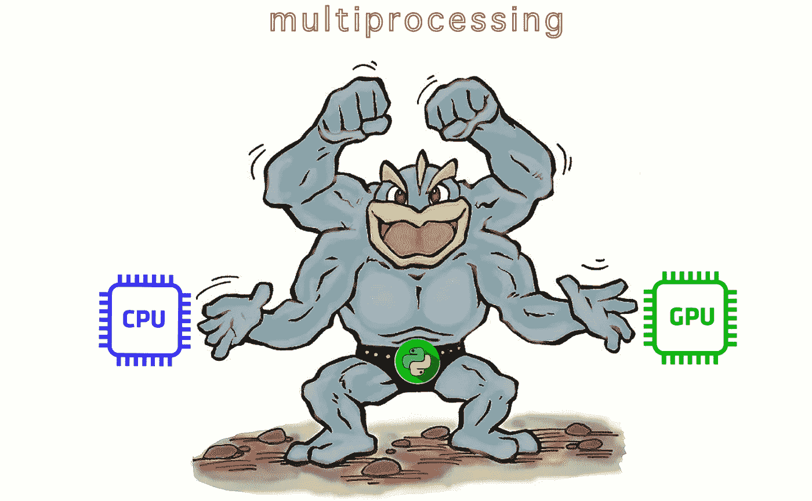
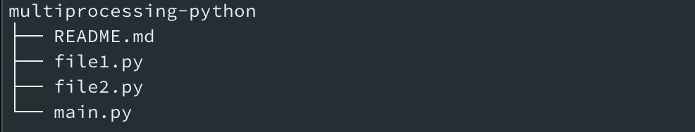

# 在 CPU 和 GPU 上并行化 ML/DL 模型推理

> 原文：<https://medium.com/codex/parallelizing-ml-dl-models-inference-on-both-cpu-and-gpu-bdc3d0d2e2ad?source=collection_archive---------0----------------------->

## 在生产环境中使用 GPU 推理深度学习模型时，如何利用未使用的 CPU 计算。



通过一个四臂卡通人物来说明多重处理。[ [来源](https://blackgladiatoarswa.blogspot.com/2015/03/pokemon-x-and-y-machamp.html)

## **问题陈述:**

你必须在计算机视觉中训练过各种机器学习(ML)或深度学习(DL)模型，使用 BERT 和 Transformers 解决物体检测、物体分割、物体定位和自然语言处理(NLP)任务等问题。在训练完模型之后，我们将它们推到生产环境中，在那里我们实时地进行推理。获得快速响应总是可取的，这增强了消费者的体验。未能最佳利用所提供的资源可能会导致延迟或金钱损失，甚至在我们不知情的情况下。因此，我们应该利用机器上未消耗的资源。

当我们通过 GPU 使用 DL 模型进行推理时，CPU 仍然剩余，可以用来执行特定的并行任务，或者可以用来并行运行一些轻量级模型。例如，我们有一个由各种模型组成的管道，包括传统的 ML 模型或 DL 模型。我们的 DL 模型很少在 CPU 上慢那么多，并且可以在 CPU 上运行。在上述场景中，我们可以通过运行一些模型来利用机器未使用的 CPU 能力。有人可能会说，我们可以为每种 CPU 和 GPU 模型类型创建两个独立的 API。然而，在这种情况下，GPU 实例的 CPU 计算仍将保持未消耗状态。

本文将讨论如何利用实例中未使用的 CPU 计算。

## **方法:**

目标是在 CPU 和 GPU 上分别运行代码库的一部分，而不影响彼此的性能。我们可以使用多重处理，通过双向方法来解决这个问题。首先，我们将首先用主流程运行我们的 python 脚本。此外，我们将在主流程下创建两个单独的流程。每个进程将调用单独的类文件，每个类文件将包含在它们的' *__init__'* 方法中进行推理时要使用的机器类型。

## **为什么不是多线程？**

多线程允许多个并发任务在单个进程中运行。换句话说，我们将在单个进程中利用资源。假设我们的主 python 脚本使用了一个进程，并且我们已经指定代码将在 GPU 上运行。当我们创建线程时，所有的线程都将使用 GPU 作为默认设置。如果我们使用 CPU 配置运行 python 脚本，也会发生同样的情况。因此，要么所有创建的线程都将占用相同的 GPU，从而导致内存不足(OOM)错误，要么占用 CPU，从而降低推理速度。因此，多线程不是解决上述方法的可行方法。

将通过使用几个 python 类文件来阐述所使用的方法。

*代码的目录结构如下:*



代码的目录结构。

***file1.py:*** 这个文件包含了用于调用 CPU 模型上的推理的类。在 *'__init__'* 方法中，我们指定了 *'CUDA_VISIBLE_DEVICES'* 到 *'-1'* ，所以它不会挑选 GPU。删除此语句将导致 OOM 错误；也就是说，多个进程将同时尝试使用同一个 GPU。

***file2.py:*** 该文件包含了用于调用 GPU 模型上的推理的类。在 *'__init__'* 方法中，我们指定了 *'CUDA_VISIBLE_DEVICES'* 到 *'0'* (或者任何一个特定的 GPU 设备)，以便它挑选 GPU。

***main.py:*** 这是包含驱动代码的主文件。

*多处理模块中的管理器是什么？*

管理器代理对象不能传播对机器内部可变对象的更改。举例来说，如果我们有一个 *'manager.dict()'* 对象，对托管列表本身的任何修改都将传播到所有其他进程。另一方面，如果我们使用一个标准的 python 字典，那么更改将不会在该字典中传播，因为管理器无法检测到更改。

主进程将运行 *'main.py'* ，并在文件的' *run'* 方法中创建两个进程。每个过程将使用公共数据源和不同的模型列表独立工作。在两个流程都完成工作后，我们将把两个辅助流程加入到主流程中。最后，我们可以返回从两个过程中收集的结果对象。

驱动代码为 ***main.py***

在下面的代码片段中，我们创建了*‘Main’*类对象，并调用了同一个类的*‘run’*方法。该方法采用输入数据集路径和可以在 CPU 和 GPU 上并行运行的模型。该函数以我们想要的任何格式或对象返回模型的输出。

```
if __name__ == "__main__":
    obj = Main()
    dataset_path = "/home/prateek/..."
    cpu_model_list = ['...', '...']
    gpu_model_list = ['...', '...']
    preds = obj.run(dataset_path, cpu_model_list, gpu_model_list)
```

完整的代码发布在 GitHub 上:

```
Github Link: [https://github.com/prateekchhikara/multiprocessing-python](https://github.com/prateekchhikara/multiprocessing-python)
```

本文介绍了一种在模型推理过程中利用机器优化计算的方法。

# 参考

 [## 多重处理-基于进程的并行性- Python 3.10.1 文档

### 是一个支持使用类似于模块的 API 生成进程的包。该套餐提供本地和…

docs.python.org](https://docs.python.org/3/library/multiprocessing.html)