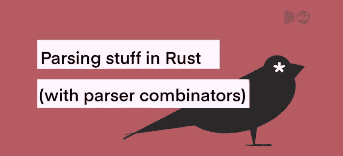

# Rust 中的解析器组合子

> 原文：<https://medium.com/codex/parser-combinators-in-rust-ed08cc3bc4a?source=collection_archive---------5----------------------->



由在英国布里斯托尔工作的 [doma 团队](https://twitter.com/doma_dev)于 2021 年 3 月 30 日星期二*发表。*

# TL；速度三角形定位法(dead reckoning)

*   不要使用正则表达式进行解析
*   解析器组合子是用高阶函数构造可组合计算的一种方式
*   解析器组合子很容易用来快速获得结果
*   对于 99%的实际应用来说，它们已经足够了，只有当你的库的唯一目的是解析时，它们才不够用

# 解析在计算中的作用

数据处理是计算的支柱。要运行一个算法，首先必须在内存中建立一些数据结构。填充数据结构的方法是获取一些原始数据并将其加载到内存中。数据科学家处理原始数据，对其进行清理，并创建格式良好的数据集。编程语言设计者将源代码文件标记化，然后将它们解析成抽象语法树。Web-scraper 作者导航抓取的 HTML 并提取感兴趣的值。

非正式地说，这些步骤中的每一步都可以称为“解析”。这篇文章讲述了如何在愤怒中完成*完整、可组合和正确的解析*。这是什么意思呢？

*   *愤怒解析*务实地考虑数据转换的问题。不需要理论上的最佳解决方案。相反，目标是尽可能快地编写一个正确的解析器。
*   *可组合解析*意味着结果解析器可能由“更小”的组件组成。它本身可以在以后作为“更大的”解析器的一个组件使用。
*   *完全解析*意味着输入将被完全使用。如果输入可能有任何偏差或错误，其作者应该在结果解析器中对它们进行编码。

那么我们如何实现呢？先说如何*不*做到。

# 忘记正则表达式

由于现在已经消亡的 Perl 编程语言的流行，整整一代计算机程序员都在徒劳地试图用正则表达式解析非正则语言。正则表达式只不过是有限状态自动机的编码。


*箭头上的项目是{0，1}字母表的字符。圆圈是状态，q1 是“接受状态”。箭头表示状态转换。*

非确定性有限状态自动机可以相当优雅地接受许多非平凡的语言。经典的例子是，不存在接受“ab”、“aabb”、“aaabbb”等形式的字符串的正则表达式，换句话说，不能用正则表达式解决匹配括号的问题。为此需要最简单的堆垛机。


*栈自动机可以同时处于几种状态。一个没有转换的状态在任何输入下都会“嘶嘶”作响。* `*(@\**` *匹配任意堆栈状态的字符'* `*(*` *'。* `*ε@ε*` *当自动机到达状态 p 时立即匹配，但仅当堆栈为空时。* [*对形式语言感兴趣的人最好的入门书*](https://blackwells.co.uk/bookshop/product/Introduction-to-Automata-Theory-Languages-and-Computation-by-John-E-Hopcroft-author-Rajeev-Motwani-author-Jeffrey-D-Ullman-author/9781292039053) *。*

因此，正则表达式远没有提供足够的工具来处理上下文无关的语法。但是它们可能足够强大来清理数据或提取一些值，所以我们为什么说你永远不应该使用它们呢？实用性原因！

让我们从一些 Regex Cookbook 帖子中举个例子([中等收入链接](/factory-mind/regex-cookbook-most-wanted-regex-aa721558c3c1))。通过这种方式，我们知道这是行业中使用的实际方法。下面是作者提供的一个正则表达式:

```
^(((h..ps?|f.p):\/\/)?(?:([\w\-\.])+(\[?\.\]?)([\w]){2,4}|(?:(?:25[0-5]|2[0-4]\d|[01]?\d\d?)\[?\.\]?){3}(?:25[0-5]|2[0-4]\d|[01]?\d\d?)))*([\w\/+=%&_\.~?\-]*)$
```

许多人可以肤浅地理解这里发生了什么。这个正则表达式似乎与链接有关，但是即使我们求助于[自动解释](https://regex101.com/r/6qUtv2/1/)，事情也不会变得更清楚。嗯，根据作者的说法，这个正则表达式应该能够检测“不合法”的 URL。现在让我们看看它和任何其他足够大的正则表达式失败的所有方式。

1.  它是错误的:它不匹配`https://​ctflearn​.​com​/​`(注意零宽度空格)。
2.  它需要外部标记，所以没有即插即用:它不匹配`␣https://ctflearn.com/`(注意前导空格)。
3.  外部标记化是这个表达式特有的:它不匹配`https://ctflearn.com,`(注意尾部逗号)。
4.  修复它是不可能的:在每个可打印字符周围匹配可选字符会把它从一段大的可读性差的代码变成一段巨大的完全不可读的代码。你的大脑甚至无法猜出`h..ps`和`f.p`位。
5.  它不能用于提取值。正则表达式不“将数据解析成数据结构”。相反，他们接受或拒绝附加条件。因此，需要额外的后处理来利用它们的输出。

正则表达式有内在的问题。对我们来说，这意味着只应该使用简短的表达式。作者专门将它们与`grep`、`find`和`vim`一起使用。

如今，很高兴地，一种更好的解析方法成为主流，在所有流行的语言中都有可用的库。从标题就能猜到，它叫做“解析器组合子”。

# 可组合解析分步指南

本着之前博客的精神，让我们解决一些实际问题。考虑到你必须编写一个交互式的 TODO 应用程序，这是实用性的顶峰。它指定了以下命令:

*   `add ${some word}* ${some #hashtag}*`(追加项目 ID)
*   `done ${some item ID}`(将项目 ID 处的条目标记为已解决)
*   `search ${some word or some #hashtag}+`(跨条目搜索，返回匹配项目 id 列表)

让我们首先定义我们将如何表示解析的数据，省略那些无聊的部分:

```
pub *enum* Entry {
    Done (Index),
    Add (Description, *Vec*<Tag>),
    Search (SearchParams),
}
```

现在让我们使用`nom`库来享受表达性和声明性解析。它有或曾经有宏 API 和函数 API。因为在版本 5 中，库的宏 API 很容易出错，我们将使用函数 API，我们已经在版本 6 中测试过了。

我们将逐行解析这些命令。从*声明*一行的顶级解析开始，并认识您的第一个解析器组合符:`alt`。

```
pub *fn* command(*input*: &*str*) 
-> IResult<&*str*, Entry> { /* A */
    alt((done, add, search))(input) /* B */
}
```

在`(A)`中声明我们的函数`command`是一个解析器。捕获解析的类型(在我们的例子中是`str&`)和输出数据结构(在我们的例子中是`Entry`)。

在`(B)`中，我们用`[nom::branch::alt](https://docs.rs/nom/6.1.2/nom/branch/fn.alt.html)`组合器组合了三个解析器:`add`、`done`和`search`。它试图从最左边开始应用这些解析器，直到一个成功。

现在，让我们看看三个解析器中最简单的一个:

```
*fn* done(*input*: &*str*) -> IResult<&*str*, Entry> {
    *let* (rest, value) = preceded( /* A */
        pair(tag("done"), ws), /* B */
        many1(digit1) /* C */
    )(input)?; 
    *Ok*((
      rest,
      Entry::Done( /* D */
        Index::new( vec_to_u64(value) )
      ) 
    ))
}
```

我们直接看到的第一个组合子是`preceded`。它忘记解析`(B)`，只保留`(C)`的输出。`(B)`不过还是会消耗输入！一般来说，它*将*两个计算组合成一个组合，运行两个计算，返回第二个计算返回的内容。这不同于仅仅按顺序运行它们，因为这里我们*建立了一个计算*，但是我们将在以后运行它！

有趣的是，如果我们正在编写 Haskell，我们不会在我们的[解析器库](https://markkarpov.com/tutorial/megaparsec.html)中找到“preceded”组合子。原因是我们在上一段中描述的叫做“右适用箭头”，或者，正如在本·克利福德的[精彩演讲](https://www.youtube.com/watch?v=r_Enynu_TV0)中所创造的“右*麻雀*”:

```
λ> :t (*>)
(*>) :: Applicative f => f a -> f b -> f b
```

另外两个组合子非常简单明了。`pair`将解析器组合成一个序列，其中`ws`解析器是一个消耗单个空白的解析器。这里有一个关于`ws`的幼稚定义:`one_of(" \t")`。`many1`至少重复一次`digit1`解析才能成功。`digit1`是在`nom`本身实现的。

现在让我们巩固对如何确保我们的解析器可以被其他人使用的理解。

我们已经讨论过，要实现这一点，我们需要返回`IResult`。现在要记住它仍然是一个“结果”类型，所以它的构造函数仍然是`Err`和`Ok`:

*   `Err`结果的变体是通过`?`修饰符构建的，该修饰符传递解析`(A)`中出现的任何潜在错误。
*   `Ok`在`(D)`中，通过将`many1`输出(一个数字向量)转换为无符号 64 位整数来构建结果的变体。是用`vec_to_u64`函数完成的，为简洁起见省略。

`IResult<in, out>`的`Ok`值的形状为`Ok((rest: in, value: out))`。这里的`rest`是剩余的要解析的输入，`value`是解析器的输出结果。您可以看到`(A)`中的`preceded`解析遵循了完全相同的模式。

这里有一些更高级的解析器，可以巩固你对如何使用 anger 解析器组合子的直觉:

```
*fn* add(*input*: &*str*) -> IResult<&*str*, Entry> {    
  *let* (rest, (d, ts)) = preceded( /* B */
    pair(tag("add"), ws),                     
    pair(description, preceded(space0, tags)) /* A */
  )(input)?;
  *Ok*( (
    rest,
    Entry::Add( Description::new(&d), ts )
  ) )
}

*fn* search(*input*: &*str*) -> IResult<&*str*, Entry> {
  *let* (rest, mash) = preceded(
    pair(tag("search"), ws),
    separated_list(
      tag(" "),
      alt((tag_contents, search_word)) /* C */
    )
  )(input)?;
  *Ok*((rest, mash_to_entry(mash)))
}

*fn* mash_to_entry(*mash*: *Vec*<SearchWordOrTag>) -> Entry /* D */
{ /* ... */ }
```

使用组合子进行解析是非常自我描述的，很难找到需要澄清的东西，但是这里有几个亮点:

*   重复`preceded`来关注你需要解析出来的数据，参见`(A)`和`(B)`中的绑定。
*   有时，您必须解析不同种类的列表。根据我们的经验，最好的方法是创建一个单独的数据类型来封装这种异构性(在我们的例子中是`SearchWordOrTag`，然后在选项的`alt`上使用`separated_list`解析器，就像在`(C)`中一样。最后，当你有一个匹配向量时，你可以根据需要通过使用一个转换函数把它折叠成一个更整洁的数据结构(见`(D)`)。

这应该足以指导您开始熟悉这种惊人的基于组合子的解析方法。以下是一些离别的想法:

*   密切关注空白，这可能有点棘手，尤其是因为我们不知道 nom 中的自动标记化选项。
*   看看[选择一个组合器](https://github.com/Geal/nom/blob/master/doc/choosing_a_combinator.md)文档页面，看看你正在使用的 nom 版本(注意！此表中的条目指向组合子的宏版本，而不是函数版本)。
*   如果你愿意的话，你可以看看[真实地写在愤怒中的代码](https://git.sr.ht/%7Ejonn/todo-rs-public/tree/main/item/src/parser.rs)，它启发了这篇博文中的片段。该代码由 Chris hop ner 和 Jonn Mostovoy 编写。

如果解析不是你的产品或者你的库的主要目的，那么解析器组合子对于你的任务应该有足够的表现力和足够的性能。我们希望你喜欢这篇文章，祝解析愉快！

如果您有任何问题，可以直接联系[乔恩](https://twitter.com/podmostom)和[宝丽](https://twitter.com/polastasule)。在这篇文章的镜子的评论中开始关于[发展到](https://dev.to/doma/)和[中等](https://doma-dev.medium.com/)的对话。

*原发布于*[*https://DOMA . dev*](https://doma.dev/blog/parsing-stuff-in-rust/)*。*