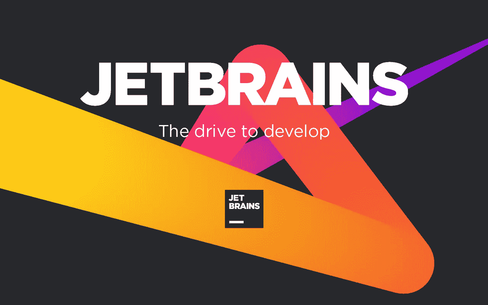
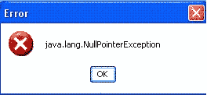
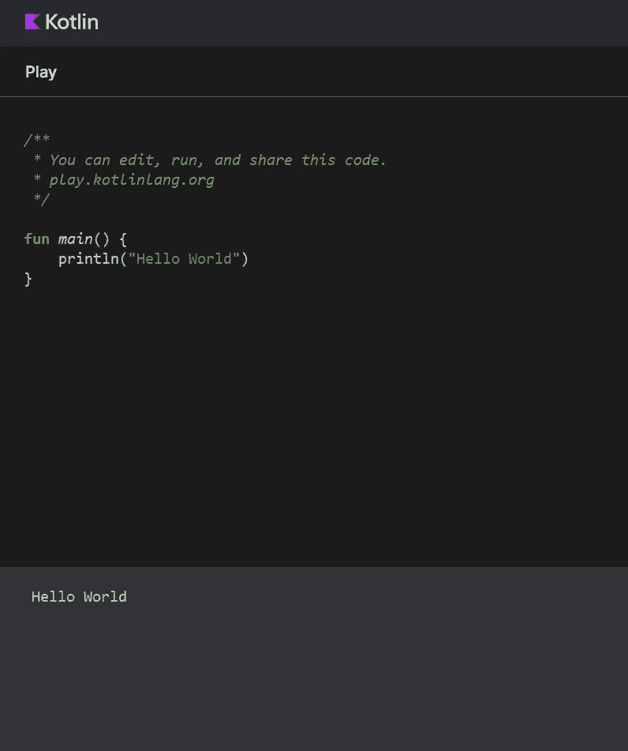

# 第 2 部分:先睹为快

> 原文：<https://medium.com/codex/part-2-sneak-peek-at-kotlin-e9f4f153c6af?source=collection_archive---------21----------------------->


马克·赖歇尔在 [Unsplash](https://unsplash.com/s/photos/kotlin?utm_source=unsplash&utm_medium=referral&utm_content=creditCopyText) 上的照片

这篇文章是课程的第二部分，

[](https://clintpaul.medium.com/kotlin-for-android-beginner-to-advanced-course-bc31083bc1c4) [## Kotlin for Android:初级到高级课程

### 通告

clintpaul.medium.com](https://clintpaul.medium.com/kotlin-for-android-beginner-to-advanced-course-bc31083bc1c4) 

在我们开始之前，想想这个。谷歌有必要认可 Kotlin 作为 Android 的一级语言吗？Java 不能成为现代编程语言吗？或者说，Kotlin 有那么安卓友好吗？我会说这是两者的结合。当我在大学(2012 年)开始学习 Android 开发时，情况完全不同。和编程语言一样，Android 也没有官方的 IDE。我们不得不租用“Eclipse IDE”来开发 Android 应用程序，但是它的主要目的是构建 Java 应用程序。因此，当 Jetbrains 在流行的 IntelliJ IDEA 软件上创建 Android Studio 时，一切都很快向好的方向转变。



Jetbrains

突然间，Android 开发者有了一个他们自己的 IDE。我们不再是二等公民了。但是，Java 仍然被用作 Android 的主要编程语言。老实说，我没意见。直到开始用 Kotlin 编码，我才知道自己想用另一种语言编码。哦，我忘了说一件事，是 Jetbrains 开发了 Kotlin。谷歌在 [Google I/O 2017](https://www.youtube.com/watch?v=Y2VF8tmLFHw) 宣布 Kotlin 为 Android 的首选语言。想到那次揭幕，我还是会起鸡皮疙瘩。对我来说，这是呼吸新鲜空气和掌握这门新兴语言的机会。


在 Google I/O 2017 上发布 Kotlin

## 为什么 Kotlin 对我们 Android 开发者来说是一个很好的选择？

*   我很早就注意到 Kotlin 的一个特点是简洁。与 Java 相比，如果用 Kotlin 编写，我们可以减少大量代码。我们的代码库开始看起来更整洁了。有扩展函数、数据类、Lambdas、主构造函数和次构造函数等。
*   他们引入了类型推理。这真是一种福气。在声明变量时，我们不必提及变量的数据类型。Kotlin 编译器会自动找出它的类型。还有，我们不用加分号(；)像 Java 一样放在每行代码的末尾。

例如:

科特林与类型推理。这里我们不必提及数据类型。Kotlin 编译器已经假设数据类型是整数。

```
val sum = 10 
```

使用 Java 的同一行代码。我们不得不提到作为整数的数据类型。否则，编译器将抛出一个错误。

```
int sum = 10; 
```

*   Kotlin 可与 Java 互操作。这意味着您不必删除或修改 Android 项目中现有的 Java 类来使用 Kotlin。您可以从 Java 类中调用 Kotlin 类，反之亦然。这大大提高了采用率。拥有数百万用户的应用程序很快开始使用 Kotlin。因为他们得到保证，它不会干扰他们现有的 Java 类。
*   NullPointerException 或十亿美元的错误



Java NullPointerException

在您的职业生涯中，极有可能至少处理过一次空指针异常。而且，很有可能，您一定使用过 Java 作为编程语言。Java 因空指针异常而臭名昭著。

*`*NullPointerException*`*(NPE)发生在你声明了一个变量，但在试图使用变量的内容之前没有创建一个对象并把它赋给变量(称为解引用)的时候。**

*Kotlin 非常优雅地处理了编程世界中的这个缺陷。在 Kotlin 中，默认情况下所有变量都被认为是非空的。这意味着，如果您忘记将对象赋给刚刚创建的变量，IDE 本身会提醒您。*

*在接下来的章节中，我们将深入探讨上述所有特性。如果你现在不能理解很多，不要烦恼。在我们的编码会议期间，一旦你处理完所有这些问题，你可以随时回到这里。*

*在你走之前，让我们至少编码一个“Hello World”然后，你可以告诉你的朋友，我教会了你一些东西😋。*

**

*泰勒·拉斯托维奇在 [Unsplash](https://unsplash.com/s/photos/hello?utm_source=unsplash&utm_medium=referral&utm_content=creditCopyText) 上的照片*

*转到[https://play.kotlinlang.org/](https://play.kotlinlang.org/)并用以下代码替换它。*

```
*fun main() {
    println("Hello World")
}*
```

*然后按下播放键。*

**

*科特林游乐场*

*如果你想尝试一些基本的东西，你可以使用这个编译器。你不必为此安装任何大型的 ide。这已经足够了。*

*现在给你一个小练习。尝试更改代码，使其必须打印您的名字和年龄。您还应该将姓名和年龄的值存储在两个不同的变量中。结果应该是这样的，*

```
*Clint 27* 
```

*我知道我们今天没有学到太多关于变量的知识。但是，做一些研究，看看你是否能得到结果。永远记住这一点，“所有优秀的程序员都非常擅长谷歌搜索。”如果你找到了正确答案，请在评论中回复代码。我很乐意为你加油。🥳如果你找不到答案，没问题。也请评论一下，我们可以一起改正。*

*希望你今天过得愉快，我们都学到了新的有用的东西。在下一章，我们将看到如何安装 JDK 和 Android Studio。我超级兴奋。😉请确保你在 [LinkedIn](https://www.linkedin.com/in/clint-paul-2504bba7/) 、 [Medium](https://clintpaul.medium.com/) 、 [Github](https://github.com/clint22) 、 [Twitter](https://twitter.com/dev_duct_tape) 或[给我买杯咖啡](https://www.buymeacoffee.com/clintpaul_dev)上关注我。*

*这篇文章最初发表在 clintpauldev.com[的](https://clintpauldev.com/part-2-sneak-peek-at-kotlin/)*