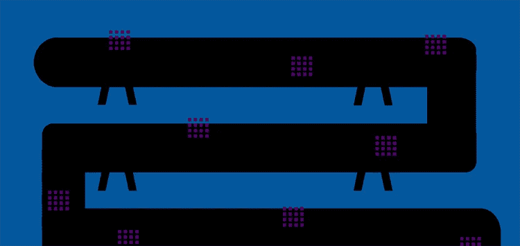

# 第 2 部分:数据管道架构的发展

> 原文：<https://medium.com/codex/part-2-the-evolution-of-data-pipeline-architecture-1ee1cef91c40?source=collection_archive---------2----------------------->

在本系列的第 1 部分中，我们描述了一个构建当今业界常用的数据管道的高级架构。在本帖中，我们将回顾市场和可用技术方面发生的一些变化。考虑到这些变化，我们将提出一个新的架构来解决我们在第 1 部分中提到的问题。

# 新范式

过去五年发生的某些事情创造了一个可以重新发明数据管道的环境。

我们感兴趣的主要变化有三个。

# 计算和存储的分离

我不确定[雪花](https://www.snowflake.com/)是否是第一个提出这种模式的公司，但他们肯定是成功使其成为主流并让市场相信其价值的公司。

通过将计算与存储分离，一些令人惊讶的事情发生了。

*   我们几乎可以无限扩展存储。我们不再担心集群的大小和调整的停机时间。此外，存储数据的成本仅与存储相关，因此要低得多。
*   当我们只访问我们需要的数据时，我们也可以扩展我们的处理。通过这种方式，在保持低成本的同时，加工也可以扩大规模。

上述内容对我们处理数据的方式有着巨大的影响。我们不必再担心我们存储的数据，我们可以灵活地在需要时对大量历史数据执行复杂的转换。

# ETL 到 EL(T)的转换

结果，数据仓库中计算和存储的分离改变了人们对 ETL(提取、转换、加载)的看法。

聪明的人很快意识到，现在我们不必实现复杂的 ETL 管道，其中大量的转换应用于数据。相反，我们可以通过移除转换并将其卸载到数据仓库来简化复杂的工程机制。

为什么这很重要？

*   尽管 ETL 听起来像是复制数据，但它并不像听起来那样是一个简单的工程问题。尤其是如果你想在分布式环境中大规模地做这件事。通过从 ETL 中移除处理，我们可以专注于构建超级弹性和一致的数据管道，并一劳永逸地解决这个问题。
*   现在，我们可以创建一个单一的数据来源，并在不丢失原始数据的情况下，根据我们的需要进行尽可能多的破坏性转换。我们随时可以回到过去，重新改变一切。

我们有原始的数据和资源来进行低成本和大规模的研究。

# 数据平台比以往任何时候都更具表现力

我相信你已经听说过 [DBT](https://www.getdbt.com/) (数据构建工具)以及数据工程师和分析师对它的喜爱。那么[物化](https://materialize.com/)呢？

这些工具只是数据工程师、分析师和数据科学家今天可以使用的一组新工具中的一小部分。

这些工具也证明了数据平台的发展趋势。数据平台从简单的 SQL 查询引擎开始。现在不是这样的了。它们已经成熟，并成为复杂的处理引擎，能够通过遵循工程为交付产品开发的所有最佳实践以及版本控制和测试等实践来部署和执行极其复杂的处理逻辑。

# 把所有的拼图拼在一起

上述所有要点都表明，是时候重新思考我们如何开发和实现数据管道了，最重要的是，我们希望如何管理数据管道负责复制的状态。

应该放弃只保留最新数据状态的范例，我们应该遵循更接近软件工程中称为“事件源”的模式

通过这样做，管道存储状态改变事件的序列或流，而不是复制源系统和数据仓库或数据湖之间的状态。

这不是数据仓库中的新概念。在数据仓库体系结构中，人们总是认为跟踪数据的变化非常重要。有数据仓库经验的人都会知道 [**缓变维度**](https://www.oracle.com/webfolder/technetwork/tutorials/obe/db/10g/r2/owb/owb10gr2_gs/owb/lesson3/slowlychangingdimensions.htm) **(SCD)** *这个术语。*

已经发明了不同的 SCD 策略。我们之前描述的数据管道的第一个架构实际上是类型 1 SCD 策略的一个例子。这种特殊的策略规定旧数据被新数据覆盖。

如果您曾经使用过 Salesforce，您可能知道每个 Salesforce 对象都附带了一个名为“History”的伴随对象。这是 SCD 运行的另一个例子。这次我们在实践中看到的是 4 型 SCD。我们保留主对象，用新数据覆盖旧数据，同时，我们保留一个历史表，记录所有的更改。与大多数情况一样，在 Salesforce 中，历史数据也有一个保留期，在此之后，我们会删除旧数据，仅保留新数据。

# 影响巨大的小变化

数据管道的架构不需要做很大的改变，但是这些小的改变简化了它们的逻辑，并且对我们处理数据的方式有很大的影响。

我们所要做的就是删除数据管道必须跟踪的逻辑——系统 B 上已经存在的逻辑——并用系统 a 上观察到的任何更新来更新它。

这样，管道变得更加简单，正如我们看到的 ETL 到 ELT，我们可以更加关注它们的弹性和一致性。这种方法还可以大大减少延迟，因为消除重复数据的复杂逻辑不再存在。

与此同时，目标存储系统上计算和处理的分离使我们能够保持数据所经历的变化的无限序列。如果我们聪明地处理数据，我们可能永远不会删除旧数据。

在这一系列的状态改变事件之上，我们可以使用像 DBT 和物化这样的工具来重建我们数据的当前最终状态，或者完全转换我们的数据并在其上构建数据应用程序。

如果我们想实施不同的 SDC 战略，现在我们可以做到这一点。如果我们希望在未来不丢失任何数据的情况下，我们甚至可以改变我们实施的策略。

我们不再需要处理两种不同的数据模型。相反，现在一切都可以作为事件流来处理。我们可以使用处理系统始终重建最终状态并使其始终可用，但同时，我们可以使用流处理框架来添加更多由我们的数据基础架构支持的用例。

最重要的是，现在我们可以在任何时间点访问我们需要的所有数据，并且我们可以支持我们所有可能的用例。我们的数据分析师和数据科学家会一直很高兴，我们可以以可预测的成本为他们提供大规模支持。

# 最后的想法

我们可以对我们的软件架构进行一些小的改动，这些改动会对我们能做什么和如何做产生巨大的影响。

作为现代数据基础设施支柱之一的数据管道也是如此。仅仅改变我们将状态从一个系统复制到另一个系统的方式，就可以对我们设计的系统的性能和功能产生惊人的影响。

当然，要做到这一点，行业必须发生巨大的变化。正如我们所看到的，如果我们存储和处理数据的方式没有一些重大的改变，我们就不可能如此容易地重新思考我们的架构。

然而，并不是所有的问题都解决了。我们必须处理的数据来源的复杂性正在增加，尽管我们已经为其中一些提供了解决方案(例如，CDC 的数据库)，但我们如何与其他系统(包括云应用程序)有效交互仍是一项正在进行的工作。

# 免费注册并开始发送数据

测试我们的事件流、ELT 和反向 ETL 管道。使用我们的 HTTP 源在不到 5 分钟的时间内发送数据，或者在您的网站或应用程序中安装我们 12 个 SDK 中的一个。[入门](https://app.rudderlabs.com/signup?type=freetrial)。

本博客最初发表于:
[https://rudder stack . com/blog/part-2-the-evolution-of-data-pipeline-architecture](https://rudderstack.com/blog/part-2-the-evolution-of-data-pipeline-architecture)