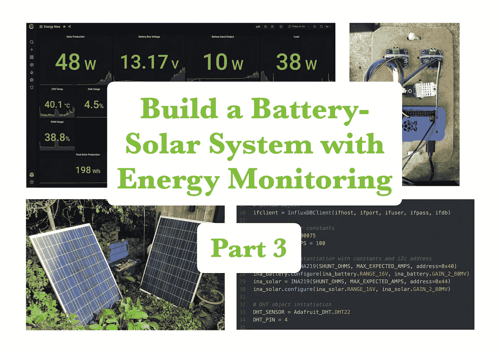

# 第 3 部分软件——用树莓皮构建并监控一个经济实惠的电池太阳能系统

> 原文：<https://medium.com/codex/part-3-software-build-and-monitor-an-affordable-battery-solar-system-with-a-raspberry-pi-cbf95742b849?source=collection_archive---------1----------------------->

## 由四部分组成的系列。

## 以低于 150 英镑的价格建造一个有能量流监测功能的电池太阳能系统…哦，玩得开心！

从左上角顺时针方向:Grafana 仪表盘显示能源监控输出；树莓 Pi 和传感器；Python 代码的快照；带两块太阳能电池板的全电池太阳能系统

# 系列