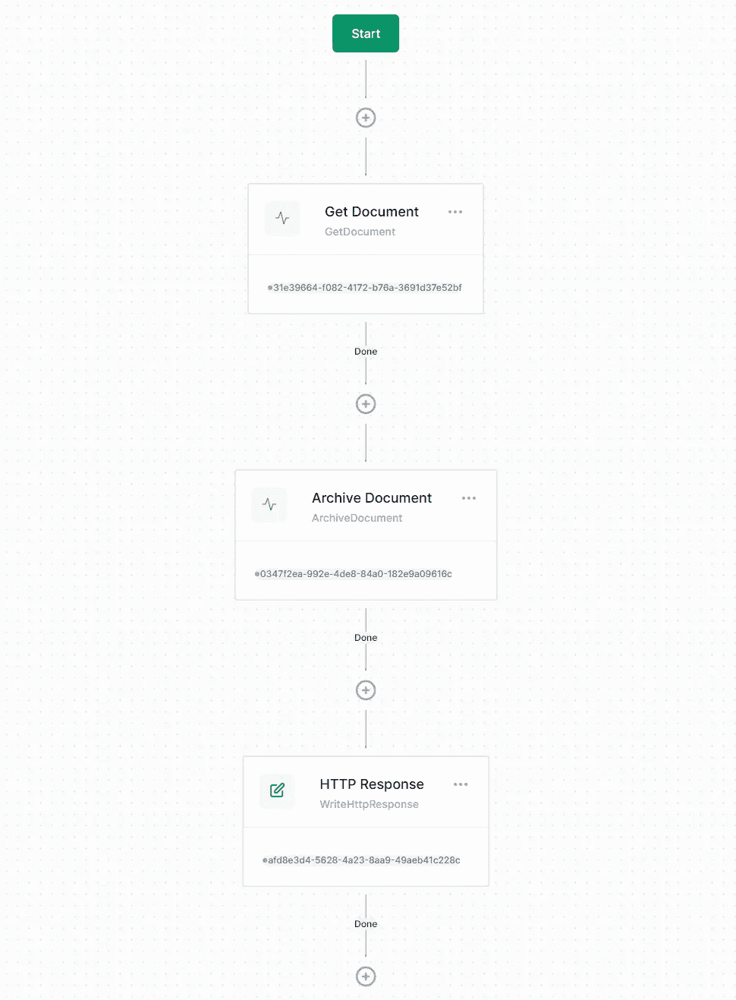
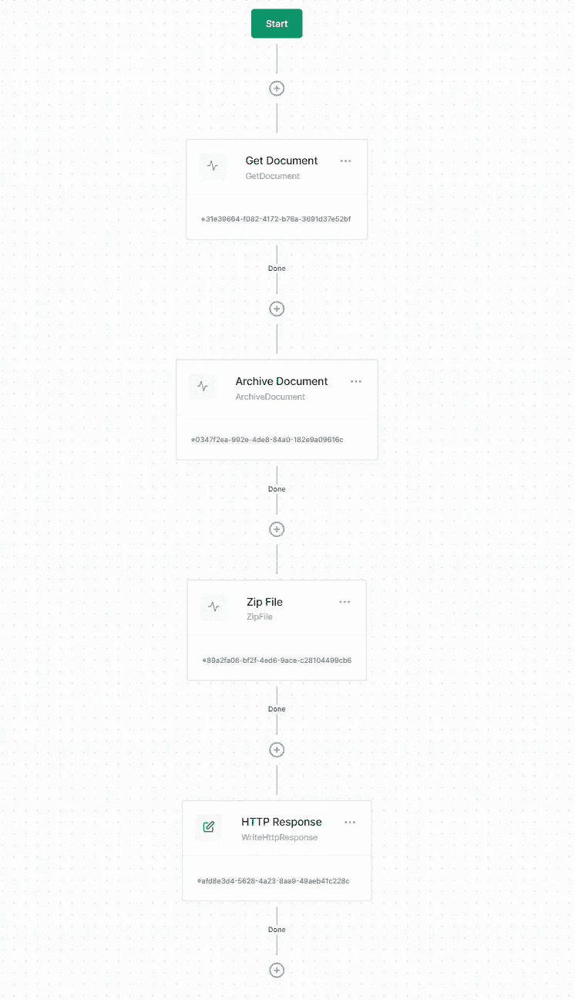
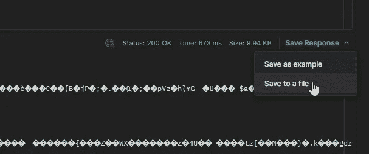
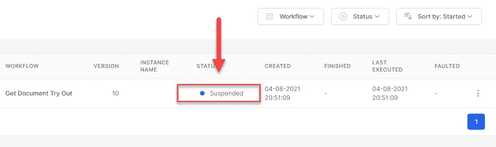

# 构建工作流驱动的第 6 部分。使用 Elsa 2 的. NET 应用程序

> 原文：<https://medium.com/codex/part-6-of-building-workflow-driven-net-applications-with-elsa-2-9b3167c612dd?source=collection_archive---------1----------------------->

## 定制活动


在[的前一部分](https://sipkeschoorstra.medium.com/part-4-of-building-workflow-driven-net-applications-with-elsa-2-d6699a6a247e)中，我们做了一些非常酷的事情:我们调用了一个工作流来响应一个域事件。虽然这个工作流是相当无害的，但现在我们已经有了重要的部分，我们可以做更多的破坏:)

随着 Elsa 越来越丰富的活动库在您附近的 NuGet feed 中出现，您已经可以在不编写自定义活动的情况下做很多事情了。但是在许多自定义工作流驱动的应用程序中，您可能需要编写自定义活动的能力。这就是我们在这一部分要做的事情。

在[简介](https://sipkeschoorstra.medium.com/building-workflow-driven-net-applications-with-elsa-2-part-1-44e08a9ba94b)中，我提到了以下定制活动:

*   获取文档
*   存档文档
*   压缩文件
*   更新区块链

我们将仔细检查每项活动，并逐一实施。

# 获取文档

此活动的目的是将文档及其相关的上传文件放入内存，以便工作流可以对其进行处理。为此，它只需要一个输入:要加载的文档的 ID。它的输出将是一个新记录类型的对象，同时携带文档和文件流。

由于这是创建的第一个活动，我将更详细地介绍它的各个方面。

首先在`DocumentManagement.Workflows`项目中创建一个新的`Activities`文件夹。然后创建一个名为`GetDocument`的新类。

```
using Elsa.Attributes;
using Elsa.Services;

namespace DocumentManagement.Workflows.Activities
{
    public class GetDocument : Activity
    {       
    }
}
```

上面的代码对通过实现从`Activity`基类继承的`IActivity`接口来实现活动有绝对的最低要求。

为了让工作流设计器的用户更容易理解此活动，建议通过在类上应用`ActivityAttribute`来提供类别和描述作为元数据:

```
[Action(Category = "Document Management", Description = "Gets the specified document from the database.")]
public class GetDocument : Activity
{
}
```

在同一个文件中，在`GetDocument`类的上面或后面添加以下记录类型(也包括必要的名称空间):

```
+ using System.IO;
+ using DocumentManagement.Core.Models;public record DocumentFile(Document Document, Stream FileStream);
```

## IsExternalInit

此时，您可能会收到来自 IDE 的抱怨，说预定义的类型系统。必须定义或导入“runtime . compiler services . isexternalInit ”,才能声明仅限 init 的 setter。”。我们以前见过这种情况，所以我们知道该怎么做:只需将`IsExternalInit.cs`文件从`DocumentManagement.Core`项目复制到`DocumentManagement.Workflows`项目的根目录中。

## 投入

解决了这个问题，让我们继续添加活动的输入属性`DocumentId`:

```
+ using Elsa.Expressions;[ActivityInput(
    Label = "Document ID",
    Hint = "The ID of the document to load",
    SupportedSyntaxes = new[] {SyntaxNames.JavaScript, SyntaxNames.Liquid}
)]
public string DocumentId { get; set; } = default!;
```

对于引擎和设计者来说,`ActivityInputAttribute`都是必要的。引擎使用属性作为标记来确定要序列化的属性，而设计器使用额外的元数据，如`Label`和`Hint`，以用户友好的方式显示活动。在显示属性时，活动编辑器利用了`SupportedSyntaxes`属性，并允许用户从属性的默认输入编辑器切换到 JavaScript 或 Liquid 编辑器。

## 输出

接下来，添加以下输出属性:

```
[ActivityOutput(
    Hint = "The document + file.",
    DefaultWorkflowStorageProvider = TransientWorkflowStorageProvider.ProviderName)]
public DocumentFile Output { get; set; } = default!;
```

工作流引擎和设计者也以类似于`ActivityInputAttribute`的方式使用`ActivityOutputAttribute`。设计者目前没有利用`Hint`属性，但是在未来的版本中这可能会改变，所以最好做好准备。

`DefaultWorkflowStorageProvider`属性告诉引擎使用什么*工作流存储提供者*来保存`DocumentFile`的值。

默认情况下，所有活动属性都作为工作流实例的一部分进行序列化。但这并不是所有类型都需要的。例如，我们的`DocumentFile`记录包含一个类型为`Stream`的属性。这通常表明这里可能储存了大量的东西。如果我们将其序列化为 base64，工作流实例可能会变得非常大，这将在每次从数据库加载实例时对性能产生负面影响，这也意味着它需要被反序列化。

通过使用不同的存储提供程序，如`TransientWorkflowStorageProvider`，对象将仅存储在内存中。

> 用户可以基于每个属性来控制使用哪个存储提供商。`DefaultWorkflowStorageProvider`仅提供默认设置。如果您想完全阻止用户拥有选项，请将`DisableWorkflowProviderSelection`属性设置为`true`。

## 执行

当活动执行时，我们希望它做以下事情:

1.  从数据库中按 ID 加载文档。
2.  将相关文件作为流读取。
3.  将这些东西作为输出返回。

要加载文档，我们需要注入`IDocumentStore`。而要读取文件，需要注入`IFileStorage`。用以下字段和构造函数更新该类:

```
+ using DocumentManagement.Core.Services;private readonly IDocumentStore _documentStore;
private readonly IFileStorage _fileStorage;

public GetDocument(IDocumentStore documentStore, IFileStorage fileStorage)
{
    _documentStore = documentStore;
    _fileStorage = fileStorage;
}
```

接下来，如下重写`OnExecuteAsync`方法:

```
+ using System.Threading.Tasks;
+ using Elsa.ActivityResults;
+ using Elsa.Providers.WorkflowStorage;
+ using Elsa.Services.Models;protected override async ValueTask<IActivityExecutionResult> OnExecuteAsync(ActivityExecutionContext context)
{
    var document = await _documentStore.GetAsync(DocumentId, context.CancellationToken);
    var fileStream = await _fileStorage.ReadAsync(document!.FileName, context.CancellationToken);

    Output = new DocumentFile(document, fileStream);
    return Done();
}
```

完整的文件应该如下所示:

## 注册活动

在我们实际使用工作流上的活动之前，我们需要向 Elsa 注册它。为此，更新`ServiceCollectionExtensions`类并在`.AddHttpActivities()`调用之后添加以下代码:

```
// Add custom activities
.AddActivitiesFrom<GetDocument>()
```

这不仅会注册`GetDocument`活动，还会注册我们在这个项目中创建的任何附加活动。

## 尝试一下

虽然在下一部分之前我们不会实现任何文档处理工作流，但是让我们通过以下步骤来确保活动正常运行:

1.  启动 web 应用程序。
2.  启动艾尔莎工作室。
3.  创建新的工作流。
4.  添加新的**获取文档**活动，并将其文档 ID 设置为以下 JavaScript 语法:`correlationId`。
5.  用以下液体内容连接一个新的 **HTTP 响应**活动:`The document’s file name is {{ Input.Document.FileName }}`
6.  发布工作流并记下其 ID(导航回工作流定义屏幕，单击新创建的工作流并从浏览器的地址栏复制工作流 ID)。
7.  转到 web 应用程序的主页并上传文档。记下生成的文档 ID。
8.  打开 Postman 或您自己喜欢的 HTTP 客户端，并执行以下请求，以使用 Elsa API 调用工作流(用您自己的值替换“{your-workflow-id}”和“{your-document-id}”):

```
curl --location --request POST 'https://localhost:5001/v1/workflows/**{your-workflow-id}**/execute' \
--header 'Content-Type: application/json' \
--data-raw '{
"correlationId": "**{your-document-id}**"
}'
```

响应应该是这样的:

```
The document's file name is
```

这可能不是你所期望的。尽管我们清楚而正确地应用了一个液体表达式:`The document’s file name is {{ Input.Document.FileName }}`，并且我们知道文档以一个实际的文件名存储在数据库中，但是由于某种原因，它没有呈现文件名。

## 流动和允许上市

为了理解为什么，我们需要知道 Elsa 使用[流体库](https://github.com/sebastienros/fluid)来评估流体表达式。虽然液体完全可以进入。NET 对象，[需要告诉用户允许访问哪些类型](https://elsa-workflows.github.io/elsa-core/docs/next/expressions/expressions-liquid#allow-listing-a-specific-type)。这使得 Liquid 成为一种安全的模板语言。

因为我们的 liquid 表达式访问了`DocumentFile`和`Document`类型(因为`Document` 是它的一个属性)，这意味着我们需要用 Liquid 允许列出它们。让我们马上做那件事。

在`DocumentManagement.Workflows`项目中，创建一个名为`Scripting`的新文件夹和一个名为`Liquid`的子文件夹。然后创建以下类:

注意，这是一个处理`EvaluatingLiquidExpression`事件的通知处理程序。每次引擎要对给定活动属性的液体表达式求值时，都会发布此事件。

在事件处理程序中，我们访问流体的`TemplateContext`，并通过注册我们的`DocumentFile`类型来配置它的`MemberAccessStrategy`。

因为我们已经从`ServiceCollectionExtensions`类中调用了`.AddNotificationHandlersFrom<StartDocumentWorkflows>()`，这个事件处理程序将自动注册到服务容器中。

当我们再次执行 HTTP 请求时，我们现在会看到类似这样的内容:

```
The document's file name is a3fe4f2b-8ef1-4984-ac98-1b571171a6d6.docx
```

光荣。让我们花点时间思考一下我们刚刚学到的内容:

*   我们创建了一个自定义活动，它接收文档 ID 作为输入，并提供加载的文档和文件流作为输出。
*   我们可以对文档 ID 值进行硬编码，但是我们以 JavaScript 表达式的形式提供输入。
*   然后，我们连接 HTTP 响应活动，利用 Liquid 写回加载的文档的文件名。
*   我们了解到，如果我们想要访问这些类型的对象，我们必须配置 Liquid 并允许列出我们的自定义类型。
*   我们使用 Elsa API 来执行我们的工作流程。

接下来，让我们处理**归档文档**活动。

# 存档文档

**存档文档**活动非常简单，它只需要执行两个任务:

1.  将给定`Document`的`Status`属性设置为`Archived`。
2.  更新数据库中的文档。

该活动将接受一个输入，即要更新的`Document`。

要创建的完整文件`ArchiveDocument.cs`如下所示:

虽然这个活动很无聊，但是它展示了快速实现一个有用的自定义活动是多么容易。

为了测试这个活动，将它连接到我们之前创建的工作流的 Get Document 活动，并使用下面的 JS 表达式作为它的`Document`属性:

```
input.Document
```

这是因为 Get Document 活动的输出返回一个类型为`DocumentFile`的对象，它包含一个`Document`和一个`FileStream`属性。由于**存档文档**活动在**获取文档**活动之后立即执行，因此前者的输出可作为后者的输入。

然而，有一个很大的警告:HTTP 响应活动现在不再直接连接到 Get Document 活动，所以它不能再使用`Input`变量。

为了解决这个问题，我们需要给**获取文档**活动一个名称。为活动命名允许您从工作流中的任何其他活动访问这些活动的输出。

所以我们要做的是:

1.  将**获取文件**命名为`GetDocument1`。
2.  用以下液体内容更新 **HTTP 响应**活动:

```
The document's file name is {{ Activities.GetDocument1.Output.Document.FileName }} and the document's status is {{ Activities.GetDocument1.Output.Document.Status }}
```

工作流应该是这样的:



回应应该是这样的:

```
The document's file name is b01bd191-2891-44d2-84e5-c8d4bfbb6917.docx and the document's status is 1
```

接下来我们来看一个更有趣的活动。

# 压缩文件

这个活动更有趣，因为它做了一些我不是每天都在做的事情。这个函数的唯一目的是获取一个流并返回它的压缩版本。

它有两个输入属性:

1.  要压缩的流。
2.  将条目写入 zip 存档时使用的文件名。

下面是要创建的代码:

没什么特别的，但是应用程序很棒。通过更新工作流程进行尝试，并使用以下设置将 **Zip 文件**活动连接到**存档文档**:

*   流(JS): `activities.GetDocument1.Output().FileStream`
*   文件名(JS): `activities.GetDocument1.Output().Document.FileName`

然后更新 **HTTP 响应**，通过配置以下设置将压缩流写回下载:

*   内容(JS): `input`
*   内容类型(文字):`application/zip`
*   回复标题(高级选项卡):`{ \"Content-Disposition\": \"attachment; filename=download.zip\" }`

完整的工作流应该如下所示:



当您现在上传文档并使用 Postman 执行工作流时，您应该会收到二进制内容。使用 Postman 将响应保存为 zip 文件，以确保您可以打开文件并签出内容。



如果你觉得这很酷，那我同意！

接下来进入最后要实现的活动:**更新区块链**。

# 更新区块链

尽管这个活动的名字可能非常令人兴奋，但我们实际上并没有给任何区块链写任何东西。这也不仅仅是一个诡计；我完全可以想象有人编写一个活动，将文档签名写入区块链，作为文档管理系统的一部分，使其防篡改。

这里更重要的一点是:当工作流进入休眠状态并等待后台任务完成时，有些活动最好在后台运行。

这就是我们接下来要展示的内容:编写一个活动来启动一个任务，在任务运行时暂停工作流，然后在任务完成后让任务恢复工作流。

为此，我们将利用 Hangfire 作为在后台运行任务的引擎。

作为第一步，让我们这样定义活动框架:

活动接收一个`File`作为输入。这可以通过一个`Stream`或一个`byte[]`来实现。然后，它会计算一个哈希并挂起工作流。

在这一点上，没有什么会恢复这一活动。接下来我们来处理这个问题。

首先，让我们注入 Hangfire 的`IBackgroundJobClient`服务，并定义一个新的`record`类型，它将为后台工作提供一些上下文:

```
public record UpdateBlockchainContext(string WorkflowInstanceId, string ActivityId, string FileSignature);
```

然后用下面一行替换`OnExecuteAsync`中的`TODO`注释:

```
// Schedule background work using Hangfire.
_backgroundJobClient.Enqueue(() => SubmitToBlockChainAsync(new UpdateBlockchainContext(context.WorkflowInstance.Id, context.ActivityId, fileSignature), CancellationToken.None));
```

这将使一个以`SubmitToBlockChainAsync`方法形式实现的新作业入队，接下来我们将把它定义为(作为 activity 类中的一个公共方法):

```
/// <summary>
/// Invoked by Hangfire as a background job.
/// </summary>
public async Task SubmitToBlockChainAsync(UpdateBlockchainContext context, CancellationToken cancellationToken)
{
    // Simulate storing it on an imaginary blockchain out there.
    await Task.Delay(TimeSpan.FromSeconds(15), cancellationToken);
}
```

一旦工作完成(等待 15 秒)，我们需要恢复工作流。一个好的方法是利用`IWorkflowInstanceDispatcher`，它让我们通过 ID 调度一个现有的工作流实例来执行。

继续注入`IWorkflowInstanceDispatcher`，然后将下面一行添加到`SubmitToBlockChainAsync`方法:

```
// Resume the suspended workflow.
await _workflowInstanceDispatcher.DispatchAsync(new ExecuteWorkflowInstanceRequest(context.WorkflowInstanceId, context.ActivityId, new WorkflowInput(context.FileSignature)), cancellationToken);
```

现在您也看到了为什么我们的小`UpdateBlockchainContext`记录类型携带工作流实例 ID 和我们的活动 ID——我们需要这两个值来恢复将被我们的活动阻塞的工作流。

我们还简单地通过将`FileSignature`作为工作流输入发送来回应它。

当工作流恢复时，工作流引擎将调用我们的 activitiy 的`OnResumeAsync`方法。现在让我们更新它，以接收文件签名并将其存储为活动的输出。用以下内容替换`TODO`注释:

```
var fileSignature = context.GetInput<string>();
Output = fileSignature;
```

完整的活动应该如下所示:

## 尝试

我们来试试吧！

通过将**更新区块链**活动连接到 **Zip 文件**活动来更新工作流，并配置如下:

*   文件(JS): `input`

我们还要确保替换掉 **HTTP Response** 活动，因为区块链活动会让工作流休眠，并在不再有任何 HTTP 上下文可用的背景中恢复工作流。

让我们这样做:

1.  删除 **HTTP 响应**活动。
2.  使用以下设置连接新的写入行活动:

*   文本(液体):`File signature: {{ Input }}`

发布更改并调用工作流。请注意，现在完成工作流大约需要 15 秒钟。还要注意，当您等待时，工作流处于*暂停*状态:



大约 15 秒钟后，控制台窗口应该会打印出如下输出:

```
File signature: ojPRr24fjiSUC0rQdVI4ieYoyy7Uhb1QfChtTKgStr4=
```

# 然后

我不知道你怎么想，但我认为编写自定义活动非常有趣！

在[的下一部分](https://sipkeschoorstra.medium.com/part-7-of-building-workflow-driven-net-applications-with-elsa-2-e369e7784555)中，我们将把它们放在一起，为每种文档类型创建一个工作流，并充分利用这些自定义活动以及一些内置活动。

那里见！