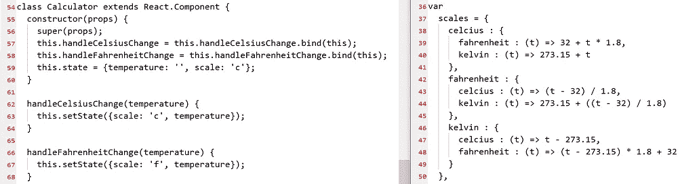

# 我认为 React 是垃圾的部分原因

> 原文：<https://medium.com/codex/part-of-why-i-think-react-is-junk-e4db95e15ef4?source=collection_archive---------0----------------------->

## 药典

## **用实际例子！**

我经常因为对前端框架的看法太低而受到很多批评。对于所有声称“更容易”、“更适合协作”或“开发更快”的说法，我发现它们普遍是截然相反的。

React，Vue，Angular，他们的 kine 对我来说毫无意义。**如果** *(大如果)*他们是— *或者可以是—* …