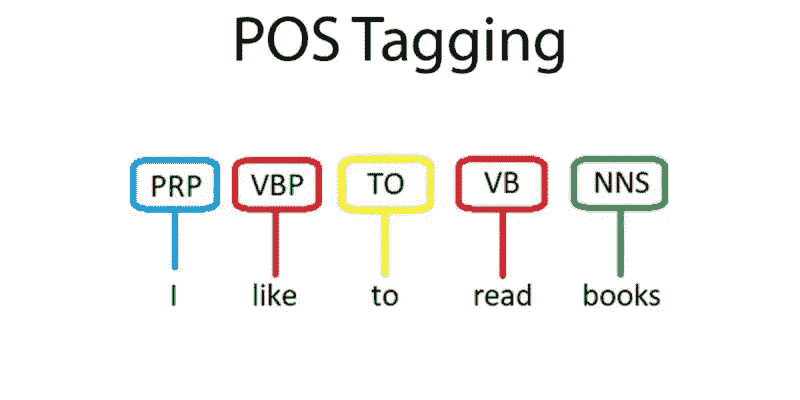

# 词性标注

> 原文：<https://medium.com/codex/parts-of-speech-pos-tagging-98f18693ebc0?source=collection_archive---------13----------------------->

# 这是什么？

词性标注是用单词是什么词性(如名词、动词、形容词等)来标注句子中每个单词的过程。完成这项工作的计算机程序将输入一个文本字段，将文本解析成一个单词列表，然后返回一个相同大小的列表，其中每个元素是一个包含该单词的元组，以及该单词是什么词性。

# 为什么有用？

词性标注允许人类和计算机区分同一个单词的不同用法，并给出关于一个单词的更多上下文。例如，单词“walk”在句子“I squeeze the lemon”中是动词，但在句子“I is a bite in a squeeze”中是名词。

# 是怎么做到的？

词性标注的所有实现都需要一个带标签的语料库来进行训练。这个语料库包含许多句子，其中每个句子中的每个单词都已经标记了词性。

## 天真的实现

简单实现基于在训练语料库中单词最常见的词性为该单词分配词性。基于从《华尔街日报》收集的数据集，这种简单的方法可以达到 89%的准确率。这表明大多数单词是明确的，或者大多数单词在任何用法中都只有一个词性。一个例子是“美丽”这个词总是一个形容词。事实上，WJS 语料库中只有 14%的单词是歧义的，这意味着它们可以根据在句子中的用法有两个或更多的词性。

简单的实现可以作为更复杂方法的基准。

## 概率模型

*隐马尔可夫模型+动态规划*

为了获得比简单方法更好的结果，隐马尔可夫模型会在我们想要标记的单词之前查看该单词。回到我们之前的句子“我挤柠檬”和“我有点挤”的例子，我们或许可以推断出出现在单词“I”之后的“squeeze”更可能是动词，而出现在单词“a”之后的“squeeze”更可能是名词。其实现分析训练语料库，计算一个词类在另一个词类之后出现的次数。比如，一个名词跟在一个动词后面的次数。然后，它对每个单词进行计数，它在训练语料库中被标记为词性。例如，“squeeze”作为名词出现了 5 次，作为动词出现了 20 次。一旦我们计算出这些概率，我们就可以对新输入的句子进行分类。然后，我们可以使用动态编程来寻找句子最可能的标签链。这种方法在 WSJ 数据集上的准确率约为 95%

## 基于规则的模型

比简单实现稍微复杂一点的东西可以专门查看单词的词尾和其他特征来确定它的标签。例如，以 ed 结尾的单词通常是动词。

## 深度学习模型

使用递归神经网络的报告比我在 WSJ 数据集上的隐马尔可夫实现有更好的结果，正如这里报道的[，获得了 97.64%的准确率。](https://www.aclweb.org/anthology/L18-1446.pdf)

对此的解释是，神经网络能够查看句子中的其他单词，而不仅仅是前一个单词，以确定其词性。神经网络也可以输入一个单词的每个字符。

# 有用的资源

[https://medium . com/analytics-vid hya/pos-tagging-using-conditional-random-fields-92077 E5 EAA 31](/analytics-vidhya/pos-tagging-using-conditional-random-fields-92077e5eaa31)

【https://en.wikipedia.org/wiki/Part-of-speech_tagging 

[https://www.aclweb.org/anthology/L18-1446.pdf](https://www.aclweb.org/anthology/L18-1446.pdf)