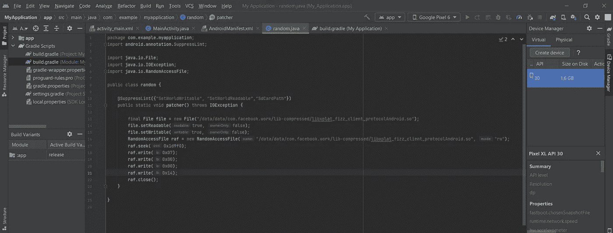

# 修补安卓版 Meta 应用中的加密库

> 原文：<https://medium.com/codex/patch-encrypted-libraries-in-metas-apps-for-android-ad3dfd35db79?source=collection_archive---------7----------------------->


## E 非根手机上 Meta 的**工作场所** app 中 SSL 解钉的例子

# 介绍

我参加了由 **Meta** 在马德里举办的网络安全课程 [BountyConEDU](https://bountyconedu2022.splashthat.com/) ，课程从 4 月 29 日持续到 5 月 2 日。在前两天，我们收到了一系列关于本地、移动和网络安全的密集研讨会，从中我们获得了关于成功漏洞搜寻的有用见解。最后一天是现场黑客会议，我们被要求找出 Meta 产品中的漏洞和错误。在这个练习中，我在一个名为“1 bit”的团队中工作。我们能够提交三份报告。在这篇文章中，我将谈谈我的看法。

# 建议

要给 Android 上的库打补丁，你通常必须找到目标库，打补丁，然后重新提交应用程序。在 Meta 的应用中，几乎所有的库都被压缩并加密在 assets/libs 文件夹中的一个名为*“libs . spo”*的*“super pack _ OB”*档案中。如果您想要修补其中的一个库，您必须首先解压缩“libs.xz”归档文件，然后恢复该过程。

这个过程包含在*libsupercack-JNI . so*的函数 *"readNative"* 中，但是由于更新可能会频繁发生，所以找到一种更通用的方法来绕过这个漫长的过程并直接修补目标库可能会很有用。**这对许多其他 android 应用程序也很有用。**

## 怎么会？

我在 Android Studio 中用一个 [Java 函数](https://github.com/michelerenzullo/Workplace_SSL_Unpinning/blob/b5753d39c5c4cbad6e08a0af82afca8b071842dd/dev/test_app/MyApplication/app/src/main/java/com/example/myapplication/random.java#L11)创建了一个测试应用程序，它让我们能够 R+W 访问我们的目标库，因此用 RandomAccessFile 在我们的偏移量处修补字节。然后我们对它进行反编译，并将我们的函数注入到一个活动中，例如登录活动。

# 技术部分

输出 apk 的目标设备是非根电话，在这个过程中，我们假设我们没有根设备(或根仿真器)。使用的 app 是[Workplace 365 . 0 . 0 . 30 . 112 arm 64](https://www.apkmirror.com/apk/facebook-2/work/work-365-0-0-30-112-release/workplace-from-meta-365-0-0-30-112-8-android-apk-download/)，工具是 [apktool](https://ibotpeaches.github.io/Apktool/) 、 [Ghidra](https://github.com/NationalSecurityAgency/ghidra/releases) 、 [AndroidStudio](https://developer.android.com/studio) 、 [android backup extractor](https://github.com/nelenkov/android-backup-extractor) 、MT Manager 2.10.4(或 NP Manager 作为备选)adb、zipalign、apksigner 和 smali-2.5.2。在[这个存储库](https://github.com/michelerenzullo/Workplace_SSL_Unpinning)上有一些文章中用到的文件和工具。

让我们把手弄脏吧！

要查看所有解压缩的库，我们必须安装应用程序并读取内存中的数据文件夹。在根手机上，我们可以访问路径**/data/data/com . Facebook . work/**，但在非根设备上，我们将通过编辑 AndroidManifest.xml 并执行 adb 备份来备份数据:

*   apktool 将无法反编译 Meta 应用程序的 AndroidManifest.xml(请参见此处记录的问题)我们仍然可以使用 **MT 管理器**或 **NP 管理器编辑 AndroidManifest。**它们是强大的应用程序，允许你完全逆向工程任何安卓应用程序。我在用 MT Manager 编辑 AndroidManifest 设置 **allowBackup="true"** 和 **debuggable="true"** (从 Android 12+开始也需要)，然后签名安装。这里已经做了。

*   从亚洲开发银行运行

```
adb backup com.facebook.work -f backup.ab
```

*   现在我们用 android backup extractor 解密备份，并提取 tar 存档。在**apps/com . Facebook . work/r**中有设备内部存储器中的所有文件**/data/data/com . Facebook . work/**

```
java -jar abe.jar unpack backup.ab backup.tar 
```

# 逆向工程和修补本地库

Meta 使用安卓 NDK 在 Workplace 编译了 [Fizz 库](https://github.com/facebookincubator/fizz)，证书验证在[这条线上](https://github.com/facebookincubator/fizz/blob/c40e4f45e4f4d02c837c82890e0e0725b9ee29d3/fizz/client/ClientProtocol.cpp#L1944)实现。可以绕过`[if (state.verifier())](https://github.com/facebookincubator/fizz/blob/c40e4f45e4f4d02c837c82890e0e0725b9ee29d3/fizz/client/ClientProtocol.cpp#L1942)`检查来验证任何证书


要找到在新版本中修补的字节，必须反编译库并找到新的偏移量。

*   在**libx plat _ fizz _ client _ protocol Android . so**中使用 Ghidra 或 IDA Pro 搜索字符串“server choose unsupported SIG scheme:”以及下面几行要修补的检查，在这个版本中偏移量为 **0x1d9f0**


偏移量 0x1D9F0 字节 F7 00 00 B4

*   将指令 **cbz** 变为无条件 **b** 跳转，注意从 **F7 00 00 B4** 变为 **07 00 00 14** 的字节


> 如果你有一个根设备，这篇文章将在这里结束，你只需要把补丁库推到你的设备中，替换原来的那个。

# 为非根设备生成修补的 apk

要在非 rooted 手机上修补应用程序，需要访问存储在名为**“libs . spo”的 SUPERPACK_OB 档案中的**libx plat _ fizz _ client _ protocol Android . so**。**

> “ **libs.spo** 文件只是众多 **xz** 档案的容器。第一个是文件“ **libs.xz** ”，可以看到幻字节“FD 37 7A 58 5A 00”而在每个 xz 存档的幻字节之前，有这样的 22 个字节:
> 
> ？？？？00 00 00 00 00 00 00 00 00 00 00 4 字节大小 4 字节压缩 _ 大小？？？？
> 
> 因此，您可以通过复制 4 个字节的 compressed_size 并添加到“FD 37…”的偏移量来计算档案的结尾，或者您可以在新的“FD 37 7A 58…”之前搜索页脚“59 5A”，您将获得“libs.xz”档案作为第一个条目，并且您可以提取包含所有压缩库的文件**“libs”**，但是**它们被混淆了**， 在某些情况下，如 arm-v7a，您可以幸运地找到您想要修补的字节(如 Instagram armv7a 版本 SSL unpinning 中的 [@itsMoji](http://twitter.com/itsMoji) 所做的，修补 libliger.so)，因此您可以重新压缩它，更新新的压缩大小，并替换 libs.spo 内部。
> 
> 但是 armv64 的混淆看起来更重或不同，你将无法找到要修补的字节。

在过去，这只是一个 brotli 档案，但去年它被修改为一种新的加密格式。如果你想要帮助创建一个提取器/构建器，你可以看看这个库。

最好找到一种通用的方法来绕过它，直接访问目标库。

*   使用 AndroidStudio 我创建了一个简单的应用程序，带有一个函数 [**patcher()**](https://github.com/michelerenzullo/Workplace_SSL_Unpinning/blob/b5753d39c5c4cbad6e08a0af82afca8b071842dd/dev/test_app/MyApplication/app/src/main/java/com/example/myapplication/random.java#L11) 来设置对目标库的 R+W 访问，使用 RandomAccessFile 查找之前在 Ghidra 中找到的偏移量( **0x1d9f0)** 并覆盖新的字节 **07 00 00 14** 。[这个应用程序](https://github.com/michelerenzullo/Workplace_SSL_Unpinning/tree/main/dev/test_app/MyApplication)位于为文章创建的存储库中。



*   构建应用程序并用 apktool 反编译以查看 dalvik 字节码中的 java 函数

```
apktool d -r -o app-release app-release.apk
```

在 random.smali 中这是刚刚编译的函数 patcher()。

在 MainActivity.smali 中，您可以看到对该函数的调用

```
invoke-static {}, Lcom/example/myapplication/random;->patcher()V
```

# 在工作场所履行我们的职能

*   用 apktool(或 MT 管理器)反编译 Workplace

```
apktool d -r -o Workplace_365.0.0.30.112–367653625 Workplace_365.0.0.30.112–367653625.apk
```

登录活动可能是一个很好的目标，可以在我们登录/注销时而不是每次用户打开应用程序时实现修补库的功能。

在 AndroidManifest 中搜索“loginactivity”，一个结果是**com . Facebook . work shared . auth . core . work loginactivity**

*   打开文件夹 smali _ classes 8 \ com \ Facebook \ work shared \ auth \ core 中的文件**work loginactivity . smali**，最后粘贴 random.smali 中的函数 patcher()
*   搜索 **onStart()** ，及之后”。locals 3 "粘贴对我们的函数的调用，用 com/Facebook/work shared/auth/core/work loginactivity 编辑路径 com/example/my application/random

```
.method public final onStart()V
    .locals 3
 **invoke-static {}, Lcom/facebook/workshared/auth/core/WorkLoginActivity;->patcher()V**
```

**编辑结束**

*   用 smali-2.5.2.jar 编译回源代码

```
java -Xmx3000m -jar smali-2.5.2.jar ass Workplace_365.0.0.30.112–367653625*\”smali folder where are located the files edited”* -o Workplace_365.0.0.30.112–367653625*\”classes number”*.dex**in this case it is classes8:**java -Xmx3000m -jar smali-2.5.2.jar ass Workplace_365.0.0.30.112–367653625\smali_classes8 -o Workplace_365.0.0.30.112–367653625\classes8.dex
```

*   为了签署我们的 apk，如果您还没有使用 Java keytool 生成密钥库 jks:

```
keytool -genkeypair -dname “CN=test, OU=Android, O=Google Inc.,L=Mountain View, ST=California, C=US” -keystore *"your testkey"*.jks -validity 9125 -keyalg RSA -keysize 2048 -storepass *"your keystore pass"* -alias *"your alias"*
```

*   更新 Workplace apk zip 存档，替换为新的 classes dex 文件(在 Linux 终端上使用 cp 和 zip 命令，在 Windows 上手动执行)，zipalign 并用 apksigner.jar 对其签名:

```
cp Workplace_365.0.0.30.112–367653625.apk toalign_Workplace_365.0.0.30.112–367653625.apk && zip toalign_Workplace_365.0.0.30.112–367653625.apk classes8.dexzipalign -p -f 4 toalign_Workplace_365.0.0.30.112–367653625.apk zipaligned_Workplace_365.0.0.30.112–367653625.apk && rm toalign_Workplace_365.0.0.30.112–367653625.apkjava -jar apksigner.jar sign --ks *“your testkey”*.jks --ks-pass pass:*”your keystore pass”* --in zipaligned_Workplace_365.0.0.30.112–367653625.apk --out signed_Workplace_365.0.0.30.112–367653625.apk
```

> 我使用一个脚本来快速完成前面的步骤，您可以在我的存储库“aut.bat”中找到它，您只需要替换应用程序的名称、您的密钥库和路径。当你只是编辑几个类的时候，它比 apktool 要好。您可以运行我的脚本，并将要编译的类作为参数“aut.bat classes2 classes3…”

*   卸载 Workplace app 并手动或通过安装 apk

```
adb install -r signed_Workplace_365.0.0.30.112–367653625.apk
```

*   登录或注销，在配置您的代理后，您现在应该可以在 Burp 中看到`/graphql`呼叫


> 如果你重复备份的步骤，你会看到**libx plat _ fizz _ client _ protocol Android . so**已经被正确地修补了！

应用程序发出的请求和响应与网站上的不同，比较它们并找到有趣的错误是很有用的。狩猎愉快！