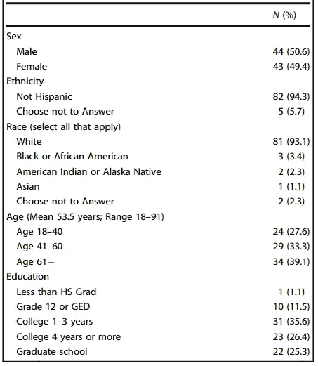

# 患者对医疗保健中使用人工智能的担忧

> 原文：<https://medium.com/codex/patient-apprehensions-about-the-use-of-artificial-intelligence-in-healthcare-d7d4f3c4361a?source=collection_archive---------8----------------------->

## ai4 健康文章评论#10

在文献中，有大量关于人工智能在健康领域应用的技术成功以及医生使用这些应用的倾向的文章。论文经常提到对这项新技术的质疑，尤其是从医生的角度。

从实际上是这些应用程序的最终用户的患者的角度来看，你是否曾经对人工智能以及他们认为它可能会产生的问题感到好奇？🤔

Richardson 等人的这篇论文正好解决了这个问题，从患者的角度全面地涵盖了这个案例，并允许我们了解他们对不同主题的想法。

让我提前声明，患者的一些评论和他们对这个主题的掌握让我感到惊讶。🌟当然，不要忘记这篇文章是在平均教育水平很高的人群中发表的(99%是高中和更高的研究生)。

参与焦点小组调查的 87 名患者的特征，这些焦点小组调查了关于在医疗保健中使用人工智能的态度。

## 参与者对医疗保健人工智能感到兴奋，但希望获得安全保证

✅尽管患者认为医疗保健人工智能与医学的目标(治愈尽可能多的患者)兼容，并支持开发人工智能工具，但他们认为有必要谨慎使用这些新技术。

✅他们报告说，需要一个谨慎的过渡期，以确保他们医疗中使用的任何人工智能工具都是经过良好测试和准确的。

✅:他们认为额外的保护是必要的，尽管他们不知道应该是什么。(尽管他们无法给出关于额外保护的明确建议。)

## 患者希望他们的临床医生确保人工智能的安全

✅患者意识到人工智能只是一个工具。考虑到每个病人都是独特的，他们认为医疗保健提供商有责任考虑人工智能的输出，并考虑其他选择。

✅他们期望医生能够对算法的误诊或误治建议进行补偿。

## 保留患者的选择权和自主权

如果✅患者不愿意，他们希望能够选择在没有人工智能工具的情况下接受医疗保健。

## 对医疗费用和保险范围的担忧

由于开发和部署这些新技术的成本，✅患者担心治疗成本增加。

✅:他们还想知道保险公司是否会支付与人工智能工具建议相反的治疗费用。

## 确保数据完整性

✅他们担心可能用于训练人工智能的错误数据的后果，因为个人健康记录并不总是准确的。

✅因为个人电子健康记录并不总是准确的，人们担心可以用于人工智能训练的错误数据会导致有偏见的算法。此外，开发人员将自己的偏见加入算法的可能性也是一个问题。

## 依赖技术的系统的风险

✅系统级崩溃、大规模技术故障或侵入人工智能系统并操纵这些工具始终是一种可能性。

✅此外，随着时间的推移，医疗保健专业人员可能会失去他们的能力，因为他们变得依赖于使用这些工具。在这种情况下，医生可能无法像现在这样做好临床评估。

> 现在从病人的角度来看问题，思考可能出现的问题。即使你已经完全开发了应用程序，信任也永远不会是%100。非常接近%100 应该是最终目标。

🌺感谢这篇有价值的论文:
乔丹·p·理查森、坎布雷·史密斯、苏珊·柯蒂斯、萨拉·沃森、朱轩、芭芭拉·巴里和理查德·r·夏普

📑 [**点击此处获取论文 PDF**](https://www.nature.com/articles/s41746-021-00509-1.pdf)Richardson，J.P .、Smith，c .、Curtis，S. *等*患者对人工智能在医疗保健中应用的担忧。 *npj 数字。医学。* **4** ，140 (2021)。[https://doi.org/10.1038/s41746-021-00509-1](https://doi.org/10.1038/s41746-021-00509-1)