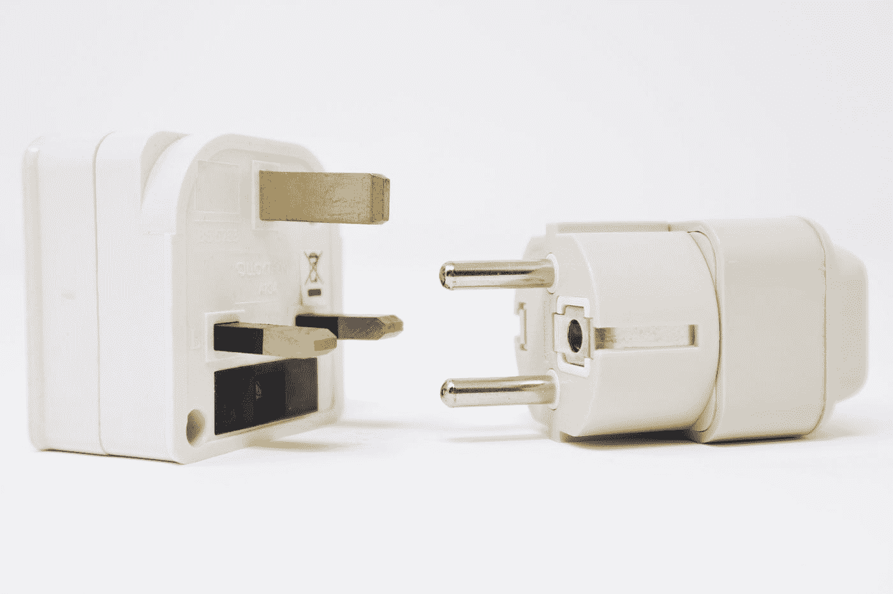

# 3 分钟模式适配器—以简单的方式掌握设计模式

> 原文：<https://medium.com/codex/pattern-adapter-in-3-minutes-master-design-patterns-in-an-easy-way-e9135b79dc79?source=collection_archive---------6----------------------->

## 🚀通过立刻理解设计模式成为一名更好的开发人员

在 [Unsplash](https://unsplash.com?utm_source=medium&utm_medium=referral) 上[叫我弗雷德](https://unsplash.com/es/@callmefred?utm_source=medium&utm_medium=referral)

> 设计模式是软件开发中常见问题的通用解决方案

# 理解模式