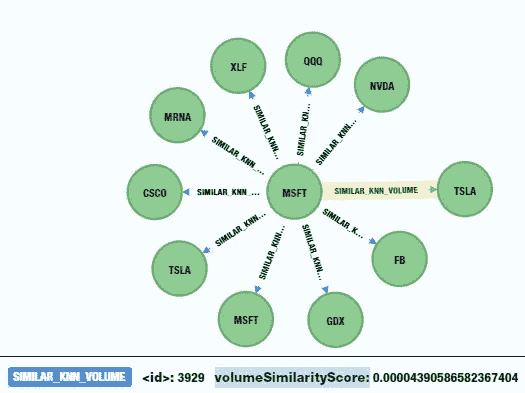

# 模式驱动的洞察:使用 Neo4j 和 Power BI 可视化股票交易量的相似性

> 原文：<https://medium.com/codex/pattern-driven-insights-visualize-stock-volume-similarity-with-neo4j-and-power-bi-13ca922acad1?source=collection_archive---------6----------------------->

发现并可视化隐藏的模式，以获得模式驱动的洞察力

这种模式驱动的可视化技术在 2021 年 7 月的 Power BI 训练营上展示过。Bootcamp 会议介绍了创建 Power Query 模板以从 Neo4j 导入数据的过程，然后直观地讲述 Neo4j 浮出水面的故事模式。对于本文，我们将重点关注从 Neo4j 的图形数据科学算法中创建的时间序列数据模式的可视化，以对股票之间的成交量相似性进行评分和分类。

如果您对如何创建电源查询模板感兴趣，该模板可用于从 Neo4j 图表自动安排电源 BI 在线数据刷新，请参考文章[使用电源 BI 导入 Neo4j 图表数据](/codex/importing-neo4j-graph-data-with-power-bi-d2686e9255bc)。Power Query 脚本也可以作为 [GitHub Gist](https://gist.github.com/BryantAvey) 获得。Power Query 脚本利用了我开发的一种技术，将多个 Power Query 步骤打包成一个应用步骤，同时在 Power Query 脚本中创建双下划线“dunder”输入变量步骤。

Power Query 中的 dunder 变量步骤示例，其中包装步骤将多个应用步骤合并为一个步骤。

如果您需要更多关于这种技术的信息，请告诉我，因为我不会在本文中涉及。

在我们开始之前，让我们明确一下，这篇文章并不是以任何方式提供股票建议或股票提示。相反，它展示了如何将 Neo4j 和 Power BI 一起使用，以一种通用的方式来获得模式驱动的洞察力。

## Neo4j 图形数据

我们都听说过关于数据中存在“隐藏模式”的宣传。但是如何发现这些隐藏的模式呢？寻找模式的最简单的方法之一是使用属性图数据库。具体来说，我们将使用领先的图形数据库提供商 Neo4j 他们发明了属性图数据库。

对三大原生图数据库之间的差异感兴趣？阅读我的文章:[标记的 vs 类型化的属性图——所有的图数据库都不一样](/geekculture/labeled-vs-typed-property-graphs-all-graph-databases-are-not-the-same-efdbc782f099)。

对于数据，我们从 TD Ameritrade 获取了每日股票价格历史数据。数据被组织成一系列链接的节点，每个连续的价格历史节点之间具有[:NEXT_PERIOD]关系。数据已从 1991 年 1 月 2 日加载到当前日期。微软(MSFT)全年的价格历史如下图所示:

MSFT 的价格时间序列数据，显示 1 年的股票价格与[:NEXT_PERIOD]的关系

每个[:NEXT_PERIOD]关系都有一个用于两个交易期之间价格差异的属性:

[:NEXT_PERIOD]关系的价格差距为 3 美分

这里我们可以看到，在 2019 年 4 月 5 日的价格节点(MSFT 以 119.39 美元开盘)和 2019 年 4 月 4 日的价格节点(收于 119.36 美元)之间，关系资产存在 3 美分的价格差距。所以，4 月 4 日和 4 月 5 日之间的价格差距是 3 美分。

每个价格节点都包含每日时段最高价、最低价、开盘价、收盘价和成交量数据属性，以及股票代码和时间戳。

在这个例子中，我们希望找到股票交易量之间的相似性，看看这些相似性模式是否有助于识别股价的顶部、底部或重要的支撑或阻力区域。

为此，我们运行了三种 Neo4j 的图形数据科学算法，以识别每日股价的股票交易量之间隐藏的相似性模式。第一个针对价格数据运行的图形数据科学算法是 K-最近邻算法或 KNN。KNN 是一种用于分类的监督机器学习算法。KNN 算法使用回归和分类来预测交易时段的交易量和我们数据集中各种股票之间的相似性值。k-Nearest neighborhood 在图形中的价格节点之间创建[:SIMILAR_KNN_VOLUME]关系，在该关系中，k-neighborhood 在数量中找到相似性。当它创建股票节点之间的关系时，它还记录每个关系的“体积相似性分数”属性，标识两个节点之间的体积相似性百分比。分数 1 表示 100%相似的交易量，这意味着两个节点上的股票交易量是相同的。

图表显示了微软和 Tesla 之间的属性:volumeSimilarityScore。

接下来，我们运行 Louvain 算法来检测股票价格节点之间的交易量相似性的社区或集群。理论上，基于从 KNN 算法产生的关系的相对密度，卢万方法导致网络中节点的最佳可能分组。鲁汶与“体积相似性分数”相对照，并分析由 KNN 生成的[:SIMILAR _ KNN _ 体积]关系，并将它们分组到社区中。生成的社区 id 作为名为 Volume Community 的属性写回到图形中。

最后，我们运行标签传播算法或 LPA。LPA 是一种半监督的机器学习算法，它将标签或标记分配给以前未标记或未标记的数据点。使用从 KNN 创建的复杂网络，LPA 确定了重要的卷簇。LPA 算法将“相似性标签”属性写回到图中的每个价格节点。这些 LPA 集群在卢万社区内是按等级划分的。结果是相似性标签的体积社区和具有相似性得分属性的相似性体积关系。

Neo4j 企业版拥有完整的[图形数据科学算法库](https://neo4j.com/docs/graph-data-science/current/)。对于这个例子，我们只使用了库中五十多种算法中的三种。

Neo4j 图形数据科学算法的分类

在运行了 KNN、鲁文和 LPA 算法之后，我们有了一个图表，其中包含了不同天的相同股票之间的相似交易量以及不同天的不同股票之间的相似性。在这里，我们看到图表的一部分显示了微软、脸书、英伟达、先进微设备、特斯拉、迪斯尼和其他公司之间的类似数量。

显示股价和股票之间[:SIMILAR _ KNN _ 成交量]关系的图表。

下一张图是图中包含的所有股票以及所有类似的 KNN 交易量关系的概述。如您所见，Neo4j 图形数据科学算法创建了一个丰富的股票间新交易量模式的环境。这是我们将在 Power BI 中探索的环境，通过在烛台和时间序列图表上绘制这些关系、社区和相似性分数来获得模式驱动的洞察力:

图表中所有股票符号的图形，显示股票之间创建的复杂的混合成交量相似关系。

## 面向模式驱动的洞察力的 Power BI 可视化

Power BI 允许我们通过其现有的庞大可视化库以数百种方式可视化 Neo4j 的图形数据。在 Power BI 中使用 R 和 Python 可视化，将 Power BI 的可视化功能扩展到数千个可视化选项。

将数据放入 Power BI 后，我们需要检查时间线上的卷相似性社区。我们还希望可视化股票市场中的任何重大活动，以查看是否存在关联模式。首先，我们来看一个高低对比图，它显示了股价在时间线上的高点和低点。这将有助于我们看到所有股票集体创出新低或新高的区域。

此外，我们希望看到相应的量社区的可视化，以了解在严重的价格高点和低点期间是否有显著的量相似性社区。下面的功率 BI 图显示了这一切是如何结合在一起的。我们已经强调了要关注的特定时间段:2020 年 2 月到 4 月。

Power BI 报告页面显示股价与成交量社区在时间线上的高低对比

这里我们可以看到，2020 年 3 月 18 日左右，所有股票都在集体创出新低。我们还看到，根据平均交易量，交易量社区出现峰值。这看起来是一个很好的地方，可以深入了解我们的体积相似性指标为我们做了什么。

脸书股票的烛台定价图表，具有显著的数量相似性得分和分布。

上面的能量 BI 图显示了脸书的蜡烛图，以及显示交易量社区和相似性标签的分布图。这些分布使我们能够专注于社区和标签的重要集群，而来自 KNN 关系的相似性得分使我们能够专注于重要的相似性事件。

脸书烛台图表与卷相似性分数相关。

我们看到，在 2020 年 2 月 6 日，脸书有一个优柔寡断的烛台，并在量的相似性明显飙升。就在 8 天前，价格大幅下降。我们在 2 月 19 日看到了同样的模式，就在 20 天的暴跌之前，脸书下跌了 72 美元。然后在秋季中期，脸书测试了 185 美元和 195 美元之间的价格水平。这里我们看到另一个相似性峰值，表明价格可能无法支撑。

脸书烛台图表与失败的支撑线的成交量相似分数相关。

3 月 25 日显示了另一个相似性峰值，表明一个潜在的支撑或另一个阻力位:

脸书蜡烛图，具有指示支持级别的交易量相似性分数相关性

然后在 4 月 9 日和 4 月 13 日(星期五和星期一),我们在相似性量上又有两次高峰:

脸书烛台图表与卷相似性得分相关确认支持水平。

这表明 3 月 25 日之前的峰值确实是一个新的支撑位。

如果我们转而看看 Adobe，我们可以看到相似性得分和价格之间有更紧密的关联。

具有体积相似性分数相关性的 Adobe 烛台图表。用双反锤和主要支撑确认显示趋势底部。

3 月 16 日显示了 Adobe 价格下跌底部的相似性得分峰值，这也与一个重要的烛台“双反锤”模式相对应。我们还看到，3 月 23 日的主要相似性峰值对应于 290 美元价格水平附近的一条非常重要的支撑线。在这种情况下，成交量的相似性似乎已经确定了熊市趋势的底部。

这就引出了一个问题:“事物在统计上是如何相关的？”为了更好地理解各种社区、标签、分数和定价信息是如何相互关联的，我们需要在时间轴上绘制它们，并在时间轴上过滤特定股票，并查看相关性。

Adobe 相关性图表

这里我们可以看到，在同一时间段内，Adobe 的相似性得分与收盘价之间存在轻微的负相关，相似性标签与收盘价之间也存在强烈的负相关。标签和价格差距之间也有很强的相关性。

脸书相关图

看看脸书，我们看到一幅完全不同的画面。我们在体积相似性分数和平均体积之间有非常显著的负相关。收盘价格和相似性得分之间也存在显著的正相关关系。

为了进一步可视化不同股票组之间的数量社区和相似性标签的重要聚类如何以及在哪里相关，查看不同分布聚类以查看哪些股票组倾向于受到数量相似性的类似影响是有帮助的。

体积相似性社区、标注和体积的 Python 分布图和相关性示例。

这里，我们在 Power BI 中有几个 Python 可视化工具，帮助我们从不同的角度和视角看到分布切片。通过分离出交易量社区和相似性标签社区，我们可以消除“噪音”,并专注于具有紧密相关性的区域，以发现哪些股票在我们的交易量相似性社区内一起形成趋势。

Native Power BI 散点图突出显示了过滤和放大集群的能力，以消除“噪音”并识别分组到相似社区中的股票。

这里，我们重点关注股票交易量相似度最高的相似度标签和交易量社区。这允许我们发现倾向于聚集在一起的特定股票，允许我们更深入地分析和创建可用于做出更好的股票交易决策的指标。

## 结论

因为关系数据库和基于表的数据结构不允许在存在未知模式的情况下进行模式发现，所以使用 Neo4j 的集成机器学习和图形数据科学算法，可以很容易地发现隐藏的模式。发现隐藏的模式可以带来更好的交易决策和更高的利润。通过将 Neo4j 与 Power BI 相结合，我们可以查看时间序列中的数据，并发现体积相似性模式。这为我们提供了基于时间的交易量相似性，从而放大了我们股票市场分析工作的价值。

希望我们已经帮助您了解了使用 Neo4j 进行模式发现和使用 Power BI 进行可视化如何创建一个非常强大和灵活的分析平台。

# Neo4j + Power BI =模式驱动的洞察力