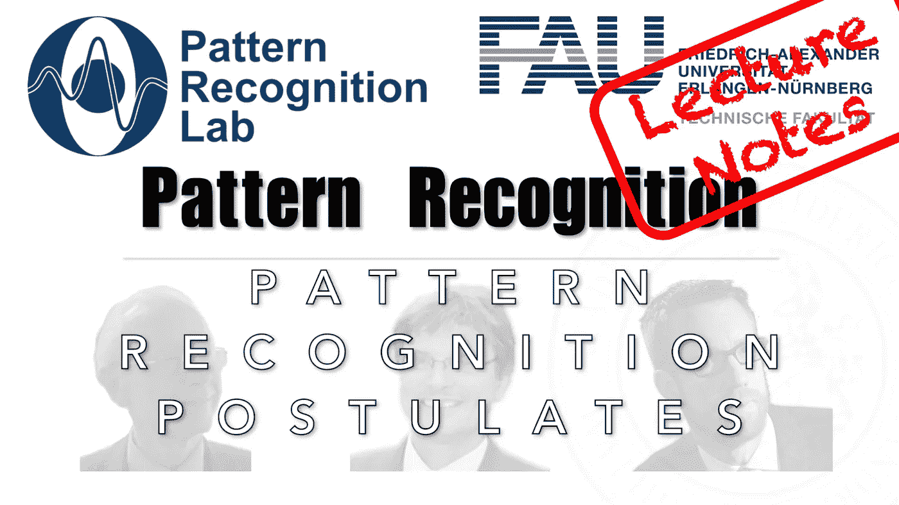

# 模式识别:分类器评估的基本假设和策略

> 原文：<https://medium.com/codex/pattern-recognition-basics-assumptions-strategies-for-classifier-evaluation-987186d5072?source=collection_archive---------3----------------------->

## 模式识别中的 FAU 讲义

## 模式识别假设

来自[模式识别讲座](https://www.youtube.com/playlist?list=PLpOGQvPCDQzsWvT_bqmexrJ359RTQQuMO)的 [CC BY 4.0](https://creativecommons.org/licenses/by/4.0/) 下的图像。

**这些是 FAU 的 YouTube 讲座“** [**模式识别**](https://www.youtube.com/playlist?list=PLpOGQvPCDQzsWvT_bqmexrJ359RTQQuMO) **”的讲义。这是讲座视频&** [**配套幻灯片**](https://doi.org/10.5281/zenodo.4429576) **的完整抄本。幻灯片的来源可在** [**此处**](https://github.com/akmaier/pr-slides) …