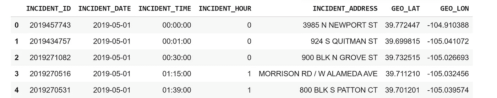
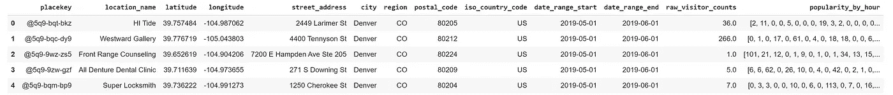
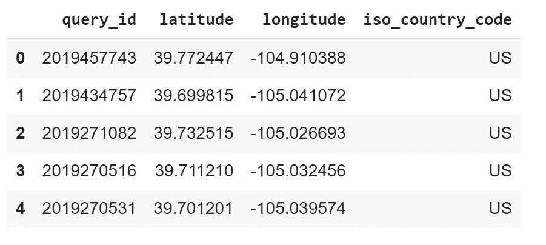
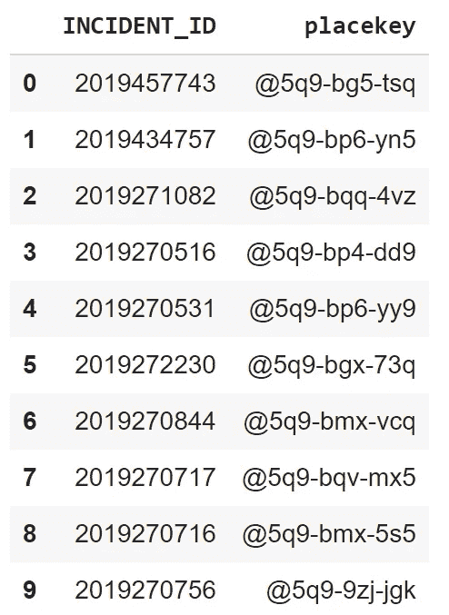
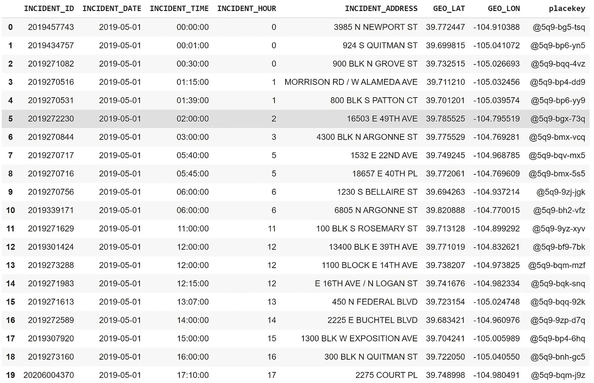
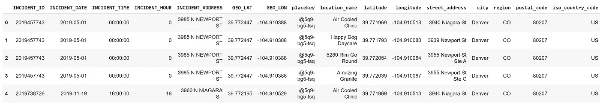
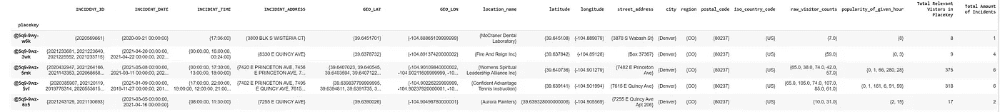
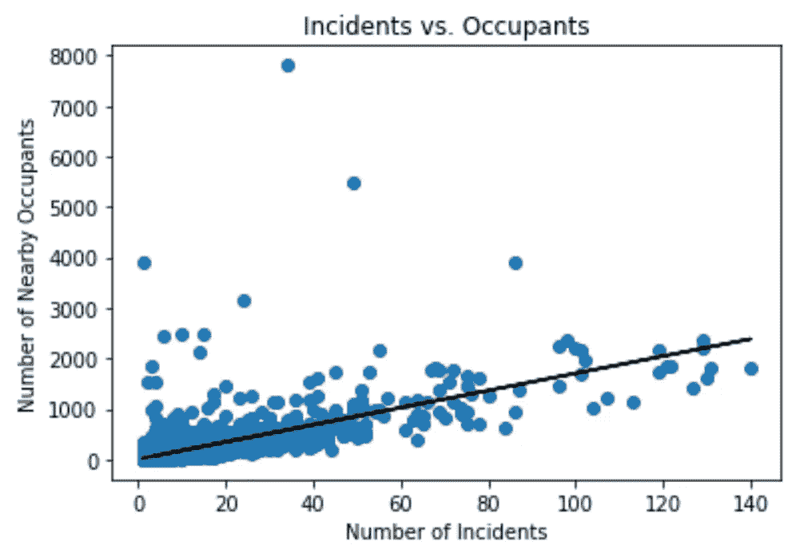
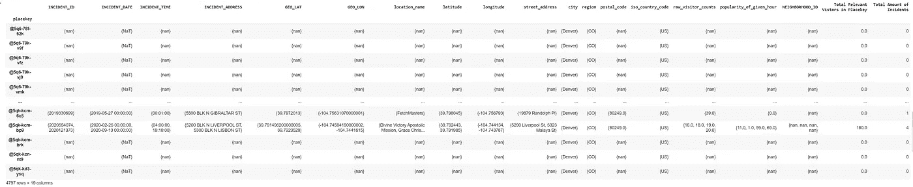

# 丹佛汽车盗窃和附近人口的模式

> 原文：<https://medium.com/codex/patterns-of-denver-car-thefts-and-nearby-population-327c12188ba2?source=collection_archive---------23----------------------->

科林·劳埃德在 [Unsplash](https://unsplash.com?utm_source=medium&utm_medium=referral) 上的照片

汽车盗窃在世界各地经常发生，但是如果没有广泛的研究，很难找出正确的模式。一个似乎很直观的假设是，偷车发生在事件发生时人流量较少的地区。这是有道理的:大多数计划实施盗窃的人会考虑一个目击者和能够阻止他们的人最少的地方。在繁忙的夜晚，在拥挤的大街上偷一辆车看起来是愚蠢的。

在我们的分析中，我们将使用 [Safegraph](http://safegraph.com/) 混合 POI 模式数据以及来自丹佛市的数据。SafeGraph 是一家数据提供商，为数千家企业和类别提供兴趣点和客流量数据。它免费提供数据，只要你注册一个[学术](https://www.safegraph.com/academics)。模式数据的模式可以在[这里](https://docs.safegraph.com/docs/monthly-patterns)找到。

我们关注丹佛的一个重要原因是:

*   这是美国一个主要的以汽车为中心的城市地区。
*   丹佛在他们的政府网站上提供所有报告的犯罪数据，包括完整的犯罪时间和地理坐标。

有关 Colab 笔记本的链接(一个用于文件转换，另一个用于分析)，请点击[这些](https://drive.google.com/file/d/14Rqynu45l8bZntDu-_6AB3IyUxdjPlm4/view?usp=sharing) [链接](https://drive.google.com/file/d/1c6yp1jtl3tZ2YPLxknd1ilpbo_YnhqDf/view?usp=sharing)。

# 设置

导入包和读取数据的过程都在上面的文件转换笔记本中。有关该主题的信息，请参考那里的注释和描述。

下面是丹佛政府正在使用的犯罪数据的示例，过滤到汽车盗窃和感兴趣的列，以及编辑成这些列的几个列:

列描述:

*   INCIDENT_ID:表示特定事件的唯一键。
*   事件日期:事件发生的日期。
*   事件时间:事件发生的时间。
*   INCIDENT_HOUR:事件发生的一天中的某个小时(对于确定当时该地区的人口数量很重要)。
*   INCIDENT_ADDRESS:事件的地址位置。
*   GEO_LAT:事件的纬度坐标。
*   地理 _LON:事件的经度坐标。

以下是模式数据的示例:

列描述:

*   place key:POI 的 Placekey ID。更多信息，请点击此[链接](https://www.placekey.io/tutorials)。
*   location_name:兴趣点的位置。
*   纬度:兴趣点的纬度坐标。
*   经度:兴趣点的经度坐标。
*   街道地址:兴趣点的地址。
*   城市:POI 的城市。
*   Region:POI 的区域(在这种情况下，为州)。
*   邮政编码:POI 的邮政编码。
*   iso _ Country _ code:POI 的国家代码。
*   date_range_start:模式数据的开始日期。
*   date_range_end:模式数据的结束日期。
*   raw_visitor_counts:日期范围内 POI 的总访客数。
*   popularity_by_hour:由一天中每个小时的平均访客数量组成的列表。

# 位置键生成

分析的前提是导出所有汽车盗窃的 Placekey，这可以通过 Placekey API 来完成。

API 需要一个惟一的键，这使得上面的事件 ID 非常适合这些目的。

下面是 API 创建位置键的输入示例:

在 API 创建了 Placekeys 之后，下面是一个输出示例:

注意:这些位置键是“仅限于位置”的，这意味着它们不是对应于一个 POI，而是对应于一个区域；更确切地说，是直径约为 130 米的 H3 六边形。更多信息，请查看[常见问题](https://www.placekey.io/faq)。

使用这些查询 id，我们可以将这些新的 Placekey IDs 内部连接到犯罪数据。

如您所见，我们现在有了每个事件的 place key id，有了 place key id，我们现在可以将这个表连接到 POI 模式表。

注意:此图片不包括所有列。

有了这些信息，我们现在就有了事故地点键中所有 poi 的列表。然而，有两件事我们必须做:

1.  由于连接方法的原因，在事件发生当月之外将事件与相关人员模式数据连接的位置创建了行，这导致了重复和不正确的结果。因此这些行被识别并删除。
2.  我们必须分离出事件发生时每个 POI 的游客人数，然后将他们加在一起，以估计事件发生时 Placekey 六边形内的 POI 总占用率。

创建了两个完整的表，因为这两个表将分别用于测试假设:

1.  前一张桌子。
2.  其中添加了 POI 模式数据集中的所有 Placekey 六边形。如果在所述六边形内没有犯罪发生，则其他列中没有数据。

# 分析

我们将计算所有日期范围内每个地点键六边形的 POI 游客入住率的相关性，以及每个地点键六边形中的汽车失窃数量。

对于第一个表(不包括空的 Placekey 六边形)，相关性是 0.696。这与最初的假设不一致…事故的数量随着人口的增加而增加，而不是减少。这有一些直观的道理……人越多，偷车的可能性就越大。但除了这个想法，它违背了大多数本能。

我们正在比较最后两列。

如你所见，事故数量和乘客数量成正比。

对于第二个表(包括空的 Placekey 六边形)，相关性是 0.725。那甚至比第一张表的还要强。这为该假说提供了进一步的证据。此处未提供显示事故与居住者之间关系的图表，因为该图表与之前的差异极小。

我们正在比较最后两列，但这次添加了一串零。

# 结论

根据所使用的方法，这个假设似乎是错误的…在更拥挤的地区，事故数量不是下降，而是上升。这有一定的道理，因为人口密集的地区有更多的车可以偷，但这与你直觉上希望人们避开目击者的想法相反。

我们可以分析空的 Placekey 六边形的人口，但是另外 2326 个 Placekey 六边形的人口非常不可能如此之少，以至于没有汽车盗窃，特别是因为犯罪似乎均匀地分布在整个城市。

我们的分析令人感动，但也不是万无一失。我们可以做更多的工作来扩大我们对步行交通和汽车盗窃之间关系的理解；这篇文章只是触及了皮毛。

例如，也许我们的 Placekey 六边形的分组分辨率太高了。也许在人口普查区块组一级的分组会讲述一个不同的故事。

有关所用数据的更多信息，请访问 [Safegraph 的网站](https://www.safegraph.com/)。任何人都可以自由使用上述数据来扩展或验证这些结论。

我们将在第二部分对此进行探讨--即将推出！

**有问题吗？**

我邀请你在 [SafeGraph 社区](https://www.safegraph.com/community)的 **#safegraphdata** 频道问他们，这是一个面向数据爱好者的免费 Slack 社区。获得支持、共享您的工作或与 GIS 社区中的其他人联系。通过 SafeGraph 社区，学者们可以免费访问美国、英国和加拿大 700 多万家企业的数据。