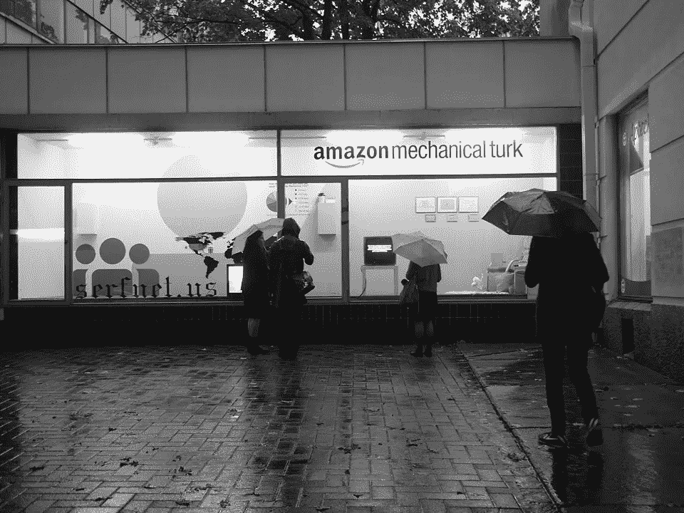
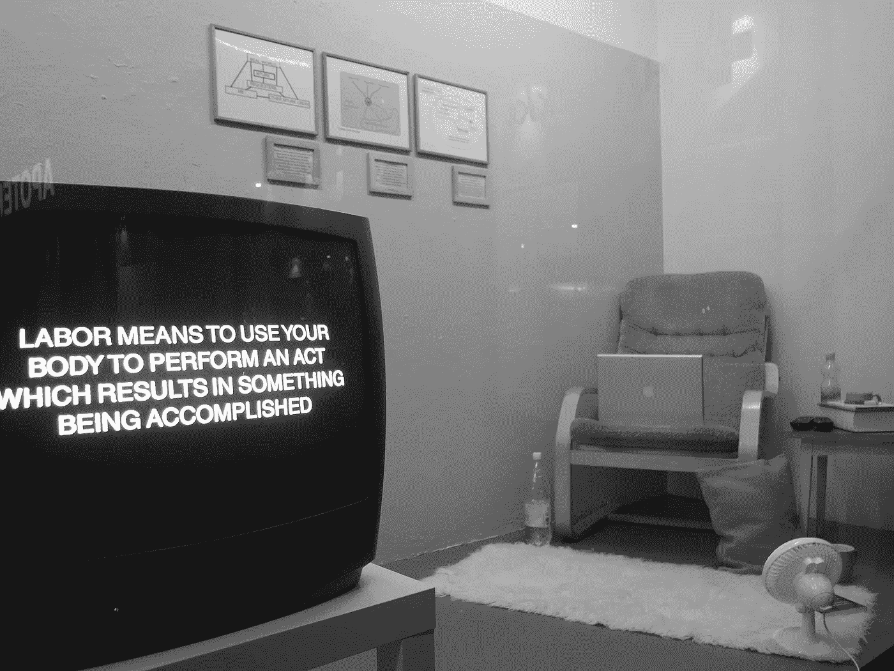

# 向微缩作品致敬

> 原文：<https://medium.com/codex/paying-homage-to-clickwork-f1f7c7801f07?source=collection_archive---------6----------------------->

## 从我的小桌子上打开众包的包装。

安吉拉·沃什科摄

在我填写了我的账户申请后不久，我收到了一封电子邮件，称我不“符合条件”，这粉碎了我成为亚马逊土耳其机械工人的希望。

我没有被告知拒绝的理由。在电子邮件中，Mechanical Turk 只是简单地说，*“客户支持无法改变这一决定，也无法分享对邀请标准的见解。如果我们的邀请标准发生变化，我们可能会在将来联系您以完成您的注册。”*

然后我开始使用我的 Clickwork 应用程序，幸运的是它马上就被批准了。我仔细阅读了工作列表，并选择了一项关于我上次旅行经历的调查。

在完成调查后，我没有得到表明调查对我的回答满意的代码，因此我没有得到我预期完成这项工作将得到的美元。

我对这些微加工任务并不感到幸运。另外，我对完成任何需要自拍的工作都有点怀疑。我担心我的脸会变成一个“深度赝品”。我想让 Clickwork 拥有我的脸——我的数据——的所有权吗？我决定，完成那些要求我尽可能少透露自己信息的工作对我最有利。然而，这大大缩小了我的工作范围。

一项关于谷歌 Chrome 用户的简短调查是我拿到报酬的第一份工作——只有几美分。我认为我没有收到上次旅行记录调查的代码和付款的原因是因为我可能完成得太快了。我在这件事上花了不少时间。然而，我同样小心翼翼地回答了花生实验室的一些调查，但我仍然没有资格参加其中的许多调查，因为我不符合客户的“理想人口统计标准或消费者习惯”。我设法在网站上又完成了一项调查，这将使我的总收入仅为 0.80 美元，勉强达到 1 美元。

我明白为什么这项工作被称为“微工作”，原因不仅仅是因为我正在完成一个将有助于一个更大项目的小任务。它要求我反思生活中那些我本来会忘记的最小细节，比如通过调查，要求我回忆过去六个月里我从某家企业订购了多少次外卖或外卖披萨，或者去年我与美国银行的银行柜员交谈了多少次。

然而，如果我说我喜欢这项工作，那我就是在撒谎。我会努力完成一项工作，但由于我永远也不会知道的原因，我经常得不到报酬。有一次，调查在我完成回答之前就结束了，因为研究已经达到了他们的目标参与者人数。

我认为我低估了这份工作，阿塔纳索斯基和沃拉在他们的论文*中把这份工作描绘成“表面上枯燥、肮脏、重复和没有创造性的工作”，然而点击工作的零工可能是一些更有尊严和简单的工作，被认为是代理劳动。*

*最初，我预计我会很快轻松赚钱。然而，我在努力挣微薄的一美元。在这种感觉自己的工作被低估的挫败感中，我开始理解代理劳动是如何产生“隐形工人”的，不仅通过掩盖他们的身份，还通过掩盖他们的情绪和压力。*

*我在这个过程中经历的任何挫折都不会被 Clickwork 知道，不会被从这些调查中受益的公司知道——我的感受会被隐藏起来，模糊不清。然而，我通过限制我要完成的点击工作，故意让自己陷入这种挫败感。*

*也许那些不喜欢将照片发布到 ClickWork 的人会发现这种微操作既轻松又有利可图。也许，我不得不重新评估我将如何处理这些调查。我的回答不必反映我自己的个人生活 Clickwork 怎么知道什么是真相呢？*

*作为一名微工，我的身份模糊，这意味着我可以选择我的种族、年龄、是否有汽车保险等等。第二天，我以更积极的态度处理了点击工作，确信我可以欺骗系统，让它相信我是任何调查中的最佳候选人。然而，在被花生实验室拒绝参与调查后，我很快被证明是错误的，因为“关于我提供的个人资料数据，发现了数据不一致”。*

*为了在 Clickwork 网站上找到工作，我勉强接受了一项任务，这项任务是我刚开始做微工时放弃的。我决定接受去梅西百货拍香水照片的任务。*

*我下载了 Clickwork 应用程序，开车去商店，准备从这份工作中赚足 20 美元。我在香水亭中筛选了几分钟，但仍然没有找到第一个列出的*阿玛尼我的方式*。*

*我很快被一名商店员工打断，问我是否需要帮助，另一名员工也向我走来。我突然觉得不知所措。我觉得我不能告诉他们我正在完成一项点击工作。*

*我觉得我在执行一项秘密任务。*

*也许，我给人的印象有点粗略，这就是为什么有两个员工来找我。应用程序上的工作本身被列为“神秘访问”，一旦我的意图被其他人质疑，我就觉得有必要“中止任务”。我询问了第一款香水的供应情况，但他们说没有。我感谢他们抽出时间，很快离开梅西百货，往家走去。*

*我完成的微雕作品远非“硕果累累”，这是土耳其机械工人卡拉在格雷和苏里的文章[*ghost network*](https://ghostwork.info/)中对她的微雕作品的描述。*

*我可以灵活地在任何时候完成一项任务，但我在任务中没有太多选择。坦率地说，这种微加工的尝试让我欣赏了我生命中的项目，这些项目是我从开始到结束对产品组成的最大控制，如果不是全部的话。*

*在这条“数字化流水线”上，我感到了‘超然’和‘麻木不仁’。*

**

*安吉拉·沃什科摄*

*作为一名微型工作者，在这三天之后，我决定再次看看[安吉拉·沃什科的艺术装置](https://angelawashko.com/home.html)，它纪念亚马逊土耳其机械公司的工人，以及更广泛地从事任何形式的众包劳动的个人。我觉得这些关于农奴装置的评论更有吸引力。*

*我最喜欢的一句话是:“我辛辛苦苦做这些调查，我真的为此感到自豪。”如果我长期致力于这份工作，我可能会更好地详细描述微工作的算法残酷性，它如何疏远个人，让他们从事单调乏味的重复性工作，而没有公司福利的额外津贴，包括心理健康服务。*

*微工作或许应该继续作为一份兼职，一份赚钱或利用空闲时间的短暂工作。然而，并不是每个人都有特权获得更满意的工作。我想我会向我认识的每一个人推荐 Clickwork，这样他们就可以理解——感同身受——微工作者，并且熟悉数字劳动的世界。*