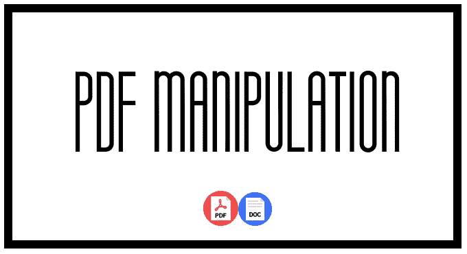
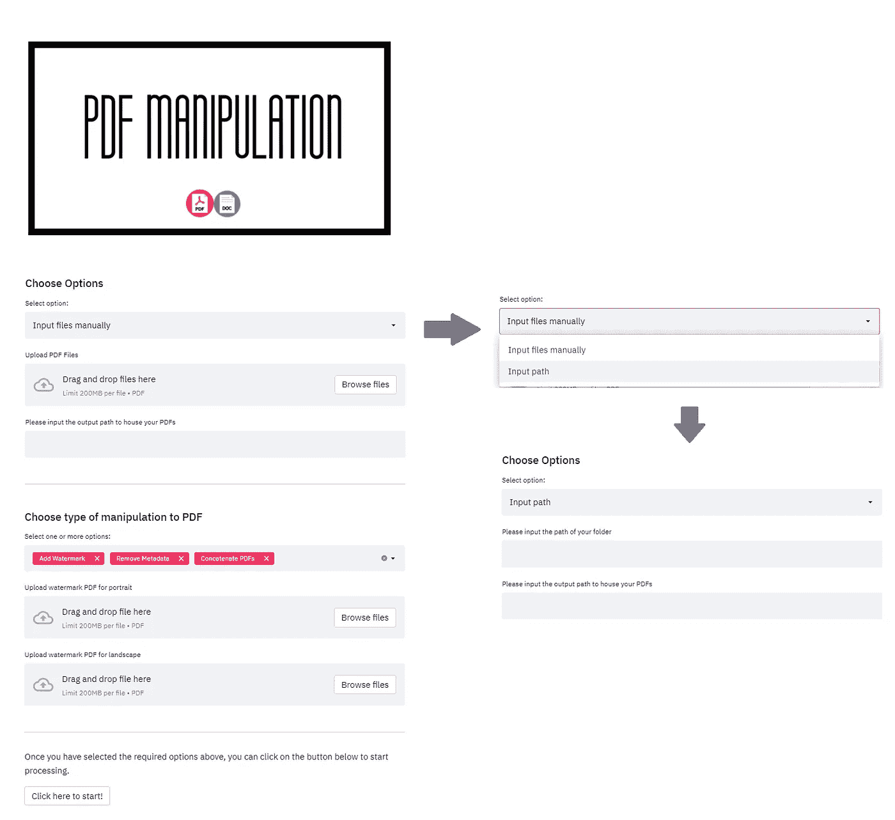

# PDF 操作应用程序第 1 部分—使用 Streamlit 和 PDFRW 创建应用程序

> 原文：<https://medium.com/codex/pdf-manipulation-application-using-streamlit-and-pdfrw-917a1f89bf5a?source=collection_archive---------5----------------------->

> 使用 python library Streamlit 在交互式 web 应用程序中添加水印功能、删除元数据，甚至将不同的 Doc/Docx/PDF 文件连接在一起。



# 为什么选择 Streamlit？

Streamlit 可在几分钟内将数据脚本转化为可共享的 web 应用程序[1]。最重要的是，不需要前端经验。通过 Streamlit，该应用程序能够获得用户对其要求和输入的输入，以便为他们定制解决方案。这无疑也让它对用户更有吸引力！

# 本申请的目的

此脚本利用软件包 Streamlit 和 PDFRW 来添加水印、删除元数据或连接 PDF 或文档(Doc/Docx ),并将它们输出到单个 PDF 或单个 PDF(如果选择了连接选项)。

虽然有许多解决方案可以轻松解决这个问题，但 python 包 PDFRW 上的解决方案并不多，当然也没有多少将该解决方案与 Streamlit 提供的优秀接口相结合。

# 简化应用程序的界面



接口和可能配置的示例

# 应用程序的特征

这个 web 应用程序是根据我的个人需求建立的:(1)合并页眉和页脚；(2)将 doc/docx 转换成 PDF 以及(3)将“修正”文档连接在一起成为一个 PDF 的选项。

**水印文档(包含页眉和页脚)**

目前，水印功能是通过在实际的 PDF 上叠加另一个包含水印的 PDF 来实现的。它有两个版本，风景和肖像。如果选择了水印功能，用户必须拖放这些文件。脚本将自动检测 PDF 的方向，并在 PDF 上加入正确的水印。

**输入路径(doc/docx 只能在此选项上运行)与手动输入文件**

对于“输入路径”选项，用户必须输入文件夹的路径，脚本将考虑该文件夹中的 PDF 和 doc/docx 文件。

对于“手动输入文件”选项，用户只需将所需文件拖放到下拉框中。这个选项的缺点是它只支持 PDF 文件，但是可以一次处理多个文件。

**串联 vs 非串联**

如果选择了“连接”选项，所有 pdf 将在规定的输出路径中保存为一个 PDF 调用“Annex.pdf”。如果未选择该选项，单个 PDF 将输出为“附件 X.pdf，附件 X.pdf，…，附件 X.pdf”

# 此 web 应用程序未来可能的改进

虽然这个 web 应用程序确实满足了我当前的需求，但我确实看到了许多可以实现的潜在改进，以便将这个应用程序带到下一个级别。

**合并其他文件类型**

对于 starter，如果用户选择“输入路径”选项，该 web 应用程序只能接受 doc/docx 文件类型，脚本将在该路径中搜索所有 doc/docx 和 pdf 文件进行操作。

其次，这种功能应该能够复制到其他文件类型，如 excel 或 txt。尽管这个特性的有用性可能并不是真正必要的。

**识别文件尺寸的能力**

目前，虽然脚本能够自动识别文档的方向(横向或纵向)并为其应用正确的水印，但它仅在文档大小为 A4 时有效。

当然，并不是所有的文件都是 A4 的。为了真正实现自动化，而不是半自动化，脚本能够自动识别文档的大小(如果是 A4、B5 甚至是 letter)并对其应用正确尺寸的水印功能将非常有用。

**水印特征增强**

该脚本在将水印功能应用到 PDF 方面肯定可以做得更好。目前，脚本在将文档整体导出之前，会将横向或纵向水印 PDF 叠加到文档上。虽然这是可行的，但是没有为用户提供定制。

用户应该能够输入水印的话，水印将被放置的位置以及方向。

**在 Heroku 或其他主机上托管应用**

最后，最后一步是在 Heroku 这样的平台上托管应用程序，以便这个 web 应用程序可以很容易地共享和使用。

# **最终想法**

这对我来说绝对是一个有趣的项目，很大一部分是因为这个脚本是在 Streamlit 中实现的，这迫使我从用户的角度进行思考。

最后，非常感谢你阅读我的文章！:)

# 完整代码

```
import streamlit as st
from pdfrw import PdfReader, PdfWriter, PageMerge, IndirectPdfDict
import pathlib
import os
from os import path
from glob import glob
from PIL import Image
import numpy as np
import comtypes.client
from pathlib import Path#################### Streamlit ####################
def load_image(img):
 im = Image.open(img)
 image = np.array(im)
 return imagest.image(load_image(os.getcwd()+”\Title.png”))
st.write(“##”)st.subheader(“Choose Options”)config_select_options = st.selectbox(“Select option:”, [“Input files manually”, “Input path”], 0)if config_select_options == “Input files manually”:
 uploaded_file_pdf = st.file_uploader(“Upload PDF Files”,type=[‘pdf’], accept_multiple_files=True)
 # uploaded_file_doc = st.file_uploader(“Upload doc/docx Files”,type=[‘docx’,’doc’], accept_multiple_files=True)
else:
 input_path = st.text_input(“Please input the path of your folder”)
 uploaded_file = []
 if len(input_path) > 0:
 st.write(f”PDFs in this path {input_path} will be uploaded”)output_path = st.text_input(“Please input the output path to house your PDFs”)
if len(output_path) > 0:
 st.write(f”Amended PDFs will be housed in this path {output_path}”)st.write(“ — — -”)
st.subheader(“Choose type of manipulation to PDF”)config_select_manipulation = st.multiselect(“Select one or more options:”, [“Add Watermark”, “Remove Metadata”, “Concatenate PDFs”], [“Add Watermark”, “Remove Metadata”, “Concatenate PDFs”])
if “Add Watermark” in config_select_manipulation:
 uploaded_file_wmp = st.file_uploader(“Upload watermark PDF for portrait”,type=[‘pdf’])
 uploaded_file_wml = st.file_uploader(“Upload watermark PDF for landscape”,type=[‘pdf’])#################### Actual Code ####################def main():
 ## Set up progress bar
 st.write(“ — — -”)
 st.subheader(“Status”)progress_bar = st.progress(0)
 status_text = st.empty()status_text.text(“In progress… Please Wait.”)## Checking the output directory
 if not os.path.exists(‘output_path’):
 os.makedirs(‘output_path’)
 status_text.text(“Output path checked okay. Proceeding to next step…”)## Define the reader and writer objectswriter = PdfWriter()
 if “Add Watermark” in config_select_manipulation:
 watermark_input_P = PdfReader(uploaded_file_wmp)
 watermark_input_LS = PdfReader(uploaded_file_wml)
 watermark_P = watermark_input_P.pages[0]
 watermark_LS = watermark_input_LS.pages[0]
 status_text.text(“Loaded Watermark PDF. Progressing to the next step…”)
 progress_bar.progress(0.25)def find_ext(dr, ext):
 return glob(path.join(dr,”*.{}”.format(ext)))wdFormatPDF = 17if config_select_options == “Input path”:filepath_doc = find_ext(input_path,”doc”)
 filepath_docx = find_ext(input_path,”docx”)
 filepath_all_doc = filepath_doc + filepath_docxfor file in filepath_all_doc:
 name = Path(file).name.split(“.”)[0]
 word = comtypes.client.CreateObject(‘Word.Application’, dynamic = True)
 word.Visible = True
 doc = word.Documents.Open(file)
 doc.SaveAs(input_path+”\\”+ name +”.pdf”, wdFormatPDF)
 doc.Close()
 word.Quit()
 filepath = find_ext(input_path,”pdf”)
 else:
 # for file in uploaded_file_doc:
 # #name = Path(file).name.split(“.”)[0]
 # word = comtypes.client.CreateObject(‘Word.Application’, dynamic = True)
 # word.Visible = True
 # doc = word.Documents.Open(file)
 # doc.SaveAs(output_path+”\\intermediate\\”+ file +”.pdf”, wdFormatPDF)
 # doc.Close()
 # word.Quit()
 # filepath_pdf = find_ext(output_path+”\intermediate”,”pdf”)
 # filepath = uploaded_file_pdf + filepath_pdf
 filepath = uploaded_file_pdf## Create a loop for all the paths
 for i in range(len(filepath)):
 file = filepath[i]
 reader_input = PdfReader(file)
 status_text.text(f”Processing {file} now…”)if “Add Watermark” in config_select_manipulation:
 ## go through the pages one after the next
 for current_page in range(len(reader_input.pages)):
 merger = PageMerge(reader_input.pages[current_page])try:
 mediabox = reader_input.pages[current_page].values()[1][‘/Kids’][0][‘/MediaBox’]
 except TypeError:
 mediabox = reader_input.pages[0].values()[1]if mediabox[2] < mediabox[3]:
 merger.add(watermark_P).render()
 else:
 merger.add(watermark_LS).render()
 writer.addpages(reader_input.pages)
 status_text.text(f”Watermark done for {file}…”)
 else:
 writer.addpages(reader_input.pages)if “Remove Metadata” in config_select_manipulation:
 # Remove metadata
 writer.trailer.Info = IndirectPdfDict(
 Title=’’,
 Author=’’,
 Subject=’’,
 Creator=’’,
 )if “Concatenate PDFs” not in config_select_manipulation:
 writer.write(output_path+”\Annex “+str(i+1)+”.pdf”)
 writer = PdfWriter()status_text.text(f”{file} completed…”)
 progress_bar.progress(0.25+(0.75/len(filepath))*(i+1))if “Concatenate PDFs” not in config_select_manipulation:
 status_text.text(f”All done!!!”)
 st.balloons()
 else:
 # write the modified content to disk
 writer.write(output_path+”\Annex.pdf”)if config_select_options == “Input files manually”:
 for file in filepath_pdf:
 if os.path.exists(file):
 os.remove(file)
 else:
 for file in filepath:
 if os.path.exists(file):
 os.remove(file)
 st.balloons()st.write(“ — — -”)
st.write(“Once you have selected the required options above, you can click on the button below to start processing. “)if st.button(“Click here to start!”):
 main()
```

# 参考

[1][https://streamlit.io/](https://streamlit.io/)

# 其他项目

*   [使用 Streamlit 和 Selenium 进行价格比较](https://choodesmond42.medium.com/price-comparison-application-using-streamlit-and-selenium-96212aa5a229)
*   [PDF 表格数据:卡梅洛特 vs Tabula？为什么不两者并用呢？](https://choodesmond42.medium.com/tabular-data-from-pdf-camelot-vs-tabula-why-not-use-both-together-433aa852f607)
*   [PDF 处理应用程序第 2 部分——如何使用 PDFminer 删除不需要的页面](https://choodesmond42.medium.com/pdf-manipulation-how-to-remove-unwanted-pages-using-pdfminer-56ba93bdd7d1)
*   [PDF 操作应用程序第 3 部分—在 Heroku 上部署应用程序，并将结果输出为 zip 文件](https://choodesmond42.medium.com/pdf-manipulation-application-part-3-deploying-the-application-on-heroku-and-output-result-as-zip-531886732f0e)