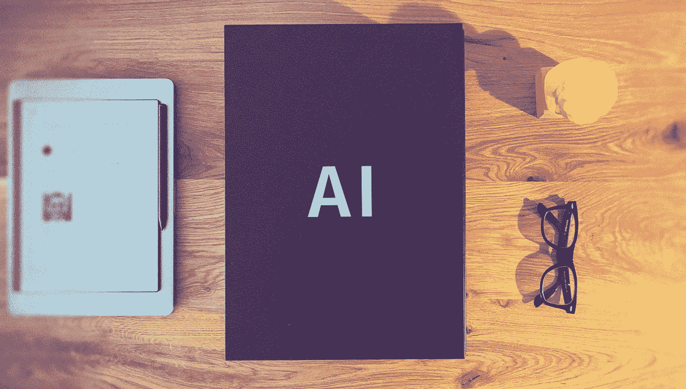
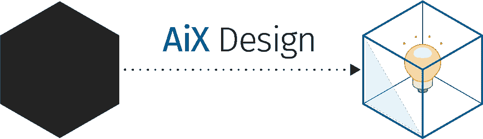
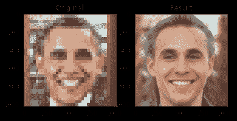
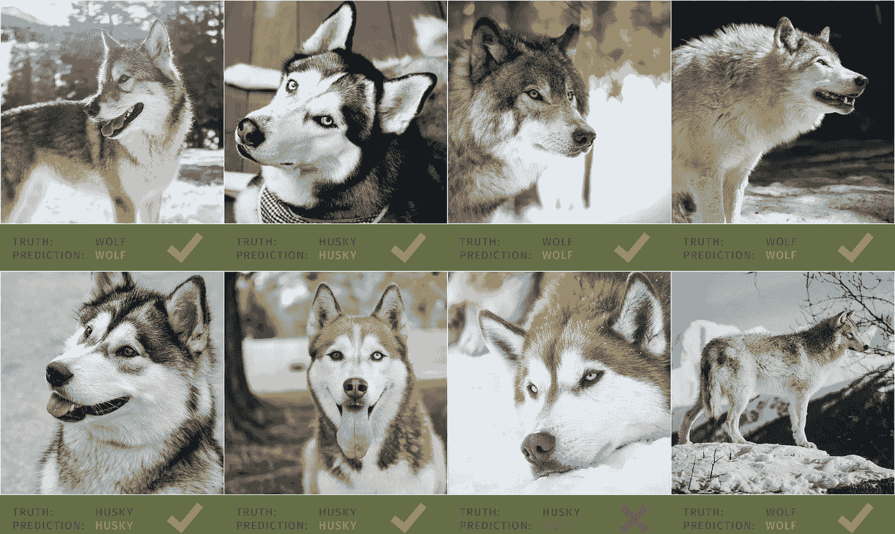

# 窥视黑盒子——从设计角度看可理解的人工智能——第一部分

> 原文：<https://medium.com/codex/peeking-in-the-black-box-a-design-perspective-on-comprehensible-ai-9dcb58389e3d?source=collection_archive---------13----------------------->

人工智能作为一个黑盒 2021 亨纳欣策

> “小心，机器人，因为我们勇敢，我们渴望行动，我们注定要成功。我们不知道自己在做什么。”–米切尔夫妇对机器(索尼电影动画，2021)

艾克斯设计 2021 亨纳欣策

*近年来，由于具有数百万自动学习参数的神经网络等强大算法的出现，人工智能(AI)技术的预测准确性大幅提高。然而，这是有代价的——与基于规则的系统和线性回归等“经典”方法相比，这些新方法由于其固有的复杂性，明显不太透明，也更难解释。因此，我们认为它们是“黑盒”系统。这种缺乏可解释性限制了它们在相当多的实际应用中的有用性。这是一个公认但在很多方面仍未解决的问题，在术语* [*下追究可交代的 AI 或*](https://www.darpa.mil/program/explainable-artificial-intelligence)**。**

*将围绕 XAI 的讨论局限于技术层面，或者仅仅是为了遵守法律和建立信任，将会错失其更大的潜力。我相信，当 XAI 被认为是 AiX 设计**不可或缺的一部分时，它提供了一个机会，让 AI 走上一条不仅可以解释，而且可以提供信息——甚至是教育——的道路。***

**听听这篇文章 2021 亨纳·欣策**

## **本系列的其他文章**

*   **窥视黑盒子——信任人工智能——第二部分**
*   **[窥视黑盒子——从可解释的人工智能到解释人工智能——第三部分](/codex/peeking-into-the-black-box-from-explainable-ai-to-explaining-ai-part-3-cc455181373e)**

# **何必呢？**

**让我们想象一下，我们在一个法医实验室工作——就像在电视节目《犯罪现场调查》中看到的那样。警方提供给我们一个模糊的图像，显示了一个罪犯的脸。**

****

**来源:[维基百科](https://en.wikipedia.org)(作者缩小)**

**我们现在的任务是提高图像的质量，使其能够与警方的数据库相匹配。这个臭名昭著的虚拟工具叫做[‘缩放和增强’](https://youtu.be/I_8ZH1Ggjk0?t=20)。原则上，不应该用这种方式放大图像，因为这需要创建原始材料中不存在的信息。但是现代机器学习技术让我们无论如何都能解决这个问题。使用[脸部去像素化器](https://colab.research.google.com/github/tg-bomze/Face-Depixelizer/blob/master/Face_Depixelizer_Eng.ipynb)，我们放大了像素化图像，以获得看起来非常真实的高分辨率图像。干得好！**

****

**作者用[人脸脱色器](https://colab.research.google.com/github/tg-bomze/Face-Depixelizer/blob/master/Face_Depixelizer_Eng.ipynb)制作的高分辨率图像**

**但是坚持住！你可能已经发现，原始图像实际上是美国前总统巴拉克·奥巴马。那么，这里发生了什么？用于转换的模型已经在成对的像素化图像及其相应的高分辨率版本上进行了训练。AI 不会真正缩放原始像素化图像。它从训练期间看到的高分辨率图像的组合中重建新图像，这些图像的像素化对应物与我们的最相似。对于艺术目的来说，这是一个有用的工具，但是对于法庭用例来说却完全不合适。如果不理解潜在机制的含义，我们就会去起诉一些随机的无辜的人。**

**这个例子是虚构的，但人工智能的可理解性具有现实生活中的后果(参见凯西·奥尼尔的[数学毁灭武器](https://www.penguinrandomhouse.com/books/241363/weapons-of-math-destruction-by-cathy-oneil/)中的一些例子；上面这个例子的灵感来源于 [Boris Müller，2021](https://borism.medium.com/ghost-in-the-machine-designing-interfaces-for-machine-learning-features-a57bb9b57e04) )。**

# **业绩证明是不够的**

**有人可能会说，如果人工智能可以被证明准确地执行，它不需要被理解才是可信的。谷歌首席决策科学家 Cassie Kozyrkov 在[中提出了完全相同的观点:“可解释的人工智能不会实现。原因如下。](https://hackernoon.com/explainable-ai-wont-deliver-here-s-why-6738f54216be)(科济尔科夫 C，2018)。**

**在我的短篇小说《朦胧的回答》中，我对这种立场可能带来的后果进行了讽刺性的展望。再试一次。
但是严肃地说，我相信这种论证有缺陷。虽然业绩是建立信任的一个关键因素(李&马里，1992)，但它不是唯一的相关因素。**

**Kozyrkov 使用了一个类比，询问我们将信任使用两艘飞船中的哪一艘，一艘理论上合理但尚未飞行过(很好理解但未经测试)或一艘在多年成功飞行中被证明安全运行的飞船(了解不多但经过良好测试)。她更喜欢后者。这个类比回避了两个问题:**

1.  **当第二艘宇宙飞船还没有服役多年时，宇航员们有什么理由相信它呢？因为所有新引入的 AI 系统都是这种情况。**
2.  **如果第二艘宇宙飞船已经飞行了很多年，它什么时候结束它的时间，并且飞行不再安全了？这需要对机器的操作有深入的了解。现实世界中的应用模式可能会改变，以前表现良好的人工智能系统会悄然退化。**

**仅仅依靠人工智能系统的性能来信任它可能是不够的，这有几个原因:**

1.  **当测试应该在真实世界中进行时，根据所涉及的风险，这可能会带来不可接受的风险。**
2.  **当测试在实验室中完成时，用户是否充分理解了指标的重要性，从而做出明智的决策？如果系统的预测错了，会错到什么程度？对所做决定负责的是人工智能系统的用户，而不是系统的创造者。**
3.  **当算法根据训练数据中的偏差学习捷径时，来自实验室环境的测量可能根本不会转化为现实世界。这将在实验室中产生令人印象深刻的性能，这在现场是不可复制的。
    Ribeiro 等人(2016)描述了一个实验，其中训练了一个模型，以高准确度区分哈士奇(爱斯基摩犬)和狼。奇怪的是，研究人员可以证明该模型忽略了动物本身的颜色、姿势或其他属性，但根据背景中雪的存在做出了预测。这种模式在实践中几乎没有用。(见下图)**
4.  **模型学习到的模式在现实世界中可能不稳定，但会随着时间推移而变化，因此预测会逐渐恶化。**
5.  **在实践中应用模型预测可以改变环境，使得模型做出预测所依据的假设不再成立。
    Caruana 等人(2015)训练了一个模型来预测肺炎的死亡概率，以决定是否让患者住院。在检查中，他们发现该模型，与直觉相反，预测有哮喘先决条件的患者死亡风险较低。这是因为医生通常不仅让这些病人住院，而且直接让他们进入重症监护室。与普通人群相比，积极的护理降低了有哮喘病史的肺炎患者的风险。在不了解这一机制的情况下遵循模型预测的结果将使有先决条件的患者不住院，使他们面临不可接受的风险。**

****

**图片分类为哈士奇狗或狼——图片来源:[加布·雷布拉](https://unsplash.com/@garebra?utm_source=unsplash&utm_medium=referral&utm_content=creditCopyText)、[克里斯蒂安·鲍文](https://unsplash.com/@chrishcush?utm_source=unsplash&utm_medium=referral&utm_content=creditCopyText)、[莫妮卡·斯塔沃维](https://unsplash.com/@monicore?utm_source=unsplash&utm_medium=referral&utm_content=creditCopyText)、[西蒙·雷伊](https://unsplash.com/@simonrae?utm_source=unsplash&utm_medium=referral&utm_content=creditCopyText)、[阿曼达·熊猫](https://unsplash.com/@hellotonytheturtle?utm_source=unsplash&utm_medium=referral&utm_content=creditCopyText)、[米洛·魏勒](https://unsplash.com/@miloweiler?utm_source=unsplash&utm_medium=referral&utm_content=creditCopyText)、[罗布森·哈苏卡米·摩根](https://unsplash.com/@robsonhmorgan?utm_source=unsplash&utm_medium=referral&utm_content=creditCopyText)、[玛利亚·克拉夫特](https://unsplash.com/@madesolobymariah?utm_source=unsplash&utm_medium=referral&utm_content=creditCopyText)(均在[Unsplash](https://unsplash.com/s/photos/wolf?utm_source=unsplash&utm_medium=referral&utm_content=creditCopyText))；作者的构图和图形**

**Kozyrkov 在她的文章中仍然清楚地提出了一些有效的观点——例如，人类的理解能力是有限度的。我们发明了复杂的算法来解决复杂的问题——太复杂而不能用简单的方法解决的问题。人类既没有能力可视化高维数据，也没有能力掌握高度非线性的关系，这两者都是典型的“人工智能问题”的特征。这意味着解释必须简化。科兹尔科夫指出，虽然我们无法检查人脑中每个神经元的工作情况，但我们仍然信任其他人。然而，人类并不是完全的黑匣子。他们总是对自己的思维方式和行为做出有用的解释。**

**考虑到我们用于预测的模型也仅仅是现实复杂性的近似值。我们仍然发现它们是有用的。因此，除了少数例外，我们应该期望解释是对我们的人工智能系统的复杂性的有用的近似。**

# **重构准确性和可理解性的权衡**

**似乎有一种共识，即在模型的准确性和可理解性之间存在着一种普遍的权衡:模型预测得越好，对人类来说就越不可理解——这都是由于其更高的复杂性——反之亦然。我们可能会得出结论，赌注越高，我们需要的预测就越准确，因此无法解释的预测将不可避免。这似乎是一个两难的选择，对于高风险的决策，我们也想深入了解所有的影响因素。**

**我们需要澄清并重新构建这一观点:任何机器学习算法唯一能够做的就是预测。是的，甚至从技术上来说，生成一个句子意味着根据前面的词预测下一个词。分类是对人类注释者将分配什么标签的预测，等等。但是，即使是高度准确的预测本身也很少有用。他们需要为实施行动的决策提供信息。决策是基于预测，但应用上下文和对后果及其概率的评估。否则，我们将不得不假设每两个决策者会在相同的预测下做出相同的决定，这显然是不正确的。为了帮助决策，人工智能系统必须提供其预测的背景。可理解的人工智能提供了这种背景。**

**这并不意味着在所有情况下，我们应该更喜欢完全透明而不是预测准确。但是从最终用户目标及其先决条件出发，将有助于对需要解释什么以及预测必须有多准确做出有根据的猜测。我们不应该把二进制代码想成“黑盒”或“白盒”(又名“玻璃盒”)，而是应该瞄准“灰盒”(Broniatowski，2021)，在可理解性和预测准确性之间取得适当的平衡。**

**在任何情况下，可理解性都不能是事后的想法——在所有技术决策都已做出之后——而必须是与人工智能系统的最终用户密切合作的产品概念和设计的一个组成部分。**

**在接下来的文章中，我将深入探讨人工智能中的信任问题，以及如何解释人工智能系统的内部运作。**

## **然后**

**[窥视黑盒子——信任人工智能——第二部分](/codex/peeking-into-the-black-box-trust-in-ai-part-2-a0d3819674d5)**

***亨纳拥有设计和计算机科学的背景，喜欢思考和推测人工智能的未来和新兴技术。他还创造数字产品***

***跟随上* [*中等*](/@merzhase) *！
连接上*[*LinkedIn*](https://www.linkedin.com/in/henner-hinze)*！***

## **相关故事**

*   **[对 AiX 设计的需求](https://hennerhinze.medium.com/the-need-for-aix-design-b38defa4162f?source=your_stories_page-------------------------------------)**
*   **[回复朦胧。再试一次。](https://hennerhinze.medium.com/reply-hazy-try-again-3149662282b3)**

# **参考**

1.  **Broniatowski D A (2021)。《人工智能中可解释性和可解释性的心理学基础》，NIST:美国商务部国家标准与技术研究所。**
2.  **Caruana R、Lou Y、Gehrke J、Koch P、Sturm M、Elhadad N (2015 年)。“医疗保健的可理解模型:预测肺炎风险和住院 0 天再入院”，*KDD“15:第 21 届 ACM SIGKDD 知识发现和数据挖掘国际会议论文集*，第 1 页*721–1730*，计算机械协会(ACM)。**
3.  **“Hinze H (2020)”朦胧回答。再试一次。、*中*【在线】，可访问:[https://henner hinze . Medium . com/reply-hazy-try-again-3149662282 B3](https://hennerhinze.medium.com/reply-hazy-try-again-3149662282b3)。(访问日期:2021 年 8 月 12 日)**
4.  **Kozyrkov C (2018)，‘可解释的人工智能不会实现。原因如下。、*黑客正午*【在线】，可访问:[https://Hacker Noon . com/explable-ai-wont-deliver-here-s-why-6738 f 54216 be](https://hackernoon.com/explainable-ai-wont-deliver-here-s-why-6738f54216be)。(访问日期:2021 年 6 月 22 日)**
5.  **李 J，马里 N (1992)。“人机系统中的信任、控制策略和功能分配”，*人类工程学*，第 35 卷，第 10 期，第 1243–270 页，泰勒&弗朗西斯有限公司**
6.  **穆勒 B (2021)。“机器中的幽灵:为机器学习功能设计界面”，medium.com[在线]。可访问:[https://borism . medium . com/ghost-in-the-machine-designing-interfaces-for-machine-learning-features-a 57 bb 9 b 57 e 04](https://borism.medium.com/ghost-in-the-machine-designing-interfaces-for-machine-learning-features-a57bb9b57e04)，(最后访问时间:2021 年 7 月 27 日)。**
7.  **奥尼尔 C (2017)。《数学毁灭武器:大数据如何增加不平等并威胁民主》，企鹅兰登书屋。**
8.  **里贝罗·M·T，辛格·S，盖斯特林·C(2016 年)。“我为什么要相信你？”“解释任何分类器的预测”，*KDD“16:第 22 届 ACM SIGKDD 知识发现和数据挖掘国际会议论文集*，第 1135–1144 页，计算机器协会。**

## **进一步阅读**

1.  **Allen P (2018)，“原型化人工智能的原型化方法”，*交互:人机交互创新者的困境——特别主题:设计人工智能*，第 XXV.6 卷，ISS 2018 年 11 月至 12 月，第 47-51 页，ACM。**
2.  **丘吉尔 E F，范艾伦 P，库尼亚夫斯基 M (2018)。“设计人工智能”，*交互:人机交互创新者的困境——专题:设计人工智能*，第 XXV.6 卷，2018 年 11 月至 12 月，第 35-37 页，ACM。**
3.  **克拉默 H，加西亚-加思赖特 J，施普林格 A，雷迪 S (2018)。“评估和解决实践中的算法偏差”，*互动:人机交互创新者的困境——专题:设计人工智能*，第 XXV.6 卷，2018 年 11 月至 12 月，第 59-63 页，ACM。**
4.  **卡内曼 D，特沃斯基 A (1974)。《不确定性下的判断:启发和偏见》，*科学*，第 185 卷，iss 4157，第 1124-1131 页，美国科学促进协会。**
5.  **林德瓦尔·M，莫林·J，劳格伦·J(2018)，“从机器学习到机器教学:UX 的重要性”，*交互:人机交互创新者的困境——专题:设计人工智能*，第 XXV.6 卷，ISS 2018 年 11 月至 12 月，第 53-37 页，ACM。**
6.  **Martelaro N，Ju W (2018)，“控制论和人工智能系统的用户体验设计”，*交互:人机交互创新者的困境——专题:设计人工智能*，第 XXV.6 卷，ISS 2018 年 11 月至 12 月，第 38-41 页，ACM。**
7.  **Wong J S (2018)，“设计与小说:想象公民人工智能”，*互动:人机交互创新者的困境——专题:设计人工智能*，第 XXV.6 卷，ISS 2018 年 11 月-12 月，第 42-45 页，ACM**