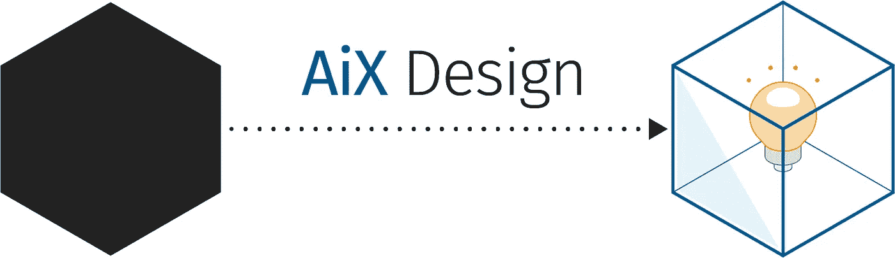
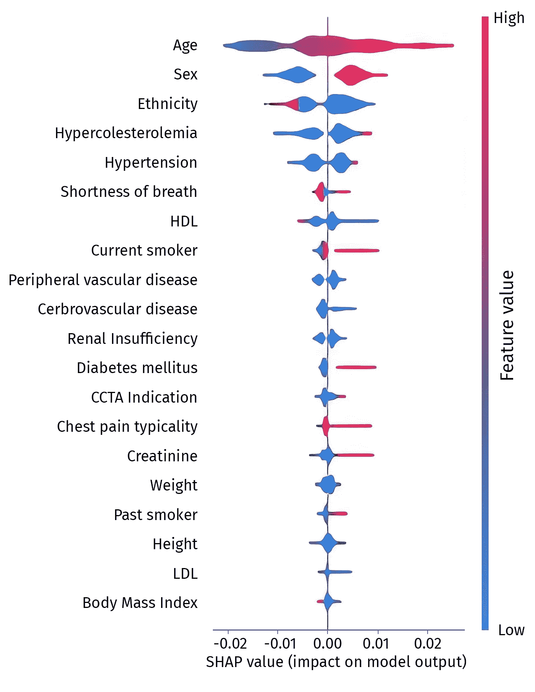
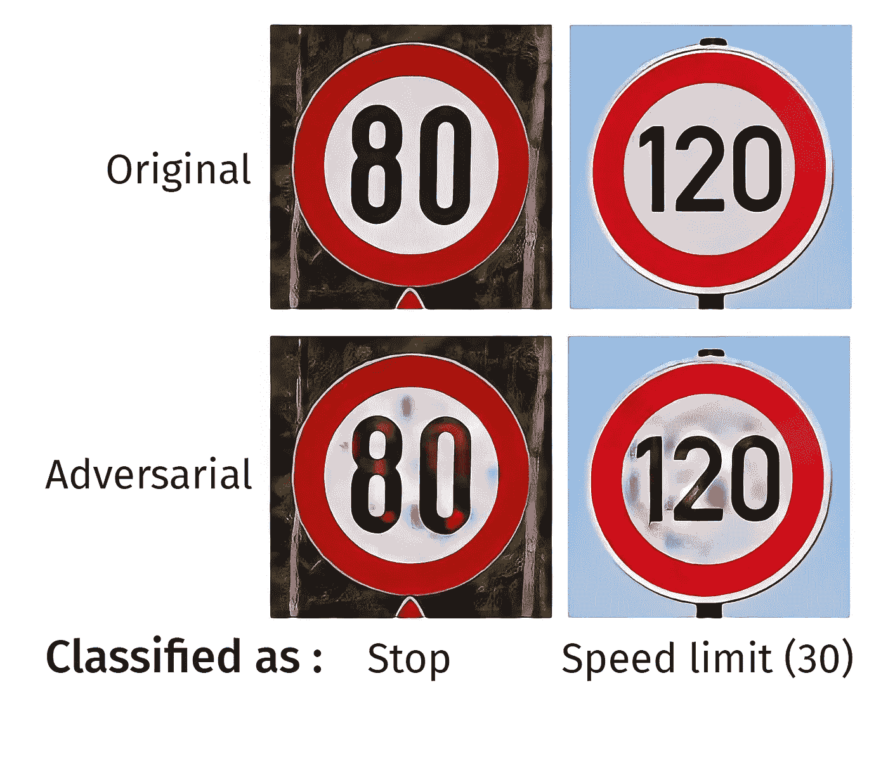

# 窥视黑盒子——从可解释的人工智能到解释人工智能——第 3 部分

> 原文：<https://medium.com/codex/peeking-into-the-black-box-from-explainable-ai-to-explaining-ai-part-3-cc455181373e?source=collection_archive---------10----------------------->

人工智能作为一个黑盒 2021 亨纳欣策

> “到目前为止，人工智能最大的危险是，人们过早地断定他们理解它。”
> 
> –Eliezer Yudkowsky(决策和人工智能理论家)

艾克斯设计 2021 亨纳欣策

[*本系列的第 1 部分*](/codex/peeking-in-the-black-box-a-design-perspective-on-comprehensible-ai-9dcb58389e3d) *介绍了 AI 系统可解释性的概念，作为* [*AiX 设计*](https://dxg.wolterskluwer.com/the-need-for-aix-design-part-1/)*(AI 系统体验的设计)的重要组成部分。* [*第二部分*](/codex/peeking-into-the-black-box-trust-in-ai-part-2-a0d3819674d5) *接着仔细研究了作为可交代性的首要目标之一的信任。*

这篇文章不仅提出了让人工智能系统变得可解释的基本考虑因素，还提出了实际解释它们的基本考虑因素:谁需要解释？出于什么目的他们需要一个解释？好的解释有什么特征？

只有以人为中心的方法来解释人工智能，才能使产品经理、设计师、用户研究人员和工程师开发出对非人工智能专家的日常生活和工作有用的人工智能系统。

*正如米勒(2019)在《人工智能中的解释:来自社会科学的见解》中所说:*

> " XAI[可解释的人工智能]是一个人机交互问题."

从这一点来看，可解释的人工智能应该从心理学和认知科学以及设计实践中吸取大量的经验。然而，可解释的人工智能经常被认为仅仅是工程技术的集合(例如，SHAP、石灰、冰等等)。).如果不考虑心理和社会因素，这些技术在实践中很容易无法产生有用的解释。具有社会科学背景的研究人员和产品设计师必须提供专业知识，以确保人工智能系统的内部工作和预测得到适当的解释，使所有利益相关者能够做出明智的决定。

# 本系列的其他文章

[第一部分:窥视黑盒子——可理解人工智能的设计视角](/codex/peeking-in-the-black-box-a-design-perspective-on-comprehensible-ai-9dcb58389e3d)
[第二部分:窥视黑盒子——对人工智能的信任](/codex/peeking-into-the-black-box-trust-in-ai-part-2-a0d3819674d5)

# 当可解释的人工智能无法解释

作为人类，我们寻找解释来提高我们的理解——以获得一个稳定的模型，我们可以用它来更好地预测我们周围的世界。因此，每当我们观察到一些意想不到或不正常的事情时，我们往往会要求解释。令人惊讶的事件告诉我们，我们的心理模型(即，我们关于世界的指导我们行为和决定的“理论”)是不正确的，或者至少是不完整的。

然而，一份完整的事件潜在原因清单会造成认知负担，这种负担太高，不切实际。因此，我们倾向于期望一个解释来呈现一组有限的原因，这些原因对我们来说是可操作的。

Miller (2019)将解释描述为由三个过程组成:

1.  了解潜在原因
2.  选择“最佳”原因
3.  将解释从解释者转移到被解释者

相比之下，图 1 显示了一张使用一种流行的可解释的人工智能技术制作的图表，这种技术被称为 [SHAP](https://christophm.github.io/interpretable-ml-book/shap.html) 。它列出了*所有*用于预测患者心脏病发作风险的因素，以及这些因素对预测的影响。根据米勒的模型，这仅使用了理解潜在原因的过程(1)但没有选择“最佳”原因(2)，这使得它充其量是一个不完整的解释。

图 1: SHAP 解释了特征对心脏病发作风险预测的平均影响。转载自 Al'Aref 等人(2019)。

假设一个医生和一个病人想要设计一个干预策略来防止心脏病发作，一个主要问题就变得很明显:许多因素根本没有用。年龄、性别和种族是心脏病发作的最强预测因素，但它们都不会受到影响。此外，使用的许多因素是相互关联的(它们相互影响)，例如，过去吸烟者更有可能成为当前吸烟者，体重和身高决定身体质量指数，等等。医生必须为额外的解释付出很大的努力。在许多其他用例中，专家可能不可用，用户只能猜测如何利用自动预测。

显而易见，好的解释需要对其语境的充分理解，尊重心理和认知因素。首先要考虑的两个问题是:谁是被解释者？他们为什么要求解释？

# 向谁解释？

为了创造一个好的解释，解释者知道什么或者认为知道什么是至关重要的。不存在“一刀切”。创建和使用人工智能系统所涉及的各种角色显然带来了不同的技能、经验、约束和激励，因为他们可能需要解释。

Tomsett 等人(2018)提出了人工智能系统的创建、使用和维护中涉及的七个角色:

1.  **创造者-所有者**
    代表人工智能系统中知识产权的所有者——管理者、执行委员会成员。
2.  **创建者-实现者**
    人工智能系统的直接实现者——数据科学家、开发人员、产品负责人、主题专家。
3.  **操作员**
    向人工智能系统提供输入并检索其预测——领域专家，模型用户。
4.  **执行者**
    根据 AI 系统的预测做出决策——领域专家，模型的使用者。
5.  **决策主体**
    受到基于 AI 系统预测的决策的影响。
6.  **数据主体**
    其个人数据被用于训练人工智能系统的人员。
7.  **审查员**
    审计和调查人工智能系统——监管实体或公司审计员。

这些角色中的每一个都可能有不同的原因和目标，为什么他们要求一个人工智能系统的解释。

# 为了什么目的解释？

虽然我们可能只是为了满足我们的好奇心而要求一个解释，但在大多数情况下，我们有一个务实的理由:我们希望弥合我们心理模型中的差距，以使我们能够做出更好的决定。解释的目的是告诉我们它将如何在下游被利用，以及它如何集成到一个更大的工作流中。这反过来将告知如何选择一个适当的解释，以及如何提出它。

基于 Arrieta 等人(2020)，该列表给出了一些解释人工智能系统的常见目的，以供考虑:

*   **可信度**(接受)
    面对给定的问题，人工智能系统能像预期的那样行动吗？(这是 XAI 目前的一个主要目标。关于对 AI 的信任，请参阅本系列的前一篇文章。)
*   **因果关系**
    数据中的哪些关系可能是因果关系，需要进一步调查？这对于设计干预措施以防止人工智能系统的预测出现至关重要。例如，预测发展成癌症的可能性可能不如识别致癌因素以避免降低该可能性有用。
*   **可移植性**
    人工智能系统的模型边界是什么？一个问题与人工智能系统被创造出来所要解决的问题有多大的不同？这个系统对解决这个问题仍然有用吗？
*   **信息量**
    人工智能系统解决的问题如何融入决策过程？什么样的语境才能使其输出最大限度地有用？
*   用户能否通过自己的判断来决定何时对人工智能系统的输出有信心，何时覆盖其输出？
*   公平
    人工智能系统的输出是公平的，还是以一种不可取的方式存在偏见？
*   非人工智能专家能否充分理解人工智能系统，并参与到它的开发和改进中来，以代表他们自己的目标？这可能是实现社会接受该制度的一个主要因素。
*   用户如何调整他们的交互行为来最大限度地利用人工智能系统？为了能够通过调整人工智能系统来研究场景，用户必须对其工作有足够的了解。
*   **隐私意识**
    系统捕获了哪些信息，这些信息对隐私敏感吗？未经授权的行为者可以提取敏感信息吗？
*   **防止操纵**
    人工智能系统的所有者和用户希望了解该模型是否会被恶意行为者操纵以产生不想要的输出。在这种情况下，解释可能变得有害，因为它们可能使人理解剥削所必需的内容。一个实际的例子是容易操纵交通标志，欺骗自动驾驶汽车感知不同的标志。

图 2:几乎察觉不到的变化导致交通标志被错误分类。(西塔瓦林等。阿尔，2018)

# 什么是好的解释？

显然，仅仅产生任何一种解释都是不够的。人工智能系统的开发者应该努力寻求好的解释。但是什么决定了什么是好的解释呢？除了考虑解释是为谁做的以及它的目的是什么之外，还有一些人类用来创造好的解释的一般品质。

Miller (2019)从以人为中心的角度提出了一些创建良好解释的标准:

*   **对比和比较(“好的解释是对比”)** 在大多数情况下，人们要求对一些意想不到的、令人惊讶的事件做出解释。一个解释应该是为了纠正导致人们错误预测的心理模型。这需要对比和比较令人惊讶的事件和他们预期的事件。“最佳”原因是那些解释两个事件中相关差异的原因。
*   **选择可操作的原因(“好的解释被选择”)** 好的解释是有用的解释。人们不期望也通常不能处理一个完整的原因链来解释一个事件。他们根据认知偏差和启发选择一两个原因。为了有用，可控的原因能做出更好的解释。应用的一些标准是**异常**(不寻常的、意想不到的原因更好)、**暂时性**或及时性(最近的原因更好)、**意向性**(有意的行动做出更好的解释。例如，“我上班迟到了，因为我绕道去了我最喜欢的甜甜圈店。”是比“因为交通堵塞，我上班迟到了”更好的解释如果两者都是原因。)、**社会规范**(社会不恰当的举动做出更好的解释。例如，“我上班迟到了，因为我绕道去了我最喜欢的甜甜圈店。”比“我上班迟到是因为我得送孩子上学”更好的解释如果两者都是原因。)
*   **统计不解释(“概率可能无关紧要”)** 由于许多需要解释的人工智能系统是基于概率统计的，因此有一种将概率作为解释的诱惑。人类不是这样解释的。举个例子:一个学生在考试中只得了 50%。老师关于所有(或大部分)学生都得了 50%的解释不令人满意。至少每个人都表现不好的原因必须得到解释。

# 什么时候不解释

意识到可解释的人工智能系统的相关性，我们也需要理解解释并不总是必要的，甚至在某些情况下会适得其反。因此，产品开发人员不应该在不了解使用解释的上下文的情况下使用解释技术。
以下是一些可能不需要解释的情况:

*   **低风险决策和众所周知的问题**
    理解算法的成本可能超过收益。(Bunt 等人，2012)
*   **用户期望已经达到**
    看到中间输出和细节会让用户质疑系统，即使它是正确的，其输出符合他们的期望。(施普林格&惠特克，2018 年)
*   **信息过载**
    过多的信息会对人类决策的准确性和信任度产生负面影响。(Poursabzi-Sangdeh 等人，2021 年)
*   **“玩弄系统”的风险**
    解释清楚的系统可能更容易被操纵(如信用评分)。

# 总结想法

虽然当前识别人工智能系统预测的潜在原因的 XAI 技术是必要的，但它们只覆盖了解释过程的一部分。人工智能系统的可解释性需要的不仅仅是工程学。它需要考虑来自社会和认知科学的见解、最佳设计实践以及被解释者的知识、期望和背景。由于用户对人工智能系统的理解会随着时间的推移而变化，解释，而不是一个单向的，静态的特征，应该被视为一个互动的，对话的过程。

只有当可解释性是从人工智能系统的概念发展而来的一部分时，这个系统才能被成功地设计到它将被使用的社会环境中。

这篇文章从设计的角度结束了对可解释人工智能的三篇介绍。请发表评论，并分享您对该主题的想法和专业知识！

*跟我上* [*中*](http://hennerhinze.medium.com) *！不要错过即将到来的关于数字产品设计和设计在人工智能中的作用的文章。*

亨纳拥有设计和计算机科学的背景，喜欢思考和推测人工智能的未来和新兴技术。他也创造数码产品。

*跟随* [*中等*](/@merzhase) *！
连接上*[*LinkedIn*](https://www.linkedin.com/in/henner-hinze)*！*

## 相关故事

*   [第二部分:窥视黑匣子——信任人工智能](/codex/peeking-into-the-black-box-trust-in-ai-part-2-a0d3819674d5)
*   [第一部分:窥视黑盒子——可理解人工智能的设计视角](/codex/peeking-in-the-black-box-a-design-perspective-on-comprehensible-ai-9dcb58389e3d)
*   [对 AiX 设计的需求](https://hennerhinze.medium.com/the-need-for-aix-design-b38defa4162f)
*   [回复朦胧。再试一次。](https://hennerhinze.medium.com/reply-hazy-try-again-3149662282b3)

# 参考

1.  Al'Aref S、Maliakal G、Singh G、van Rosendael A、Ma X、Xu Z、Al Hussein Alawamlh O、Lee B、Panday M、阿申巴赫 S、Al-Mallah M、Andreini D、Bax J、Berman D、Budoff M、Cademartiri F、Callister T、Chang H-J、Chinnaiyan K、Shaw L (2019)。临床变量和冠状动脉钙化评分的机器学习在冠状动脉计算机断层摄影血管造影术中预测阻塞性冠状动脉疾病:来自 CONFIRM 注册的分析。*欧洲心脏杂志*，iss 41(3)，第 359-367 页，欧洲心脏病学会(ESC)。
2.  阿里埃塔 A B、迪亚斯-罗德里格斯 N、德尔塞尔 J、本尼托 A、塔比克 S、巴尔巴多 A、加西亚 S、吉尔-洛佩斯 S、莫利纳 D、本雅明 S、查提拉 R、埃雷拉 F (2020)。“可解释的人工智能(XAI):概念、分类法、面向负责任的人工智能的机遇和挑战”，*信息融合*，第 58 卷，第 82–115 页，Elsevier。
3.  劳宗·伦特·邦特(2012 年)。解释总是很重要吗？“已部署的低成本智能交互系统的研究”，*智能用户界面国际会议——IUI 会议录，*计算机械协会(ACM)。
4.  Hinze H (2021)。《黑盒中的窥视——可理解人工智能的设计视角——第一部分》， *Medium* 【在线】，可从以下网址获取:[https://Medium . com/codex/peeking-in-the-Black-Box-A-Design-Perspective-on-comprehensive-AI-9d CB 58389 e3d](/codex/peeking-in-the-black-box-a-design-perspective-on-comprehensible-ai-9dcb58389e3d)。(访问日期:2022 年 3 月 2 日)
5.  Hinze H (2021)。《窥视黑盒——对人工智能的信任——第二部分》， *Medium* 【在线】，可在:[https://Medium . com/codex/peeking-into-the-Black-Box-Trust-in-AI-Part-2-a0d 3819674 D5](/codex/peeking-into-the-black-box-trust-in-ai-part-2-a0d3819674d5)获取。(访问日期:2022 年 3 月 2 日)
6.  廖 Q V，格伦 D，米勒 S (2021)。质疑人工智能:为可解释的人工智能用户体验的设计实践提供信息，CHI '20:关于计算系统中人的因素的 2020 CHI 会议论文集，第 1–15 页，ACM。
7.  Lim B Y，Dey A K，Avrahami D (2009 年)。“为什么以及为什么解释不能提高上下文感知智能系统的可理解性”， *CHI '09:关于计算系统中人的因素的 SIGCHI 会议论文集，*PP 2119–2128，计算机械协会(ACM)。
8.  米勒 T (2019)。《人工智能中的解释:来自社会科学的见解》，人工智能，第 267 卷，第 1-38 页，爱思唯尔。
9.  Molnar C (2022)。“可解释的机器学习——让黑盒模型变得可解释的指南”，*leanpub.com*。
10.  Poursabzi-Sangdeh F，Goldstein D G，Hofman J M，Vaughan J W，Wallach H (2021 年)。“操纵和测量模型可解释性”， *arXiv* :1802.07810。
11.  Sitawarin C，Bhagoji A N，Mosenia A，Chiang M，Mittal P (2018)。飞镖:用毒标欺骗自主车'，飞镖:用毒标欺骗自主车， *arXiv* :1802.06430。
12.  施普林格 A，惠特克 S (2020)。“渐进公开:用户何时、为何以及如何想要算法透明信息？”美国计算机学会交互式智能系统汇刊，第 10 卷，iss 4，art-nr。29，第 1–32 页，计算机械协会(ACM)。
13.  Tomsett R、Braines D、Harborne D、Preece A、Chakraborty S (2018 年)。向谁解释？用于分析可解释机器学习系统的基于角色的模型，arXiv，1806.07552。

## 进一步阅读

1.  Broniatowski D A (2021)。《人工智能中可解释性和可解释性的心理学基础》，NIST:美国商务部国家标准与技术研究所。
2.  Caruana R、Lou Y、Gehrke J、Koch P、Sturm M、Elhadad N (2015 年)。“医疗保健的可理解模型:预测肺炎风险和住院 0 天再入院”，*KDD“15:第 21 届 ACM SIGKDD 知识发现和数据挖掘国际会议论文集*，第 1 页*721–1730*，计算机械协会(ACM)。
3.  丘吉尔 E F，范艾伦 P，库尼亚夫斯基 M (2018)。“设计人工智能”，*交互:人机交互创新者的困境——专题:设计人工智能*，第 XXV.6 卷，2018 年 11 月至 12 月，第 35-37 页，ACM。
4.  克拉默 H，加西亚-加思赖特 J，施普林格 A，雷迪 S (2018)。“评估和解决实践中的算法偏差”，*互动:人机交互创新者的困境——专题:设计人工智能*，第 XXV.6 卷，2018 年 11 月至 12 月，第 59-63 页，ACM。
5.  卡内曼 D，特沃斯基 A (1974)。《不确定性下的判断:启发和偏见》，*科学*，第 185 卷，iss 4157，第 1124-1131 页，美国科学促进协会。
6.  拉卡拉朱 H，巴斯塔尼 O (2019)。“我怎么忽悠你？”:通过误导性的黑箱解释操纵用户信任，arXiv:1911.06473v1
7.  李 J，马里 N (1992)。“人机系统中的信任、控制策略和功能分配”，*人类工程学*，第 35 卷，第 10 期，第 1243–270 页，泰勒&弗朗西斯有限公司
8.  林德瓦尔·M，莫林·J，劳格伦·J(2018)，“从机器学习到机器教学:UX 的重要性”，*交互:人机交互创新者的困境——专题:设计人工智能*，第 XXV.6 卷，ISS 2018 年 11 月至 12 月，第 53-37 页，ACM。
9.  Martelaro N，Ju W (2018)，“控制论和人工智能系统的用户体验设计”，*交互:人机交互创新者的困境——专题:设计人工智能*，第 XXV.6 卷，ISS 2018 年 11 月至 12 月，第 38-41 页，ACM。
10.  奥尼尔 C (2017)。《数学毁灭武器:大数据如何增加不平等并威胁民主》，企鹅兰登书屋。
11.  里贝罗·M·T，辛格·S，盖斯特林·C(2016 年)。“我为什么要相信你？”“解释任何分类器的预测”，*KDD“16:第 22 届 ACM SIGKDD 知识发现和数据挖掘国际会议论文集*，第 1135–1144 页，计算机器协会。
12.  斯莱克丁，西尔格德 S，贾 E (2020)。愚弄莱姆和 SHAP:对事后解释方法的对抗性攻击"， *arXiv* :1911.02508v2
13.  Wong J S (2018)，“设计与小说:想象公民人工智能”，*互动:人机交互创新者的困境——专题:设计人工智能*，第 XXV.6 卷，ISS 2018 年 11 月至 12 月，第 42-45 页，ACM