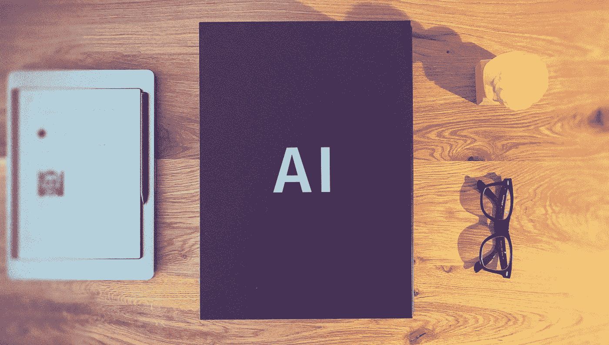

# 窥视黑盒子——信任人工智能——第 2 部分

> 原文：<https://medium.com/codex/peeking-into-the-black-box-trust-in-ai-part-2-a0d3819674d5?source=collection_archive---------8----------------------->

人工智能作为一个黑盒 2021 亨纳欣策

> “我是一个会说话的机器人。你可以相信我。”—阿尔法 5 (Power Rangers，2017)

艾克斯设计 2021 亨纳欣策

在本系列 *的 [*部分，我已经介绍了作为*](/codex/peeking-in-the-black-box-a-design-perspective-on-comprehensible-ai-9dcb58389e3d) [*AiX 设计*](https://hennerhinze.medium.com/the-need-for-aix-design-b38defa4162f) *的重要组成部分的 AI-systems (XAI)的可解释性。在这篇文章中，我想看看可解释性的主要目标之一:对人工智能的信任。**

*欧盟委员会(人工智能高级专家组，2019)发布的高水平“可信人工智能的道德准则”强调了可解释性和信任之间的联系，指出:“可解释性对于建立和维护用户对人工智能系统的信任至关重要。”，这表明不仅信任是必要的，而且理解人工智能系统将使它成为可能。*

*复杂性使得对人工智能驱动的自动化的理解往往不切实际甚至不可能，使用户和其他利益相关者面临不确定性和风险。在脆弱的情况下，信任成为合作的有利因素。事实上，信任是广泛接受人工智能系统的基本要求。*

*因此，在开发人工智能产品时，我们经常会面临这样的问题:“我们如何增加用户对我们人工智能产品的信任？“为了成功地设计人工智能中的信任，我们需要仔细研究这个问题背后的一些假设:可信度是否决定信任？反过来，信任决定使用吗？信任总是可取的吗？*

*通过这篇文章，我想鼓励产品经理、开发人员和设计师对人工智能中的信任采取差异化的观点，而不仅仅是通过了解哪些因素影响信任和用户行为的动态来要求增加信任。*

听听这篇文章 2021 亨纳·欣策

## 本系列的其他文章

*   窥视黑盒子——可理解人工智能的设计视角——第一部分
*   [窥视黑盒子——从可解释的人工智能到解释人工智能——第三部分](/codex/peeking-into-the-black-box-from-explainable-ai-to-explaining-ai-part-3-cc455181373e)

# 是什么让人工智能系统值得信赖？

人类的默认立场是信任——我们信任，除非我们有理由相信信任是不合适的。研究表明，人类对不熟悉的自动决策辅助工具高度信任，期望它们可靠并胜过人类辅助工具(Dzindolet 等人，2002 年和 2003 年)。

这种情况对产品开发人员来说并没有看起来那么有利。实际上，信任度的提高意味着用户会带着很容易违背的期望接近我们的产品——当用户过度补偿他们的失望时，即使运行良好但不完美的系统看起来也不值得信任。不幸的是，信任往往取决于系统的最差行为，而不是其整体性能(Muir 和 Moray，1996)。信任一旦失去，只会慢慢恢复。因此，通过产品的框架和设计来调节用户的期望是抵消这种影响的关键。

为了设计信任，我们必须首先理解信任是建立在什么基础上的。我们需要考虑人工智能系统的哪些属性？人类评估自动化的可信度有三个基本依据:

1.  **性能** —系统在做什么？
    (它的行为、可靠性、可预测性、能力、专长是什么？)
2.  **流程** —系统运行如何？
    (其机制是什么？系统的算法是否合适？它接受反馈来改进吗？)
3.  **目的** —系统为什么存在？
    (其预期用途是什么？它的创造者的动机是仁慈的吗？)

(李和马里，1992 年)

人类在三个基础之间做出推论(例如，透明的过程表明良好的意图。)因此，只建立在其中一个基础上的信任往往是脆弱的(Lee and See，1994)。因此，提供关于性能的测试度量不足以灌输强大的信任，但是工作机制(过程)的透明性和人工智能系统的目的也是必需的。

# 信任会导致使用吗？

让我们重温一下我们最初的问题。“我们如何增加用户对我们人工智能产品的信任？”暗示着信任一个人工智能系统等同于依赖它，但研究证明这一假设是错误的。信任是一种关于人工智能系统可信度的信念，它只调节而不决定用户的行为，即依赖和使用人工智能系统——或不使用。有一些因素可能会恳求用户使用不可信的人工智能系统或不使用可信的系统。

人机信任模型。转载自 Chancey 等人(2017)。

在上图中，Chancey 等人(2017)将风险作为调节因素之一，但还需要考虑其他因素:

*   **注意力**(工作负荷、动机、压力、厌倦)
    高工作负荷，尤其是在时间限制下的多任务处理，迫使用户依赖于原本不被信任的人工智能系统。
*   **备选方案的可用性** 用户可能不会使用可信的人工智能系统，因为有其他选择可用。
*   建立和使用人工智能系统的努力
    当使用人工智能系统的成本超过预期收益时，用户可能会避免使用他们原本信任的人工智能系统。
*   **对独立性能的投资**
    用户可能有个人原因不将任务委托给其他可信任的人工智能系统(例如，声誉、挑战的价值等)。).
*   **感知风险**
    随着感知风险的增加，对自动化辅助设备的依赖往往会超过人类辅助设备(Lyons and Stokes，2012)。
*   自信对自己的能力更有信心的用户倾向于较少依赖一个在其他方面值得信任的人工智能系统。
*   与新手相比，专家倾向于更少地依赖可信的人工智能系统。

这些因素应该牢记在心，尤其是在用户研究期间，因为它们可能不会在实验室环境中生效。在某些情况下，信任人工智能系统的用户可能仍然决定不使用它。

# 信任越多就越好吗？

正如我们所见，信任是一种基于对可信任度的感知的信念。这种感知不需要反映现实。在 Jacovi et al. (2021)中，我们可以找到“有保证的”与“无保证的”信任的概念。这揭示了我们的问题的另一个问题:“我们如何增加用户对我们的人工智能产品的信任？“我们不能不加批判地努力增进信任。作为产品开发人员，我们自然希望防止用户不信任并因此不使用我们的产品。我们也应该帮助用户不要过度信任和滥用我们的人工智能系统。只有适当的信任才能可靠地提高人-人工智能联合的性能，而不是单独的性能(索尔金和伍兹，1985；Wickens 等人，2000 年)。承认我们的系统是不完美的，我们需要引导用户适当地信任它们，以帮助优化他们决策过程的结果。

如果信任没有得到适当的校准，不必要的不信任(信任达不到人工智能系统的能力)可能会导致废弃，这样人工智能支持的好处仍然没有得到利用。同样重要的是，过度信任(超出系统能力的信任)可能导致过度依赖和滥用，使用户和其他利益相关者处于危险之中(Lee 和 Moray，1994；缪尔，1987)。举一个极端的例子:2018 年，一辆处于全自动驾驶模式的优步汽车造成了一场致命的事故，如果安全驾驶员没有过度依赖自动化，并适当注意道路，这场事故可能是可以避免的(BBC，2020)。

在校准信任时，我们要考虑两个因素(Lee and See，2004；见下图):

*   用户的信任在多大程度上反映了人工智能系统的实际能力？
*   用户能在多大程度上信任人工智能系统的组件而不是整个系统？随着人工智能系统能力的变化，用户的信任度变化有多快？

校准、分辨率和自动化能力之间的关系。转载自 Lee 和 See (2004)。

适当信任的挑战也适用于可解释性。对人工智能系统为何可能出错的解释已被证明可增加信任度(如 Dzindolet 等人，2003 年)并反过来增加信赖度，因为它们使系统的过程变得可观察。但这是真实的，与实际表现无关。因此，解释也可能导致过度信任和误用。Eiband (2019)的一项研究表明，从详细的事实解释中获得的信任可以与“placebic”解释相媲美——那些假装解释而实际上不提供信息的解释，比如“我们需要你提供这些数据，因为算法需要它来工作。”因此，解释需要仔细设计，以帮助用户建立知情的，校准的信任。

# 总结想法

作为产品开发人员，我们需要意识到自动化不仅仅是减少用户错误，而是用设计者的错误来代替它们。这就产生了我们需要认真对待的责任。因此，让用户信任我们的产品的第一个必要条件是真诚地努力构建值得信赖的产品——并且我们自己也要表现得值得信赖和负责任。
人类容易出现自动化偏差(Parasuraman 和 Riley，1997)。他们倾向于忽略与他们已经接受为正确的自动化解决方案相矛盾的信息。虽然我们希望我们的用户从人工智能技术的机遇中受益，但与此同时，我们需要让他们能够做出明智的决定，什么时候依赖自动化是明智的，什么时候不是。这不仅需要证明我们的人工智能系统能够工作，还需要对它们的局限性和我们开发它们的意图保持透明。

*跟我上* [*中*](/@merzhase) *！不要错过本系列的下一篇文章，在这篇文章中，我将看看如何设计对人工智能有意义的解释。*

## 然后

[窥视黑盒子——从可解释的人工智能到解释人工智能——第三部分](/codex/peeking-into-the-black-box-from-explainable-ai-to-explaining-ai-part-3-cc455181373e)

亨纳拥有设计和计算机科学的背景，喜欢思考和推测人工智能的未来和新兴技术。他也创造数码产品。

*跟随上* [*中等*](/@merzhase) *！
连接上*[*LinkedIn*](https://www.linkedin.com/in/henner-hinze)*！* [*加入介质！*](https://hennerhinze.medium.com/membership)

## 相关故事

*   第三部分:窥视黑盒子——从可解释的人工智能到解释人工智能
*   [第一部分:窥视黑盒子——可理解人工智能的设计视角](/codex/peeking-in-the-black-box-a-design-perspective-on-comprehensible-ai-9dcb58389e3d)
*   [对 AiX 设计的需求](https://hennerhinze.medium.com/the-need-for-aix-design-b38defa4162f?source=your_stories_page-------------------------------------)
*   [回复朦胧。再试一次。](https://hennerhinze.medium.com/reply-hazy-try-again-3149662282b3)

## 参考

1.  英国广播公司(2020 年)。BBC 新闻[在线]，https://www.bbc.com/news/technology-54175359，BBC，优步自动驾驶操作者因致命车祸被起诉。(访问日期:2021 年 12 月 2 日)
2.  钱西·E·T、布利斯·J·P、雅马尼·Y、汉德利·H·A·H(2017)。《信任和依从-依赖范式:风险、误差偏差和可靠性对信任和依赖的影响》，人类因素，第 59 卷，第 3 期，第 333-345 页，人类因素和人类工程学学会。
3.  Dzindolet M T，Peterson S A，Pomranky R A，Pierce L G，Beck H P (2003)，“信任在自动化依赖中的作用”，《国际人机研究杂志》，第 58 期，第 697-718 页，爱思唯尔科学有限公司
4.  dzindolet M . T .，Pierce L .，Beck H . P .，Dawe L .(2002 年)《视觉检测任务中人工和自动辅助设备的感知效用》，人类因素，第 44 卷，第 79-94 页，人类因素和人类工程学学会。
5.  Eiband M，Buschek D，Kremer A，Hussmann H (2019)，“Placebic 解释对智能系统中信任的影响”，CHI'19 扩展摘要，计算机械协会(ACM)。
6.  Jacovi A，Marasović A，Miller T，Goldberg Y (2021)，“形式化人工智能中的信任:人工智能中人类信任的先决条件、原因和目标”，ACM 公平、问责和透明会议 21 (FAccT '21)，计算机械协会(ACM)。
7.  人工智能高级专家组(2019)。“可信人工智能的道德准则”，欧洲委员会。
8.  李 J，马里 N (1992)。“人机系统中的信任、控制策略和功能分配”，人类工程学，第 35 卷，第 10 期，第 1243-270 页，泰勒和弗朗西斯有限公司
9.  李 J，马里 N (1994)。信任，自信和操作员'自动化适应'，*人机研究国际期刊*，iss 40，第 153-184 页，学术出版社有限公司
10.  李博士，见 K . A(2004 年)。《对自动化的信任:为适当的信赖而设计》，人类因素，第 46 卷，第 1 期，第 50-80 页，人类因素和人类工程学学会。
11.  莱昂斯 J . B .，斯托克斯 C .(2012 年)。《自动化环境中人与人的依赖》，《人的因素》，第 54 卷，第 1 期，第 112-121 页，人的因素和人类工程学学会。
12.  缪尔博姆(1987 年)。“人类和机器之间的信任，以及决策辅助工具的设计”，《人机研究国际期刊》(继续作为《人机研究国际期刊》)，第 7 卷，ISS 5–6，第 527–539 页，爱思唯尔有限公司
13.  Muir B . M .，Moray N .(1996 年)，‘对自动化的信任。第二部分。“过程控制模拟中信任和人为干预的实验研究”，人类工程学，第 39 卷，第 3 期，第 429-460 页，泰勒和弗朗西斯有限公司
14.  Parasuraman R，Riley V (1997)，‘人类和自动化:使用、误用、废弃、滥用’，人类因素，第 39 卷，第 2 期，第 230-253 页，人类因素和人类工程学学会。
15.  索尔金博士，伍兹博士(1985 年)。《带人工监视器的系统:信号检测分析》，人机交互，第 1 卷，第 49-75 页，劳伦斯·厄尔鲍姆联合公司。
16.  Wickens C D，Gempler K，Morphew M E (2000 年)。《飞机交通回避中预测器显示的工作负荷和可靠性》，交通人为因素，第 2 卷，iss 2，第 99-126 页，泰勒和弗朗西斯有限公司

# 进一步阅读

1.  ADAMS B . D .(2005)，“信任与信心”，加拿大国防研究与发展部(DRDC)。
2.  Alarcon G M，Gibson A M，Jessup S A (2020)。“人-机器人信任的性能、过程和目的因素中的信任修复”，2020 年 IEEE 人机系统国际会议(ICHMS)，第 1–6 页，IEEE。
3.  Antifakos S，Kern N，Schiele B，Schwaninger A (2005 年)。“通过显示系统可信度来提高上下文感知系统的可信度”，移动 HCI'05，计算机器协会(ACM)。
4.  科克尔伯格(2011 年)。“我们能信任机器人吗？”，伦理和信息技术，14 (2012)，第 53-60 页，斯普林格自然。
5.  德克鲁兹 J (2020)。信任与不信任，信任与哲学手册，第一版，第三章。
6.  Ess C M (2020)。信任和信息与通信技术，信任与哲学手册，第一版，第 31 章。
7.  弗罗吉·C·K、德夫林·S、帕克·R、布朗·N·L、西布利·C、科因·J·T(2021)。近乎完美的自动化:调查性能，信任和视觉注意力，人的因素，人的因素和人类工程学协会。
8.  博姆·戴维斯(1998 年)。“先进出行者信息系统的年龄和拥堵信息准确性对用户信任和合规性的影响”，交通研究记录:交通研究委员会杂志，第 1621 卷，iss 1，第 43-49 页，美国国家科学院、工程和医学-交通研究委员会。
9.  吉勒 F，乔宾 A，伊恩卡 M (2020)。“当我们谈论信任时，我们谈论什么:医疗保健中人工智能的信任理论”，基于智能的医学，Elsevier B.V
10.  戈德堡科学中心(2020 年)。信任与信赖，信任与哲学手册，第一版，第八章。
11.  格罗津斯基 F，米勒 K，沃尔夫 M J (2020)。人工代理的信任，信任与哲学手册，第一版，第 23 章。
12.  hoff K . A，Bashir M (2015)，“自动化中的信任:影响信任的因素的整合经验证据”，《人的因素》，第 57 卷，第 3 期，第 407-434 页，人的因素和人类工程学协会。
13.  姜 H，金 B，管 M Y (2018)。“信任或不信任分类器”，第 32 届神经信息处理系统会议，神经信息处理系统。
14.  Kunkel J，Donkers T，Michael L，Brabu C-M，Ziegler J (2019)。我来解释:个人和非个人的解释对推荐系统信任的影响'，the 2019 CHI 计算系统中人的因素会议录，计算机械协会(ACM)。
15.  Mayer R C，Davis J H，Schoorman F D (1995)，“组织信任的整合模型”，《管理学会评论》，第 20 卷，第 3 期，第 709-734 页，管理学会。
16.  缪尔博姆(1994 年)。《自动化中的信任:第一部分:自动化系统中信任和人类干预研究的理论问题》，人类工程学，第 37 卷，第 11 期，第 1905-1922 页，泰勒和弗朗西斯有限公司
17.  里维斯 B，纳斯 C (1996 年)。《媒体等式:人们如何像对待真实的人和地方一样对待计算机、电视和新媒体》，剑桥大学出版社。
18.  苏林斯 J . P .(2020)。对机器人的信任，信任和哲学手册，第一版，第 24 章。
19.  特罗沙尼 I，希尔 S R，谢尔曼 C，阿瑟 D (2020)。我们信任人工智能吗？拟人化和智能的作用，计算机信息系统杂志，第 61 卷，iss 5，第 481-491 页，泰勒和弗朗西斯在线。
20.  Tschopp M (2020)，‘人工智能和信任:停止询问如何增加对人工智能的信任’，scip AG 博客[在线]，可访问:[https://www.scip.ch/en/?labs.20200220](https://www.scip.ch/en/?labs.20200220)，scip。(访问日期:2021 年 11 月 1 日)
21.  王 N，Pynadath D V 罗维拉 E，巴恩斯 M J，希尔 S G (2018)，‘是我的长相？还是我说了什么？解释、具体化和期望对人-机器人团队中信任和绩效的影响，说服技术:第 13 届国际会议，第 56-69 页，施普林格。
22.  威林加 M (2020)。“算法时要考虑什么”，FAT *“20:2020 年公平、问责和透明会议论文集，第 1-18 页，计算机械协会(ACM)。
23.  尹 M，沃恩 J W，瓦拉赫 H (2019)。理解机器学习模型中准确性对信任的影响'，the 2019 CHI 计算系统中人的因素会议录，计算机械协会(ACM)。
24.  张 Y，李亚青，贝拉米 R K E (2020)。“信任和解释对人工智能辅助决策中信任校准准确性的影响”，FAT *“20:2020 年公平、问责和透明会议论文集，第 295-305 页，计算机械协会(ACM)。