# 基于 AWS Lambda 的 API 的性能调优(检测巴黎的 5/5 锁定自行车站)

> 原文：<https://medium.com/codex/performance-tuning-for-an-aws-lambda-based-api-b8b49b2d07db?source=collection_archive---------1----------------------->

亚采克·迪拉格在 [Unsplash](https://unsplash.com?utm_source=medium&utm_medium=referral) 上的照片

> 这一系列文章是关于我在学习如何使用 AWS 无服务器堆栈的同时，花了太多时间试图解决一个小问题(检测巴黎上锁的自行车站，见[第一部分](/codex/detecting-locked-bicycle-stations-an-aws-serverless-story-part-1-95dcdb477649))。要查找其他文章，请跳到页面底部。

在第 4 部分的[中，我为我的](/codex/creating-a-serverless-api-and-hosting-a-frontend-with-s3-b50e61a8f707) [www.velinfo.fr](http://www.velinfo.fr) web 应用程序创建了前端和 API，该应用程序计算并显示 1500 个巴黎自行车站点的状态。

一切都很好，但网站相当慢。静态内容的加载需要一些时间，API 的响应速度也不是很快。我该如何改进呢？

# 使用 CloudFront 进行前端缓存

当您想要更快地提供静态内容(如网站的静态文件)时，一个简单的解决方案是使用 CDN 或[内容交付网络](https://en.wikipedia.org/wiki/Content_delivery_network)。这是一个由服务器组成的分布式网络，将用来缓存你的内容(从简单的文件到视频)，尽可能地靠近你的用户。更准确地说，CDN 将位于您的应用程序的“前面”，这意味着客户端将调用它而不是您的站点。如果 CDN 在缓存中没有内容，它将调用您的站点。

有很多独立的 cdn 可以选择，从 Akamai 到 Cloudflare。但是，由于 AWS 有自己的 CDN ( [CloudFront](https://aws.amazon.com/cloudfront) )，我就用这个吧。

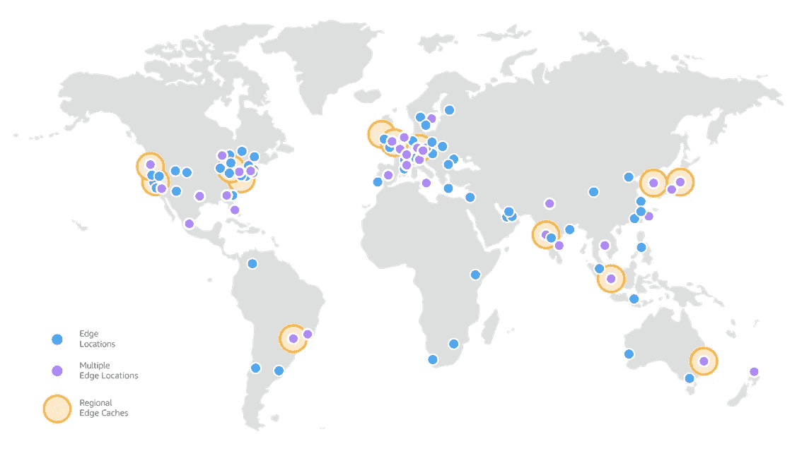

云锋位置

在 CloudFormation 模板中设置 CloudFront 很简单。您需要定义一个“分布”(CloudFront 将如何缓存以及缓存什么)，并定义:

*   您想要缓存的 HTTP 方法(GET and HEAD for me)
*   “来源”是什么(CDN 代理的内容的来源，在我们的例子中是网站的 S3 桶)
*   什么是缓存行为(内容应该缓存多长时间，在丢失内容的情况下会发生什么……)
*   要使用的[价格等级](https://docs.aws.amazon.com/AmazonCloudFront/latest/DeveloperGuide/PriceClass.html)是什么(对应于要使用的位置数量)

并且不要忘记更新“www.velinfo.fr”的 CNAME DNS 记录，以便它指向分布而不是 S3 桶。

所有这些都可以通过 AWS web 控制台完成，但至于我的应用程序的其余部分，我将直接在我的 CloudFormation 文件中定义它。

使用 CloudFormation 建立的 CloudFront 发行版

## 性能改进

为了评估性能提升，我将使用[key dn 的性能测试](https://tools.keycdn.com/performance)并重点关注欧洲城市。最重要的指标是 TTFB(到达第一个字节的时间)，它表示呼叫被应答之前的等待时间。

改进是显而易见的:从大约 55 毫秒到大约 25 毫秒。不错！

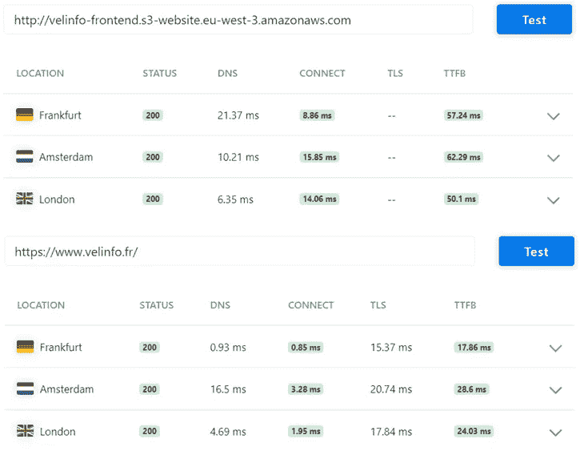

> **注意**:现在 CloudFront 已经建立，我不再需要公开访问网站 S3·巴特。只有 CloudFront 发行版可以访问它。

## 这要花多少钱？

CloudFront [定价](https://aws.amazon.com/cloudfront/pricing/)基于三个轴:

*   从 CloudFront 传输到互联网的数据量:0.085 美元/GB(流量越大越便宜)
*   **从原点传输到 CloudFront 的数据量**:0.020 美元/GB
*   **HTTP(S)调用的数量**:0.0120 美元/ 10.000 HTTPS 调用

目前，加载主页执行大约 10 个调用到我的前端域，大约 300KB。对源的调用次数可以忽略不计，因为内容只会在部署后更改，所以它可以在缓存中保留很长时间。

实际上，我不期望超过几千个用户。假设每天有 10.000 个用户，那么我每天会有大约 3 GB 的传出流量和大约 100.000 个呼叫，因此**每天大约 0.375 美元**。这并没有考虑到大部分静态内容将被缓存在客户端浏览器中的事实。

# 用 X 射线分析 Lambda 性能

我的站点的静态内容加载得更快了，但是我的 API 还是太慢了。

例如， *GET /stations* 端点，它返回每个自行车站点的当前状态、状况和特征，需要 12 秒以上才能完成！

我已经确保我的 DynamoDb 调用是并行进行的，所以我不确定还能做些什么来进一步改进它。幸运的是，我可以使用 AWS [X 射线](https://aws.amazon.com/xray/)更好地了解我的性能瓶颈在哪里。

X-Ray 是一个跟踪应用程序中每个调用的系统，有助于识别性能问题。要在 NodeJs Lambda 函数上使用它，您需要为您的函数启用它(例如，在 web 控制台中)，导入`aws-xray-sdk`包并使用`AWSXRay.CapureAWS()`方法包装对函数依赖项的调用(在我的例子中是对 DynamoDb 的调用)。

然后，在 X 射线 web 控制台中，您将能够看到函数执行过程中每个调用的详细轨迹:

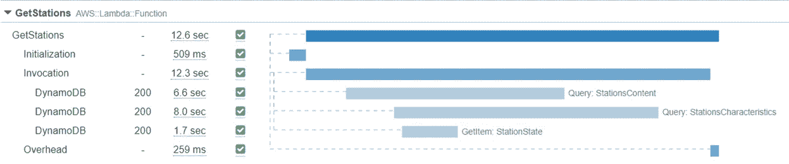

GetStations 函数调用的 X 射线跟踪。

在这里，我可以清楚地看到我的三个 DynamoDb 调用是正确地并行进行的，但是最长的一个调用持续了 8 秒钟！

对于一个简单的读取操作来说，这似乎非常慢，那么 DynamoDb 有什么问题吗？嗯，这 8 秒钟不仅代表数据库端花费的时间，还代表函数端整理/解组数据花费的时间(DynamoDb 将对象存储为类型化的 JSON，需要在使用前进行处理)。并且这些类型的操作是 CPU 密集型的。

我们真正看到的是标准 Lambda 函数的 CPU 限制。

## 提高 Lambda 函数的 CPU 性能

默认情况下，Lambda 函数只使用 128MB 的内存，并且可以访问一小部分 vCPU 内核。增加内存很容易(通过在 SAM/CloudFormation 模板中设置`MemorySize`参数，最大可达 10240MB)，但是没有办法分配更多的 CPU。这是因为 CPU 能力会随着分配的内存自动扩展。

简单来说:**要有更多的 CPU 能力，你需要更多的内存**。

更具体地说，[您在 1769MB 标记处达到了一个完整的 vCPU 内核](https://docs.aws.amazon.com/lambda/latest/dg/configuration-function-common.html#configuration-memory-console)。一旦你分配了更多的内存，你将开始拥有不止一个线程，但是单线程的性能已经达到了 1769MB。

因此，让我们将 GetStations Lambda 函数设置为 1769MB，看看我们在全内核的情况下会获得什么样的性能提升。

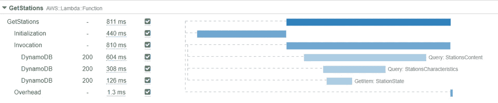

增加内存达到一个完整的 vCPU 线程后的 x 射线跟踪。

从 12.6 秒降到 811 毫秒，还不错😊。

费用呢？内存的增加成比例地影响每毫秒的成本。这意味着我的 1769MB Lambda 的运行成本是标准 128MB Lambda 的 14 倍。但它的运行速度也快了 15 倍。因此，在我的例子中，增加内存(和性能)更便宜！

对其他端点进行同样的优化可以获得类似的性能提升。我还可以为作为内部检测系统一部分的 Lambda 函数增加*内存大小*，但是我没有性能限制，因为它们只是每分钟运行一次。

# 缓存 API 的多种方法

既然服务于端点的每个 Lambda 函数都已优化，让我们做一个简单的性能测试。我会连续调用 50 次其中一个最重的端点(*GET/prediction/by-station*)。

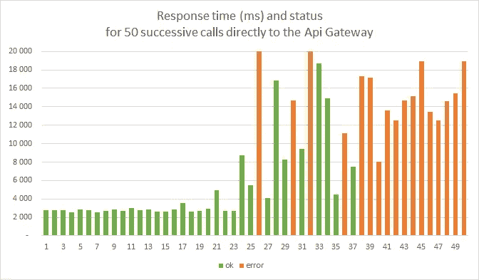

对预测/按站端点的连续调用的响应时间。

对于前 20 次呼叫，端点表现一致。大约需要 3 秒钟完成。然后响应时间开始增加，一些调用失败，最后 10 个调用完全失败。

发生了什么事？嗯，我们刚刚检查了 DynamoDb 表的读取容量，所以我们的读取操作受到了限制。更糟糕的是，当端点失败时，内部检测管道的一些功能也失败了，因为它们从同一个表中读取数据，并且也被抑制了。

> Y 你会在第二部分的[中找到更多关于 DynamoDb RCU(读容量单位)和 WCU(写容量单位)的细节。](https://ouvreboite.medium.com/detecting-locked-bicycle-stations-an-aws-serverless-story-part-2-b1967d639699)

换句话说:如果在我的 API 上有太多的调用，API 就会失败，更糟糕的是，它可能会破坏内部检测管道。

我能做什么？

增加所有相关表的读取容量将是最简单的解决方案，但这可能很快变得代价高昂，因为我已经达到了自由层的极限。这只会推迟问题的解决，只是在失败前需要更多的呼叫。

我还可以创建一组新的表，这些表只能由管道函数写入，由 API 函数读取。它们将作为隔离层。但是，要让这些表支持大量的呼叫，仍然需要更多的 RCU，这是我无法承受的。

与其试图增加我的表的吞吐量，也许我应该专注于寻找一种方法来缓存我的数据，这样我的表就更少被调用。

## 命中率

评估任何缓存解决方案的有用性和成本的一个重要指标是命中率。它是缓存能够应答的呼叫数与总呼叫数的比率。命中率越大，缓存就越有用。

显然，命中率取决于我的 API 的设计和用例。例如，返回为调用者定制的数据的端点会导致低命中率，因为给定的响应只能为单个用户缓存。

幸运的是，我的 API 非常简单，只包含一些端点，没有参数，独立于用户，内容大约每 60 秒更新一次。所以我可以期待一个非常好的命中率。

## 电动加速器

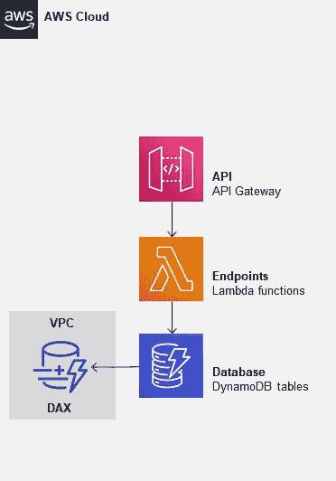

[DynamoDb 加速器](https://aws.amazon.com/dynamodb/dax/)(或 DAX)是 DynamoDb 的托管缓存。

更具体地说，它是一个[通读/直写](https://aws.amazon.com/blogs/database/amazon-dynamodb-accelerator-dax-a-read-throughwrite-through-cache-for-dynamodb/)缓存。这将极大地提高它缓存的 DynamoDb 表的读取性能，并且 DAX 响应的每个读取操作都不会消耗表中的任何读取容量。

在内部，它由一个或多个缓存节点的集群组成。可以把这些节点想象成 AWS 以您的名义创建的小型 EC2 实例。至于任何 EC2 实例，它们需要设置在子网中(VPC 或虚拟私有云)。您需要为这些节点的大小和数量付费。最小的节点起价约为每月 30 美元。

✅Fixed 成本，将有利于所有功能，将提高所有调用的性能。

❌Requires 更新数据层，需要建立一个 VPC，不会减少 Lambda 或网关调用的数量，基础成本对于一个宠物项目来说是昂贵的。

## 弹性缓存

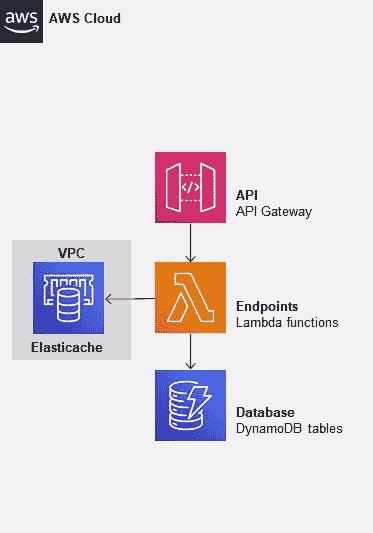

[elastic cache](https://aws.amazon.com/elasticache)是 AWS 管理的分布式缓存。缓存技术可以是 Memcached 或 Redis，这取决于您的需要。

Lamba 可以连接到 Elasticache 集群来获取数据，剩下的实现就交给我了。我可以简单地将它用作副缓存，或者更新管道的函数，直接写入缓存，让 API 从缓存中读取数据，而不是 DynamoDb 表。

至于 DAX，Elasticache 内部由一组托管 EC2 实例组成，需要创建一个 VPC。价格取决于节点的数量和大小，最小的节点大约每月 10 美元。但是，根据缓存的实现方式，您可能希望至少有两个节点来确保高可用性。

✅Fixed 成本，缓存逻辑取决于你。

❌Requires 重写应用程序的一部分来实现缓存逻辑，需要设置一个 VPC，不会减少 Lambda 或网关调用的数量。

## 使用 Lambda 实例自己的内存

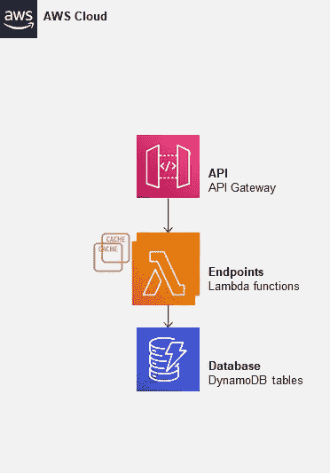

当一个调用到达 API 网关时，相应的 Lambda 的一个实例开始应答它。

但是启动 Lambda 需要一些时间(这是一个“冷启动”)。因此，为了最大限度地减少这种情况，Lambda 会在调用结束后保持实例存活几分钟，以防再次调用相同的函数。

我们可以利用这一点，直接在 Lambda 的实例中缓存一些数据(例如，在事件处理函数之外分配一个变量)。下次调用这个 Lambda 时，如果重用同一个实例，数据仍然会在那里。

这种解决方案有两个主要限制:

*   **可预测性**:我们无法控制实例何时被释放或保留，因此无法预测这种缓存解决方案的命中率
*   **并发**:当一个 Lambda 函数需要启动时，如果对应的实例存在但当前正在使用中(比如回答并发调用)，Lambda 别无选择，只能创建一个新的实例。这意味着在高负载情况下“命中率”会更差，因为会创建越来越多的新实例…

✅Free！

❌Only 边际改进，不会在负载下提供任何保证，不会减少 Lambda 或网关调用的数量。

## API 网关的缓存

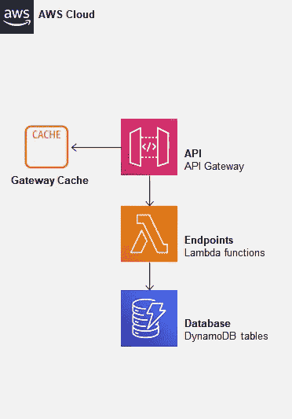

[API 网关](https://aws.amazon.com/api-gateway/)提供了缓存功能，可以缓存它返回的数据。

与 DAX 或 Elasticache 相反，不需要设置 VPC，因为缓存节点是由网关“拥有”的。事实上，您不必选择节点的数量或类型，只需选择缓存所需的总内存，一切都由网关处理。

设置相当简单:您只需要选择一个内存大小、一个保持期，并标记您希望包含在缓存中的端点。

> ApiGateway 有两种风格:RestAPI 和 HttpApi。RestApi 提供了更多功能。HttpApi 的性能更高，价格便宜大约 3 倍。只有 RestApi 支持缓存。

定价基于这一内存大小，最低 0.5GB，每月约 15 美元。

与前一个解决方案相比，这个解决方案提供了一个额外的优势:由于缓存“更早”，每次它可以应答一个调用，不需要调用 Lambda 函数。

✅Fixed 成本，减少 Lambda 调用次数，设置简单

❌Requires 使用比 HttpApi 更贵的 RestApi 口味，固定成本适中

## 云锋

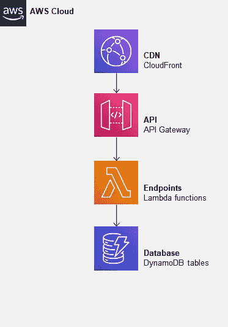

至于静态网站内容，也可以使用 CDN(这里是 CloudFront)来缓存数据。事实上，从 CloudFront 的角度来看，缓存一个 API 或一个网站大多是一样的。

使用 CloudFront 还有其他好处:

*   数据缓存在离用户更近的地方(即使这对于只涉及单个城市的服务来说不是很有用)
*   Cloudfront 可以处理一些其他特性，比如内容压缩

设置发行版与我刚才对网站静态内容所做的类似，但有一些例外:

*   TTL 会更短(60 秒)
*   我需要转发 CORS 需要的标题

这次我将定义一个合适的缓存策略，而不是使用内联参数:

[定价](https://aws.amazon.com/cloudfront/pricing/)更复杂，因为它取决于通话的数量和规模。但是，这就是事情变得有趣的地方:**由 CloudFront 应答的呼叫比由 ApiGateway 应答的呼叫便宜**:

*   **通话成本** : HttpApi 每 10.000 美元 0.035 美元，CloudFront 每 10.000 美元 0.012 美元
*   **数据传输成本** : HttpApi 每 GB 0.09 美元，CloudFront 每 GB 0.085 美元

显然，这只是因为我的命中率会很高，而且因为 CloudFront 不必经常调用底层 API 网关(这会增加成本)。

✅Cost 节约，成本随使用量而增加

❌Setup 是乏味的，成本随使用情况而变化

## 获胜者是…

仅从成本角度来看，CloudFront 是明显的赢家。设置不需要重写我的函数，这将使设置变得简单。

如果我的 API 更复杂(这会产生更低的命中率)，我可能会使用 DAX，因为它会提供最健壮、最简单的解决方案。

**获胜者:👑云锋👑**

那么，它的效果如何呢？

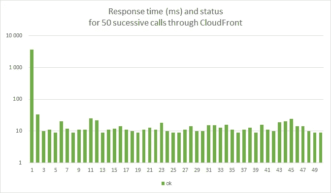

小心，刻度是对数的

和以前一样，第一次通话大约需要 3 秒钟才能结束。但是后面的通话都只有~10ms。我认为我们可以说这是成功的😊

# 结论

即使 AWS 希望您认为 Lambda 将允许您*运行代码，而无需考虑服务器或集群*，但一旦您必须提高性能，这显然会变得更加复杂。

但我认为这是一件好事:这意味着即使在无服务器堆栈的墙内，当我面临问题时，我也不会局限于单一的解决方案。我可以利用几个工具，甚至可以依赖像 Elasticache 这样的“非无服务器”工具。

对于本文的特定主题(性能)和本系列中的其他主题来说都是如此。

我开始做这个项目已经一年多了。它仍然有点不可靠，前端设计是基本的，但我实现了我真正想做的事情:理解这个“无服务器”的东西是什么，更适应 AWS，并构建一个“真正的”应用程序。

我希望你读我的时候和我写这篇文章的时候一样开心！如果你想看一些乱七八糟的代码，可以在 Github 上找到源码:【https://github.com/ouvreboite/velinfo

节约成本是我的主要目标，这将使我不用考虑太多钱就能在线维护应用程序。我也很高兴地告诉大家，Velib 的团队似乎致力于改善他们的服务。希望我的应用程序很快就会过时！

至于我，我选择了一个更激进的解决方案:我买了自己的自行车。🚴

*   第 1 部分:为原型选择 AWS 无服务器堆栈
*   第 2 部分:无服务器应用的主干:Lambda 函数和 DynamoDb 表
*   [第 3 部分](/codex/detecting-locked-bicycle-stations-an-aws-serverless-story-part-3-d532318dfca7):用 Lambda 函数和 DynamoDb 流实现实时检测算法
*   第 4 部分:创建一个无服务器的 API，用 S3 托管一个前端
*   [第 5 部分](/codex/performance-tuning-for-an-aws-lambda-based-api-b8b49b2d07db):基于 Lambda 的 API 的性能调优