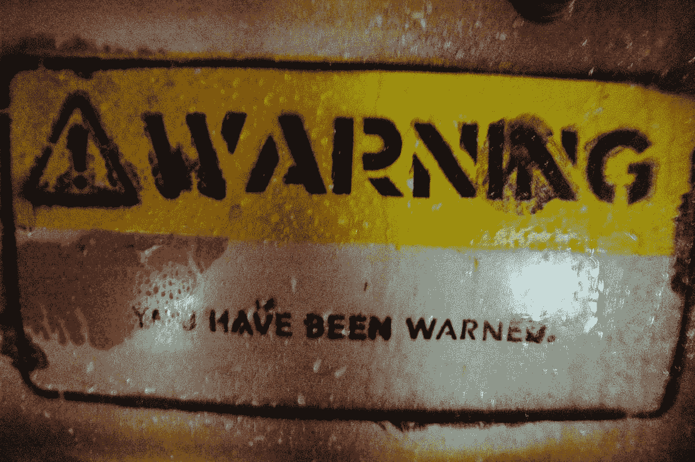

# Perl 警告和 warn 函数

> 原文：<https://medium.com/codex/perl-warnings-and-the-warn-function-67e48b0f94ad?source=collection_archive---------11----------------------->

[*“警告！”*](https://www.flickr.com/photos/38834306@N00/2049428733) *by* [*约翰·古德里奇*](https://www.flickr.com/photos/38834306@N00) *是*[*CC BY-NC-SA 2.0*](https://creativecommons.org/licenses/by-nc-sa/2.0/?ref=openverse&atype=html)

我上周在传递[时提到](https://phoenixtrap.com/2021/12/28/avoid-yoda-conditions-in-perl-you-should/)Perl 的下一个主要版本 v5.36 将默认启用`[warnings](https://perldoc.perl.org/warnings)`用于选择 `[use v5.35;](https://metacpan.org/release/NEILB/perl-5.35.7/view/pod/perl5353delta.pod#Core-Enhancements)` [或更高](https://metacpan.org/release/NEILB/perl-5.35.7/view/pod/perl5353delta.pod#Core-Enhancements)的代码。在纪念 Perl 的第 34 个生日的前一周，我没有提到自从 2000 年引入以来，警告系统已经变得越来越精细了。fel low Perl 博客 ger 和 [CPAN 作家 Tom Wyant](https://metacpan.org/author/WYANT) 在过去的几年里一直在为他最喜欢的博客写日志…