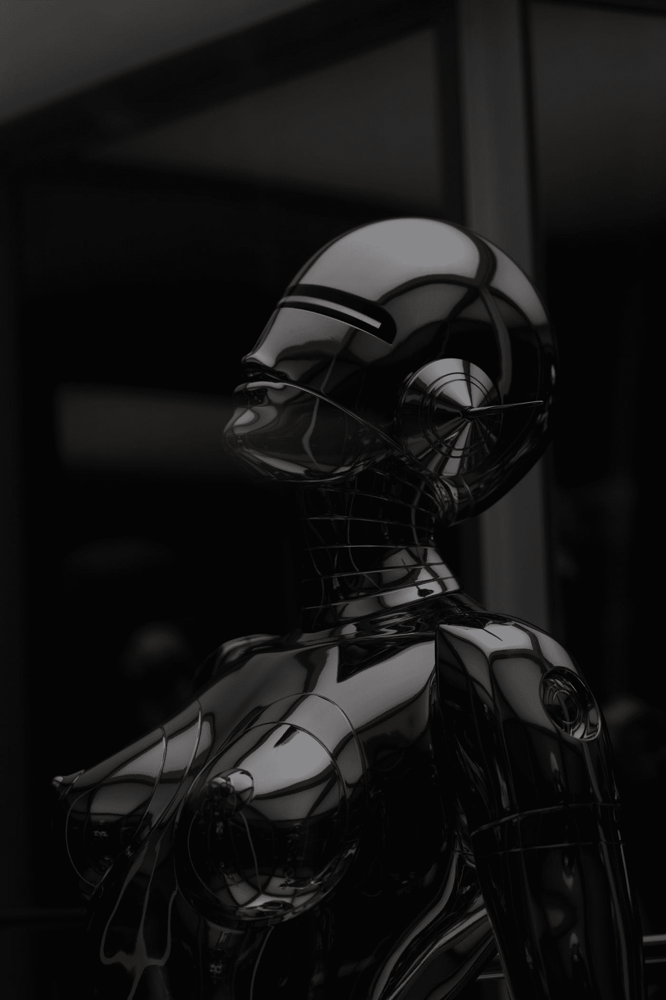

# 拟人化人工智能:下一个前沿

> 原文：<https://medium.com/codex/personify-the-a-i-the-next-frontier-bce3d5286ff7?source=collection_archive---------14----------------------->

## 人工智能生成的内容所缺乏的是随意咬指甲的能力。

照片由[许](https://unsplash.com/@mrsunburnt?utm_source=medium&utm_medium=referral)在[上挥洒](https://unsplash.com?utm_source=medium&utm_medium=referral)

当我第一次听说项目 [DALL-E](https://openai.com/blog/dall-e/) 时，我感到很困惑，这是一个神经网络，我们只能通过文本提示来生成图像。