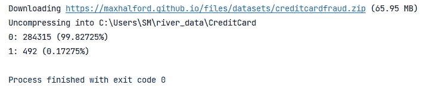
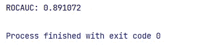
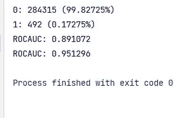

# 用 River 进行增量式 ML 学习的哲学

> 原文：<https://medium.com/codex/philosophy-of-incremental-ml-learning-with-river-f309050ccbc?source=collection_archive---------6----------------------->

对运动中的数据执行机器学习


你是否厌倦了重新训练模型，而是想建立动态模型，然后在线机器学习(因此河！)可能就是你要找的。当目标是一次学习和预测一个实例时，这里有一些信息。 **River 比 PyTorch、Tensorflow 和 scikit-learn 快一个数量级。**

## **ML 传统方法**

机器学习通常是在批量设置中完成的，即一个模型一次性适合一个数据集。这导致静态模型必须被重新训练，以便从新数据中学习。

## **传统 ML 的一些弊端**

在许多情况下，这既不优雅也没有效率，而且通常会招致相当数量的技术债务。事实上，如果您正在使用批处理模型，那么您需要考虑维护一个训练集、监控实时性能、模型再训练等。

## 冷增量河流法

使用 River，你可以不断地从数据流中学习。这意味着模型一次处理一个观察值，因此可以动态更新。这允许从不适合主存储器的大规模数据集学习。

在流设置中，使用*运行统计数据*进行特征缩放，这是一种允许均值和标准差增量更新的数据结构。

**对于增量式训练模型，常见的学习算法是** [***随机梯度下降***](https://towardsdatascience.com/stochastic-gradient-descent-clearly-explained-53d239905d31) **(SGD)。** SGD 是一种用于训练神经网络的流行算法，有多种变体。它还可以用于训练其他模型，如线性回归。SGD 的核心思想是在每个训练步骤中，模型参数权重在梯度的相反方向上进行调整，该梯度是使用该步骤中的模型预测误差来计算的。

## 用例

River-approach 在新数据不断到达的情况下集成得很好。它在许多用例中表现出色，如时间序列预测、垃圾邮件过滤、推荐系统、CTR 预测和物联网应用。

以下是使用 River(以及一般的在线机器学习)的一些好处:

*   **增量**:模型可以实时更新自己。
*   **自适应**:车型可以适应[概念漂移](https://www.wikiwand.com/en/Concept_drift)。
*   **生产就绪**:处理数据流使得在模型开发期间复制生产场景变得简单。
*   **高效**:模特不需要重新培训，需要很少的计算能力，这[降低了她们的碳足迹](https://arxiv.org/abs/1907.10597)
*   **快:**当目标是一次学习和预测一个实例时，River 比 PyTorch、Tensorflow 和 scikit-learn 快一个数量级。

## **河流解释**

学习和预测是所有预测模型的两个主要功能。learn one 方法用于学习(更新模型的内部状态)。`*predict one*`(分类、回归和聚类)`*predict proba one*` (分类)和`*score one*`(异常检测)算法根据学习目标提供预测。值得注意的是，river 包含了 transformers，这是使用 transform one 方法转换输入的有状态对象。

要安装 river，您可以使用 pip，如下所示

```
pip install river
```

River like creme 有一个类似于 Scikit-learn 的 API，也称为用于流或在线机器学习的 Scikit-learn。它支持几乎所有不同的最大似然估计器和转换器，但设计用于流数据。

简单的事实是，我们以流的形式获取数据，这意味着我们不能像在传统的批处理设置中那样做很多事情。

## 缩放比例

例如，假设我们想要缩放数据，使其均值为 0，方差为 1，就像我们之前做的那样。为此，我们只需从每个值中减去每个特征的平均值，然后将结果除以特征的标准偏差。问题是，在实际检查所有数据之前，我们不可能知道平均值和标准差的值！一种继续进行的方法是对数据进行第一次传递以计算必要的值，然后在第二次传递期间缩放这些值。问题是，这违背了我们的目的，即通过只看一次数据来学习。虽然这可能看起来相当严格，但它会带来相当大的好处。

我们在`river`中进行**特征缩放**的方式包括计算*运行统计*(也称为*移动统计*)。其思想是，我们使用一种数据结构来估计平均值，并在获得一个值时进行自我更新。这同样适用于**方差(以及标准偏差)。现在的想法是，我们可以计算每个特性的运行统计数据，并在它们出现时进行缩放。使用`river`的方法是使用`preprocessing`模块中的`StandardScaler`类。**

我们将使用的一些方法如下:

*   `naive_bayes` -这是我们将用来建立文本分类模型的算法。
*   `preprocessing` -它将用于处理我们用来训练模型的数据集。
*   `metrics` -用于计算我们模型的准确度分数。
*   `stream` -它用于模拟我们的数据集成为流数据。
*   `anomaly` -用于检测模型中的错误和异常。
*   `compose` -用于构建流水线，实现机器学习工作流程的自动化。

既然我们正在缩放数据，我们可以开始做一些实际的机器学习。

## 示例 1 快速入门

举个简单的例子，我们将训练一个逻辑回归来对[网站钓鱼数据集](https://archive.ics.uci.edu/ml/datasets/Website+Phishing)进行分类。这是数据集中的第一个观察结果。

```
>>> from pprint import pprint
>>> from river import datasets>>> dataset = datasets.Phishing()>>> for x, y in dataset:
...     pprint(x)
...     print(y)
...     break
{'age_of_domain': 1,
 'anchor_from_other_domain': 0.0,
 'empty_server_form_handler': 0.0,
 'https': 0.0,
 'ip_in_url': 1,
 'is_popular': 0.5,
 'long_url': 1.0,
 'popup_window': 0.0,
 'request_from_other_domain': 0.0}
True
```

现在，让我们以流的方式在数据集上运行模型。我们依次交错预测和模型更新。与此同时，我们更新了一个性能指标，以查看模型的表现。

```
>>> from river import compose
>>> from river import linear_model
>>> from river import metrics
>>> from river import preprocessing>>> model = compose.Pipeline(
...     preprocessing.StandardScaler(),
...     linear_model.LogisticRegression()
... )>>> metric = metrics.Accuracy()>>> for x, y in dataset:
...     y_pred = model.predict_one(x)      # make a prediction
...     metric = metric.update(y, y_pred)  # update the metric
...     model = model.learn_one(x, y)      # make the model learn>>> metric
Accuracy: 89.20%
```

## 示例 2 不平衡的数据集(信用卡欺诈)

在机器学习中，处理不平衡数据集是很常见的。在针对欺诈检测和垃圾邮件分类等任务的在线学习中尤其如此。在这两种情况下，这是二进制分类问题，通常 0 比 1 多得多，这通常会妨碍我们扔给它们的分类器的性能。

例如，我们将使用 river 中可用的信用卡数据集。我们将首先使用一个集合。计数器来计算 0 和 1 的数量，以了解阶级平衡。

```
import collections
from river import datasets

X_y = datasets.CreditCard()

counts = collections.Counter(y for _, y in X_y)

for c, count in counts.items():
    print(f'{c}: {count} ({count / sum(counts.values()):.5%})')
```



## 基线模型

数据集很不平衡。每一个 1 大约有 578 个 0。现在让我们用默认参数来训练一个逻辑回归，看看效果如何。我们将测量 ROC AUC 分数。

```
from river import linear_model
from river import metrics
from river import evaluate
from river import preprocessing

X_y = datasets.CreditCard()

model = (
    preprocessing.StandardScaler() |
    linear_model.LogisticRegression()
)

metric = metrics.ROCAUC()

evaluate.progressive_val_score(X_y, model, metric)
```



性能已经相当令人满意，但正如我们现在看到的，我们可以做得更好。

## 以期望的样本大小和类别分布进行采样

`RandomUnderSampler`和`RandomOverSampler`的缺点是你不能控制分类器训练的数据量。通过欠采样或过采样来调整样本的数量，从而可以获得目标分布。但是，您可以同时进行这两项操作，并选择分类器将看到多少数据。为此，我们可以使用`RandomSampler`类。除了期望的类分布，我们还可以指定训练多少数据。为了符合您的约束，样本将会欠采样和过采样。这是强大的，因为它允许您控制类分布和训练数据的大小(从而控制训练时间)。在下面的示例中，我们将对其进行设置，以便模型将使用 1%的数据进行训练。

## 河流中的标准标尺

缩放数据，使其平均值和单位方差为零。在引擎盖下，运行均值和运行方差被保持。缩放比例与批量缩放数据时略有不同，因为事先并不知道确切的平均值和方差。然而，从长远来看，这对性能没有不利影响。

这个转换器支持小批量以及单个实例。在小批量情况下，允许在后续调用之间改变列的数量和顺序。换句话说，即使你每次调用`learn_many`和`transform_many`时添加和/或删除特性，这个转换器也会继续工作。

## Imblearn 参数

*   **分类器** ( [*基)。分类器*](https://riverml.xyz/latest/api/base/Classifier)
*   **desired _ dist**(*dict*)
*   期望的阶级分布。关键字是类别，而值是所需的类别百分比。这些值的总和必须为 1。如果设置为`None`，则观察值将被随机均匀采样，这完全等同于使用`ensemble.BaggingClassifier`。
*   **采样率** —默认为`1.0`
*   数据与样本的期望比率。
*   **种子** ( *int* ) —默认为`None`
*   随机种子的再现性。

```
*#Under Sampling & Oversmapling* model = (
    preprocessing.StandardScaler() |
    imblearn.RandomSampler(
        classifier=linear_model.LogisticRegression(),
        desired_dist={0: .8, 1: .2},
        sampling_rate=.01,
        seed=42
    )
)

metric = metrics.ROCAUC()

print(evaluate.progressive_val_score(X_y, model, metric))
```



看看我们的分数是如何提高的。

## **结论**

River 为不同的流学习问题提供了多种先进的学习方法、数据生成器/转换器、性能指标和评估器。它是 Python 中两个最流行的流学习包合并的结果:Creme 和 scikit-multiflow。River 引入了一个改进的架构，该架构基于从开创性的包中吸取的经验教训。River 的目标是成为对流式数据进行机器学习的首选图书馆