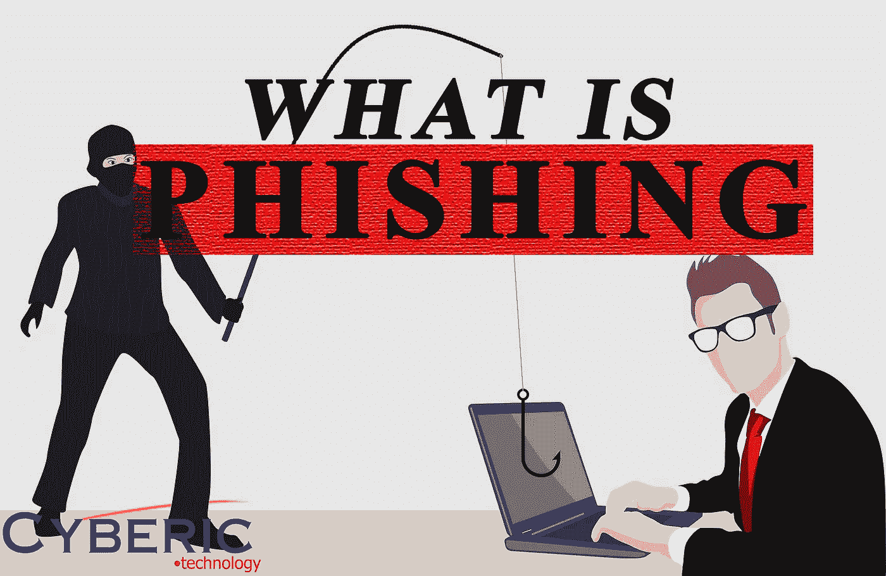

# 钓鱼！

> 原文：<https://medium.com/codex/phishing-b8eb93289cda?source=collection_archive---------16----------------------->

# 什么是网络钓鱼？

什么是网络钓鱼？我们知道这听起来像钓鱼，甚至图像看起来像攻击者试图钓一个受害者，但这到底是什么？在我解释网络钓鱼之前，我们必须知道什么是社会工程攻击。基本上，社会工程攻击是一种操纵和欺骗用户执行操作的恶意活动。网络钓鱼是一种社会工程攻击，攻击者试图通过伪装成受信任的人、公司或组织，通过通信软件和社交媒体平台发送消息。网络钓鱼信息只是黑客攻击用户，使他们执行诸如点击恶意链接或让受害者提供他们的敏感信息(如银行帐户)的操作。

网络钓鱼不仅用于随意浏览互联网的个人用户，也用于在大大小小的公司和政府机构中获得立足点。如果被骗，公司和组织将会遭受损失，但大多数情况下，数据丢失和帐户凭证丢失非常常见。根据具体情况，企业将很难恢复丢失的数据，而且在经济上也很难恢复。

# “网络钓鱼”这个名字是怎么来的？

有人说网络钓鱼这个术语受到了钓鱼这个词的影响。与钓鱼类似，网络钓鱼也是一种从用户“海洋”中“钓鱼”用户名、密码和其他敏感信息等凭据的技术。

一些网络钓鱼攻击的列表:

## 电子邮件钓鱼

攻击者向受害者发送看起来非常真实的电子邮件，该电子邮件旨在让受害者通过电子邮件回复或在攻击者的网站上输入信息，攻击者能够看到受害者的输入数据。

## HTTPS 网络钓鱼

HTTPS 网络钓鱼攻击是通过向受害者发送带有虚假网站链接的消息或电子邮件来进行的。该网站被用来欺骗受害者输入他们的凭据或私人信息。

## 鱼叉网络钓鱼

这种攻击包括以组织中的特定个人为目标，试图窃取登录凭据。攻击者通常在开始攻击之前首先收集有关此人的信息，例如他们的姓名、职位和联系方式。

# 2022 年的网络钓鱼统计

如今，网络钓鱼正演变成黑客的一项有利可图的业务。据估计，每天大约有 1.56 亿封网络钓鱼电子邮件被发送，导致超过 80，000 次点击。到 2022 年，这些攻击似乎也越来越频繁。在 2022 年第一季度，反网络钓鱼工作组(APWG)观察到总共 1，025，968 次网络钓鱼攻击。这是第一次季度总数超过 100 万，成为 APWG 有史以来最糟糕的一个季度。

# 脸书和谷歌(有史以来最大的网络钓鱼骗局之一)

2013 年至 2015 年间，世界上最大的两家科技公司成为假发票骗局的受害者，被骗走 1 亿美元(当时约为€9000 万美元)。

一名立陶宛人 Evaldas Rimasauskas 注意到这两个组织都使用台湾基础设施供应商广达电脑。

他发送了一系列伪造的数百万美元的发票，在两年多的时间里复制了该供应商，并附有合同和信件，似乎是由脸书和谷歌的高管和代理人签署的。

这个骗局最终被发现，脸书和谷歌采取了法律行动。他们追回了不到一半的赃款，而 Rimasauskas 则被逮捕并从立陶宛引渡回国。

2019 年 12 月，被判处有期徒刑五年。

# 如何防止网络钓鱼

网络钓鱼攻击保护要求用户和公司都采取措施。

对于用户来说，谨慎是关键。欺骗消息通常包含暴露其真实身份的微妙错误。这些可能包括拼写错误或更改域名。用户在提供信息之前应该首先考虑它是否是真实的，或者用户可以联系真实的人，攻击者假装他/她是否发送了电子邮件。

对于企业来说，可以采取一些步骤来减轻网络钓鱼和鱼叉式网络钓鱼攻击:

双因素身份认证(2FA)是应对网络钓鱼攻击的最有效方法，因为它在登录敏感应用程序时添加了额外的验证层。2FA 依赖于用户拥有两样东西:他们知道的东西，比如密码和用户名，以及他们拥有的东西，比如智能手机。即使员工受到威胁，2FA 也会阻止使用他们受到威胁的凭据，因为仅凭这些凭据不足以进入。

除了使用 2FA，组织还应该执行严格的密码管理策略。例如，应该要求员工经常更改密码，并且不允许在多个应用程序中重复使用一个密码。

教育活动还可以通过实施安全措施(如不点击外部电子邮件链接)来帮助减少网络钓鱼攻击的威胁。

简而言之，如果网络钓鱼消息的内容看起来如此真实，那么网络钓鱼攻击就可以很容易地执行并欺骗用户。由于这个原因，许多组织因为黑客试图欺骗用户/员工而遭受损失。我希望你们在阅读这篇博客的同时获得一些有用的知识。也要警惕网络钓鱼！

*参考文献*

维基百科贡献者。(2022 年 10 月 21 日)。社会工程(安全)。维基百科。[https://en . Wikipedia . org/wiki/Social _ engineering _(安全)](https://en.wikipedia.org/wiki/Social_engineering_(security))

什么是网络钓鱼？网络钓鱼攻击的类型。(2022 年 6 月 17 日)。检查点软件。[https://www . check point . com/cyber-hub/threat-prevention/what-is-phishing/](https://www.checkpoint.com/cyber-hub/threat-prevention/what-is-phishing/)

McKeever，g .，McKeever，g .，Hewitt，n .，Wall，p .，Lynch，B. L .，Lynch，b .，Lynch，b .，& Lynch，B. (2020 年 6 月 17 日)。什么是网络钓鱼|攻击技术和诈骗示例| Imperva。学习中心。[https://www . imper va . com/learn/application-security/phishing-attack-scam/](https://www.imperva.com/learn/application-security/phishing-attack-scam/)

网络钓鱼的历史。(2021 年 10 月 25 日)。PhishProtection.com。[https://www . phish protection . com/resources/history-of-phishing/](https://www.phishprotection.com/resources/history-of-phishing/)

19 种网络钓鱼攻击及其示例。(未注明)。Fortinet。检索于 2022 年 10 月 27 日，来自[https://www . fortinet . com/resources/cyber glossary/types-of-phishing-attacks](https://www.fortinet.com/resources/cyberglossary/types-of-phishing-attacks)

欧文，L. (2022 年 10 月 7 日)。有史以来最大的 5 个网络钓鱼骗局。IT 治理博客。[https://www . it governance . eu/blog/en/the-5 最大的网络钓鱼诈骗](https://www.itgovernance.eu/blog/en/the-5-biggest-phishing-scams-of-all-time)

必须知道钓鱼统计(2022 年更新)。(未注明)。出口。检索于 2022 年 10 月 27 日，来自[https://www . egress . com/blog/phishing/phishing-statistics-round-up](https://www.egress.com/blog/phishing/phishing-statistics-round-up)