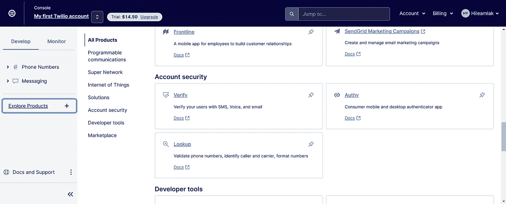

# 使用 React Native 和 Twilio 验证电话号码

> 原文：<https://medium.com/codex/phone-number-verification-with-react-native-and-twilio-afb09e5486aa?source=collection_archive---------2----------------------->

你以前肯定和短信验证有过互动。您甚至可以使用 Twilio API 编写一个。那是一周前的我。为什么我要写一篇文章解释如何针对你使用 Twilio？您可能已经注意到，Twilio 是一家快速发展的公司，他们的 API 和文档都在不断改进。我以前用过 Twilio，但是没有一样看起来很熟悉。此外，在线视频和教程已经过时。这是我在 2022 年 7 月 2 日记录的过程。

让我们首先了解一下我们的架构是如何建立的。下图用编号的步骤解释了这一点。

为了可访问性，我将在下面写下不同部分之间的遭遇，但是如果你对这个图满意的话，你可以跳到下一节。

ReactNativeAPP: Hey backend 我的号码是+1857****，可以验证一下吗？

Backedend:嗨 Twilio，+1857***想被验证，能不能给我发个验证码。

Twilio:嘿，电话号码，这是一条短信，带有 ReactNativeAPP 要求的验证码。

ReactNativeApp:嘿后端，我提交的手机得到了验证码 546。那是你送的吗？

后端:嘿 Twilio，546 是你发给+1857***的验证号吗？

是的，先生，就是它。

**注意**:需要注意的重要一点是，我们的 Twilio API 调用必须通过我们的后端，而不是直接来自前端。这提供了几个安全特性。首先，我们不必向客户提供的代码公开我们的 Twilio 授权令牌。如果有人能接触到这些信息，他们完全可以接管我们的 Twilio 账户。

然而，我们的设置不会自动使我们的安全防弹。例如，它不能阻止有人伪装成我们的 react 本机应用程序，并向我们的后端发送多个请求，从而导致可能的 DDoS 攻击或花费我们很多钱。这可以通过在节点后端放置一个过滤器来避免。我们还可以采取其他多种保护措施，但我不会在本文中探讨这些措施。

# **设置 Twilio 账户**

现在让我们设置我们的 Twilio apis。你可以去 twilio.com。一旦你完成了注册过程，你应该被引导到你的控制台，看起来应该像下面这样。

在这一页中，请注意帐户信息部分下的信息，我们稍后会回来。现在，继续创建一个虚拟电话号码。完成后，转到探索产品部分并选择验证。

然后会提示您创建服务。继续创建一个新服务。你可以随便叫它什么，但是一旦你注意到服务的 SID。你可以把它复制到某个地方，但是你也可以以后再回来。这种服务的创造总结了事物的 Twilio 方面。

# **设置后端**

这里，我假设您已经设置了节点和 npm。也就是说，你需要创建一个新的文件夹。在这个文件夹中，安装 twilio 和 express。你可以这样做，首先用`npm init`初始化 npm，然后用`npm install express`和`npm install twilio`初始化。完成安装后，您的文件夹结构应该如下所示。

现在创建一个 server.js 文件，其中包含以下代码的变体。

在编写本代码时使用了[https://www.twilio.com/docs/verify/api](https://www.twilio.com/docs/verify/api)文档。

代码是不言自明的，但是为了澄清一点，我们有三个可到达的 URL。

`/`:主页面，完全没必要。它仅用于测试目的。

那么我们有

`/verify/:to`

这是向数字`:to`发送验证的代码，或者例如`/verify/+1857****`将向`+1857****`发送验证

最后我们有了

`/check/:to/:code`

这将检查`:code`是否是发送给`:to`的验证码。因此，如果代码`5678`被发送到`+1857***`，那么`/check/+1857****/5678`将返回一个 json 响应来确认或拒绝。

最后一个难题是你可以在哪里找到前三个常数。我们已经讨论过在哪里可以找到服务 ID(它是您创建的服务页面)。至于 accountId 和 authToken，您可以在前面提到的主控制台中找到它们。

我们现在可以通过运行`npm start`来测试我们的后端了。一旦你运行了这个命令，进入你的浏览器，输入`lcoalhost:3000`就会显示欢迎文本。

# **设置 React 本机前端**

最后一块是面向用户的 react 原生应用。我再次假设您已经有了 react 本机和导航设置，如果没有，您可能想看看 react 本机文档中关于设置您的编码和测试环境的内容。

我将首先提供一个电话验证页面作为组件。为这个项目安装的唯一包是 react-native-phone-number-input。你可以在这里找到安装的详细信息([https://www . npmjs . com/package/react-native-phone-number-input](https://www.npmjs.com/package/react-native-phone-number-input))。这个包似乎有一些已知的漏洞:它是由你来使用它(或者你可以创建自己的)。不管怎样，让我们进入代码。

我已经评论了重要的部分，其他的

您可能需要一些操作来为您的用例配置代码，但是我希望这能让您对如何使用 Twilio API 有一个大致的了解。如果它留下了评论，如果它没有留下改进。