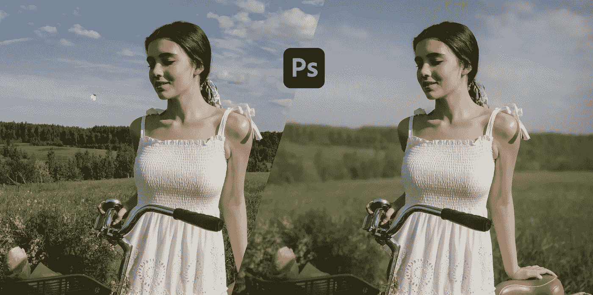

# Photoshop 的新深度模糊功能令人惊叹

> 原文：<https://medium.com/codex/photoshop-new-depth-blur-feature-is-mind-blowing-704c7cdfec45?source=collection_archive---------1----------------------->

照片由 [Pexels](https://www.pexels.com/photo/girl-riding-bicycle-10203433/?utm_content=attributionCopyText&utm_medium=referral&utm_source=pexels) 的[罗恩·拉赫](https://www.pexels.com/@ron-lach?utm_content=attributionCopyText&utm_medium=referral&utm_source=pexels)拍摄

深度模糊功能是 Adobe Photoshop 2021 中可用的[神经滤镜](https://helpx.adobe.com/photoshop/using/whats-new/2021-4.html#improved-neural-filters)的一部分，在 Photoshop 2022 中得到极大改进。深度模糊是一种滤镜，它模拟使用快速光圈镜头获得的背景模糊或散景效果。

在某些方面，这个功能类似于 iPhone 如何使用“人像模式”来创建深度模糊，只是控制更多。