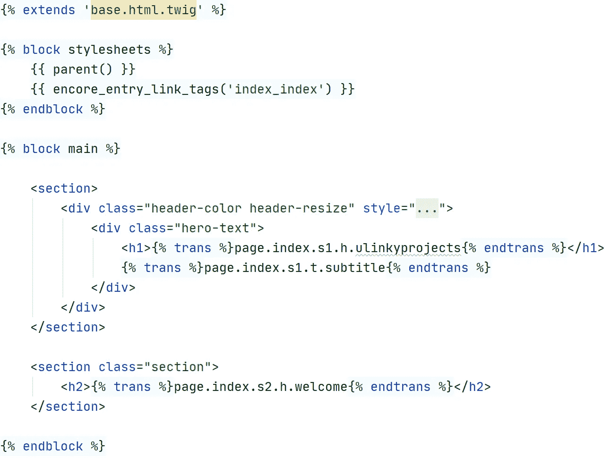

# PHP Symfony 是创建 Web 应用程序的一个很好的框架

> 原文：<https://medium.com/codex/php-symfony-is-a-great-framework-to-create-a-web-application-882fb98c7a2?source=collection_archive---------5----------------------->


克里斯蒂娜@ wocintechchat.com 在 [Unsplash](https://unsplash.com?utm_source=medium&utm_medium=referral) 上的照片

# 什么是 Symfony

也许你会问自己:Symfony 到底是什么？如果你从未听说过，我想给你一个简短的介绍:

Symfony 是一个用 PHP 编写的企业 web 应用框架。它被组织成一组可重用的 PHP 组件，这使得选择项目所需的组件变得非常灵活。
当然都是开源的:)

**谁在用 Symfony** 我做了一点调查，发现有很多公司和项目都依赖 Symfony。根据 Symfony 网站，StackShare，Twitter 和很多项目网站，我发现以下公司和软件项目都是用 Symfony 组件构建的:
Accenture，Trivago，Typeform，BlaBlaCar，Statista，Deezer，Spotify，Shopware，Magento，Drupal，Joomla，Wikimedia，Matomo，phpBB，ownCloud 等等。

## 框架的强度

*   健壮、灵活、组织良好且可维护
*   长期支持
*   优秀的文档

## 基本结构

为了给你一个快速的概述，下面是一个典型的 Symfony 应用程序的默认文件夹结构:

```
symfony_project/
├─ assets/
├─ bin/
│  └─ console
├─ config/
│  ├─ packages/
│  └─ services.yaml
├─ migrations/
├─ public/
│  ├─ build/
│  └─ index.php
├─ src/
│  ├─ Command/
│  ├─ Controller/
│  ├─ DataFixtures/
│  ├─ Entity/
│  ├─ EventSubscriber/
│  ├─ Form/
│  ├─ Repository/
│  ├─ Security/
│  └─ Twig/
├─ templates/
├─ tests/
├─ translations/
├─ var/
│  ├─ cache/
│  └─ log/
└─ vendor/
```

如您所见，默认文件夹结构包含“src”中的所有源文件。Web 资源存储在“资源”文件夹中。如果您使用 webpack，这些将被编译并存储在“public/build”文件夹中。默认情况下，目录“var”包含日志记录和缓存文件。此外，还有用于您的配置、模板和翻译的目录。

模型-视图-控制器(MVC)是核心架构。

*   **模型**
    数据库-称为“实体”的对象存储在实体文件夹中。存储库文件夹包含这些实体从数据库获取和加载对象的存储库。
*   **查看**
    模板文件夹通常包含你所有的树枝模板。在那里你可以构建你的 HTML 内容。通常，您有一个类似“base.html.twig”的文件，其中包含所有页面的页眉和页脚。然后，很容易用一些视图来扩展基础，这些视图使用变量、过滤器和一些表示逻辑来创建优秀的应用程序。
*   **控制器**
    在 src/Controller 中，您可以为您的应用程序定义控制器。可以通过浏览器中的 URL 访问控制器，这些 URL 被定义为路线。控制器包含一些逻辑，将带有一些逻辑的用户输入粘合到数据库和视图。

# Symfony 的核心特性

*   MVC 架构
*   数据库抽象层
*   模板引擎
*   依赖注入
*   事件调度程序
*   表单生成器
*   验证器
*   路由器
*   贮藏
*   安全功能
*   灵活并可通过捆绑进行扩展
*   电子邮件、配置、HttpClient 等组件
*   测试框架

# Symfony 的亮点

下面，我列出了我最喜欢的 Symfony 框架的六个特性:

## **数据库抽象层(教条 ORM)**

Symfony 使用 Doctrine 作为默认的对象关系映射器。它允许您将数据库表映射到对象，而无需编写任何 SQL 语句。您可以为您的配置使用注释、XML 或 YAML。下面的例子展示了一个带有联系人表单条目注释的类。每个表单输入都会创建一个新对象，该对象将被持久化到 MySQL 数据库中。存储和获取条目非常容易。如果您想要更高的性能或更复杂的查询。您可以在所谓的“存储库”中定义它们。


将联系人表单实体映射到原则注释的示例

## **模板引擎(Twig)**

Twig 是一个快速灵活的模板引擎。Twig 支持继承和过滤器。这使得它成为创建服务器端呈现 HTML 代码的强大而简单的工具。语法非常类似于 Python 的 Django。



带有继承、块和转换的小枝文件示例

## 翻译

将应用程序翻译成几种语言非常容易。可以以多种文件格式添加字符串翻译。最受欢迎的是 YAML，XLF，JSON，INI，PO 和 PHP。
译文可以很容易地在 Twig 模板中使用。Symfony 还提供了一些命令来查找丢失的翻译。

## 探查器工具栏

Symfony 提供了一个名为“Profiler”的调试工具栏。如果你想调试你的应用程序，工具栏是非常有用的。它让你一瞥引擎盖下发生了什么。例如，发送什么标题、缓存效率、执行的数据库查询、性能洞察等等。


如果调试模式处于活动状态，调试工具栏位于网站底部

如果您想获得关于您的应用程序的更多信息，您可以打开 profiler。对于调试非常有用。它显示了关于您的请求、会话信息、表单输入和异常的详细信息。此外，事件、缓存请求、丢失的翻译、性能和许多其他东西都是可用的。


Symfony Profiler 显示给定请求的性能指标

## 命令

Symfony 提供了很多命令来管理你的应用程序。您可以清除缓存、执行数据库迁移或扫描模板以查找缺失的翻译。


示例:清除 Symfony 缓存的命令

您也可以创建自己的命令。这很好，因为您可以使用命令行界面来管理您的应用程序。

## 路由器

Symfony 路由器允许您将 URL 映射到您的控制器。也有很大的灵活性。你可以使用注释、YAML、XML 来定义你的路线。您可以使用参数在您的 URL 中提供选项。定义特定 URL 使用哪种语言非常容易。在配置文件中也可以实现访问控制。Symfony 还提供了一些调试命令。它显示了哪条路径和方法将被传递给给定的控制器。

## 测试框架(PHPUnit)

为您的应用程序编写测试是创建可靠和安全的应用程序的关键步骤。单元测试可以毫不费力地集成到 Symfony 中。此外，该框架提供了创建完整功能应用程序测试的组件。

## 配置

应用程序配置允许您以自己喜欢的文件格式配置几乎所有内容。数据库、缓存、翻译、路由、模板等等都有默认的 YAML 配置。

## 扩展(捆绑系统)

bundle 系统允许你为你的应用程序创建和安装插件。可以通过 composer 安装软件包。这是一个 PHP 的包管理器。配置发生在您的配置文件目录中。

# 结论

我并不是说 PHP Symfony 是所有事情的最佳解决方案。还有很多其他优秀的框架和编程语言。这要看你想做什么，你熟悉什么技术。

相反，我想分享我对这个框架的着迷。Symfony 是一个强大的企业框架，有很多很棒的东西。另外，一些开发者称 PHP 是一种“丑陋”的语言。希望我能够展示使用框架使你的代码更加结构化和“漂亮”。
最后，希望这篇文章已经给了你一个关于 Symfony 的简短介绍。也许你想在下一个 web 项目中使用它:-)。

那么，**你觉得【Symfony 怎么样？**你用吗？**
你在考虑去**试试看吗？****

让我在**评论**中知道，并考虑**点击下面的那个♥按钮**在全世界传播。