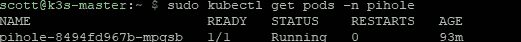

# HTTPS 上空的黑洞和 DNS

> 原文：<https://medium.com/codex/pi-hole-and-doh-f1a9f8acd0f7?source=collection_archive---------0----------------------->

## [法典](http://medium.com/codex)


由[菲利普·卡森伯格](https://unsplash.com/@fantasyflip?utm_source=unsplash&utm_medium=referral&utm_content=creditCopyText)在 [Unsplash](https://unsplash.com/s/photos/cybersecurity?utm_source=unsplash&utm_medium=referral&utm_content=creditCopyText) 上拍摄的照片

最近的技术领域都是关于安全性和数据保护的。你会注意到现在大多数网站只在 HTTPS 运行。但是你知道吗，人们仍然可以通过查看你的 DNS 查询来跟踪你做了什么？今天我们来看看什么是 HTTPS 域名系统，为什么你需要它，以及如何设置它。

# 什么是 DoH？

> **DNS over HTTPS** ( **DoH** )是通过 [HTTPS](https://en.wikipedia.org/wiki/HTTPS) 协议([维基百科](https://en.wikipedia.org/wiki/DNS_over_HTTPS))执行远程[域名系统](https://en.wikipedia.org/wiki/Domain_Name_System) (DNS)解析的协议

DoH 利用与您和网站之间的数据传输相同的加密技术来保护您的所有数据。它由相同的可信证书链支持，并防止相同的攻击。

# 为什么我需要 DoH？

要回答这个问题，让我们来看看常规 DNS 的潜在问题。

**数据保护—** 我们已经在本文中提到了这一点，但是由于 DNS 查询本质上是纯文本，因此它们对于在往返于目标 DNS 服务器的途中经过的任何节点都是可见的。你的 ISP 知道你在找什么，链路上的任何交换机或路由器都有能力检查内容并记录下来。也许你并不关心这个，但是现在有很多人真的想控制谁能看到他们的任何事情。HTTPS 域名系统确保所有关于你请求的内容和你得到的回复都是安全的，不会被窥探。

**DNS 欺骗**——如 [Imperva](https://www.imperva.com/learn/application-security/dns-spoofing/) 所述:

> 域名服务器(DNS)欺骗(也称为 DNS 缓存中毒)是一种攻击，利用改变的 DNS 记录将在线流量重定向到与其预期目的地相似的欺诈性网站。

这种攻击使人们容易受到进一步的攻击，如窃取凭据或安装恶意软件。这可以通过利用提供商 DNS 软件中的缺陷或通过执行中间人攻击并在您的上游链中获得他们自己的 DNS 服务器来实现。虽然我们不能帮助上游服务器保护自己，但通过利用 HTTPS，我们可以通过验证身份和加密有效载荷来防止 MITM 攻击。

**DNS 操作** —除了缓存中毒，还有其他原因可能会导致结果被修改。例如，ISP 审查通常围绕阻止或操纵某些 DNS 结果。你经常无法知道你所接收的内容已经被修改。正如理查德·奇尔温在《T2》中所说:

> DOH 的加密(通过 HTTPS)对提供商隐藏了流量，在一个 ISP *不能*封锁的端口上。

这意味着你知道你得到的没有被篡改，你知道服务不会被你的 ISP 删除。

# 怎么用 DoH？

如果你已经到了这一步，你就需要 DoH，至少对你的个人情况来说是这样。我现在将向您展示如何为您的网络设置自己的 DoH 服务器。这将在一个 Kubernetes 集群上进行，所以在尝试按照说明操作之前，请确保您有一个这样的集群。如果你有几个 RPi，你会愿意在 Kubernetes 上运行，请在[阅读我的系列文章，获得 RPi K3S 集群设置](/codex/reliable-kubernetes-on-a-raspberry-pi-cluster-introduction-cbdca4e759fb)。

我们将要使用的图片是我制作的。你可以在[https://hub.docker.com/r/scottjones4k/pihole-doh](https://hub.docker.com/r/scottjones4k/pihole-doh)看看 docker 图片，也可以在[https://github.com/scottjones4k/pihole-doh](https://github.com/scottjones4k/pihole-doh)看看它的源代码。作为一个原则问题，我建议你看看这个——以及你想在你的系统上运行的任何其他容器——它们里面实际上发生了什么。对于某些人来说，很容易将一些邪恶的东西放入图像和人群中。

你要做的第一件事是创建你的 pihole.yaml:

```
apiVersion: v1
kind: Namespace
metadata:
  name: pihole
  labels:
    app: pihole
---
apiVersion: apps/v1
kind: Deployment
metadata:
  name: pihole
  namespace: pihole
  labels:
    app: pihole
spec:
  replicas: 1
  selector:
    matchLabels:
      app: pihole
  template:
    metadata:
      labels:
        app: pihole
        name: pihole
    spec:
      containers:
      - name: pihole
        image: scottjones4k/pihole-doh:latest
        imagePullPolicy: Always
        env:
        - name: TZ
          value: "Europe/London"
        - name: WEBPASSWORD
          value: "<<YOURSECRETPASSWORD>>"
        - name: DNS1
          value: "127.1.1.1#5153" #DoH
        - name: DNS2
          value: "127.1.1.1#5153" #DoH
---
apiVersion: v1
kind: Service
metadata:
  name: pihole
  namespace: pihole
spec:
  selector:
    app: pihole
  ports:
  - port: 80
    name: pihole-admin
    protocol: TCP
    targetPort: 80
---
apiVersion: traefik.containo.us/v1alpha1
kind: IngressRoute
metadata:
  name: pihole-route
  namespace: pihole
spec:
  entryPoints:
    - websecure
  routes:
  - match: Host(`pihole.yourdomainhere.com`)
    kind: Rule
    services:
    - name: pihole
      port: 80
  tls:
    certResolver: cloudflare
---
apiVersion: v1
kind: Service
metadata:
  name: pihole-dns-tcp
  namespace: pihole
spec:
  type: LoadBalancer
  selector:
    app: pihole
  ports:
  - port: 53
    targetPort: 53
    protocol: TCP
    name: dns-tcp
  externalIPs:
    - <<YOUR-DNS-IP>>
---
apiVersion: v1
kind: Service
metadata:
  name: pihole-dns-udp
  namespace: pihole
spec:
  type: LoadBalancer
  selector:
    app: pihole
  ports:
  - port: 53
    targetPort: 53
    protocol: UDP
    name: dns-udp
  externalIPs:
    - <<YOUR-DNS-IP>>
```

上面的 yaml 文件包含几个关键项。

`Deployment`部分包含一个网络密码设置，您需要在其中输入自己的密码。这是查看 web 界面时使用的密码。它还指定 DNS1 & 2 为前往`123.0.0.1#5153`。这是容器映像运行 Cloudflare(代理 Cloudflare DoH 服务器的本地 DoH 服务)的地方。这意味着 Pi-Hole 没有解决的任何问题都会通过 DoH 向上传递。

yaml 还包含一个`IngressRoute`。这就是 Traefik 路由任何进入它的入口点的东西的方式。如果您不想公开 web 用户界面，您可以删除此部分。如果您确实想这样做(并且您已经按照我以前的系列运行了 Traefik ),您需要确保更新`Host`部分以匹配您的 DNS 条目。

最后，创建了两个负载平衡器服务。它们是向您的网络公开 DNS 解析功能所必需的。在`externalIPs`部分，您可以指定希望使用什么 IP 来将其暴露给网络。这不是绝对必要的，因为您的负载平衡器供应器能够为它分配一个 IP 地址，但是强烈建议您指定它，以便它始终是同一个 IP 地址。两个服务中的两个外部 IP 应该匹配。

一旦你设置了它，你应该像应用任何其他清单一样应用它

```
$ sudo kubectl apply -f pihole.yaml
```

要检查它是否启动并运行，请检查 pihole 名称空间中的窗格

```
$ sudo kubectl get pods -n pihole
```

假设一切正常，您将得到如下输出



成功运行 Pi-Hole 实例

现在剩下的就是设置网络的 DNS 设置。如何做到这一点在不同的路由器提供商之间有很大的不同，所以你必须寻找和更新你自己的 DNS/DHCP 设置。

恭喜你！您现在有了一个更安全的互联网浏览体验，所有 DNS 请求离开您的网络安全和加密。如果你愿意，你可以更进一步，托管一个 VPN，这样你就可以在外部使用这个 DNS 服务器，但是这已经超出了我们的范围！