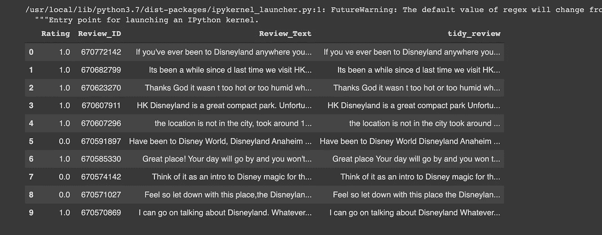
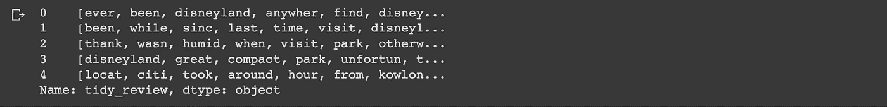

# 选择迪斯尼乐园-评论的自然语言处理。第二部分

> 原文：<https://medium.com/codex/picking-a-disneyland-natural-language-processing-of-reviews-part-2-a74658c2b16d?source=collection_archive---------8----------------------->

在这个系列的第一部分，迪斯尼加州以平均排名在我们的名单上名列前茅，但是它的评论会支持它的位置吗？

在本文中，我们将尝试自然语言处理，建立一个模型来将评论分为正面和负面，看看哪个迪士尼乐园最受游客喜爱！

[金立](https://unsplash.com/@kinli?utm_source=medium&utm_medium=referral)在 [Unsplash](https://unsplash.com?utm_source=medium&utm_medium=referral) 上拍照

在第 3 部分中，我们将从 Tripadvisor 上搜集评论，并在上面运行我们的模型，看看迪士尼乐园是否坚持自己的立场。

让我们开始摇滚吧！

## 步骤:

1.  **上传数据集:**将其分为测试和训练数据集，将在整个项目中使用。
2.  **标记训练数据集:**根据访问者给出的评级，将评论标记为正面或负面。
3.  **清理数据:**去掉标点、数字和特殊字符，去掉短词。修饰和词干
4.  **将数据可视化**
5.  **应用机器学习模型:**我将使用词袋模型中的特征来使用逻辑回归。
6.  **预测测试数据:**我将基于测试数据集使用模型来预测评论是正面还是负面。
7.  **寻找赢家:**正面和负面评价比例最高的迪士尼乐园将成为我们的赢家！

## 步骤 1 —上传数据

导入必要的包:

现在让我们上传数据集:

## 步骤 2-创建并标记训练数据集

首先，让我们用下面一行创建我们的训练数据集:

*train = PD . read _ CSV(' disneylandreviews . CSV '，编码='latin-1')*

既然训练数据集已经上传，我们需要看一下“评级”栏，因为这是我们试图预测的。最初的等级是从 1 到 5。为了便于分析，我将正面评价( **> 3)替换为 1** ，负面评价( **< 4)替换为 0** )。

现在我们有了这样的东西:

上传的数据集

最后，让我们使用以下代码行重命名这些列，这将有助于我们在清理和分析训练数据集中包含的数据时引用特定的列。

## 步骤 3—清理数据

现在我们需要清理数据。这是使我们的文本具有正确格式的关键一步，以便稍后将其输入到模型中。如果我们看一下当前的评论格式，它们看起来像这样:

评论的原始格式

正如你所看到的，这篇文章的很多部分对我们的分析没有任何帮助。例如，尽管标点符号和特殊字符可能赋予数据额外的含义(感叹号(！)表示激动的心情，而句号(。)可以暗示确定性)，它们不会对审查本身的意义产生重大影响，因此我们需要删除它们。

以下是清理评论的基本步骤:

1.  **删除标点、数字和特殊字符**
2.  **去掉短词**
3.  **对单词进行标记** —标记是单独的术语或单词，标记化是将一串文本拆分成标记的过程。
4.  **词干化** —从单词中去除后缀(“ing”、“ly”、“es”、“s”等)的基于规则的过程。

## **删除标点、数字和特殊字符**

我们创建了一个名为“tidy_review”的新列，其中我们用空格替换了所有标点符号、数字和特殊字符。

我们最终得到的评论的干净版本

## 删除短词

大多数短词，如“on”、“up”、“go”等，在分析评论时没有什么价值，因此我们将使用以下函数删除所有长度为 3 个字符或更少字符的词:

“tidy_review”列中的所有单词现在长度为 4 个或更多字符

## 修饰词语

> 标记化是将文本分割成可以在上下文中解释的有意义的块，这将帮助我们理解上下文并为 NLP 开发模型。

我将使用 *split()* 方法来标记单词。这个方法将一个句子字符串转换成由逗号分隔的单词列表。

现在，我们所有的注释都是 1D 数组的形式，带有一个索引来标识每个注释的位置。

***split()*** 方法的输出

## 词干

> 词干化就是把这个词简化到它最基本的意思。当我们提到词干时，我们指的是**结尾、后缀(“ing”、“ly”、“es”、“s”等。)和单词的前缀。**

在这种情况下，我将使用波特斯特梅尔算法。这个算法太复杂了，不在本文的讨论范围之内，但是您可以在这里找到关于它的更多信息:

 [## 波特词干算法-基本介绍

### 在语言学(语言及其结构的研究)中，词干是单词的一部分，是所有词形变化所共有的…

vijinimallawaarachchi.com](https://vijinimallawaarachchi.com/2017/05/09/porter-stemming-algorithm/) 

下面是我们将用于在标记化评论上实现波特词干分析器算法的代码:

我们得到以下输出:

现在，我们需要用波特·斯特梅尔的结果来更新我们的专栏。正如您在输出中看到的，单词已经被简化为基本的词条，并准备好进行操作:

## 步骤 4 —可视化数据

将数据可视化不仅超级有趣(谁不喜欢色彩缤纷的拼贴画呢！)，但它也可以为我们提供关于访问者最常用的词语、整体情绪和态度的重要见解。

我决定使用一个单词云来进行可视化。要实现它，让我们首先导入必要的库:

导入必要库的代码

看看负面评论是关于什么的总是有用的。因此，让我们用评分为 0(低于原始等级 3)的评论创建一个单词云。

生成单词云的代码

负面情绪词云

这是我们得到的美丽的单词云。您可以对任何图像进行此操作，只需越过上面代码中的链接即可！

关于这个单词云，值得注意的是,“巴黎”这个词直接出现了，这表明人们对巴黎迪士尼乐园的不满程度可能比其他迪士尼乐园更高。还有很多与定价有关的词，如“欧元”、“昂贵”和“价格”，向我们表明价格是一些游客关心的问题。

## 步骤 5-应用机器学习模型

首先，我将应用**单词袋模型。**该模型简化了单词的表示，用于从给定文本中提取特征。简而言之，它将一串单词转化为一串可以分析的数字，并通过确定单词属于哪个主题来实现这一点。

从单词袋模型开始，我们首先需要建立一个特征矩阵，可以用下面的代码来完成:

设置特征矩阵的代码

这是我们得到的输出矩阵:

输出特征矩阵

应用单词包功能:

现在我们将创建我们的测试数组。为此，我们将使用我们刚刚创建的矩阵中的值，并使用*创建一个稀疏矩阵。todense()* 功能:

从数据创建稀疏矩阵

稀疏训练矩阵

现在让我们对数据进行逻辑回归。这是一种预测二元结果的分析方法，在我们的例子中，是评论将被称为正面(1)还是负面(0)。

创建逻辑回归

现在，让我们将逻辑回归应用到我们之前创建的训练矩阵中:

## 步骤 6—确定模型的准确性

现在我们做了一个模型！万岁！

了解我们的模型在预测评论的性质方面有多准确很重要。我将使用 F1 的分数来看看这个模型是否能做出准确的预测。虽然对于给定的模型，F1 分数是最优的没有明确的基准，但是 0.8 到 0.9 的范围通常是理想的。

计算我们模型的 F1 分数

我们得到 F1 的分数是 **0.9172350230414746** ，不错吧！

## 步骤 7 —将模型应用于测试数据

现在我们的模型看起来相当不错，可以做出一些相当准确的预测。让我们将它应用到我们在这个项目开始时创建的测试数据集上，看看它能够对评论进行多少排序。

测试我们制作的模型

此代码将对测试数据运行我们的模型，并将其预测输出到单独的。名为“result.csv”的 csv 文件，我们可以下载该文件。

让我们看看我们得到了什么结果:

结果文件

正如你可以看到的前 4 个评论，模型做得相当不错。第一个(0)评论包含关键字，如“精彩”和“相当好”，这表明该评论总体上是积极的，因此它的评级为 1。另一方面，第三条评论显然是负面的，因为游客似乎对公园内的施工工作以及食品价格高感到失望，因此该评论的评分为 0。

## 第八步——寻找获胜者

现在让我们找出平均正面评价数最高的迪士尼乐园。为此，我们将对每个分支的评级等于 1 的所有值求和，然后除以记录总数。

分数概要:

巴黎:**0.622972120322817**

香港: **0.712993762993763**

加州:**0.764688838503555**

总体而言，加州迪士尼乐园赢得了最多的正面评价。这证明了我们在第一部分中的结果，在第一部分中，迪斯尼加州获得了最高的数字平均值。

所以，如果你碰巧选择了去哪里——迪士尼加州是首选。

*参见源代码:*

 [## GitHub-sashakorovkina 123/迪士尼乐园 _ 感悟

github.com](https://github.com/sashakorovkina123/disneyland_sentiment.git) 

> *请继续关注第三部分，我们将从各种旅游网站收集数据，看看迪士尼顾客的观点是如何随着时间的推移而变化的！*
> 
> 与此同时，**请在评论区留下任何意见/更正或明智的话，作为一名初学数据科学家，您的意见对我来说非常有价值！**