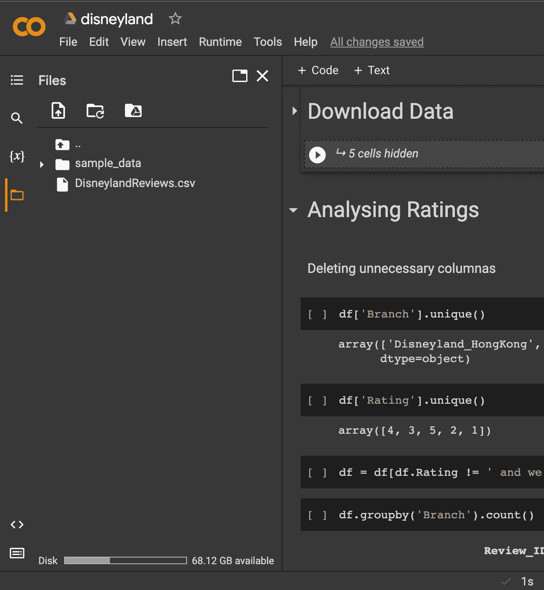
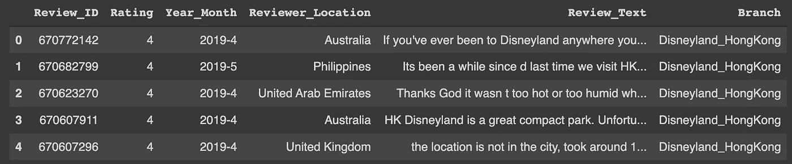
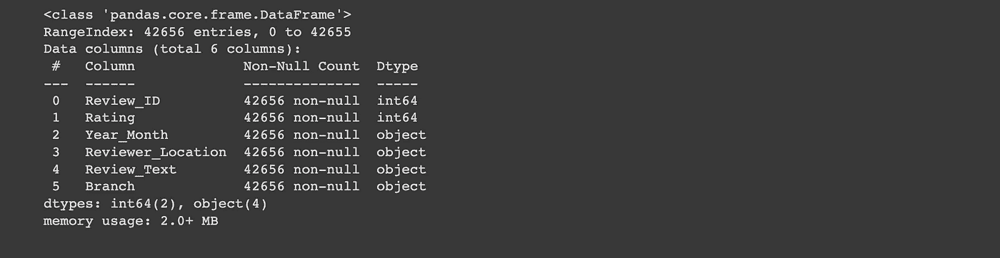
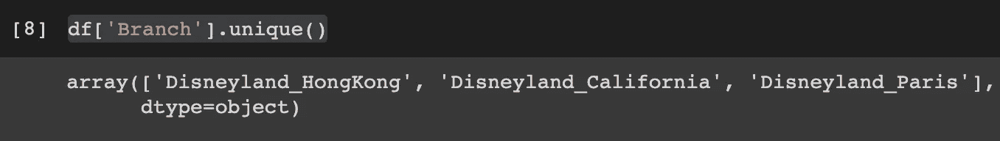
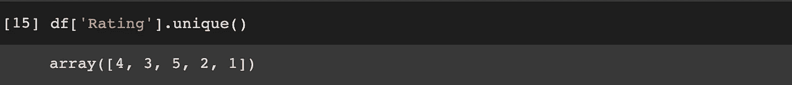
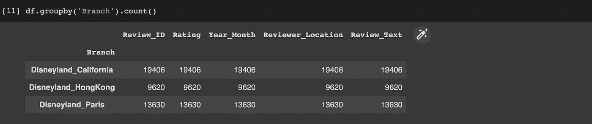

# 用数据科学挑选迪士尼乐园。第一部分

> 原文：<https://medium.com/codex/picking-a-disneyland-with-data-science-part-1-cbd24dc46dee?source=collection_archive---------9----------------------->

我非常喜欢迪士尼的任何东西。商品、公园、人物——我愿意接受任何提议，所以我找不到比分析迪士尼乐园评论更好的第一个数据科学项目了。

在本文中，我将比较三个迪士尼乐园(香港、加州和巴黎)的排名，并找出哪一个名列榜首。在第二部分，我将使用情感分析来看看哪个迪斯尼乐园在正面评论的数量上排名第一。

[摩羯宋](https://unsplash.com/@capricorn_song?utm_source=medium&utm_medium=referral)在 [Unsplash](https://unsplash.com?utm_source=medium&utm_medium=referral) 上的照片

让我们开始摇滚吧！

**有什么计划？**

1.  从 Kaggle 中查找数据集并将其下载到 Jupyter 中，以及获取关于该数据集的基本信息。
2.  清理数据—删除不必要的列，使数据类型正确等等。
3.  按分支机构对迪士尼乐园进行分组，并找出它们的平均评分。
4.  比较结果评分并庆祝

**第一步:导入包**

为了启动这个项目，我已经导入了以下库:

**步骤 2:连接到 Kaggle**

Kaggle 是一个非常棒的平台，可以举办数据科学竞赛，并且有大量的数据库供您使用。它也很容易连接到你的 Jupyter 笔记本上，就像这样:

以下是一些关于如何将 Kaggle 连接到您的笔记本电脑的附加信息:

[https://www . analyticsvidhya . com/blog/2021/06/how-to-load-ka ggle-datasets-directly-into-Google-colab/](http://How to connect Kaggle)

在我们的例子中，我们将使用以下数据库:

 [## 迪士尼乐园评论

### 对 3 个迪士尼乐园分支机构-加州、香港和巴黎的评论和评级

www.kaggle.com](https://www.kaggle.com/datasets/arushchillar/disneyland-reviews) 

列描述:

1.  Review_ID:给予每个评论的唯一 ID
2.  评级:从 1(不满意)到 5(满意)
3.  年 _ 月:评论者参观主题公园的时间
4.  审查者 _ 地点:访问者的原籍国
5.  评论 _ 正文:访问者的评论
6.  迪士尼乐园 _ 分店:迪士尼乐园的位置

让我们将这个数据库上传到笔记本中:

这个文件是一个. **zip** 文件，所以我在第二行解压了它。这种方法并不总是有效，因此如果对您来说失败了，请将 **DisneylandReviews.csv** 文件放入“文件”选项卡(见下图)，然后运行第三行。

上传后，您应该会在“文件”部分看到 **csv** 文件

> 请记住，每次关闭程序时，您都需要重新上传所有文件，因为它们会在运行结束后被删除。

**第三步:获取基本信息**

现在让我们快速看一下我们面临的情况。在运行 *df.head()，*之后，我们得到如下结果:

快速浏览一下，我们可以看到评级以数字的形式呈现，我们在“Review_Text”部分有一些看起来非常干净的文本，这意味着预处理应该很容易。仅仅看一眼，很明显评论发表的年份和评论者的位置不会显著影响他们的评级。因此，我们稍后将删除这些列。

现在让我们看看这个数据帧的组成部分的数据类型，我们可以通过使用 *df.info()* 命令来完成。

下面是我们得到的结果——总共 42656 行，评论 id 和评级是整数类型，其他的都是一个**对象**，这些有时很难处理，所以我们应该考虑以后把它改成一个字符串。

现在让我们检查我们最感兴趣的列中的唯一值——**分支**列和**评级**列，我们执行以下操作:

我们可以看到，评级范围为 1-5，我们正好有 3 个分支。当我们希望按分支机构对评级进行分组时，这将派上用场

**第四步:数据清理**

让我们从删除不必要的列开始，正如我们在上面讨论的，它们是审阅者位置、审阅出版年份和审阅者 ID。

我们知道分支列对象属于**对象**类型，我们需要将它们转换成字符串:

**第五步:计算平均分**

最后也是最激动人心的一步！我们将每个迪士尼乐园的总评分除以该迪士尼乐园的评论数，得出每个迪士尼乐园的平均排名。

我们先来获取每个迪士尼乐园的记录数量:

在这里，我们按分支对迪士尼乐园进行了分组，并找到了每个分支的评论总数。太好了！

现在我们需要遍历各个列，找到每个迪士尼世界的总评分，我们可以使用以下命令来完成:

**结果揭晓……**

1.  加州迪斯尼乐园:4。59860 . 48686868686
2.  香港迪士尼乐园:4 . 54867 . 48686868661
3.  巴黎迪士尼乐园:3 . 46867 . 38868686861

事实证明，加州迪士尼乐园拥有最高的数字平均评分！

## 源代码

在我的 GitHub 上查看 Jupyter 笔记本:

 [## GitHub:选择一个 disn 并根据他们的排名使用…

### 此时您不能执行该操作。您已使用另一个标签页或窗口登录。您已在另一个选项卡中注销，或者

github.com](https://github.com/sashakorovkina123/disneyland_ranks.git) 

> 请继续关注第 2 部分，我们将涉足自然语言处理，看看迪士尼加州是否也在评论中获得第一名。与此同时，**请在评论区留下任何意见/更正或明智的话，作为一名初学数据科学家，您的意见对我来说非常宝贵！**