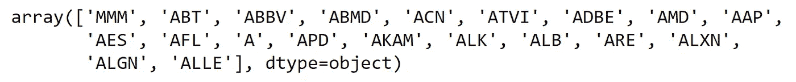
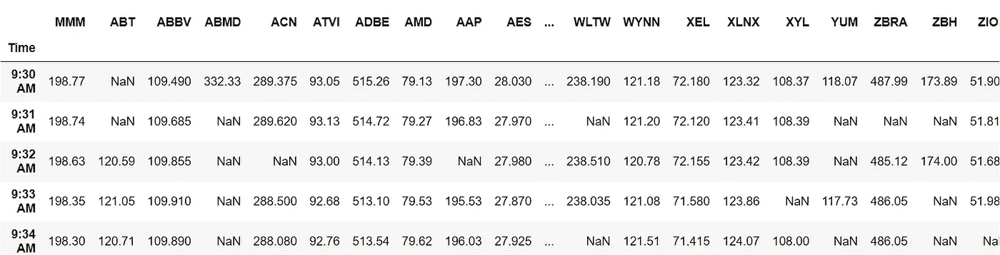
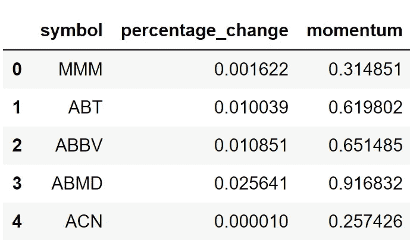
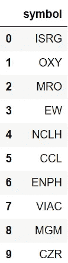
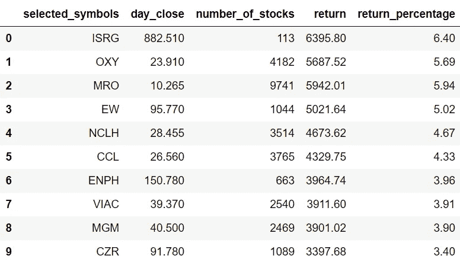

# 用 Python 中的量化动量策略选股

> 原文：<https://medium.com/codex/picking-stocks-with-a-quantitative-momentum-strategy-in-python-b15ac8925ec6?source=collection_archive---------0----------------------->

## 一个简单而有用的方法来优化选择股票的过程


[吉利](https://unsplash.com/@gillyberlin?utm_source=medium&utm_medium=referral)在 [Unsplash](https://unsplash.com?utm_source=medium&utm_medium=referral) 上拍摄的照片

**免责声明:**本文严格出于教育目的，不应作为投资提示。

# 介绍

当我还是一个业余交易者时，选择合适的股票进行交易的过程是一场噩梦。关于股票、不确定性和情绪的消息增加了这一过程的痛苦。遥遥领先，今天，我用我最好的伙伴 Python 找到了自己的解决方案。在本文中，我们将使用 python 构建一个简单的量化动量策略，该策略可以过滤并挑选出最佳的盘中股票。但是等等，什么是量化动量策略？

量化动量策略是一种选择价格涨幅最大的股票的策略。简单来说就是识别涨势很大的股票的过程。现在我们已经对什么是量化动量策略以及如何用它来选股有了一些了解。让我们用 python 实现策略吧！

# Python 实现

本文涉及的步骤有:

```
**- Importing the required packages****- Extracting the list of all S&P 500 stock's symbols****- Pulling Intraday data of all the stocks in the S&P 500****- Calculating percentage change and momentum of all stocks****- Finding stocks with greater momentum****- Backtesting with a equal-weight portfolio**
```

## 步骤 1:导入包

本文的主要包是处理数据的 Pandas 包、处理数组的 NumPy 包和使用 API 提取数据的 Requests 包。二级包是数学函数的 Math 包、复杂函数的 SciPy 包和统计函数的 Statistics 包。

**Python 实现:**

既然我们已经将所有需要的包导入到 python 环境中。让我们开始提取所有标准普尔 500 股票的符号列表。

## 第二步:提取所有标准普尔 500 股票的符号列表

我看到过构建复杂的 web 抓取功能来完成这个特定任务的教程。但是，这不是我们要遵循的方式，我们的代码将会更加简单和高效。

**Python 实现:**

**输出:**



作者图片

**代码解释:**正如我之前所说，我们不会使代码复杂化，也不会使用任何网络抓取技术来提取标准普尔 500 指数中股票的符号，但是，我们使用了 Pandas 软件包提供的一个名为“read_html”的高效函数。这个函数将在给定的 URL 中搜索表，并以列表格式返回数据。回到我们的代码，我们首先使用“read_html”函数提取 S & P 500 中股票的符号，并将其存储到“sp500”变量中。然后我们定义了一个变量‘sp 500 _ list’来将提取的数据存储到一个 NumPy 数组中。现在我们已经收集了所有标准普尔 500 股票的符号。我们来拉一些日内数据！

## 步骤 3:使用 IEX 云 API 提取当天数据

在这一步中，我们将使用 IEX 云 API 提取所有标准普尔 500 股票的当天数据。如果你不知道如何使用 IEX 云 API 提取股票数据，我建议你在这里[阅读我的文章](/codex/pulling-stock-data-from-iex-cloud-with-python-d44f63bb82e0#38d0)。

**Python 实现:**

**输出:**



作者图片

**代码解释:**这段代码可以分为三个部分:定义一个拉取日内数据的函数，使用定义的函数拉取 S & P 500 中所有股票的日内数据，保存并导入提取的数据。

第一部分包括从第 1 行到第 36 行的代码。在第一部分中，我们首先定义一个名为“get_intraday_prices”的函数，它以股票的符号作为参数。在函数内部，我们首先定义两个变量来存储 API 键和 URL。使用 Requests 包提供的“get”函数，我们以 JSON 格式提取当天数据。在做了一些数据处理和操作之后，我们以熊猫数据帧的形式返回数据。

第二部分包括从第 38 行到第 44 行的代码。在这一部分中，我们迭代股票的符号来提取每只股票的当天数据。我们将每只股票的当天数据存储到“df”变量中。

第三部分包括从第 46 行到第 48 行的代码。这一部分的主要目标是保存和导入提取的所有股票的日内数据。这一步是可选的，但是强烈建议您这样做，因为当您重新打开脚本时，您可以节省运行迭代过程的时间。我们首先使用 Pandas 软件包提供的“to_csv”功能将提取的日内数据保存在“sp500”的名称中。然后，在“read_csv”功能的帮助下，我们导入保存的数据帧。

## 步骤 4:计算百分比变化和动量

在这一步，我们将计算每只股票的日变化和动量。

**Python 实现:**

**输出:**



作者图片

**代码解释:**首先，我们创建一个名为‘PC’的空列表来存储每只股票的百分比变化。利用 for 循环，我们遍历标准普尔 500 指数中所有股票的符号，并使用 Pandas 软件包提供的“pct_change”函数将计算出的百分比变化附加到“dc”列表中。然后，我们创建一个名为“sp500_momentum”的数据框架来存储股票的符号、百分比变化以及我们将要计算的动量。

回到计算动量的代码，我们首先在“sp500_momentum”数据帧中创建一个名为“momentum”的列，并用空值填充它。然后我们传递一个 for 循环，用实际的动量值填充空值。

## 第五步:寻找更有动力的股票

在这一步中，我们将根据我们计算的动量值对股票进行排序，并找出动量最高的前 10 只股票。

**Python 实现:**

**输出:**



作者图片

**代码解释:**我一直遵循保持代码简单高效的原则。我也在这里做过。我们首先创建一个名为“top_picks”的数据框架，其中存储了前 10 只动量较大的股票。为了对前 10 只股票进行排序和查找，我们使用了 Pandas 软件包提供的‘nlargest’函数。

## 步骤 6:回溯测试

在这一步中，我们将通过在动量最高的前 10 只股票中投资等量的资金来进行回溯测试，让我们看看结果。

**Python 实现:**

**输出:**



**代码解释:**首先，我们定义两个变量分别存储总投资价值和每股投资价值。接下来，我们将传递一个 for 循环来查找所有前 10 名股票的当天收盘价，并将这些值附加到“day_close”变量中。在接下来的几行代码中，我们创建了一个名为“backtest_df”的数据框架，其中包括计算出的每只股票的买入数量、我们投资前 10 只股票的回报率，以及我们投资的回报率。如你所见，我们得到了不错的回报。就是这样！

# 最后的想法！

在本文中，我们学习了如何实施简单的量化动量策略来挑选可交易的股票。您可以从两个方面改进这篇文章:

*   **挑选股票进行长期投资:**在这篇文章中，我们挑选股票进行日内交易，但是，你也可以实施挑选长期可投资股票的策略。通过这样做，你将学会如何相应地调整定量动量策略，并使用几个指标来构建策略。
*   更多股票:本文仅基于标准普尔 500 指数(S &中列出的股票，但你也可以考虑在更多交易所上市的股票。执行此任务的优点是，在给定提取的数据量的情况下，您将能够进行大规模的研究，并且您可以掌握使用 stocks APIs 和数据处理提取数据的艺术，因为此任务需要大量的数据。

就是这样！您已到达这篇文章的结尾。此外，如果您忘记了遵循任何编码部分，不要担心！我在最后提供了完整的源代码。希望你能在这篇文章中找到有用的东西。如果你有任何改进这篇文章的建议，请留下你的评论。

## **完整代码:**