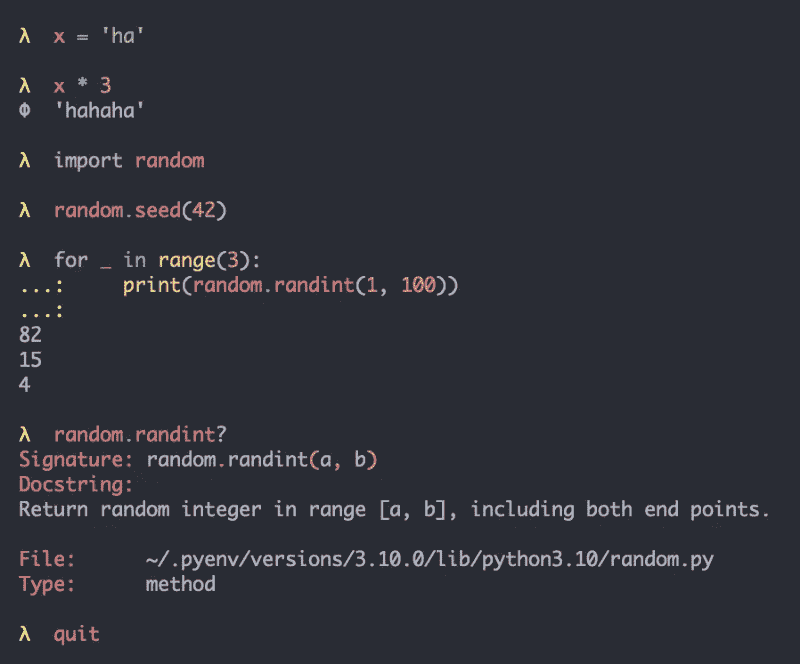
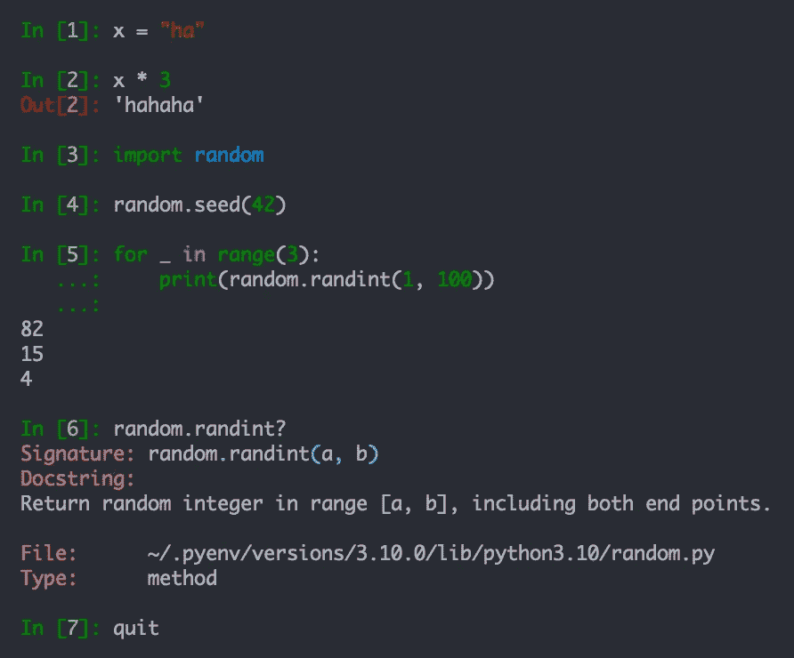
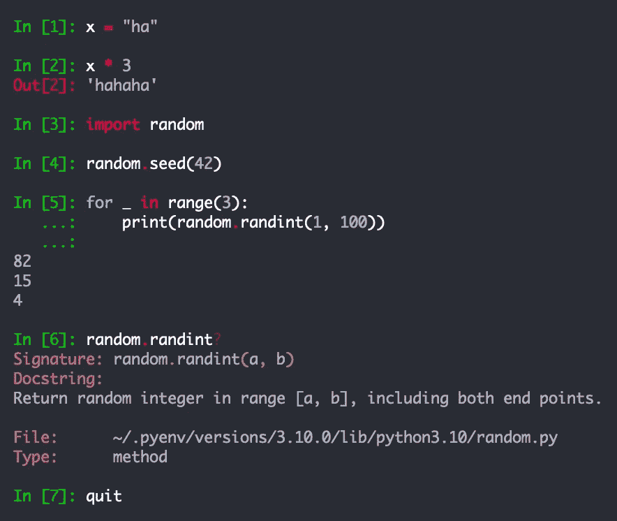
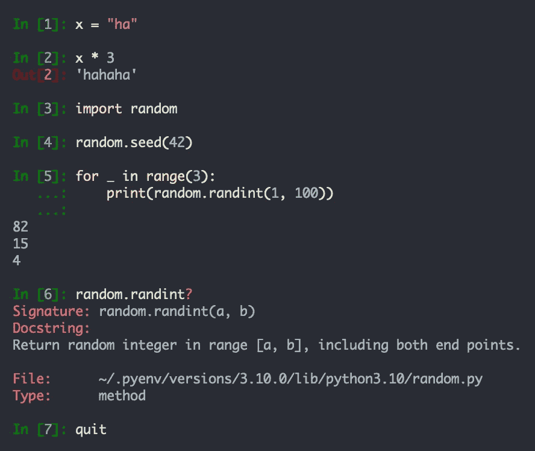
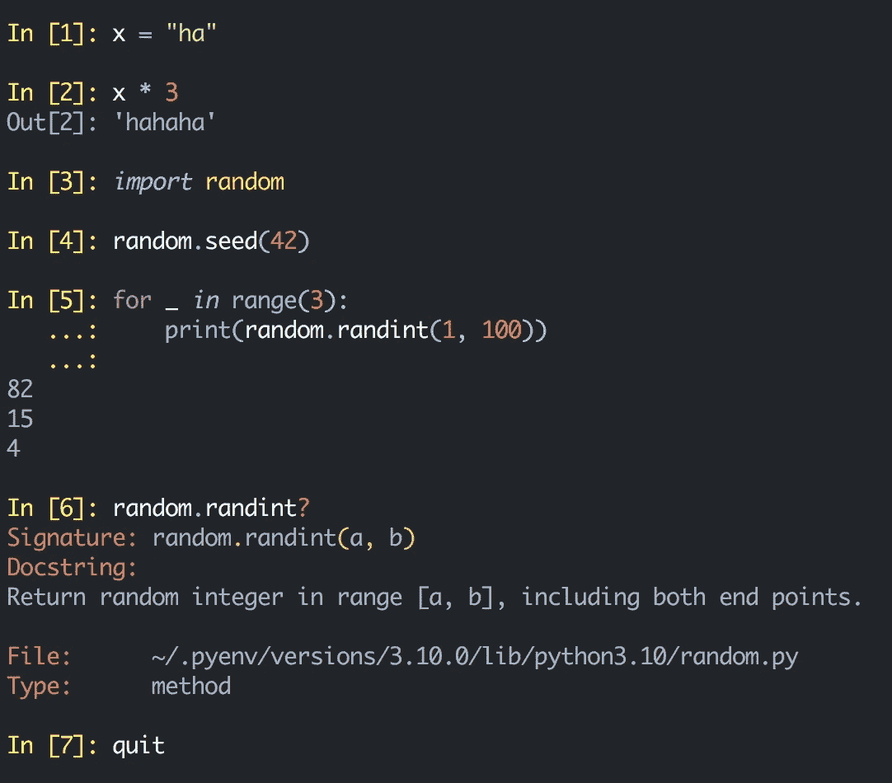
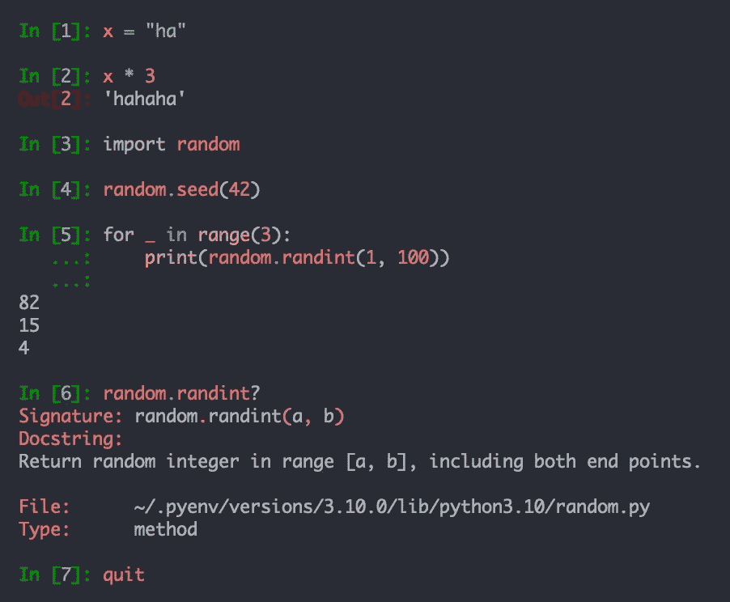
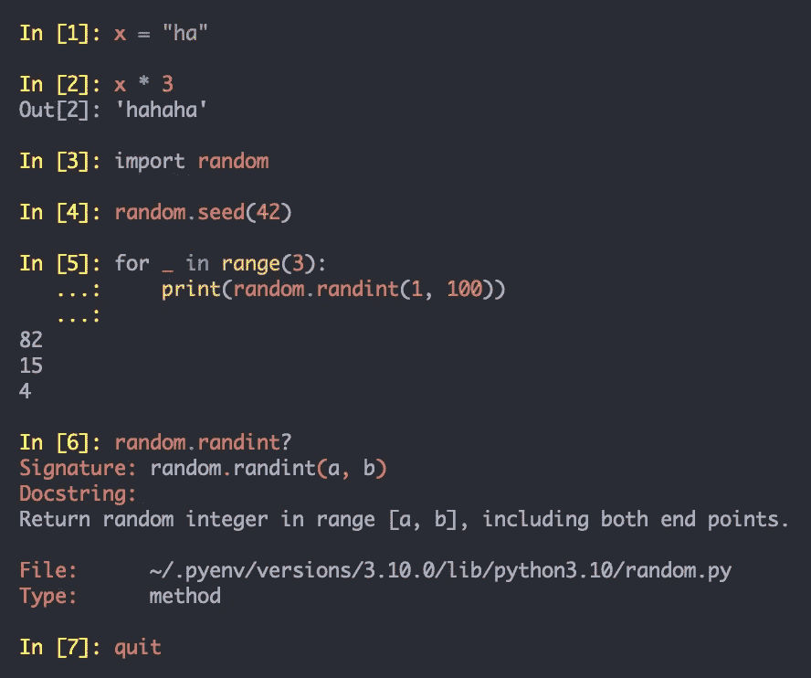
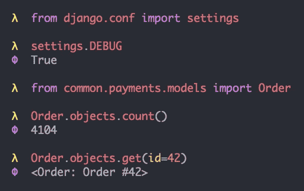
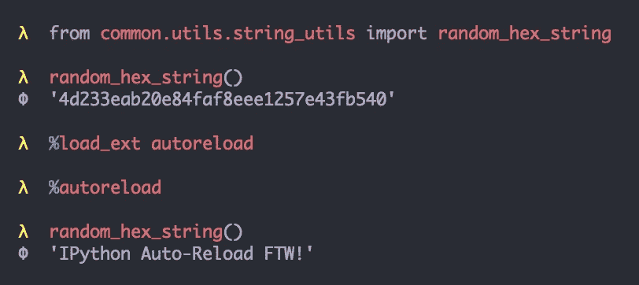

# 皮条客你的蟒蛇和姜戈壳

> 原文：<https://medium.com/codex/pimp-your-python-and-django-shells-db9c995c3735?source=collection_archive---------0----------------------->

使用 IPython 美化 Python/Django shell 的简单步骤


阿诺德·弗朗西斯卡在 [Unsplash](https://unsplash.com?utm_source=medium&utm_medium=referral) 上拍摄的照片

# 目标

*   有这样一个聪明的伊普森·REPL:



# 背景

[IPython](https://en.wikipedia.org/wiki/IPython)(**I**interactive**Python**)现在 20 岁了。它很成熟，有很多特性，而且非常受欢迎。它是一个交互式的 shell，一个 [eval()机器](https://www.youtube.com/watch?v=S0No2zSJmks&t=612s)，并作为各种客户端的**后端**，比如 IPython REPL shell(终端客户端)和 IPython/Jupyter Notebook(浏览器客户端)。

默认的 Python REPL(**R**EAD-**E**val-**P**rint-**L**OOP)外壳存在缺陷，因此 IPython 旨在改进 UI/UX。一些值得注意的 [IPython 特性](https://github.com/ipython/ipython#main-features-of-ipython):

*   **语法高亮**(更容易阅读代码或发现错误)
*   **标签完成**(少打字)
*   **自动缩进**(适用于`for`循环或`def`中的代码块)
*   自省(例如，`foo?`用于文档，`foo??`用于源代码)
*   模块的自动重新加载(方便/高效)
*   访问 Unix shell 命令(例如，`ls`、`pwd`、`cd`)
*   与 Django shell 整合
*   会话/历史被保存

仅前 3 条就足以成为放弃默认 Python REPL 的理由。

笔记本在统计学家、科学家、研究人员等中很受欢迎。虽然有很多定制 Jupyter 主题的资源，但是 IPython REPL 的资源却很少。而且它们相当稀疏，所以需要挖掘 IPython 文档，甚至源代码来定制颜色/提示。

# IPython Shell

*安装*

很容易安装:

`pip install ipython`

*捆绑配色方案*

IPython 捆绑了一些配色方案:`Neutral`、`Linux`、`LightBG`和`NoColor`。*默认*配色方案称为`Neutral`，可通过`—-colors` 选项调用:

```
ipython --**colors**=**Neutral**
```



另一种配色叫做`Linux`。同样，这可以通过以下方式调用:

```
ipython --**colors**=**Linux**
```



但是这些配色都不好看，尤其是深色终端。配色是个人的事。因此，用户很可能也想使用他们喜欢的配色方案。幸运的是，有一种方法。

# 色素细胞

[Pygments](https://github.com/pygments/pygments) 是一个用 Python 写的语法高亮器。对于 [Rich](https://github.com/willmcgugan/rich) 、 [Pdb++](https://github.com/pdbpp/pdbpp) 、 [PuDB](https://github.com/inducer/pudb) 、 [IPython](https://github.com/ipython/ipython) 等热门项目来说是一个依赖。因此，当您安装 IPython 时，它也会自动安装。

*已安装的主题*

Pygment 捆绑了很多主题。我们可以通过以下方式轻松检查可用/已安装的主题:

```
pygmentize -L styles
```

这些配色方案在 [Pygments 网站](https://pygments.org/styles/)上有截图，所以你会对它们在终端上的外观有所了解。

# IPython 主题

*Zenburn 配色方案*

我们可以在调用命令时在 IPython 中指定配色方案。例如，要使用`zenburn` 配色方案:

```
ipython --TerminalInteractiveShell.**highlighting_style**=**zenburn**
```



*Python/IPython 覆盖*

然后我们可以在`.bashrc`或`.zshrc`中设置这些方便的 shell 别名，这样调用`**python**`或`**ipython**`将自动调用带有主题的`ipython`:

```
alias **python**="ipython"
alias **ipython**="ipython --TerminalInteractiveShell.**highlighting_style**=**zenburn**"
```

*字体样式*

在[样式库](https://pygments.org/styles/)中，你会注意到一些主题有斜体/粗体字符，比如在`material`和`dracula`主题中。这些主要取决于你的终端。例如，我的 fast [Alacritty](https://github.com/alacritty/alacritty) 终端不支持连字/带样式的字母，但它在我的 [iTerm2](https://github.com/gnachman/iTerm2) 上呈现得很好。下面是使用 iTerm2 和`material`主题时的截图，注意`***import***`和`***_***`是斜体的:



***一暗*** *配色*

一片黑暗是我最喜欢的主题。它由 Atom 推广，目前是 VS Code、PyCharm 或 Vim 中最流行的主题之一。我所有的编辑器、ide、终端都在用。

幸运的是，自从两周前的[开始，这款](https://github.com/pygments/pygments/pull/1924)[也有了小版本](https://github.com/pygments/pygments/blob/master/pygments/styles/onedark.py)。但是，这意味着它在 PyPI 上还不可用。上一次`pygments` 的 PyPI 更新是差不多 4 个月前(2021 年 8 月 15 日)。所以，当你运行`pygmentize -L styles`时，它不在列表中，其他最近的主题也可能不在列表中。

于是，我在 GitHub 上下载了`pygments`的[最新版本](https://github.com/pygments/pygments/archive/refs/heads/master.zip)，然后复制了`styles`文件夹，并覆盖了我安装的`pygments`的 **2.10.0** 版本中的`styles`文件夹:

```
.../site-packages/pygments/**styles**
```

我现在可以运行它:

```
ipython --TerminalInteractiveShell**.highlighting_style**=**one-dark**
```



# IPython 配置

其他用户可能会在这一点上停止，因为我们已经有了一个配色方案。但是其他人可能仍然对冗长的 IPython **提示符**及其编号和/或颜色感到恼火。

*IPython 配置文件*

为了定制 IPython 的各个方面，包括提示，我们可以创建一个概要文件，这样我们就可以将我们的定制/覆盖放在那里:

```
ipython **profile** **create**
```

这将创建名为 **profile_default** 的默认配置文件:

```
~/.ipython/**profile_default**
```

IPython 将在其中自动创建一个**配置文件**:

```
~/.ipython/profile_default/**ipython_config.py**
```

如果您检查配置文件的内容，它包含 IPython 的默认设置，这些设置是注释行，它们都以全局 config ( `**c**`)对象命名空间/前缀。

*提示颜色*

要更改提示颜色，我们可以利用这个属性:

```
# Override highlighting format for specific tokens
# **c.TerminalInteractiveShell.highlighting_style_overrides** = {}
```

例如，您可以将它放在配置文件中的任何位置:

```
from IPython.terminal.prompts import Token**YELLOW** = '#FFFF5C'
**VIOLET** = '#BD93F9'c.TerminalInteractiveShell.**highlighting_style_overrides** = {
    Token.Prompt: YELLOW,
    Token.PromptNum: YELLOW,
    Token.OutPrompt: VIOLET,
    Token.OutPromptNum: VIOLET,
}
```

`Token.Prompt`、`Token.PromptNum`、`Token.OutPrompt`、`Token.OutPromptNum`对应 IPython 输入输出提示，即`In [1]:`和`Out[2]:`。这看起来更好:



*提示字符*

现在，提示颜色对我来说是可以接受的，但它仍然太冗长，我只想有一个最小/光滑的提示。我们可以通过从`Prompts`类继承并覆盖提示方法来轻松覆盖默认提示。您可以将任何字符放入 [**记号**](https://ipython.readthedocs.io/en/7.x/config/details.html#custom-prompts) 列表中，就像放入`>>>`一样，以符合通常的 Python 提示:

```
from IPython.terminal.prompts import Prompts, Tokenclass MyPrompt(**Prompts**): def **in_prompt_tokens**(self, cli=None):
        tokens = [
            (Token.Prompt, '**λ**  ')
        ]
        return tokens def **out_prompt_tokens**(self):
        tokens = [
            (Token.OutPrompt, '**Φ**  ')
        ]
        return tokensc.TerminalInteractiveShell.**prompts_class** = **MyPrompt**
```

这将呈现对我来说足够好的最终表单，并与我的其他终端定制保持一致:


主题配置

既然我们现在有了一个配置文件，我们也可以在其中设置主题:

```
c.TerminalInteractiveShell.**highlighting_style** = '**one-dark**'
```

因此我们不需要在`ipython`调用期间设置它，或者不需要如上所述为它设置 shell 别名。

# 姜戈壳牌公司

如果安装了 IPython，Django `shell`或`[shell_plus](https://django-extensions.readthedocs.io/en/latest/shell_plus.html)`将利用它，这也将加载您的定制概要文件/配置。这是使用 Django `shell`时的示例:



*自动重新加载*

IPython 有自动重新加载机制，这在使用 Django `shell`时非常方便，因为如果您更新了 Django 代码，就不需要再次运行`manage.py shell`。只需要加载/调用`autoreload` IPython 扩展:

```
# Load
%load_ext **autoreload**# Invoke
%**autoreload**
```

在下面的运行示例中，`**random_hex_string**()`返回一个随机的十六进制字符串，然后我修改了它的定义/返回值，保存了更改，加载/调用了 IPython `autoreload`，然后再次调用了`random_hex_string()` 。我故意硬编码了一个无效的十六进制字符串`IPython Auto-Reload FTW`返回文本，只是为了证明函数定义确实被修改了。实际上，更新后的代码无需重启 Django `shell`即可执行:



# 关键要点

*   IPython 是一个成熟的项目，非常受欢迎，相对于默认的 Python REPL 有很多特性和改进。重要的特性是语法高亮、制表符补全和自动缩进。
*   某些用户不接受默认的 IPython 颜色/提示。尽管定制它们很容易。
*   IPython 使用色素着色。我们可以列出可用的主题:

```
pygmentize -L styles
```

*   我们可以在运行`ipython`时设置 IPython 主题:

```
ipython --TerminalInteractiveShell.**highlighting_style**=**one-dark**
```

*   我们可以创建一个默认配置文件:

```
ipython profile create
```

*   我们可以将我们的定制(颜色、提示等)放在 profile/config 文件中:

```
~/.ipython/profile_default/**ipython_config.py**
```

*   Django `shell`或`[shell_plus](https://django-extensions.readthedocs.io/en/latest/shell_plus.html)`将自动加载 IPython 及其配置文件(如果可用的话)。它还可以自动重新加载导入的模块，避免重新运行`shell`。
*   IPython 可以取代 ide 终端中默认的 Python REPL，比如 PyCharm/VS 代码。
*   IPython 有许多强大的特性。看看这个有趣的"[等等，IPython 能做到吗？！](https://www.youtube.com/watch?v=S0No2zSJmks)”演示，包括对 IPython 替代方案的讨论，如`bpython`和`ptpython`。

感谢您的阅读。如果你发现了一些价值，请关注我，或者为文章鼓掌/评论，或者[请我喝杯咖啡](https://ko-fi.com/ranelpadon)。这对我意义重大，鼓励我创作更多高质量的内容。