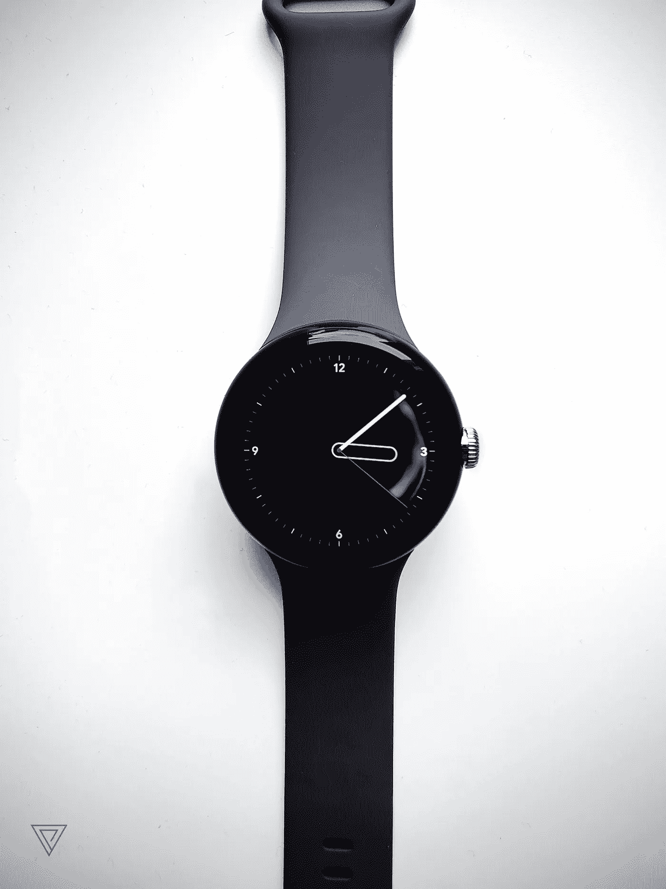

# 像素手表— 50 天后

> 原文：<https://medium.com/codex/pixel-watch-50-days-later-2572ffae71c3?source=collection_archive---------0----------------------->

Pixel 手表中众多独特表盘之一。

那是 2017 年，当我第一次读到谷歌智能手表的传言时，我正在摇我一岁的 Nexus 5x。但是，除了当年与 LG 合作推出漫无目的的 Android Wear 2.0 可穿戴设备的短暂合作，以及随后几年的一些大牌收购之外，谷歌之后的事情基本上保持沉默。

> 直到现在。