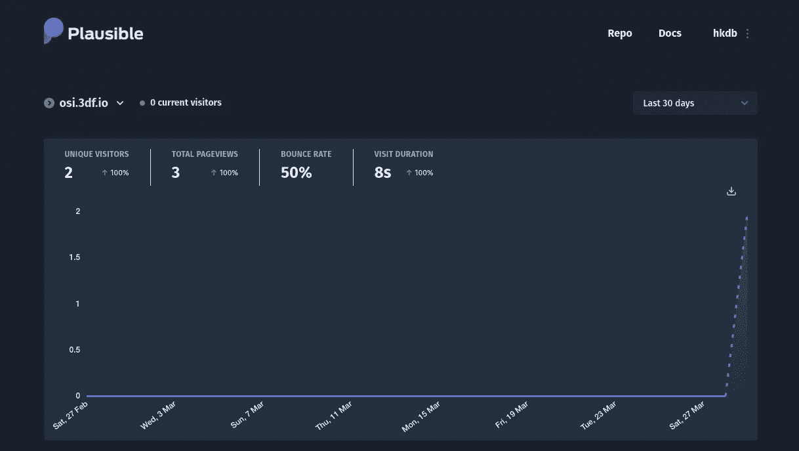

# 似是而非:自托管分析

> 原文：<https://medium.com/codex/plausible-self-hosted-analytics-5370fc1aa889?source=collection_archive---------7----------------------->

## 开源、轻量级、非常简单、注重隐私

现在[我的个人电子邮件和文件共享又都是自托管的](https://link.medium.com/iQDi5Nsh2eb)，使用谷歌进行分析就没什么意义了，不是吗？所以我四处寻找一个自托管的开源解决方案，并偶然发现了这个叫做[似是而非的](https://plausible.io/)的小东西。当然，谷歌分析是强大的，我们可能无法…