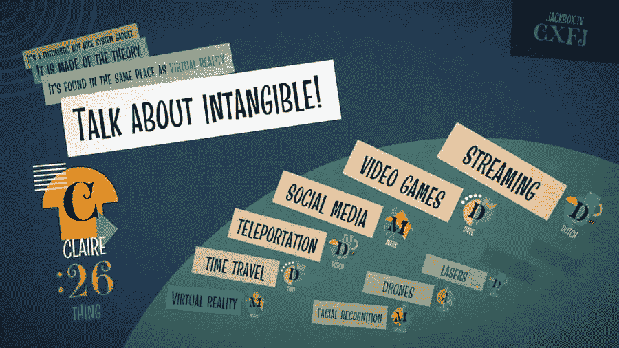
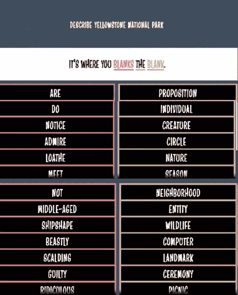
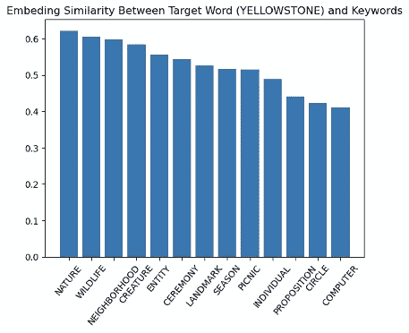
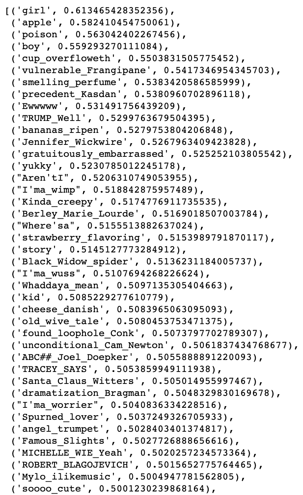
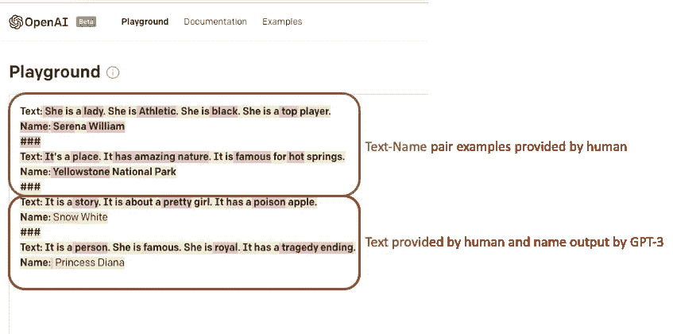

# 使用自然语言处理玩文字游戏

> 原文：<https://medium.com/codex/playing-word-games-using-natural-language-processing-92e7c2ed37ee?source=collection_archive---------7----------------------->

# 介绍

我经常被同事邀请去参加一个叫做“乱说”的聚会游戏。在这个游戏中，我们每个人轮流(作为**主持人**)描述一个秘密物体(一个人、一个地方、一部电影等等)。但是描述句只能由有限数量的关键词组成。其他玩家(如**猜测者**)可以根据提示输出任意多的猜测。如果在限定的时间内猜对了，那么**主持人**和**猜对者**都将获得该轮的分数。如果时间到了，没有任何正确的猜测，不得分。一个简单的例子是这样的:**主持人**提供如下描述句子:

**这是个故事。**

这是关于一个漂亮女孩的故事。

它有一个毒苹果。

中奖的**猜者**猜“白雪公主”。

成功的猜测取决于两件事: **1** 。**主持人**和 **2** 给出的提示。**猜测者**将暗示理解为关于目标对象的预见特征。

作为一名移民，由于我有限的词汇量和不同的文化背景，英语单词游戏对我来说总是很难。毫不奇怪，这个游戏非常具有挑战性，因为成功的猜测取决于这样一个假设，即**呈现者**和**猜测者**都具有关于这个单词的上下文知识。如果**猜测者**和**呈现者**在阅读同一本书、观看同一部电影/电视或任何其他社会文化背景知识的经历上几乎没有重叠，则成功得分的机会将非常低。

不过作为一个**数据科学家**，我也对这个游戏作为一个有趣的 ***自然语言处理*** ( **NLP** )挑战很着迷。我特别好奇在玩“乱说”的时候，现代 NLP 技术的发展是否会对我有所帮助。

从一个 **NLP** 的角度来看，你可能首先把这个游戏看作一个问答序列预测问题。但事实上，通过隐式提供多个提示来识别一个对象与 QA 序列预测并不完全相同。一个简单的方法可以用来区分这两个问题是“搜索引擎”。问题总是明确的，并准备好链接到搜索输出中相应的答案，而隐含提示的搜索往往会迷失在偏离的主题中。或者，游戏可以被认为是一个分类序列预测问题，其中隐含的提示描述作为输入，被识别的对象作为标签。正如您所想象的，这个模型必须训练大量的词汇数据，以便理解提示和目标对象词汇之间的内在上下文联系。

在本文的其余部分，我将展示一些由 **word2vec** 嵌入和 **GTP-3** 模型帮助的游戏示例。总之， **word2vec** 可能有助于展示者在提出提示描述句子时选择最相关的关键词，但事实证明它对猜测者猜出正确的对象几乎没有帮助。与此同时, **GPT-3** 模型在根据隐含的句子描述击中正确的目标方面表现出色。

# **使用 word2vec 嵌入相似度为提示选择正确的关键字**

**w**[**ord2 vec**](https://en.wikipedia.org/wiki/Word2vec)是现代 NLP 技术发展中最重要的突破之一。通过 **word2vec** 模型训练实现的单词嵌入可以以某种方式用于表示不同单词之间有意义的距离。 **word2vec** 的模型训练细节不在本文讨论范围之内。

回到“乱说”回合，当一个**展示者**试图选择相关关键词来为**猜测者**提供最有信息的提示时，嵌入目标对象词和可选关键词之间的相似性可以提供良好的指导。

下图展示了一个例子，当**演示者**需要选择关键词来描述目标对象“黄石公园”时。“自然”和“野生动物”是两个很好的选项，因为它们在列表中具有最高的嵌入相似性。

# 使用 GPT-3 模型猜测正确的对象

正如我们所讨论的，通过隐式地提供多个提示来识别一个对象不是一件容易的事情，这需要通过大量的数据训练在提示和目标对象词汇之间有内在的上下文理解。在这种情况下， **word2vec** 模型不适合解决这个问题，因为训练数据的大小有限，并且缺乏内在的注意力建模。拿同样的《**白雪公主**》举例。如果我们简单地对那些被选中的关键词(“故事”、“漂亮”、“姑娘”、“毒药”、“苹果”)的嵌入矩阵进行平均，提取出嵌入相似度最高的前 50 个词(如下 trunked table)，“**”白雪公主**”甚至都没有出现。为了击中正确的目标，它几乎要求像人类一样的理解，这以某种方式将“故事-女孩-毒药-苹果”联系起来，作为“**白雪公主**故事的明显特征。

[**GPT-3**](https://en.wikipedia.org/wiki/GPT-3) 是当今最前沿的 NLP 模型之一，据报道基于变压器的 1750 亿个参数，它已经证明达到了人类的智能性能水平。它会克服“乱说”游戏中显示的类似挑战吗？幸运的是 [OpenAI](https://openai.com/) 提供了一个方便的操场 API 供我们试用。下图显示了一些初步结果。API 首先询问一些例子来帮助理解 NLP 任务。提供两个“文本-名称”对来指示基于句子描述的对象分类任务。接下来， **GPT-3** 模型根据接下来两个例子中的描述性提示语句成功输出“白雪公主”和“戴安娜王妃”。同时，它提供了一个彩色编码的突出显示，以指示关于模型输出的注意概率。

**GPT-3** 被证明是一个优秀的自然语言处理模型，有助于这个文字游戏。值得注意的是，当你使用 OpenAI 玩文字游戏时:

1.  **GPT-3** 模型是由 2019 年之前的词汇数据训练的，它可能不会很好地猜测 2019 年之后出现的任何流行对象。
2.  正确的对象识别在很大程度上取决于演示者提供的横截面关键词。在最后一个文本名称示例中，如果只提供了前三个句子作为“ ***，则它是一个人。她很有名。她是皇家的*** ，模特会输出名字为**【伊丽莎白二世女王】**
3.  OpenAI 根据 NLP 任务的不同侧重点提供了不同的模型变体，可能需要进行一些尝试和测试来选择最佳模型。
4.  尝试不同的温度参数，找出模型输出的最佳随机设置。

最后，我希望你喜欢阅读这篇文章，并请不要犹豫，提供一些掌声！