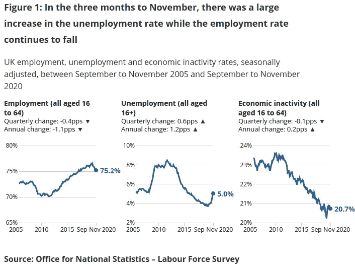

# 插入 ONS Beta API

> 原文：<https://medium.com/codex/plugging-into-the-ons-beta-api-68438e572b49?source=collection_archive---------5----------------------->

## [法典](http://medium.com/codex)

## 使用该界面绘制英国劳动力市场的统计数据。

**16 至 64 岁的成年人中有多少人在就业？国家统计局进行了一项[劳动力调查](https://www.ons.gov.uk/employmentandlabourmarket/peopleinwork/employmentandemployeetypes/methodologies/labourmarketsurveytechnicalreport)。**

统计学家利用这次调查的结果来估计这一份额。这项调查还估计了失业率和其他关键指标。

本文使用截至 2020 年 11 月的三个月报告。(图片: [ONS](https://www.ons.gov.uk/employmentandlabourmarket/peopleinwork/employmentandemployeetypes/bulletins/uklabourmarket/january2021) )