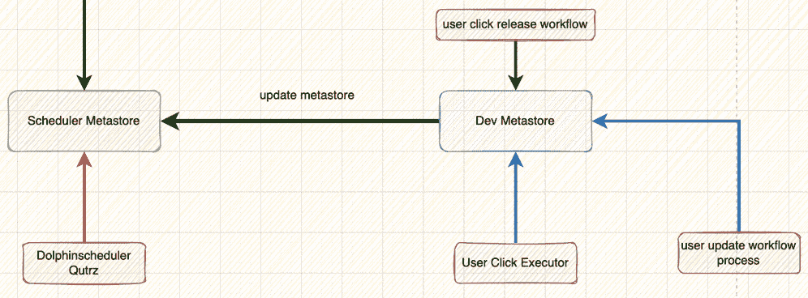
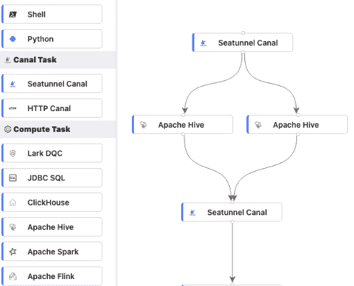
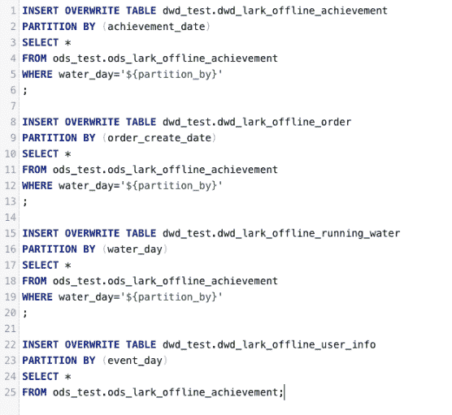
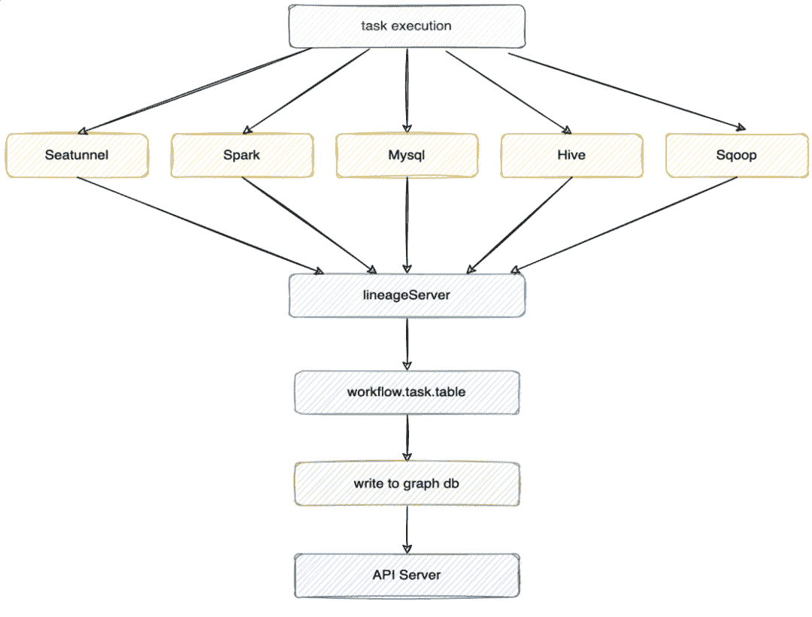
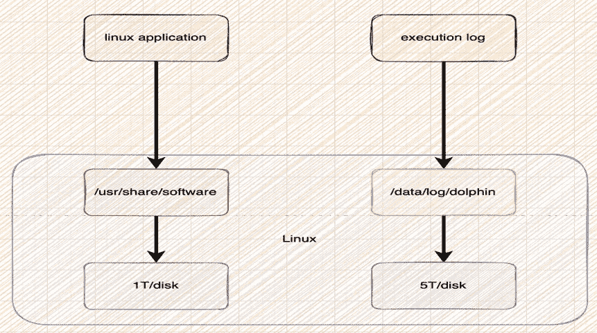
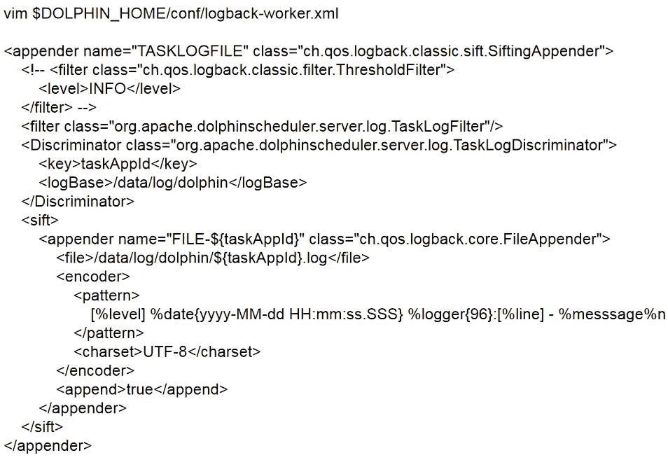

# 插件扩展、沿袭耦合系统、生产环境优化、应用程序重构以简化 Apache DolphinScheduler 的使用

> 原文：<https://medium.com/codex/plugin-extensions-lineage-coupling-systems-production-environment-optimization-the-application-161eb0b53b16?source=collection_archive---------23----------------------->


Apache DolphineScheduler，新一代大数据任务调度系统，旨在让调度更简单。为了更好地为用户服务，Apache DolphineScheduler 贡献者 Baiqiang Zhang 提供了一些解决可用性现有问题的解决方案，如任务扩展、任务谱系耦合、任务日志优化等。，并在四月份的 Apache DolphinScheduler 在线会议上展示了它们，详细解释了他的一些应用实践和对 Apache dolphin scheduler 的优化。

分享的主要内容如下。

*   基于 Apache DolphinScheduler 的重构
*   Apache DolphinScheduler 插件的扩展
*   Apache DolphinScheduler 沿袭耦合系统
*   优化 Apache DolphinScheduler 以适应生产环境


张百强，大数据基础平台开发者，从事大数据基础平台开发和底层组件运维

# 01 在 Apache DolphinScheduler 上重构

## 1 在多种环境中重构元数据和任务执行

Apache DolphinScheduler 的 3.x 和 2.x 版本在元数据和多种环境中的任务执行方面存在缺点，社区目前尚未进行功能优化，即，

1.无法在线编辑任务

2.任务不能在 Pro/Test 环境之间动态切换

3.不能使用多个调度程序设置同一个流程工作流

**1.1 元数据分离重构**

为了解决多个环境中的元数据和任务执行问题，我们对 Apache DolphinScheduler 进行了基本的修改。

改革始于任务上线后不可编辑的问题，这导致用户体验不太友好，如果随机更改，会影响在线调度。通常，任务只有在完全开发后才能修改，如果没有，它们不能在线弹出，因为它们可能会影响下游的依赖关系。因此，我们修改了 Apache DolphinScheduler 元数据，将用户编辑的任务和调度的任务分成两个独立的部分，这样，当用户单击任务发布时，它会触发对依赖于调度的任务信息表的更改，而用户的本地执行和修改都不会触发依赖于调度的任务信息表。



如上图所示，当用户点击执行一个任务时，当一个任务被修改时，操作指向 Dev 的元数据。当用户点击发布任务，通过 Dev 发布到 Apache DolphinScheduler，即调度元数据，调度元数据就可以执行了。这有助于我们解决任务编辑的问题。如果不发布任务，我们的任务不会影响在线任务。这相当于任务的多态转换，即测试和生产。

**1.2 多环境执行重构**

第二个问题的改进:任务动态地切换环境。基于最新版本的 Apache DolphinScheduler 2.x.x，支持多种环境，我们给出了一个部署配置 scheduler . executor . environment . name，这个参数用来决定一个任务通过多种调度执行时应该使用哪种环境。比如调度 a 时用测试环境，调度 b 时用生产环境，任务执行的转换是通过参数配置自动完成的。

## 增加了 2 个任务信息列表

为了增强 UI 页面的可用性，我们特意添加了任务列表功能，以减少用户操作并在一个页面上显示消息。在原生 Apache DolphinScheduler 中，我们需要多次点击才能找到任务执行记录，部分任务的详细信息并不全面，包括任务最近的执行状态。同时，我们还修改了任务向上/向下模块，以单独显示任务。页面内容包括链接到版本的任务版本、任务历史、最近 10 次执行实例、任务名称、编辑任务流程、任务版本管理、定时管理、任务下载等。

## 3 项目文件夹功能扩展和工作流 UI 修改

在本地 Apache DolphinScheduler 中，不可能创建第二个调度程序。目前，我们已经修改了用户界面，以支持多种调度设置的调度任务。

具体来说，Apache DolphinScheduler 提供了一个基于项目的最大单元，每个项目包含数百或数千个工作流单元，以及工作流下的任务。虽然它本身包含分页功能，但就使用场景而言，如果一个项目包含太多的工作流，用户将会弄不清该任务下有哪些任务，也无法根据当前项目的服务线划分任务。为了方便用户操作，我们提供了一个单位服务行文件夹，分为项目->工作流目录->目录，并修改了工作流定义界面的界面风格，如下图所示:



脚本任务

# 02 Apache DolphinScheduler 插件扩展

我们目前已经创建了许多类型的任务，但通常只使用三个类别，即 Spark/Hive ClientSQL 任务、DQC 任务和 SSH 任务。

## 1 个 Spark/Hive 客户端 SQL 任务

Apache DolphinScheduler 的开箱即用任务仅提供了一种通过 JDBC 执行 SQL 任务的形式，但是对于一些筒仓场景，这些任务类型是不够的，因此我们提供了 hive/spark SQL 任务的基于模板的配置。但是，这可能会对其他系统产生影响，所以我们将其作为一个模板，它支持多个 SQL，并包含高级参数，即所有 Spark 参数和所有 Hive 参数的列表，供用户搜索和配置，而其余功能保持不变。这些修改对允许用户快速开发离线任务有很大的影响，同时将当前任务绑定到一个谱系系统，该系统可以在任务执行时包含完整的可追溯谱系。



SQL 语法

## 2 DQC 任务

当前 2.x 版尚不支持 DQC 任务。我们基于一组现有规则改进了 DQC 任务的第一个版本，提供了空值检查、最大值检查、最小值检查、重复检查和数据量检查，并支持多分类、多表比较和用户定义的函数。以上功能相对容易实现，相当于将规则包装成 Spark SQL，通过 Spark SQL 或其他方式执行。

在优化方面，对于统计数据量，我们编写了专门的程序，直接从 ORC 文件中读取数据量，提高资源利用率。目前，我们已经完成了包括任务检测、DQC 警报和自定义规则在内的功能集成，但 DQC 尚未覆盖所有大数据场景。

## 3 SSH 任务

SSH 任务提供了一个任务模板。在某些场景下，如果 Apache DolphinScheduler 的工作人员不在机器上，我们需要自己定时执行任务，比如每天定时清理日志，定时操作某些 bash。为了统一管理，我们为快速开发提供了冗余任务。

# 03 Apache DolphinScheduler 沿袭耦合系统

沿袭耦合一直是社区中比较流行的需求之一，所以我将借此机会谈谈我们对此功能所做的改进，供您参考。

## 1 任务表沿袭绑定

首先，是任务表沿袭绑定。当 Apache DolphinScheduler 执行一个任务时，我们会根据类型得到以下类型，并将这些类型的任务内容、任务名称、工作流名称写入沿袭服务器，然后在沿袭服务器建立沿袭后写入 graph db 或 Hbase，最后通过 API 查询数据进行显示。



任务类型包括 SeaTunnel、Spark、MySQL、Hive 和 Sqoop。我们如何从数据中提取血统？

首先，数据提取是沿袭的来源，我们通过 SeaTunnel 和 Sqoop 本身包含的配置文件构建沿袭节点，并将配置文件发送到 lineageServer。lineageServer 相当于一个客户端，目的是解析接收到的配置文件和一些变量数据，并将其发送到 MQ。

其次，数据仓库的 Spark 实现包括 Spark 的监听器和 SparkSql 的 SparkSessionExtensions。

再者，MySQL 是自定义解析规则，使用 antlr4 工具，你可以使用 Druid 或者其他你认为合适的解析工具。

最后，hive 类型使用了一个 Hive 钩子。钩子在 SQL 执行前有一个触发器，在 SQL 执行后有一个触发器，它向下游发送关于执行的信息。

LineageSource 的具体实现是解析所有的用户定义，包括数据提取和目标数据，LineageSource 解析 SeaTunnel 和 Sqoop，将配置发送给下游的沿袭服务，沿袭服务会将其解析成一个大的 json str，发送给 MQ，我们会在解析中将其绑定到 workflow.task.database.table 格式的 WorkflowName 和 TaskName。在这个过程中，我们如何获得工作流和任务名称？在 Apache DolphinScheduler 实现中，用户的任务最终被封装到一个 shell 中执行。然后将工作流名称和任务名称导入到流程级环境变量中，或者使用流程 API 进行设置，并在下游触发挂钩。当 hook 被触发时，环境变量仍然存在于同一个进程下，因此当 hook、spark listener 或 lineage service 触发时，它读取环境变量，在获得工作流名称和任务名称后将其连接成一个大的 JSON，其中包含了关于 lineage 的全套信息，然后 lineage 的 JSON 数据被发送到 MQ，由 lineage 的下游读写到图形库、Hbase 或 MySQL，最后通过 API 服务器显示出来。

如果您想构建更深层次的沿袭服务，您需要了解常见的 SQL 解析工具，包括

*   antlr4，通过它可以编写规则，生成规则类文件，然后直接使用解析。这个工具目前由 Apache Spark 使用。
*   方解石是 Apache Flink 目前使用的工具。
*   Druid，它有一个完全打包的 API，可以解析 Hive 和 MySQL。
*   解析包 Hive-exec.jar 和 Spark-sql.jar. Native 解析包会提供一个解析的公共 API 直接调用，也可以解析 sql 然后封装血刃。

## 2 沿袭存储设计建议

*   h 基本存储

我们用 Hbase 存储来存储 Atlas 中的血统，Neo4j 原生支持血统，那么为什么要用 Hbase 来存储血统呢？这是因为与使用 Neo4j 数据库相比，我们不需要进行任何额外的学习。

复杂的是世系的设计，首先，我们以世系表结构为例，最简单的设计是

```
tableName lineage_table (split[])
rowkey
column family s t
```

第一行:为 Hbase 定义表名 lineage_table

第二行:设计 rowkey。rowkey 是要搜索的表的当前名称。Hive 的 hook 机制执行完任务 SQL 后，会将信息发送给下游。会有一个 DDL 监控，当用户触发 DDL 时，比如用户创建了一个新表，它会在 Hbase 中推送或者插入数据，包括创建时间和表名，表名就是它的 rowkey。

第 3 行:列簇。有 2 种柱簇设计，包括源和目标。比如表 a 对应上下游任务表谱系，上游相当于源，下游相当于目标。这两个列簇将沿袭写入源和目标。

在应用程序级查询时，可以直接根据显示的行键查找所有的源和目标。这是一个简单的想法，由于各种原因，我们还没有应用。如果你对 Hbase 有很深的了解，我们建议你深入研究一下。一旦写入数据，我们每次只扩展最近的谱系，并根据最近的谱系按顺序扩展，而更新任务需要发送一个事件来删除旧的谱系和其他操作。

*   Neo4j

如果您知道如何使用 Neo4j，存储血统信息比使用 Hbase 更容易，因为它对血统的自然支持，不需要设计自己的血统。

# 04 Apache dolphin scheduler 的生产基本优化

## 1 任务日志存储优化

任务调试对于服务于用户和开发人员的调度系统来说是必不可少的。通常，任务调试从演示、调试和日志开始，因此针对任务执行日志的调试对用户来说是必不可少的。随着任务的增加和时间的推移，日志会增加，但企业中的服务器往往有单独的存储磁盘和应用程序磁盘，所以我们需要采取的第一步是改变 Apache DolphinScheduler 的执行日志的位置。



如上图所示，部署应用程序的目录挂载在 1T 磁盘上，写入执行日志的目录挂载在 5T 磁盘上，用于可插拔数据磁盘。这是关于分裂。

写的时候需要修改 conf 下的 logback-worker，log base 和 file 标签的内容，写到相应的位置。因此，可以划分日志、执行日志和应用程序，减少服务器的压力，方便日志监控和日志清理，而无需采取其他操作。



## 2 经验分享

在修改 Apache DolphinScheduler 的过程中，我们也获得了一些经验与大家分享。

**1。实例数据是如何管理的？**

随着系统继续在线运行，实例数据会随着时间的推移逐渐重现，但是删除大量实例数据或者存储并不是一个好的解决方案。这个问题的更好的解决方案是拆分数据库和表，将数据写入 HDFS，并留给 HIVE 管理，只将历史统计数据写入 MySQL。第二种方式是修改 Apache DolphinScheduler 的查询，需要添加一些聚合，比如 Hive 结果和历史数据的聚合。

**2。Shell 结果抓取失败的原因是什么？**

shell 的执行机制是，一旦一行代码报告错误，如果下一行还有代码，它仍然会执行，如果下一行代码正常执行，它将返回 0。我们可以设置。

**3。如何添加新的管理员用户？**

将原生 Apache DolphinScheduler 的 t_Apache DolphinScheduler_user 表中的 user_type 改为 0。

**4。如何在原生 Apache DolphinScheduler 中使用双环境执行？**

要保证 Apache DolphinScheduler 在两个集群中都可以运行，最简单的方法就是将 worker 部署到测试环境中，在这种情况下我们可以动态选择任务执行时执行哪个 worker；如果不想部署太多的 worker，可以设置两个不同的执行 env，然后在不启动服务的情况下将测试环境包部署到其中一个 worker 位置，甚至可以取消 service jar，只依赖客户机及其配置文件。如果您需要确保数据一致性，您将需要使用外部工具，如 DQC 工具和定制开发工具。

以上就是我要分享的，谢谢！

# 加入社区

参与 DolphinScheduler 社区并为其做出贡献的方式有很多，包括:

文档、翻译、Q & A、测试、代码、文章、主题演讲等。

我们假设第一个 PR(文档、代码)是简单的，应该用来熟悉提交过程和社区协作风格。

所以社区整理了以下适合新手的问题列表:[https://github.com/apache/dolphinscheduler/issues/5689](https://github.com/apache/dolphinscheduler/issues/5689)

非新手问题列表:[https://github.com/apache/dolphinscheduler/issues?q = is % 3A open+is % 3A issue+label % 3A % 22 volunteer+wanted % 22](https://github.com/apache/dolphinscheduler/issues?q=is%3Aopen+is%3Aissue+label%3A%22volunteer+wanted%22)

如何参与投稿:[https://dolphin scheduler . Apache . org/en-us/community/development/contribute . html](https://dolphinscheduler.apache.org/en-us/community/development/contribute.html)

**GitHub 代码库:**【https://github.com/apache/dolphinscheduler】T4

**官方网站:**https://dolphinscheduler.apache.org/

邮件列表:dev@dolphinscheduler@apache.org

**推特:**@海豚时间表

YouTube:https://www.youtube.com/channel/UCmrPmeE7dVqo8DYhSLHa0vA

**松弛:**https://s.apache.org/dolphinscheduler-slack

**投稿指南:**https://dolphin scheduler . Apache . org/en-us/community/index . html

你的项目之星很重要，不要犹豫，点亮阿帕奇海豚调度❤️之星