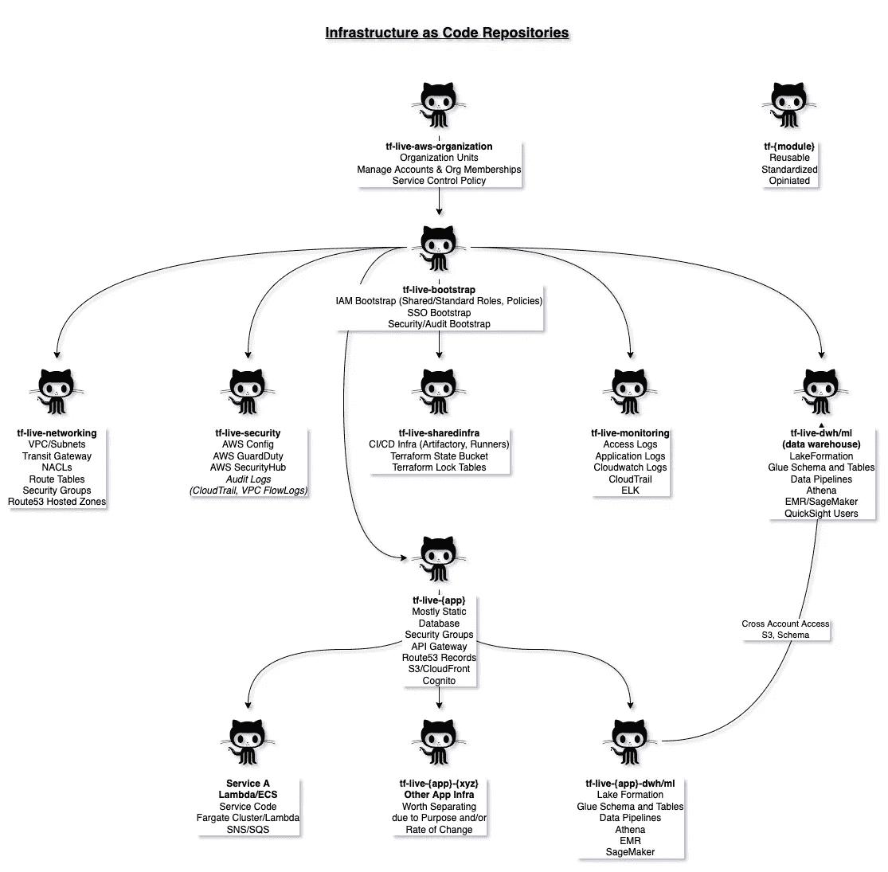

# 将基础设施构建为代码库时要考虑的要点

> 原文：<https://medium.com/codex/points-to-consider-for-structuring-infrastructure-as-code-repositories-886ff58404b8?source=collection_archive---------6----------------------->

由于组织使用基础架构作为代码的方法来创建和维护基础架构组件，主要是在公共/私有云环境中，基础架构治理、安全性、平台和应用程序团队需要决定如何在一个或多个不同的代码存储库中创建基础架构组件，因此 CI/CD 管道也是如此。在本文中，我将分享我们在各种存储库中管理基础设施组件的方法，并分享我们设置背后的原因。我们将 AWS 用于带有 [Terraform 和 Terragrunt](/codex/devops-iac-setup-using-terragrunt-and-terraform-5d8a54c97724) 的云原生应用程序，因此尽管这种想法广泛适用于任何云提供商，但我将使用的术语将专门针对 AWS 和 Terraform。

在高层次上，我们将基础设施需求划分为几大领域:

*   共享基础设施
*   安全性
*   建立工作关系网
*   记录/可观察性
*   数据仓库
*   每个应用程序

In 上述大部分领域的基础设施组件将部署在他们的 AWS 帐户中，以提供更好的隔离，作为 [AWS 组织](https://aws.amazon.com/organizations/)的一部分，以便您可以轻松引导(使用 [AWS 控制塔](https://aws.amazon.com/controltower/))并使用[服务控制策略](https://docs.aws.amazon.com/organizations/latest/userguide/orgs_manage_policies_scps.html)来创建防护栏并为帐户设置限制。[账户结构](/geekculture/how-many-aws-accounts-do-i-need-part-2-a45de4d89efc)请参考下面的故事。

 [## 我需要多少个 AWS 账户？

### AWS 组织的演变，随着您的业务和需求从概念验证发展到…

medium.com](/geekculture/how-many-aws-accounts-do-i-need-part-2-a45de4d89efc) 

现在，您已经有了 AWS 帐户，AWS 组织的一部分，下一个问题是我们如何着手创建作为代码存储库的基础设施，并开始作为代码之旅的基础设施。

D 这里的讨论可以大致是关于[单一回购与多重回购](https://geekflare.com/code-repository-strategies/)的，但是是在基础设施(不是应用程序或服务开发)的背景下。考虑到多方回购的好处，为了更好的治理、隔离和性能，我们决定将多方回购策略作为代码用于我们的基础设施。

通过我们的 [Terraform with Terragrunt 设置](/codex/devops-iac-setup-using-terragrunt-and-terraform-5d8a54c97724)，我们在高层次上拥有以下存储库

作为代码存储库的基础设施(按功能区域分开，但相互依赖)

*   **帐户引导(tf-live-bootstrap):** 添加新帐户，并使用平台使用所需的 SSO 和 IAM 配置来引导它们。启用 Cloudtrail 日志记录。创建 IAM 用户角色并将其与默认策略和权限边界相链接。
*   **共享基础架构(tf-live-sharedinfra):** 共享基础架构是为了实现开发运维自动化所需的设置，以及所有帐户和存储库通用的 CI/CD。例如，Terraform 锁表和具有跨区域复制的状态 S3 桶。部署日志等。与主要/次要区域相关的*配置*可以是您自动化所依赖的共享基础架构存储库的一部分。
*   **安全(tf-live-security):** 启用个人账户中的安全服务，设置安全服务的委托管理员 [AWS GuardDuty](https://aws.amazon.com/guardduty/) 、 [AWS Config](https://aws.amazon.com/config/) 、[安全中枢](https://aws.amazon.com/security-hub/)等。为每个用户角色(平台/开发人员、数据库管理员、应用程序开发人员等)定制 IAM 配置可以是安全性的一部分，也可以是单独的存储库。
*   **联网(tf-live-networking):** VPC 设置(每个帐户)、NACL、路由表、[中转网关](https://aws.amazon.com/transit-gateway/)(每个环境组)[网络管理器](https://aws.amazon.com/transit-gateway/network-manager/)，跨帐户共享中转网关或 VPC/子网、 [AWS 防火墙管理器](https://aws.amazon.com/firewall-manager/)。默认的安全组集(每个子网组、每个组件角色，如数据库、应用程序、缓存、ELB)，可用作其他安全组规则(在应用程序和其他存储库中)的一部分，用于通过源安全组标记允许/拒绝传入或传出流量。
*   **日志记录/监控(tf-live-monitoring):** 可以将日志集中*到共享基础架构(如 ELK stack、跨帐户 Cloudwatch 日志访问)的帐户，这些帐户具有适当的角色和权限，可以为各种用户组提供日志可见性。支持基础架构日志和跨帐户警报，支持共享以帮助观察基础架构和应用程序组件。*
*   ***数据仓库(tf-live-datawarehouse):** 设置[湖泊形成](https://aws.amazon.com/lake-formation/)，跨账户桶/数据共享，加密数据 KMS 密钥访问。[粒度权限管理](https://docs.aws.amazon.com/lake-formation/latest/dg/managing-permissions.html)使用湖泊形成权限，胶合目录/模式，雅典娜，红移。您可以划分任何数据管道工作，以便将数据放入数据仓库中的单独存储库中。此外，任何分析自动化也可以放在单独的存储库中。*
*   ***应用程序(tf-live-{appname}):** 应用程序存储库将拥有静态资源，如 Route53、API 网关、SNS、SQS、S3 桶、CloudFront 分发、登录帐户的日志转发、KMS 密钥和 SSM 参数。*
*   ***Terraform 模块存储库(tf-{module}):** 当您想要应用约定、标准并强制执行某种云服务使用方式时，您需要将该定制放入单独的 Terraform 模块存储库中。云服务使用的某个领域的专家组可以将他们对服务的标准使用作为 Terraform 模块，在组织内创建一个 [InnerSource](https://about.gitlab.com/topics/version-control/what-is-innersource/) 模型。*

*对于中型和大型公司，根据每个团队在管理其基础架构方面的成熟度和自由度，您可能希望通过在存储库名称组合中添加 *{appname}* 来限定每个应用的共享基础架构、网络、监控和数据仓库。*

# *要考虑的要点*

*一旦您决定使用多回购策略，甚至将您的基础架构作为代码，并同意您希望划分基础架构资源/设置的高级领域，则应考虑其他要点，以决定是否将某个基础架构放入其存储库中。*

*   *您的基础架构最适合哪个高级领域(从上面的列表中)？在回答这个问题时，你也要考虑是否有一个具有特定技能的**专家小组**更适合处理这些问题，如安全、监控、网络等。允许单个主题领域(网络、安全、共享基础设施、数据仓库)进一步将其基础设施资源划分和构建到多个存储库中。*
*   *特定**的基础设施是特定于应用的** **还是所有应用的通用**？如果是针对某个应用，是否需要针对每个环境进行实例化？*
*   *当您对建立基础设施组件(资源或资源组)的特定方式持有**观点**时，您需要在一个单独的存储库中创建一个单独的 Terraform 模块，如果它有可能在不止一个(或几个)地方使用的话。围绕加密、可靠性、可用性和可观察性的最佳实践可以分组到一个模块中，以便使用该模块的每个团队不必担心他们使用的设置是否符合组织或公司级别的安全性、治理等法规遵从性以及惯例/标准。*
*   *考虑资源的**变化率**，例如在应用程序资源的情况下，您可以将数据库、API 网关、Route53、ELBs 等划分为一次性设置，但是之后将应用程序代码部署到 ECS、Fargate 或 Lambda 会更频繁，因此最好相应地将快速变化和缓慢变化(或多或少静态)的资源分开。类似地，与设置数据管道和数据分析相关的自动化相比，数据仓库的基线设置可以划分到它们的存储库中。此外，如果管道和分析 IaC 代码是特定于应用程序的，那么每个应用程序也可以有其数据管道和数据分析存储库。容器或 Lambda 函数源代码和部署将位于它们的存储库中。*
*   ***单向依赖** : Terraform 允许您输出资源细节，供另一个存储库使用。然而，总是要确保你有一个单向的依赖关系，一个更通用的/公共的存储库到特定的存储库的依赖关系是好的，但不是相反。比如依赖于 tf-live-bootstrap 的 tf-live-security 可以，同样，依赖于 tf-live-networking 或者 tf-live-security 的 tf-live-{appname}也可以，但是 tf-live-networking 应该*而不是*依赖于 tf-live-{appname}。*
*   ***学习&发展:**随着您的基础设施增长、应用程序增长、组织增长，您将了解哪些对您有用，哪些对您无用，发展您的设置。如果变更经常是相关的，那么合并存储库，如果变得过于臃肿，那么分离存储库。始终关注让你慢下来的东西，重新审视技术债务，并在*正确的时间*正面处理它们。*

*以代码之旅的形式开始基础设施本身可能会让人不知所措，但是拥有一个考虑到以上几点的存储库结构将有助于您随着应用程序、团队和组织的成长和发展而更好地伸缩。密切关注你的基础设施代码的技术债务，并在债务阻碍你的进展之前在适当的时候进行重构，通过*重构*基础设施代码，添加功能，并在不影响整个软件系统的情况下在多个存储库中移动资源。*

*如果你喜欢这个故事，请随时关注我，这样你就可以在我以后的文章中得到通知。请留言分享您是如何为基础设施自动化构建存储库的。*

*我的其他一些故事你可能会喜欢:*

* [## 使用 Terragrunt 和 Terraform 的 IaC 设置

### Terragrunt 可以让你的 Terraform 代码保持干燥。当我尝试它时，我想知道如何在类似的…

medium.com](/codex/devops-iac-setup-using-terragrunt-and-terraform-5d8a54c97724)  [## 我需要多少个 AWS 账户？

### 具有多帐户设置的 AWS 基础设施被认为是最佳实践。您在决定 AWS 时应该考虑的方面…

medium.com](/geekculture/how-many-aws-accounts-do-i-need-d54261a0ab04)  [## 我需要多少个 AWS 账户？—第二部分

### AWS 组织的演变，随着您的业务和需求从概念验证发展到…

medium.com](/geekculture/how-many-aws-accounts-do-i-need-part-2-a45de4d89efc)  [## 停止在互联网上暴露堡垒主机

### 云中(甚至是数据中心中)网络架构的最佳实践是隔离您的基础架构资源…

medium.com](/codex/stop-exposing-bastion-host-over-the-internet-c1d535192562)*