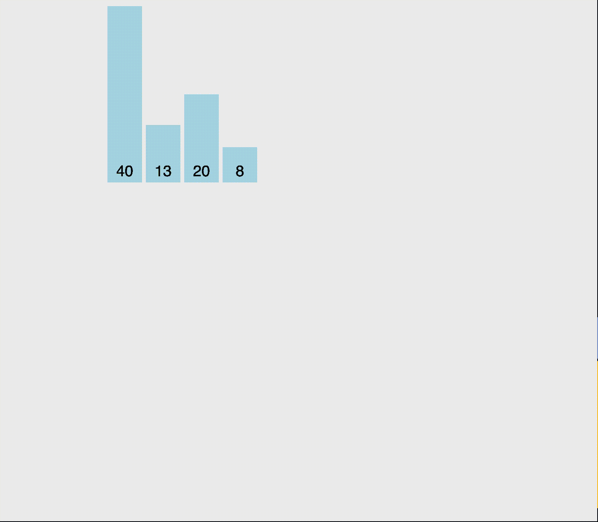

# 扑克脸

> 原文：<https://medium.com/codex/poker-face-9503e7901e57?source=collection_archive---------17----------------------->

木星图像/Stockbyte/Getty 图像

## 排序算法:插入排序 JavaScript

> **插入排序** [迭代](https://en.wikipedia.org/wiki/Iteration)，每次重复消耗一个输入元素，增长一个排序后的输出列表。在每次迭代中，插入排序从输入数据中删除一个元素，找到它在排序列表中的位置，并将其插入到那里。它重复进行，直到没有输入元素。
> 
> 排序通常是就地完成的，方法是遍历数组，在数组后面增加排序后的列表。在每个数组位置，它将根据排序列表中的最大值检查那里的值(在检查的前一个数组位置中，最大值恰好在它的旁边)。如果更大，它会将元素留在原位，并移动到下一个元素。如果较小，它会在排序列表中找到正确的位置。([维基百科](https://en.wikipedia.org/wiki/Insertion_sort))

插入排序类似于大多数人如何安排一手扑克牌(或者去钓鱼，如果你喜欢)。当你抽一张新卡时，它的价值可能会比你手里的一些牌小。因此，你将新卡片与每张已分类的卡片进行比较，直到你在已分类的卡片中找到合适的位置。

[**图示展示:插入排序**](https://www.w3resource.com/php-exercises/searching-and-sorting-algorithm/searching-and-sorting-algorithm-exercise-3.php)

插入排序将数组分成 2 个子部分:排序后的**元素(在前面)和剩余的**未排序的**元素。在第一遍开始时，**排序的**子段只是第一个元素。因此，我们从第二个元素(`array[i], i = 1`)开始外部循环，这是第一个**未排序的**元素。**

我们将第一个**未排序的**元素分配给一个变量(`currentValue = array[i]`)来保存该元素，同时我们进行比较并可能交换它。

我们使用一个内部循环来比较第一个**未排序的**元素(`currentValue`)和它左边的元素(`array[j], j = i — 1`)。该元素是**排序的**子节中最大的元素。

> 在第一遍中，最大的**排序的**元素是第一个元素`(array[0], j = 1 — 1)`。

如果`array[j]`大于`currentValue`，我们将`array[j]`赋给它右边的元素(`arr[j + 1]`)。现在，`array[j]`和`array[j + 1]`具有相同的值。

> 在第一遍中，第一个和第二个元素现在具有相同的值，即第一个元素的值`(array[0])`。幸运的是，我们用变量`currentValue`保存了第二个元素`(array[1])`的值，因为我们刚刚替换了它。

当`j < 0`或`array[j]`不大于`currentValue`时，内环**减少** `j`并断开。否则，我们继续将排序后的**元素向右移动。**

> 在第一次内部循环中，`j`从 0 递减到-1，因此我们中断内部循环。

现在，我们将`currentValue`放置在**排序的**子部分的适当位置。

> 在第一遍中，我们用第二个元素`(array[0] = currentValue)`替换第一个元素。

现在，**已排序的**子段包含 2 个元素，而**未排序的**子段包含少一个元素。

我们继续在外循环中递增`i`以抓取第一个**未排序的**元素，将其与**排序的**元素进行比较，并将其放入**排序的**子节中的正确位置，直到数组排序。

[visualgo.net—插入排序](https://visualgo.net/en/sorting?slide=9)

## 提高赌注

JavaScript 示例

[插入排序](https://www.udemy.com/course/js-algorithms-and-data-structures-masterclass/)

## 疲乏到极点

样本问题

*   [插入排序列表](https://leetcode.com/problems/insertion-sort-list/)
*   [插入分类—第 1 部分](https://www.hackerrank.com/challenges/insertionsort1/problem)
*   [插入分类—第二部分](https://www.hackerrank.com/challenges/insertionsort2/problem)

> 📚资源👀
> 
> [*Udemy — JavaScript 算法与数据结构大师班*](https://www.udemy.com/course/js-algorithms-and-data-structures-masterclass/)
> 
> 【visualgo.net 插入排序
> 
> [插入排序](https://www.geeksforgeeks.org/insertion-sort/)