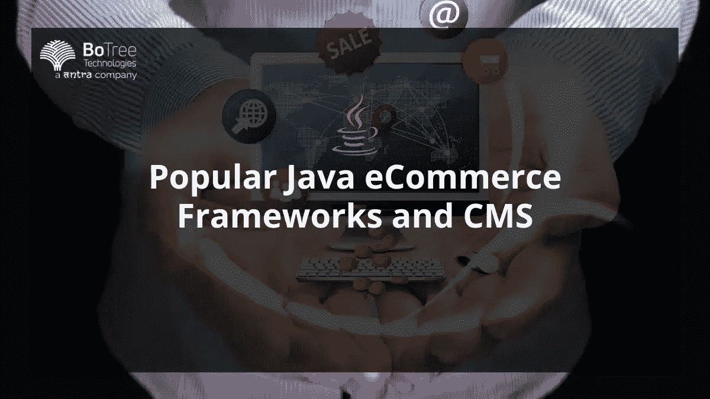

# 流行的 Java 电子商务框架和 CMS

> 原文：<https://medium.com/codex/popular-java-ecommerce-frameworks-and-cms-b42505284c8f?source=collection_archive---------16----------------------->

Java 是一种成熟的编程语言，是大约 90%的财富 500 强公司的服务器端语言。此外，一些世界上最好的公司，如网飞、Slack、Instagram 等等，都是使用 Java 技术栈构建的。

以客户为中心已经成为一个生态系统的核心，它非常重视数字技术和人工智能和机器学习等颠覆性创新。对消费者满意度的关注是如此之多，以至于一个软件开发公司提供了许多可以带来更好的消费者体验的产品。

记住这一点，一家 Java [企业软件开发公司](https://www.botreetechnologies.com/enterprise-software-development-company)，特别关注内容管理系统和电子商务框架。Java 框架和 CM[有助于定制应用的快速开发。](https://www.botreetechnologies.com/blog/what-are-some-of-the-best-java-web-application-frameworks/)

> **阅读更多:** [**为什么 2022 年流行 Java 应用开发？**](https://www.botreetechnologies.com/blog/why-is-java-application-development-popular/)

# 如何在应用程序开发中使用 Java 电子商务框架？

框架的选择取决于为应用程序开发选择的框架。因此，一个 [Java 软件开发](https://www.botreetechnologies.com/blog/pros-and-cons-of-java-software-development/)公司必须仔细选择一个合适的框架。

每个[电子商务平台开发](https://www.botreetechnologies.com/blog/top-ecommerce-app-development-trends/)都是不同的。有许多框架和 Java 工具可以满足所有需求。然而，框架的最终选择将取决于您的知识水平和您的站点所需的定制水平。

大多数常见的 Java 框架可以支持可定制的预建模块，这些模块可以帮助满足一个[电子商务网络应用](https://www.botreetechnologies.com/blog/botree-technologies-recognized-as-a-top-ecommerce-and-web-development-company-in-the-usa-by-selected-firms/)的基本需求。这些框架可用于添加功能性和管理性功能。在功能方面，单一的功能，如搜索功能，可以添加到一个新的网站或一个接一个地添加到现有的网站。另一方面，电子商务网站的管理方面可以由广泛的营销、会计、仓储等功能来支持。

某些 Java 框架还支持添加代码来完全从头构建定制组件。这提供了额外的灵活性，以适应每一个确切的应用需求。

# 电子商务开发的顶级 Java 框架

一家 [Java 开发](https://www.botreetechnologies.com/blog/9-common-java-development-mistakes-to-avoid-in-2022/)公司使用了许多电子商务框架。这里是顶级 Java 电子商务开发框架的列表。

1.  **Hybris / SAP 客户体验**

*   SAP SE 的子公司 Hybris 是一个全渠道电子商务框架，其功能深度集成到 SAP 云生态系统中。它为卖家提供了增强的数据和工具，以优化利润和忠诚度。
*   它支持 B2B、B2C 和 B2B2C 企业，如雀巢、GE、Levi Strauss 等。这是一个昂贵的 java 框架，当它被充分利用时，它提供了最好的性价比。
*   领先的 Java 服务公司使用它来提供两种重要的产品:商业解决方案和营销工具。此外，该框架非常适合于改善与消费者的沟通。
*   Hybris 是一个多语言和多厂商的框架，支持多渠道机会。它有许多可配置的组件，Java 企业解决方案公司可以使用这些组件来构建满足客户个人需求的理想平台。

**2。阔叶树**

*   Broadroad leaf 是另一个被 Java 开发服务广泛用于构建定制电子商务应用的框架。这是一个高度可扩展的框架，可以很容易地与电子商务业务一起增长。
*   它类似于 Hybris，因为它也利用了现代开源技术，如 Java 和 Spring。但是，Broadleaf 本身是开源的。它支持在电子商务系统中使用多个网站、货币、渠道、语言等。
*   Broadleaf 可以与 WordPress、Drupal、Zendesk 和其他平台集成。

**3。阿帕奇 OFBiz**

*   OFBiz 的 Apache 是一个用于构建 [Java 应用](https://www.botreetechnologies.com/blog/java-applications-examples/) **的框架。**Apache 提供的解决方案可以开箱即用，也可以定制以满足特定要求。
*   该框架附带了各种预构建的核心模块，如会计、CRM、仓储和制造。在业务方面，该框架提供了目录管理、促销和定价管理、供应链履行以及成功支付所需的所有其他功能。
*   尽管有各种好处，但该框架需要更好的项目管理选项和调度功能。然而，特性有助于设计[定制解决方案](https://www.botreetechnologies.com/blog/customized-software-what-is-it-types-and-examples/)来管理这些。

# 顶级 Java 内容管理系统

什么是 Java CMS？它是一个内容管理系统，使用 Java 编程语言和一系列库和工具构建而成。一个 Java [CMS 软件应用程序](https://www.botreetechnologies.com/case-studies/content-marketplace-app)帮助创建和交付数字内容。

有许多[基于 Java 的 CMS 系统](https://www.botreetechnologies.com/case-studies/customizable-enterprise-cms)，因此，很难选择一个最适合你的。因此，这里列出了最好的基于 Java 的内容管理系统，以帮助用户管理他们网站和[网络应用](https://www.botreetechnologies.com/web-application-development)上的内容。

*   **玉兰**
*   它是一个无头的开源 CMS，允许多个附加组件和集成，使用户能够定制以满足他们的需求。
*   它建立在面向 Java 开发人员的最好的开源堆栈之上，为内容存储和管理(除了 API 之外)提供了许多机会，以便在 T2 企业的不同系统之间重用内容。
*   **露天**
*   Alfresco 有一个与 REST APIs 和 SDK 耦合的模块化架构。它使用户能够增强电子商务体验，并提供可配置、可重用的组件来构建引人入胜且响应迅速的 web 和移动 Java 应用程序**。**
*   Alfresco 还支持领先的生产力应用程序，包括 Microsoft Office、Google Docs、Microsoft Outlook、Salesforce 等。 [Java 软件开发服务](https://www.botreetechnologies.com/blog/benefits-of-choosing-java-software-development-services/)可以使用其他基于 Java 的业务流程管理(BPM)框架来扩展电子商务 CMS。
*   Alfresco 的主要优势在于，它不仅提供 CMS，还为电子商务企业提供了更广泛的信息管理框架。
*   **Bloomreach**
*   像 Magnolia 一样，Bloomreach 是另一个无头 CMS，允许 Java 开发公司轻松地将其与其他电子商务开发和管理工具集成。
*   它是非常模块化的，并支持一种灵活的方法来建立一个定制的电子商务网站。此外，该系统受到许多大品牌的信任和运营，如博世、NHS Digital、HellermannTyton 等。

> **阅读更多:**[**2022 年 Java Web 开发的未来是什么样子的？**](https://www.botreetechnologies.com/blog/what-does-the-future-of-java-web-development-look-like/)

# 结论

Java 软件开发公司必须选择最合适的框架来构建满足其需求的电子商务应用程序。所有的 Java 框架和 CMS 都有优势和能力，可以充分利用它们来获得预期的结果。框架的最终选择还取决于

开发项目的需求、时间表和预算

**常见问题解答**

哪个是最好的 Java 电子商务框架？

许多知名的电子商务 Java 框架提供了各种功能、内置特性以及定制某些设计特性的机会。一些最重要的 java 框架 和 CMS**，比如 SAP Hybris、Broadleaf、Bloomreach 等等，在这个博客中都有讨论。阅读更多内容，了解顶级 Java 框架。**

****什么是内容管理系统？****

**一个内容管理系统允许电子商务公司根据市场需求创建、编辑、删除和移动你网站上的页面。它通常安装在服务器端，可以从 PC、笔记本电脑和移动设备上访问。**

****您是否提供 Java 电子商务开发和后期部署服务？****

**BoTree Technologies 是最好的 Java 软件开发公司，提供同类最佳的电子商务应用程序开发服务。凭借 9 年多的专业知识，它证明了我们的能力，并确保您获得世界一流的电子商务解决方案。**

***原载于 2022 年 11 月 4 日 https://www.botreetechnologies.com***。****